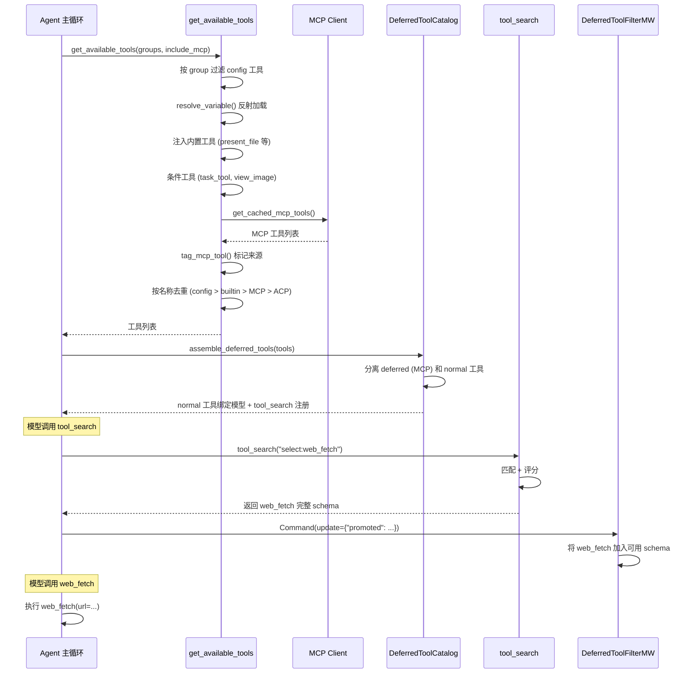

# 工具系统

## 读前思考

- 一个 Agent 系统可能接入几十甚至上百个 MCP 工具，全部绑定到模型会消耗大量 token。你怎么做到"让模型知道有这些工具可用，但不为每个工具的 schema 付 token 费"？
- 工具来自多个源头（内置、MCP、ACP、配置声明），名称可能冲突。你的优先级策略是什么？

## 核心问题

工具系统解决的核心问题是：**从多个源头聚合工具，按优先级去重，然后通过延迟发现机制控制 token 开销**。

DeerFlow 的工具系统采用"配置驱动 + 多源聚合 + 延迟发现"三层架构。YAML 配置声明静态工具，运行时聚合内置工具、MCP 工具和 ACP 工具，最后通过 `tool_search` 对 MCP 工具实施延迟 schema 发现。

## 方案展示

### 设计选择一：延迟工具发现（Deferred Tool Discovery）

MCP 工具数量可能很多（几十到上百个），每个工具的 JSON Schema 绑定到模型会消耗大量 token。DeerFlow 的解决方案是 `DeferredToolCatalog`：只暴露工具名称列表给模型，模型需要某个工具时通过 `tool_search` 获取完整 schema。

`tool_search` 支持三种查询模式：`select:name1,name2`（精确选择）、`+keyword rank`（必须包含关键词 + 按相关性排序）、`regex`（正则匹配 + 评分）。每次搜索最多返回 5 个工具的完整 schema，防止 schema 爆炸。

### 设计选择二：MCP 路由自动提升

除了模型主动搜索，`McpRoutingMiddleware` 还能根据用户请求中的关键词自动提升对应的 MCP 工具。工具元数据中的 `keywords` 和 `priority` 字段构成路由索引，匹配时自动将 MCP 工具从 deferred 状态提升为可用。

这个设计的价值在于：对于高频工具（如 `web_search`），模型不需要先调用 `tool_search` 再调用工具，减少了一轮 LLM 交互。

### 设计选择三：多源聚合 + 优先级去重

工具来自四个源头，按优先级排列：

| 优先级 | 源头 | 说明 |
|--------|------|------|
| 1（最高） | config.yaml 声明 | 用户显式配置的工具 |
| 2 | 内置工具 | present_file, ask_clarification 等 |
| 3 | MCP 工具 | 通过 MCP 协议发现的外部工具 |
| 4（最低） | ACP 工具 | Agent Communication Protocol 代理工具 |

去重时保留高优先度的同名工具，并发出 warning 日志。这个优先级设计背后的逻辑是：用户显式配置的意图最强，应该覆盖默认行为。

## 完整执行流：工具从加载到执行

整个流程分为四个阶段：

1. **多源聚合**：`get_available_tools()` 从四个源头收集工具——按 config 声明反射加载、注入内置工具（present_file 等）、按条件注入（subagent 启用时加载 task_tool，vision 模型加载 view_image）、从 MCP client 获取缓存的外部工具。所有工具按名称去重，优先级为 config > builtin > MCP > ACP。

2. **延迟目录构建**：`assemble_deferred_tools()` 将 MCP 工具从模型 binding 中隐藏，只暴露名称列表。同时注册 `tool_search` 工具供模型按需查询。这一步大幅减少了绑定到模型的 schema token 开销。

3. **按需发现与提升**：模型在推理过程中判断需要某个工具时，调用 `tool_search` 查询。搜索结果通过 `Command(update={"promoted": ...})` 写入 graph state，`DeferredToolFilterMiddleware` 在下一轮模型调用前将提升的工具 schema 加入可用集。McpRoutingMiddleware 也可以根据用户请求关键词自动提升，省去一次 tool_search 调用。

4. **工具执行**：提升后的工具与普通工具同等对待，经过中间件链的权限检查（授权、护栏、loop 检测、token 预算）后执行。

## 工程优化

**同步/异步桥接**：`make_sync_tool_wrapper` 为异步工具提供同步调用路径，使用 `ThreadPoolExecutor`（10 workers）在已有 event loop 时通过 `context.run(asyncio.run(...))` 执行，保持 contextvar 传播。

**DeferredToolCatalog 不可变性**：使用 `frozen=True` dataclass + `cached_property` 实现不可变目录和惰性 hash 计算，`catalog_hash` 用于 scope promotion 状态，防止 catalog 变更后旧 promotion 暴露不同工具。

**搜索降级**：正则编译失败时降级为字面量匹配（模型输出的查询可能包含不平衡括号）。

**工具名 mismatch 检测**：config 中的 name 与 tool.name 不一致时在加载阶段 warning，防止 LLM 收到不一致的 schema。

## 面试要点

**1. 延迟发现 vs 全量绑定的 token 成本差异有多大？**

一个典型的 MCP 工具 schema 约 200-500 token。如果有 50 个 MCP 工具，全量绑定需要 10k-25k token，而延迟发现只需要约 500 token（名称列表）+ 按需加载的 1-2 个工具 schema。对于 128k 上下文窗口的模型，这个差异不致命；但对于 32k 或更小的模型，延迟发现能显著减少工具对上下文空间的占用。

**2. tool_search 的三种查询模式（select/+/regex）是否过于复杂？**

从模型使用角度看，三种模式覆盖了不同的场景：精确知道工具名用 select，模糊搜索用 +keyword，模式匹配用 regex。复杂度由 `tool_search` 工具内部处理，模型只需要输出自然语言查询。代价是 prompt 中需要解释三种模式的用法，增加了约 200 token 的指令开销。

**3. 如果 MCP 工具恢复失败（比如服务器不可达），系统会怎么处理？**

fail-closed 策略：`assemble_deferred_tools()` 在 MCP 工具恢复失败时抛异常，拒绝绑定 MCP schema。这比静默忽略更安全——如果让模型看到工具名但执行时失败，用户体验更差。
