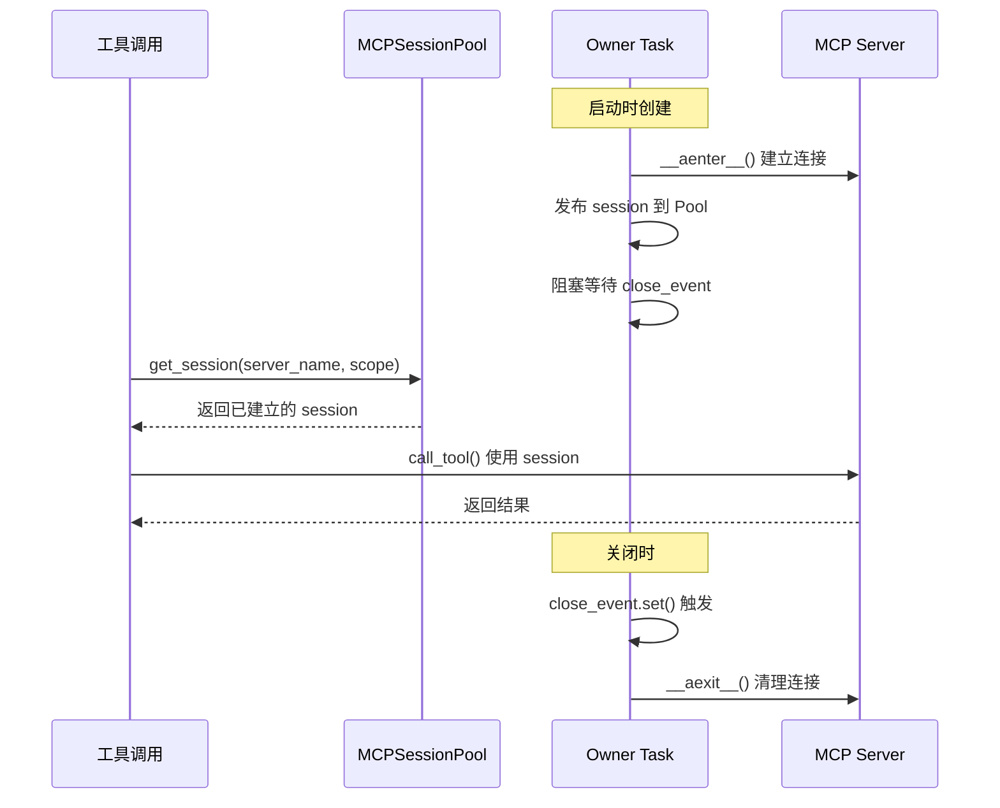
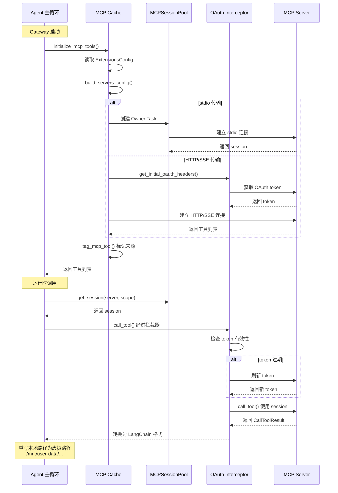

# MCP 集成

## 读前思考

- MCP 服务器可能运行在不同进程甚至不同机器上，每次工具调用都要重新建立连接吗？你怎么在跨调用保持会话状态？
- HTTP/SSE 传输的 MCP 服务器需要 OAuth 认证，token 会过期。你怎么在每次工具调用时自动刷新 token，而不让上层感知？

## 核心问题

MCP 集成层解决的核心问题是：**将外部 MCP 服务器的工具透明地注册为 LangChain 原生工具，同时处理会话保持、OAuth 认证、配置热更新等工程挑战**。

DeerFlow 通过 `langchain-mcp-adapters` 桥接 MCP 协议，以会话池解决跨调用状态保持，以 OAuth 拦截器处理 HTTP/SSE 鉴权，以内容签名缓存实现配置热更新。

## 方案展示

### 设计选择一：Owner Task 模式的会话池

MCP 会话（尤其是 stdio 传输）需要在多次工具调用间保持状态。但 DeerFlow 的工具执行路径有同步和异步两种模式：同步路径每次调用都创建新的 event loop（`asyncio.run`），而 anyio 的 context manager 要求 `__aenter__` 和 `__aexit__` 在同一个 task 中执行。

DeerFlow 的解决方案是 Owner Task 模式：每个 MCP 会话由一个专属 asyncio.Task 拥有其完整生命周期。这个 owner task 进入 context manager 后阻塞等待关闭信号，工具调用时从会话池获取已建立的会话，关闭时只发信号让 owner task 自行退出。

这个设计的关键洞察是：**仅 stdio 传输被池化，HTTP/SSE 不池化**。原因是 HTTP/SSE 使用 anyio TaskGroup，无法从不同 async task 安全关闭。

### 设计选择二：OAuth 拦截器自动刷新

HTTP/SSE MCP 服务器需要 OAuth 认证，token 会过期。DeerFlow 的解决方案是双层 OAuth 处理：

1. **初始 token 获取**：`get_initial_oauth_headers()` 在启动时获取 token 写入 headers
2. **自动刷新拦截器**：`build_oauth_tool_interceptor()` 在每次 `call_tool` 时检查 token 有效性，过期则自动刷新

拦截器模式的好处是：上层工具调用完全不需要感知 OAuth 的存在，拦截器在底层透明处理。

### 设计选择三：内容签名缓存

MCP 工具列表可能随配置变化（用户添加/删除 MCP 服务器）。DeerFlow 用 `(resolved_path, mtime, size, sha256)` 四元组检测配置变更，变化时关闭所有会话并重建工具列表。

为什么不用纯 mtime？因为 mtime 比较有多个盲区：同秒编辑、git checkout 恢复旧时间戳、网络挂载的 mtime 不精确。四元组签名虽然计算成本更高，但能可靠检测所有变更场景。

## 完整执行流：MCP 工具从加载到执行

整个流程分为三个阶段：

1. **启动加载**：Gateway 启动时，`initialize_mcp_tools()` 读取 `ExtensionsConfig` 中的 MCP 服务器配置，根据传输类型分别处理——stdio 传输创建 Owner Task 建立持久会话连接，HTTP/SSE 传输先通过 OAuth 获取初始 token 再建立连接。所有服务器的工具并发加载（`asyncio.gather`），单个服务器失败不影响其他。加载完成后为每个工具打上 MCP 来源标记。

2. **运行时调用**：模型调用 MCP 工具时，stdio 工具从 `MCPSessionPool` 获取已建立的持久会话（按 server_name + user_id:thread_id 作用域），HTTP/SSE 工具则通过拦截器自动检查 token 有效性，过期则自动刷新。整个 OAuth 刷新过程对上层透明。

3. **结果转换**：MCP 返回的 `CallToolResult` 被转换为 LangChain 的 `content_and_artifact` 格式。关键的一步是路径重写——工具输出中的主机真实路径被替换为虚拟路径（如 `/mnt/user-data/workspace/`），确保 sandbox 内部始终看到统一的虚拟路径，防止信息泄漏。

## 工程优化

**并发工具发现**：`asyncio.gather` 并行加载所有服务器的工具，单个服务器失败不影响其他。

**in-flight 去重**：`_inflight` 字典让同一 (server, scope) 的并发创建请求共享一个 Future，避免重复建会话。

**文件路径重写**：对 stdio 子进程固定 cwd/temp 到用户数据目录，输出中的本地路径自动转为虚拟路径供 sandbox/artifact API 服务。通过调用前后文件快照 diff，将纯文本中的裸文件名关联重写为虚拟路径。

**工具名称净化**：`_VALID_MCP_TOOL_NAME` 正则限制为 `[A-Za-z0-9_-]+`，防止恶意工具名在 deferred tool 列表中注入 prompt 结构。

**LRU 容量管理**：`MAX_SESSIONS=256`，超限时按 LRU 顺序淘汰最旧会话。Event loop 关闭/切换时自动淘汰并重建。

**取消安全**：`asyncio.shield` 保护锁获取和 Future 等待，取消时仍确保锁被释放、owner task 被正确关闭。

## 面试要点

**1. 为什么只池化 stdio 传输，不池化 HTTP/SSE？**

stdio 传输的子进程需要保持运行状态（stdin/stdout 管道），每次重新创建成本很高。HTTP/SSE 传输本身是无状态的 HTTP 请求，重新创建成本低。更关键的是技术约束：HTTP/SSE 使用 anyio TaskGroup，无法从不同 async task 安全关闭（会触发 RuntimeError）。这个限制不是设计选择，而是技术约束下的妥协。

**2. 内容签名缓存的计算成本（sha256）是否过高？**

sha256 计算确实比 mtime 慢，但配置文件的访问频率很低（每次 `get_cached_mcp_tools()` 调用时检查一次），且文件通常很小（几 KB）。相比误判导致的会话重建成本（关闭所有连接 + 重新发现工具），sha256 的计算成本可以忽略。这是一个典型的"用计算换准确性"的权衡。

**3. OAuth token 刷新失败时系统会怎么处理？**

拦截器在刷新失败时会抛出认证异常，上层工具调用捕获后返回错误给模型。模型可以选择重试或换用其他工具。这个设计避免了在拦截器层面做复杂的错误恢复逻辑，把决策权交给模型。
