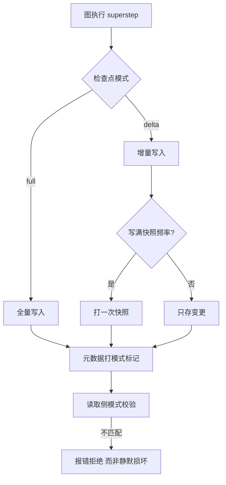
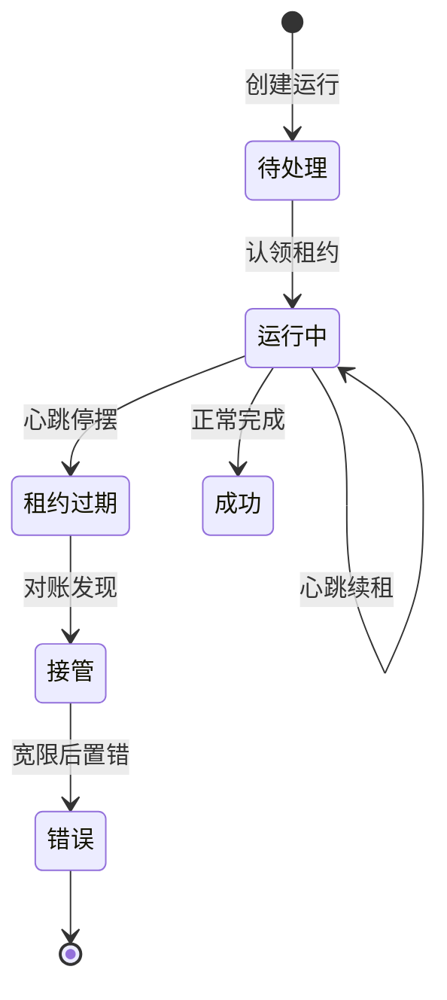
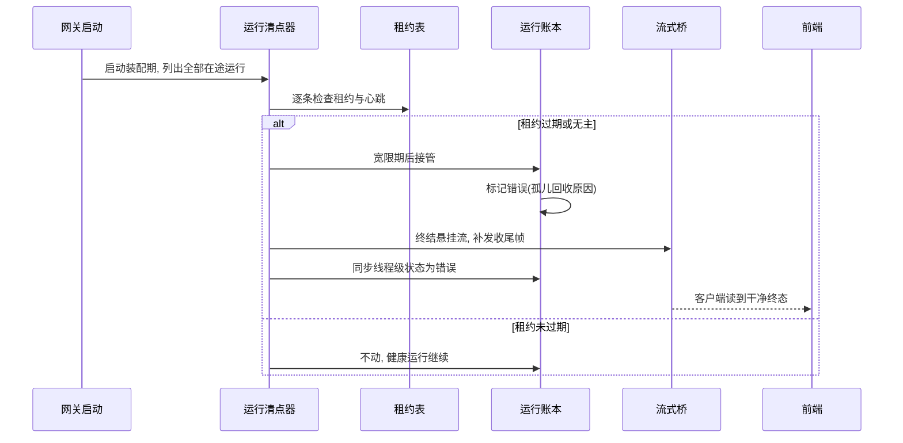

# 会话状态与持久化

## 读前思考

- 图执行引擎每一步都产出新状态，但"哪些步已落盘、哪些还在内存"没人知道。服务崩溃后，你是希望恢复成"崩溃前的完整现场"（可从任意点续跑），还是"明确告诉用户这次运行失败了"？续跑需要付出什么代价？
- 多 worker 部署下两个进程同时接到同一线程的消息，各自开跑，就会产生两条平行执行。你会在哪一层保证"一个线程同时只有一个活跃运行"——应用层加锁、数据库唯一约束、还是两者都要？

## 核心问题

**如何为企业级多 worker 部署建模"图执行状态"与"运行生命周期"两层状态：图状态可持久、可回滚，运行可记账、可展示，且同一线程绝不出现并发运行。**

deer-flow 把状态彻底分成两层。其一是图状态检查点，由 LangGraph checkpointer 承载，full/delta 双模式，服务暂停、回滚、上下文压缩改写；其二是运行生命周期账本，runs 表加租约加孤儿对账，服务崩溃记账与前端展示。两层的恢复语义截然不同：图状态永远可从最近检查点读取，但运行层面明确不续跑——孤儿运行一律终态化为错误。LangGraph 检查点表独立于项目自己的迁移体系之外，形成两套并存的持久化治理。

| 维度 | deer-flow 的选择 |
|------|------------------|
| 状态载体 | LangGraph 图状态检查点 + 运行账本双轨 |
| 检查点形态 | full/delta 双模式，delta 只写增量 |
| 并发纪律 | 每线程至多一个活跃运行 + 跨 worker 租约 + 心跳 |
| 恢复语义 | 图状态可读，运行不续跑、孤儿置错 |
| 存储治理 | SQLite/Postgres + 混合 bootstrap |

## 方案展示

### 设计选择一：full/delta 双检查点模式 + 进程级冻结

图状态每个 superstep 落一次检查点。full 模式全量写；delta 模式只写增量——messages 通道经增量通道承载，每写满快照频率打一次快照，其余只存变更。模式一经创建就进程级冻结：热切换直接抛配置错误（要求重启）；fail-closed 兼容门保证 full 模式进程读 delta 检查点时报模式不匹配错误而不是静默损坏——读取侧校验返回快照、写入侧预检模式兼容，仅支持 full 到 delta 单向迁移。每个检查点的元数据带模式标记，供诊断关联。

**为什么这么选**：企业级多用户部署下检查点存储随会话轮数线性增长，delta 把写放大压到变更量级；跨模式读取是静默损坏的来源，冻结加 fail-closed 把它变成启动期可见的错误。**牺牲了什么**：模式切换必须重启进程；delta 检查点没有完整状态值，读取必须经访问器重组（这是"用重组换存储"的交换）。

### 设计选择二：孤儿运行只记账不续跑

运行生命周期用六态账本管理：运行创建时插入待处理行，认领后写入属主与租约到期时间；心跳循环每三分之一租约时长续租一次、每三轮心跳做一次孤儿对账，不等 pod 重启。崩溃恢复的完整动作是：启动时列出所有在途运行 → 对租约过期或无租约的运行做宽限接管 → 标记为错误 → 清理悬挂的流式连接 → 同步线程级状态。被恢复的运行在前端表现为明确错误，错误文案直白说明"网关在本次运行达到持久终态前重启"。

**为什么这么选**：图执行的副作用（写文件、调外部服务）不可安全重放，LangGraph 中断点续跑语义复杂——宁可明确失败让用户重来，也不冒重复副作用的险。**牺牲了什么**：长运行遇重启必须从头再来，恢复粒度是"整个运行"而非"最后一个检查点"。

### 设计选择三：每线程至多一个活跃运行 + 存储治理双轨

并发纪律落在数据库层：部分唯一索引保证每线程至多一个待处理或运行中的运行，同线程并发请求按默认策略拒绝。多 worker 部署还有启动门禁：数据库必须是支持并发写的后端、租约心跳必须开启、进程内资源必须禁用，三条不满足直接拒绝启动。存储治理是双轨的：空库首次启动走直接建表加版本标记（不跑迁移脚本），遗留库走回填加版本基线再升级；Postgres 用跨进程锁真串行，SQLite 用进程内锁加超时尽力而为；检查点表独立于项目自己的 ORM 体系之外，迁移脚本不覆盖它。

**为什么这么选**：唯一索引把"一个线程一个活跃运行"变成数据库不可违反的事实，而不是依赖应用层自觉；双轨 bootstrap 避免"空库跑迁移失败"与"遗留库版本错位"两类启动事故。**牺牲了什么**：同线程并发请求被拒绝（默认策略），需要上层排队；约束与索引必须在 ORM 模型里双写条件，否则空库与迁移库行为不一致。

### 设计选择四：多执行上下文的配置覆盖隔离

子代理与嵌入场景需要临时覆盖全局配置（换模型、改沙箱模式、调递归上限）而不污染全局单例：配置栈用上下文变量实现，入栈出栈成对出现，天然支持异步并发隔离——每个异步任务持有一份自己的配置栈，互不串扰。查询配置时先看栈顶覆盖，无覆盖才走全局的文件签名检测与热重载路径。

**为什么这么选**：进程内可能同时跑着主代理与多个子代理，若覆盖直接写全局单例，一个子代理的临时配置会泄漏给所有并发任务；上下文变量栈让覆盖作用域与任务作用域一致，出栈即复原。**牺牲了什么**：覆盖是运行时临时的，不落盘——子代理重启后配置回到全局值；配置栈只覆盖配置读取路径，不覆盖状态存储路径（会话记录仍按全局路由归属，归属机制见 01-gateway）。

## 核心机制执行流：一次崩溃重启后的孤儿运行清点

以多 worker 部署中一个 worker 崩溃、另一个 worker 进程完成对账为例：

**阶段一：启动清点。** 网关在启动装配期、对外服务之前执行孤儿清点：列出所有在途运行，逐条检查租约。这一步必须早于路由开放，因为线程元数据无法表达"仅当最新运行是被恢复的那个时才更新"的原子条件，提前做避开了与并发新运行的读写竞争（网关侧时序见 01-gateway）。

**阶段二：接管与置错。** 对租约过期或无租约的运行，先过宽限期再接管并标记错误，错误原因记为孤儿回收。单 worker 模式没有租约概念，所有在途运行都被回收；多 worker 模式只回收租约过期的，健康运行的心跳租约不动。

**阶段三：清理与同步。** 补发结束信号终结悬挂的流式连接——重连的客户端读到干净的收尾帧而不是永远挂起的连接；若被回收的运行恰好是该线程的最新一次执行，线程状态同步置为错误，前端可以明确知道这次执行失败了。

**边界路径——运行期孤儿：** 某个 worker 心跳停摆后，其他 worker 的心跳对账发现过期租约即可接管，不等 pod 重启——恢复是运行期的周期性行为而不只是启动行为。**边界路径——调度器重启：** 计划任务运行在进程内，调度器重启时把排队与运行中的计划任务直接标失败，由用户重排（单调度器假设）。**边界路径——关闭竞态：** 关闭顺序刻意安排为先排空在途运行、后释放检查点存储连接池，防止"任务还在写检查点、连接池已关"的资源竞争。

## 工程优化

**防御性补丁带版本守卫与自动退位**：上游引擎在 full 到 delta 迁移后的首个 superstep 曾静默丢弃待写数据（表现为恢复后首条消息消失），项目以补丁委托基类实现修复；补丁带版本守卫（在特定版本验证过，新版本告警要求复检）、上游修复后自动退位、幂等，从状态定义模块的 import 时机锚定使所有构建图的进程生效。

**状态 reducer 防御**：合并冲突失败关闭（宁可报错不静默覆盖）、终态不可被非终态覆盖、委派记录上限；图片数据只存元数据不存 base64，控制检查点体积。

**bootstrap 幂等**：空库直接建表加版本标记，遗留库回填加基线再升级；Postgres 用跨进程锁真串行，SQLite 用进程内锁加超时尽力而为。

**单 worker 退化路径**：无租约模式把空租约视为孤儿立即回收，不需要心跳，部署形态从多 worker 退化到单 worker 时零配置。

## 面试要点

**1. delta 检查点省存储但读取要重组，为什么 deer-flow 敢用而其他项目不用？**

参考答案方向：delta 的前提是"读取路径集中可控"——所有状态读取经统一访问器重组，配合快照频率限制增量膨胀，配合进程级冻结与 fail-closed 兼容门防半迁移损坏。其他项目没有这套配套（没有统一读取入口、没有模式冻结），用 delta 就是在赌不出现静默损坏。判断标准是"检查点体积 × 恢复读取频率"：两者乘积决定增量路线的收益是否盖过重组成本，配套治理的复杂度则由读取路径的可控性决定。

**2. 崩溃后"置错不续跑"和"自动续接"（hermes-agent 的方案，见 docs/hermes-agent/04-state.md）各自的代价是什么？**

参考答案方向：置错不续跑语义简单、副作用安全，但长运行遇重启必须重来，用户损失全部进度；自动续接保住进度与对话连续性，但必须回答"续接会不会重复副作用""过期上下文要不要清理"——hermes 用新鲜度窗口和适配器感知提示回答。判断标准是"运行时长 × 副作用可重放性"：长运行且副作用可重放适合续接，短运行或副作用危险适合置错。

**3. 为什么空库首次启动走直接建表而不是跑迁移脚本？**

参考答案方向：迁移脚本面向"已有数据的版本升级"，空库跑迁移会经过一条从未被生产验证过的路径，且基线版本的定义容易错位；直接建表加版本标记让首次部署走最短路径。代价是约束与索引必须写进 ORM 模型（双写条件），否则空库与迁移库行为不一致。判断标准是"首次部署频率 × 存量升级的版本跨度"。
