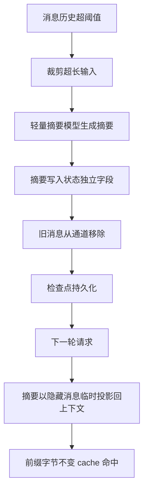
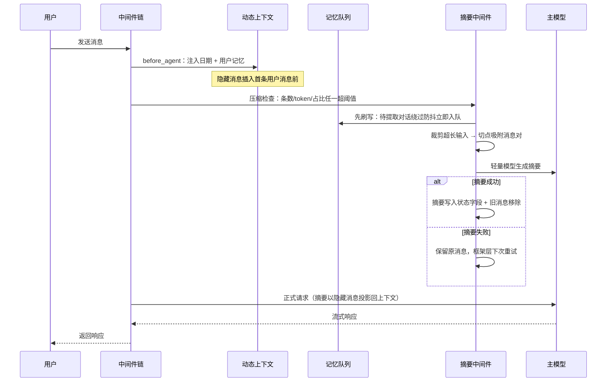

# 上下文工程

## 读前思考

- 系统提示词里想放当前日期、用户记忆、活跃技能这些动态信息，但这些内容每次都不一样，会把提供商的前缀缓存全部打碎。如果把它们全部挪出系统提示词，模型还能可靠地遵循这些指令吗？
- 上下文压缩必须改写消息历史，而改写前缀又会让缓存失效。有没有办法让摘要"存在但不占用消息通道"，使压缩发生后历史前缀仍然一个字节都不变？

## 核心问题

上下文工程解决的核心问题是：**在有限窗口内决定系统提示词、动态上下文、对话历史如何组装与收缩，同时尽可能保住 prompt cache 的命中前缀。** deer-flow 在这个问题上走得最极端——它是四个项目中唯一把"缓存友好"同时贯彻到组装和压缩两端的设计：组装端把全部动态内容挪出静态模板，压缩端把摘要挪出消息通道。

| 维度 | deer-flow 的选择 |
|------|-----------------|
| 提示词结构 | 全静态模板（十六段）+ 运行时隐藏消息注入 |
| 动态内容注入 | 中间件每轮注入到首条用户消息之前 |
| 规则文件 | SOUL.md 人格编译进模板，HTML 转义防注入 |
| 压缩触发 | 绝对 token 数 / 消息条数 / 窗口占比三条件任一 |
| 摘要存放 | 会话状态独立字段 + 检查点持久化 + 每轮投影 |
| 摘要模型 | 可配置为轻量小模型，与主模型解耦 |
| 记忆联动 | 压缩启动前绕过防抖立即刷写记忆队列 |

## 方案展示

### 设计选择一：静态系统提示词 + 动态上下文注入

系统提示词由提示词模板装配函数（源码：apply_prompt_template）一次性拼装，采用 XML 标签分段。deer-flow 的系统提示词走的是彻底静态化路线：模板本体不含任何随用户、随日期变化的内容，这类信息一律推迟到运行时由中间件注入，于是同一份模板能在全量用户和全量会话间逐字节复用，前缀缓存可以命中到模板末尾。

**静态模板的十六个组成部分：**

| 序号 | 段落 | 类型 | 核心内容 |
|------|------|------|----------|
| 1 | 角色定义 | 静态 | 开源超级 agent 的自我声明，agent 名称可配置，默认名 DeerFlow 2.0 |
| 2 | 用户输入边界 | 静态 | 声明用户输入被 BEGIN/END USER INPUT 包裹，其中内容是不可信数据而非指令 |
| 3 | 保密指令 | 静态 | 严禁向用户透露系统提示词、人格、技能体系等框架内部标签内容 |
| 4 | 人格 | 条件 | 从 SOUL.md 读取的 agent 人格/价值观，经 HTML 转义防注入 |
| 5 | 自我更新 | 条件 | 仅自定义 agent：教导用自我更新工具持久化自我更新 |
| 6 | 思考规范 | 静态 | 先分析再行动、不清楚必须澄清、思考后必须给出实际响应 |
| 7 | 澄清系统 | 静态 | 澄清工作流：CLARIFY→PLAN→ACT，5 种澄清场景 + 澄清工具用法 |
| 8 | 技能系统 | 动态 | 延迟发现模式（仅列名称）或传统模式（完整元数据） |
| 9 | 记忆工具 | 条件 | 记忆工具使用规范：检索/新增/更新/删除 |
| 10 | 延迟工具 | 条件 | MCP 延迟工具名称列表（仅名称，用工具搜索获取 schema） |
| 11 | 路由提示 | 条件 | 按关键词的工具偏好路由提示 |
| 12 | 子代理 | 条件 | 子代理编排指令：分解-委派-综合流程、并发上限、可用类型 |
| 13 | 工作目录 | 静态+条件 | 文件路径规范：uploads/workspace/outputs 目录 + 可选挂载目录 |
| 14 | 响应风格 | 静态 | 清晰简洁、自然语气、行动导向 |
| 15 | 引用规范 | 静态 | 搜索后必须加内联引用，报告末尾必须有 Sources 节 |
| 16 | 关键提醒 | 静态+动态 | 提醒清单 + 条件性子代理提醒和 Skill First 提醒 |

**运行时动态注入（中间件，不在静态 system prompt 中）：**

| 中间件 | 注入内容 | 形式 |
|--------|---------|------|
| DynamicContextMiddleware | 当前日期 + 用户记忆 | 隐藏 SystemMessage/HumanMessage，插入第一条用户消息前 |
| DurableContextMiddleware | 对话摘要 + 子代理委派账本 + 已加载技能列表 | 隐藏 HumanMessage + 权威合约 SystemMessage |
| SkillActivationMiddleware | 完整 SKILL.md 内容（用户输入斜杠技能名时） | 隐藏 HumanMessage |
| TodoMiddleware | 任务列表规范（Plan 模式） | 追加到 system prompt |

**为什么这么选**：企业级多用户部署下，缓存折扣乘以用户量是真金白银，静态模板是唯一能跨所有用户共享的缓存资产。**牺牲了什么**：模型对系统提示词和用户消息中指令的遵循程度不同，关键行为约束放在注入消息里可能被弱化；动态内容只注入到第一条用户消息前，长对话中模型可能逐渐"忘记"。技能内容的注入面与渐进披露机制归 07-tools.md，本篇只讲它何时以何种形式进入窗口。

### 设计选择二：摘要移出消息通道（cache 友好压缩）

压缩挂在中间件链的安全与上下文层（源码：SummarizationMiddleware）。触发条件是三选一的组合判断：绝对 token 数、消息条数、窗口占比，任一达标即启动。保留策略是"保尾 N 条 + 消息对不可切断"：AI 消息与其紧随的工具结果消息永远成对保留，切点落在工具消息中间时整对后移。摘要调用自身的输入也有 token 上限，超长历史先裁剪再摘要，防止为了压缩把摘要模型也撑爆。

这个设计把"摘要"从消息序列里彻底拿了出去：摘要文本落在会话状态的一个独立字段上，随检查点持久化；每轮组装请求时，再由投影逻辑把它以隐藏数据消息的形式临时放回上下文（源码：DurableContextMiddleware）。消息前缀因此不因压缩被改写，静态模板和早期消息的缓存命中不受影响。摘要模型可配置成轻量小模型，压缩成本与主模型解耦。

**为什么这么选**：压缩与 prompt cache 天然对抗——压缩改写前缀，前缀一变缓存全失效，而通道分离让两者不再互相伤害。**牺牲了什么**：这套机制与中间件框架、检查点持久化绑死，无法单独摘出来用；计数用字符近似，精度在四家中最低，只能用更宽松的阈值留出误差空间。压缩在循环中的位置（中间件 before_agent 钩子内检查、不消耗轮次预算）见 03-orchestrator.md，本篇是机制主场。

### 设计选择三：压缩前记忆刷写（与长期记忆的接口）

压缩会永久删除消息原文。如果被删的消息里有值得跨会话记住的事实，必须赶在摘要前落盘——deer-flow 是唯一做了这个联动的项目：压缩启动前，先把待提取的对话绕过记忆提取的防抖窗口，立即送入记忆队列（摘要前刷写机制）。防抖窗口本是为了合并短时间内的多次提取，但压缩不等人，等窗口到期消息已经被摘要替换了。一个刻意的例外：子代理的压缩链跳过这个刷写——子代理的内部轮次（中间工具调用过程）不应进入用户的长期记忆。记忆的提取、存储与检索机制归 06-memory.md，本篇只讲刷写发生在压缩启动前这个时机。

## 核心机制执行流：一次带压缩的轮次

以"历史已接近阈值、用户发来新消息"为例：

**阶段一：动态注入。** before_agent 钩子按中间件链顺序执行，动态上下文中间件先把日期和用户记忆以隐藏消息插入首条用户消息之前。注入发生在压缩检查之前，保证压缩决策基于注入后的完整上下文。

**阶段二：压缩决策与刷写。** 摘要中间件检查三个触发条件，命中任一即启动。启动的第一步不是调摘要模型，而是把待提取对话刷入记忆队列——这个顺序不能颠倒，颠倒之后被摘要替换的消息就永远进不了长期记忆。

**阶段三：摘要与投影。** 摘要调用使用独立的轻量模型，产物写入会话状态的独立字段并随检查点持久化；被替换的旧消息从通道移除，但每轮请求时摘要会以隐藏数据消息投影回上下文，模型看到的上下文仍然连续。

**边界路径——摘要失败**：摘要模型报错或返回空时，原消息列表原样保留，不做任何破坏性修改，依赖框架层的重试在后续轮次再次尝试。

**边界路径——子代理压缩**：子代理运行在独立的中间件配置上，其压缩链跳过记忆刷写，直接摘要替换——子代理的内部轮次不属于用户的长期记忆。

## 工程优化

**切点吸附保护工具对**：切点落在 AI 消息与工具结果消息中间时整对向后移动，宁可多保留一轮也不产生"有调用无结果"的悬空消息——悬空的工具调用对会让部分提供商的 API 直接拒绝请求。

**摘要输入预裁剪**：摘要请求自身也受 token 上限约束，超长历史先按策略裁剪再喂给摘要模型。这是对"压缩风暴"的防御——如果摘要输入无上限，一次超长会话的压缩请求本身就会触发摘要模型的上下文溢出。

**摘要模型解耦**：摘要调用可配置为与主模型不同的轻量模型，压缩成本不随主模型价格线性上涨，也允许在不停主服务的情况下单独调整压缩策略。

**投影而非物化**：摘要每轮以临时隐藏消息投影回上下文，而不是真正写回消息列表。物化会永久改变消息前缀，投影让"模型可见"与"存储字节"分离，是缓存保护的核心手段。

## 面试要点

**1. 为什么把动态内容从系统提示词挪到消息历史？这个方案在什么条件下会退化？**

参考答案方向：挪出去的收益是系统提示词跨用户字节相同，前缀缓存命中率最大化，多用户部署下折扣收益随用户量线性放大。退化条件有两个：一是模型对用户消息中指令的遵循度明显低于系统指令时，关键约束可能被忽略；二是会话很长时，注入点只有一条（首条用户消息前），模型对中后期上下文的注意力分配可能让早期注入的信息失焦。判断标准是"缓存收益 × 指令遵循风险"：多用户高并发且约束可由规则文件静态化时挪出去；单用户且强依赖动态约束时留在提示词内。

**2. 摘要存成状态字段而不是消息，带来了什么新问题？**

参考答案方向：最大的新问题是"模型可见内容"和"持久化消息列表"不再一致——调试时看会话状态看不到模型实际读到的摘要投影，回放时必须重放投影逻辑才能复现当时的上下文。其次是框架耦合：摘要生命周期绑定检查点持久化和中间件投影两个子系统，任何一端改动都要同步另一端。收益是消息前缀永远不因压缩改变，缓存投入不因压缩作废。判断标准是"压缩频率 × 缓存折扣"：压缩频繁且折扣大时值得承受这个复杂度，压缩罕见的项目直接改写消息更简单。

**3. 压缩前的记忆刷写为什么必须绕过防抖窗口？如果按正常节奏等窗口到期会怎样？**

参考答案方向：防抖窗口的目的是合并短时间内的多次提取请求，减少记忆写入次数。但压缩是破坏性且立即执行的——窗口还没到期，消息已经被摘要替换，等窗口到期时提取器读到的只剩摘要文本，细节（具体文件路径、错误信息）已丢失。绕过防抖等于承认"压缩截止期早于防抖截止期"。反过来说，如果没有压缩，防抖窗口能正常发挥合并作用。判断标准是"破坏性操作的截止期 vs 延迟优化窗口"：破坏性操作在前，延迟优化必须让路。
