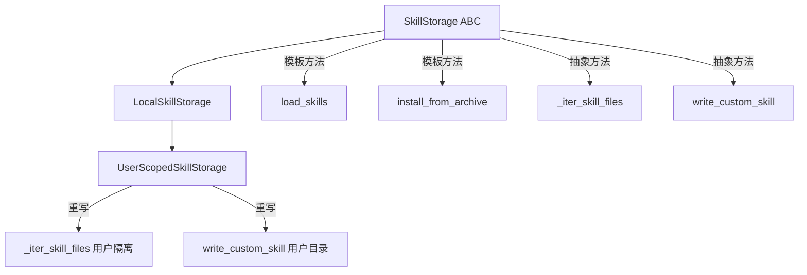
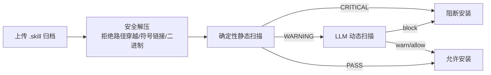
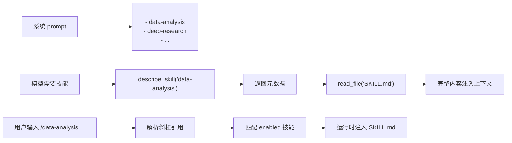
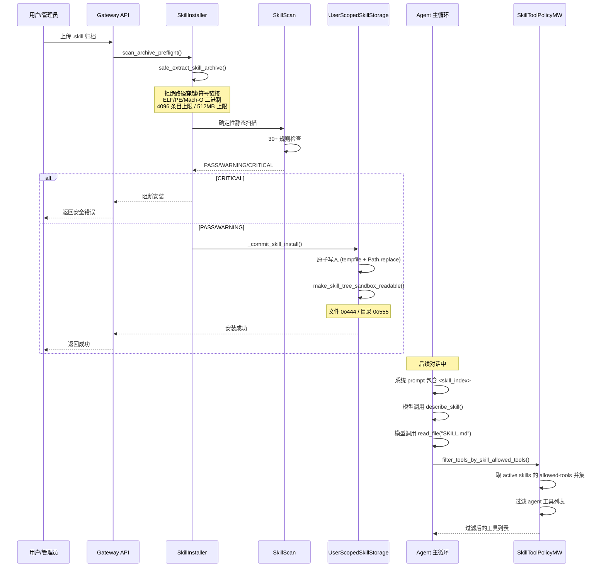

# 技能系统

## 读前思考

- 技能文件（SKILL.md）是用户提供的 Markdown，里面可能包含恶意的 prompt injection 或危险的脚本引用。你怎么在安装前检测这些风险？
- 技能按需加载的核心挑战是：模型怎么知道有哪些技能可用，又怎么在需要时加载完整内容？

## 核心问题

技能系统解决的核心问题是：**以 SKILL.md 为规范，提供可扩展的 agent 工作流注入机制，同时通过双重安全扫描和工具策略实现行为隔离**。

DeerFlow 的技能系统以分层存储（public/custom/legacy）、用户隔离、双重安全扫描（确定性静态 + LLM 动态）、延迟发现目录和斜杠激活为核心设计。

## 方案展示

### 设计选择一：模板方法存储模式 + 用户隔离

`SkillStorage` ABC 定义抽象原子操作（`_iter_skill_files`、`write_custom_skill`、`ainstall_skill_from_archive` 等），具体流程（`load_skills`、history 序列化、路径验证）作为 final 模板方法。`UserScopedSkillStorage` 继承 `LocalSkillStorage` 仅重写路径和迭代逻辑，将 custom skills 重定向到 `{base}/users/{user_id}/skills/custom/`。

当用户没有自定义技能时，回退显示全局 `custom/` 为 `LEGACY`（只读），一旦用户创建第一个 skill 则 shadow 消失。这个设计让多用户部署中每个用户的技能互不干扰。

### 设计选择二：双重安全扫描

技能安装前经过两层安全扫描：

1. **确定性静态扫描**（`skillscan/`）：30+ 规则覆盖已知危险模式——路径穿越、密钥嵌入、Python/Shell 危险模式（`eval`、`exec`、`os.system`）、云元数据访问（`169.254.169.254`）等。零 LLM 成本、结果可重现。
2. **LLM 动态扫描**（`security_scanner.py`）：处理模糊边界——prompt injection 意图、上下文相关的风险等级判断。CRITICAL 直接阻断，HIGH 以下警告。

确定性扫描器还特别处理了 Python 实例客户端外泄检查：追踪简单名称绑定到已知客户端构造函数（如 `HttpClient()`），但不追踪 comprehension、walrus 表达式、注解等复杂绑定——这些场景保守地不产生 finding，避免误报。

### 设计选择三：延迟发现 + 斜杠激活

技能内容不一次性加载到上下文。系统 prompt 只注入 `<skill_index>` 名称列表，模型通过 `describe_skill(name)` 获取元数据，通过 `read_file` 加载完整 SKILL.md。

用户也可以显式激活：输入 `/skill-name task` 触发斜杠激活，运行时注入 SKILL.md 内容到当前 turn。

激活后，技能的 `allowed-tools` 策略生效：`SkillToolPolicyMiddleware` 取所有 active skill 的 `allowed-tools` 并集，过滤 agent 工具列表。框架内建工具（`describe_skill`、`read_file`、`tool_search`、`review_skill_package`）始终保留。

## 完整执行流：技能安装到激活

整个流程分为三个阶段：

1. **安全安装**：用户上传 `.skill` 归档后，首先经过安全解压（拒绝路径穿越、符号链接、可执行二进制、zip bomb），然后进入双层安全扫描。确定性静态扫描覆盖 30+ 规则，CRITICAL 直接阻断，WARNING 传递给 LLM 动态扫描做上下文判断。扫描通过后，技能文件原子写入到用户隔离的存储目录，并设置 sandbox 只读权限（文件 0o444/目录 0o555）。

2. **延迟发现与加载**：安装后的技能不会立即加载到上下文。系统 prompt 只包含 `<skill_index>` 名称列表，模型通过 `describe_skill()` 获取元数据，通过 `read_file()` 加载完整 SKILL.md。用户也可以通过 `/skill-name` 斜杠命令显式激活，运行时直接注入 SKILL.md 内容。

3. **工具策略过滤**：技能激活后，其 `allowed-tools` 声明生效。`SkillToolPolicyMiddleware` 取所有 active skill 的 `allowed-tools` 并集，过滤 agent 工具列表。框架内建工具（describe_skill、read_file、tool_search、review_skill_package）始终保留，确保模型仍能发现和加载其他技能。这是一个软约束——依赖模型的指令遵循能力，而非沙箱级的硬隔离。

## 工程优化

**归档安全**：拒绝 NTFS Alternate Data Stream（冒号路径）、嵌套归档、zip bomb（解压比检测）。`is_eval_fixture_skill_md()` 识别测试 fixture 中的 SKILL.md，不将其注册为运行时技能。

**原子写入**：custom skill 写入使用 `tempfile.NamedTemporaryFile` + `Path.replace`（POSIX 原子替换），`_skill_states.json` 同样原子写。

**名称规范化**：skill name 强制 hyphen-case（`^[a-z0-9]+(?:-[a-z0-9]+)*$`），≤64 字符，防止路径注入。

**HTML 转义**：`describe.py` 对 name/description/allowed-tools 做 `html.escape`，防止 SKILL.md frontmatter 值伪造框架标签。

**LRU 存储缓存**：per-user 存储实例上限 64 个，`OrderedDict` + `move_to_end` 实现真 LRU。

## 面试要点

**1. 双重安全扫描的确定性阶段为什么不追踪复杂 Python 绑定（comprehension、walrus 等）？**

因为这些构造的变量绑定路径过于复杂，静态分析容易产生误报（把安全的代码标记为危险）。保守策略是：复杂绑定不产生 finding，宁可漏报也不误报。误报会让用户觉得扫描器不可靠，最终忽略所有告警。

**2. 技能的 allowed-tools 策略是"行为隔离"还是"行为建议"？**

文档明确说"this is best-effort behavioral scoping, not a hard security boundary"。原因是：通过 `read_file` 加载另一个 SKILL.md 的内容不在控制范围内，active-skill 条目也可能被有界上下文的驱逐策略移除。它是一个软约束，依赖模型的指令遵循能力，而非沙箱级的硬隔离。

**3. 用户隔离的 Legacy 回退设计有什么好处和风险？**

好处是平滑迁移：老版本的全局 custom skills 在新版本中仍然可见（只读），用户不会因为升级而丢失技能。风险是：如果多个用户共享同一个 Legacy 目录，一个用户的技能对其他用户可见。一旦用户创建自己的第一个 skill，shadow 机制会隐藏 Legacy，但这个转换是不可逆的。
