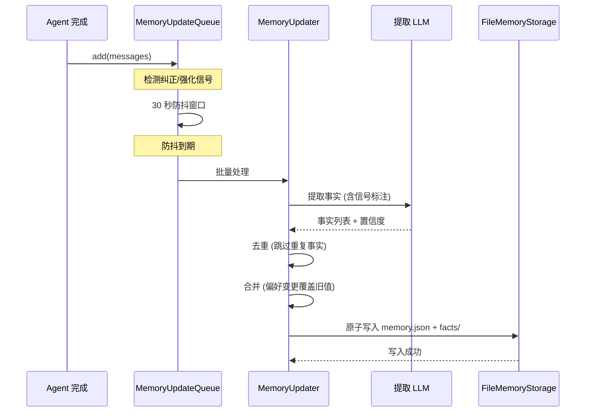
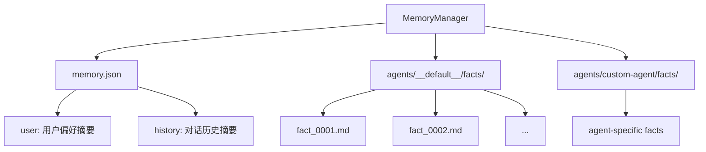
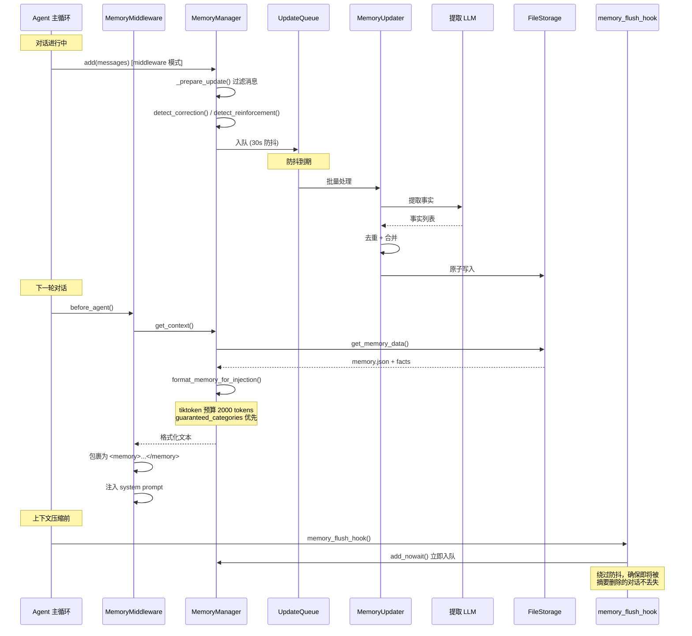

# 记忆系统

## 读前思考

- 大多数 Agent 在对话结束后就忘掉一切。如果要实现跨 session 的长期记忆，你会怎么从对话中提取"值得记住"的信息？用规则还是用 LLM？
- 记忆更新需要避免重复和冲突——用户说"我喜欢 Python"，下次又说"我转到 Rust 了"。你的记忆系统怎么处理这种偏好变更？

## 核心问题

记忆系统解决的核心问题是：**从对话中自动提取持久化事实，跨 session 注入到 agent 上下文中，同时处理去重、冲突和容量管理**。

DeerFlow 的记忆系统以可插拔的 `MemoryManager` ABC 为契约，默认 DeerMem 后端通过防抖队列 + LLM 事实提取 + markdown/JSON 混合持久化，实现对话到长期记忆的自动转化。

## 方案展示

### 设计选择一：三层方法契约

`MemoryManager` ABC 将方法分为三个层级：

- **Tier-1**（必须实现）：`add()`、`get_context()` — 核心读写
- **Tier-2**（管理操作）：`search()`、`get_memory()`、`clear()` — 默认 raise NotImplementedError
- **Tier-3**（可选钩子）：`warm()`、`reload()`、事实 CRUD — 默认 no-op

`supports_search` ClassVar 与 `search()` 是否被重写做交叉验证，`mode="tool"` 强制要求 search 实现。这种分层让简单后端（如 noop）只需实现两个方法，复杂后端可以逐步解锁更多能力。

### 设计选择二：防抖队列 + 信号检测

对话不是立即处理，而是入队后 30 秒防抖批量处理。入队前检测纠正信号（用户说"不对"、"我改主意了"）和强化信号（"对"、"没错"），这些信号传递给 LLM 提取器以提高事实更新精度。

### 设计选择三：用户摘要 vs Agent 事实的分层存储

DeerMem 将记忆分为两层：

- **memory.json**：用户级摘要文档，包含 `user`（个人偏好）和 `history`（历史摘要）两个 section
- **facts/**：per-agent 的 canonical Markdown 文件，每个事实一个文件，路径用 `SHA-256(fact_id)` 前两字符分片

这种分离的好处是：用户级摘要跨 agent 共享，agent 特定事实隔离存储。`__default__` 是保留桶名，不在合法自定义 agent 名称语法内，所以删除自定义 agent 不会误删共享记忆。

## 完整执行流：记忆从提取到注入

整个流程分为四个阶段：

1. **信号检测与入队**：每次 agent run 完成后，`MemoryMiddleware` 在 `before_agent()` 中调用 `add()` 将对话消息入队。入队前会过滤消息（仅保留 human+ai），并检测纠正信号（用户说“不对”“我改主意了”）和强化信号（“对”“没错”）。这些信号会传递给后续的 LLM 提取器以提高事实更新精度。入队时同时捕获 `user_id` 和 `trace_id` 到 `ConversationContext`，避免 ContextVar 跨 Timer 线程传播的问题。

2. **防抖批处理**：入队后启动 30 秒防抖窗口。窗口内同一 (thread_id, user_id, agent_name) 的多次写入合并为一次 LLM 调用。防抖到期后，`MemoryUpdater` 调用 LLM 提取事实，然后去重（跳过重复事实）和合并（偏好变更覆盖旧值），最后原子写入 `memory.json` 和 per-agent 的 markdown 事实文件。

3. **记忆注入**：下一轮对话时，`MemoryMiddleware` 在 `before_agent()` 中调用 `get_context()` 加载记忆。`format_memory_for_injection()` 使用 tiktoken 按 2000 token 预算截断，`guaranteed_categories`（如 correction）优先保证配额。格式化后的文本被包裹为 `<memory>...</memory>` 标签注入 system prompt。

4. **摘要前刷写**：当 `SummarizationMiddleware` 准备压缩旧消息时，`memory_flush_hook()` 会先调用 `add_nowait()` 立即入队（绕过防抖），确保即将被摘要删除的对话内容不会丢失。这是记忆系统和上下文压缩系统之间的关键协调点。

## 记忆系统提示词结构

DeerFlow 的记忆通过两条路径影响模型行为：

**路径 1：主 system prompt 中的 \<memory_tool_system\> 段落**（条件注入，仅 memory tool 模式开启时）：定义 memory_search/memory_add/memory_update/memory_delete 四个工具的使用规范，包括何时搜索、何时保存、保存什么内容、如何组织记忆条目。

**路径 2：DynamicContextMiddleware 运行时注入**（不在静态 system prompt 中）：每轮对话开始前，中间件从记忆存储中检索相关记忆，包裹在 \<memory\> 标签中作为隐藏 HumanMessage 插入第一条用户消息前。这个设计确保记忆内容不污染 system prompt（保护 prefix cache），同时保证模型在每轮对话中都能看到相关记忆。

关键设计：\<memory\> 标签是用户可见数据（与 \<soul\>、\<skill_system\> 等框架内部标签不同），模型可以向用户提及记忆内容。记忆注入有 tiktoken 精确计算的 token 预算，guaranteed_categories（如 correction）优先保证配额。

## 工程优化

**tiktoken 预算**：`format_memory_for_injection()` 使用 tiktoken 精确计算 token 数，`guaranteed_categories`（如 correction）优先保证配额。

**原子文件写入**：`memory.json` 写入使用临时文件 + rename，防止进程中断导致数据损坏。

**乐观并发控制**：`revision` 字段实现乐观锁，`MemoryRevisionConflict` 防止旧写覆盖新数据。Snapshot 派生操作（scoped clear、consolidation）在 manifest 冲突时重载完整文档并重算。

**事实容量管理**：`max_facts=100` 上限，超出时保留高置信度事实（`_trim_facts_to_max` 按 confidence 降序截断）。

**关闭刷写**：`shutdown_flush(timeout)` 在 K8s graceful shutdown 中同步排空队列，honour `terminationGracePeriodSeconds`。

**Host Hook 注入**：后端包不直接引用 deer-flow 概念（Langfuse、hidden message 过滤等）。Host 通过 `_collect_host_hooks()` 提供默认实现，新增后端只需实现 `from_config`。

## 面试要点

**1. 为什么用 LLM 提取事实而不是用规则（如正则匹配偏好表达）？**

自然语言的偏好表达太多样——"我喜欢 Python"、"Python 是我的首选"、"我主要写 Python"、"Python is my go-to language"。规则系统需要维护大量模式且难以覆盖所有变体。LLM 提取器虽然增加了 API 成本，但能准确理解语义，还能处理多语言场景。30 秒防抖批量处理进一步降低了 LLM 调用频率。

**2. 防抖队列在 Timer 线程中执行，ContextVar 怎么传播？**

`user_id` 和 `trace_id` 在入队时捕获到 `ConversationContext` 对象中，不依赖 ContextVar 跨 Timer 线程传播。这是一个刻意的设计选择：在入队边界显式捕获上下文，而不是依赖隐式的线程局部变量。

**3. 记忆的 fact 文件用 SHA-256 分片有什么好处？**

`fact_*` ID 是顺序生成的，如果直接用作文件名，所有文件会在同一目录下线性增长。用 `SHA-256(fact_id)` 前两字符（256 个桶）分片，文件均匀分布，避免单目录文件数过多导致的文件系统性能下降。
