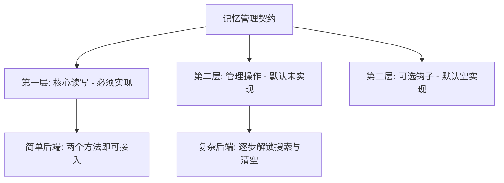
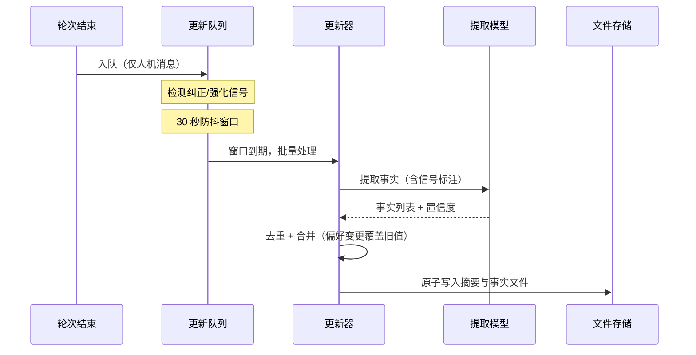
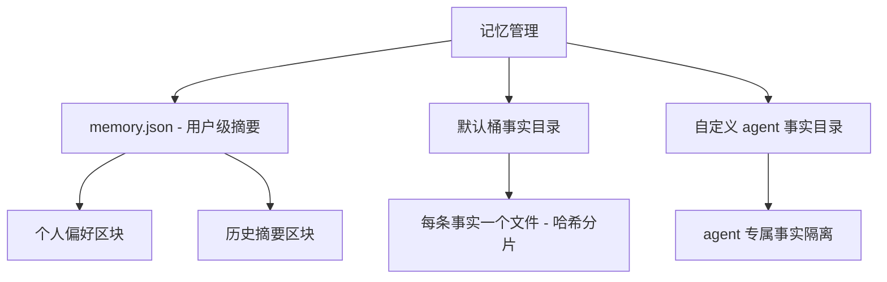
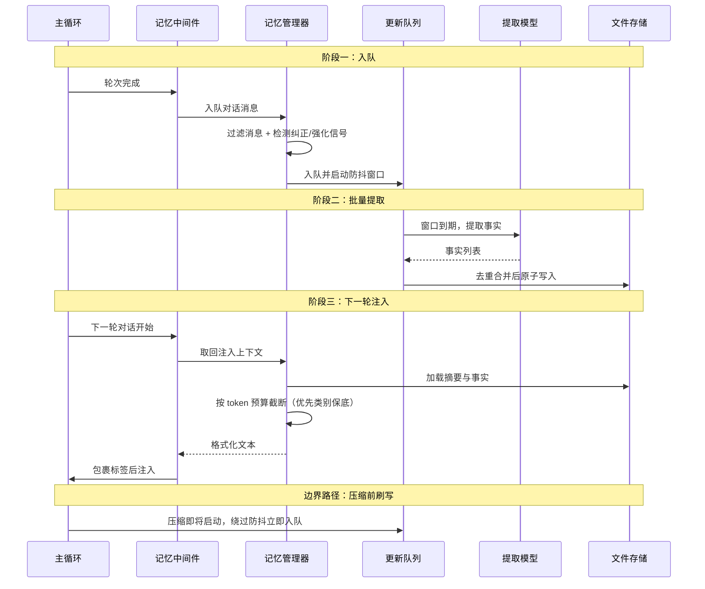

# 长期记忆

## 读前思考

- 用户的偏好会变：今天说"我喜欢 Python"，下次说"我转到 Rust 了"。如果记忆系统把两句话都当成新条目存下来，检索时就会返回两条互相矛盾的事实。你会怎么让提取环节分辨"这是新事实"还是"这是对旧事实的替换"？
- deer-flow 面向企业场景，对话密集、多 agent 并行。每次提取都要一次模型调用，你会怎么把提取成本压下来，又不丢掉"用户刚改口"这种时效性很强的信号？

## 核心问题

记忆系统解决的核心问题是：**从对话中自动提取持久化事实，跨会话注入到 agent 上下文中，同时处理去重、冲突和容量管理。** 边界说明：单会话内的上下文压缩属短期记忆，见 [05-context](05-context.md)；对话消息本身的持久化归会话存储，见 [04-state](04-state.md)。本篇只讲 deer-flow 的跨会话长期记忆。

deer-flow 的记忆系统以可插拔的记忆管理契约为接口基础（源码：MemoryManager 抽象基类），默认后端通过防抖队列、模型事实提取、文件持久化三件套，把对话自动转化为长期记忆；注入由中间件在每轮对话前完成。它不做独立的检索引擎——记忆库被设计成"小到可以整体装进预算"，走全量加载路线。

| 维度 | deer-flow 的选择 |
|------|----------------|
| 提取方式 | 防抖队列批量 + 模型提取（带纠正/强化信号标注） |
| 存储后端 | 文件：用户级摘要（memory.json）+ per-agent 事实文件（facts/） |
| 检索方式 | 免检索：全量加载 + token 预算截断 |
| 注入时机 | 中间件每轮前注入，包在用户可见标签里 |
| 整合与过期 | 提取时去重合并，容量上限淘汰 |
| 并发控制 | 防抖窗口合并写入，版本号乐观锁防旧写覆盖新写 |

## 方案展示

### 设计选择一：三层方法契约

记忆管理接口把方法分成三个层级：第一层是必须实现的核心读写（入队提取与取回注入上下文两个方法）；第二层是管理类操作（搜索、单条读取、清空），默认抛出未实现异常；第三层是可选钩子（预热、重载、事实增删改查），默认空实现。后端是否支持搜索，用声明标志与实际方法重写做交叉验证，工具模式强制要求实现搜索。

**为什么这么选**：deer-flow 允许宿主替换任意记忆后端，简单后端（如空实现）只需写两个方法就能接入，复杂后端逐步解锁更多能力，契约不会逼着每个后端实现全套管理接口。**牺牲了什么**：调用方必须先探测能力再调用，分层契约比单一接口的理解和测试成本更高。

### 设计选择二：防抖队列 + 信号检测

对话不是立即提取，而是入队后经 30 秒防抖窗口批量处理。入队前做两类信号检测：纠正信号（用户说"不对""我改主意了"）和强化信号（"对""没错"），信号标注随对话一起交给提取模型，用于提高事实更新精度——检测到纠正时，模型知道要覆盖旧事实而非新建。

**为什么这么选**：企业场景对话密集，逐轮提取的模型调用开销不可接受；防抖把窗口内同一会话、同一用户、同一 agent 的多次写入合并为一次调用，成本降一个量级。信号检测则解决"偏好变更"问题——"我转到 Rust 了"覆盖"我喜欢 Python"，而不是两条矛盾记忆共存。**牺牲了什么**：窗口内的提取延迟（最长约一个防抖窗口），以及信号词表覆盖不到的改口表达。

### 设计选择三：用户摘要与 agent 事实的分层存储

记忆分两层落盘：memory.json 是用户级摘要文档，含个人偏好与历史摘要两个区块，跨 agent 共享；facts/ 目录存 per-agent 的事实文件，每条事实一个 Markdown 文件，路径用事实编号哈希（SHA-256 前两字符）分片到 256 个桶。默认共享桶用保留名称，不在合法自定义 agent 名称的语法范围内。

**为什么这么选**：用户偏好应该跟着用户走而非跟着某个 agent 走，agent 专属事实又不能互相污染，分层是唯一同时满足两者的结构；哈希分片避免顺序编号文件在单目录线性增长拖慢文件系统；保留桶名保证删除自定义 agent 时不会误删共享记忆。**牺牲了什么**：两层存储的一致性维护成本——摘要与事实文件需要各自的事务与版本控制。

## 核心机制执行流：记忆从提取到注入

以一次"用户表达偏好并被记住"为例，展示记忆从产生到下次被模型看到的完整链路：

**阶段一：信号检测与入队。** 每次 agent 运行完成后，记忆中间件把对话消息交给管理器入队。入队前过滤消息（只保留用户与模型两类）并检测纠正/强化信号。入队时同时把用户标识和追踪标识捕获进会话上下文对象——防抖窗口到期时执行在定时线程里，不能依赖线程局部变量的隐式传播，必须在入队边界显式捕获。

**阶段二：防抖批处理。** 窗口内同一会话、同一用户、同一 agent 的多次写入合并为一次提取。到期后更新器调用模型提取事实，随后去重（跳过重复事实）、合并（偏好变更覆盖旧值），最后原子写入摘要文档与事实文件。

**阶段三：记忆注入。** 下一轮对话时中间件取回记忆内容：加载摘要与事实文件，按 tiktoken 精确计算的 token 预算截断，优先类别（如纠正类）保底配额，格式化后包在记忆标签里注入。注意注入位置是第一条用户消息之前的隐藏消息而非系统提示词——这样记忆内容不进入系统提示词前缀，不破坏 prompt cache（组装时机与提示词结构见 [05-context](05-context.md)）。

**阶段四（边界路径）：摘要前刷写。** 当压缩中间件准备把旧消息替换成摘要时，会先触发记忆刷写钩子：待提取对话绕过防抖窗口立即入队，确保即将被删除的原文先进入记忆管道。这是与上下文压缩的关键协调点，压缩机制见 [05-context](05-context.md)。另一条边界：子代理的压缩链特意不触发这个刷写——子代理的内部工具调用过程不该进入用户的长期记忆。

**边界路径：并发写入冲突。** 两个会话同时更新同一份摘要时，写入携带版本号做乐观锁，旧版本写入会被拒绝而不是静默覆盖新数据；快照派生操作（局部清空、整合）在清单冲突时重新加载完整文档再重算。

## 记忆系统提示词结构

deer-flow 的记忆通过两条路径影响模型行为，本节只讲"记忆内容从哪来"，注入时机与提示词分层见 [05-context](05-context.md)：

| 路径 | 内容来源 | 进入方式 |
|------|---------|---------|
| 记忆工具说明段 | 系统提示词的条件段落 | 仅工具模式开启时注入，定义搜索/新增/更新/删除四个工具的使用规范 |
| 记忆内容注入 | 记忆存储检索结果 | 中间件每轮运行时包裹记忆标签，作为隐藏消息插入第一条用户消息前 |

第二条路径是关键设计：记忆内容不进系统提示词，而是放在用户消息位。系统提示词保持稳定以命中 prompt cache，记忆每轮可变但不影响前缀。记忆标签属于用户可见数据类标签（与框架内部标签不同），模型可以向用户提及记忆内容。

## 工程优化

**精确预算截断**：注入时用 tiktoken 精确计算 token 数而非字符估算，优先类别（如纠正类）先保配额，其余类别按序截断，保证最重要的记忆不被挤出。

**原子文件写入**：摘要文档写入走临时文件加重命名，进程中途崩溃不会留下写了一半的损坏文件。

**乐观并发控制**：版本号字段实现乐观锁，防止旧写覆盖新数据；清单冲突时派生操作重载完整文档重算。

**事实容量管理**：事实条数设硬上限（100 条），超出时按置信度降序保留高分事实——这是 deer-flow 版的过期策略：不做时间淘汰，做质量淘汰。

**关停刷写**：容器优雅关停时同步排空提取队列，避免防抖窗口内的待提取对话随进程退出而丢失。

## 面试要点

**1. 为什么用模型提取事实而不是规则匹配（如正则匹配偏好表达）？**

参考答案方向：自然语言的偏好表达变体太多——"我喜欢 Python""Python 是我的首选""我主要写 Python"，规则词表维护成本高且覆盖不全；模型能理解语义、处理多语言、还能配合信号标注识别"改口即覆盖"。代价是每次提取一次 API 调用，靠防抖批量摊薄成本。判断标准是"偏好表达的形式多样性 × 可接受的调用成本"：表达越多样、调用越便宜，越应该选模型提取。

**2. deer-flow 不做独立检索引擎、直接全量加载加预算截断，这在什么条件下成立？规模变大后怎么演进？**

参考答案方向：成立条件是记忆库总量始终小于注入预算——用户级摘要加百条以内的事实文件，截断后仍能整体装下，此时"免检索"反而是最简单可靠的方案（没有检索失准问题）。规模变大后有两条演进路：加检索层（全文或向量，参考 hermes-agent 与 openclaw 的路线），或提高整合强度（学 openclaw 的定期整合控制总量）。判断标准是"记忆总量 × 注入预算余量"：装得下就免检索，装不下必须先检索或先瘦身。

**3. 防抖队列在定时线程里执行，会话上下文（用户标识、追踪标识）怎么保证不丢？**

参考答案方向：不依赖线程局部变量的隐式传播，而是在入队边界把上下文显式捕获进会话对象，线程拿到的是一份快照。这样做的理由：防抖到期时间不确定，期间请求上下文可能已经切换，隐式传播拿到的是错误现场。判断标准是"异步延迟的确定性 × 上下文的易变性"：延迟越不确定、上下文越容易变，越应该显式捕获而非依赖传播。
