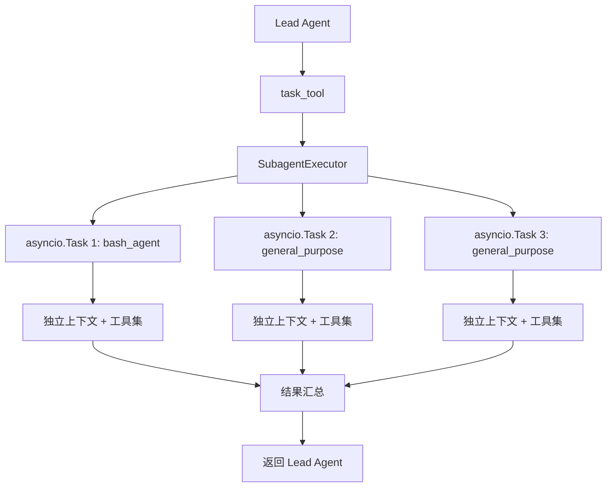
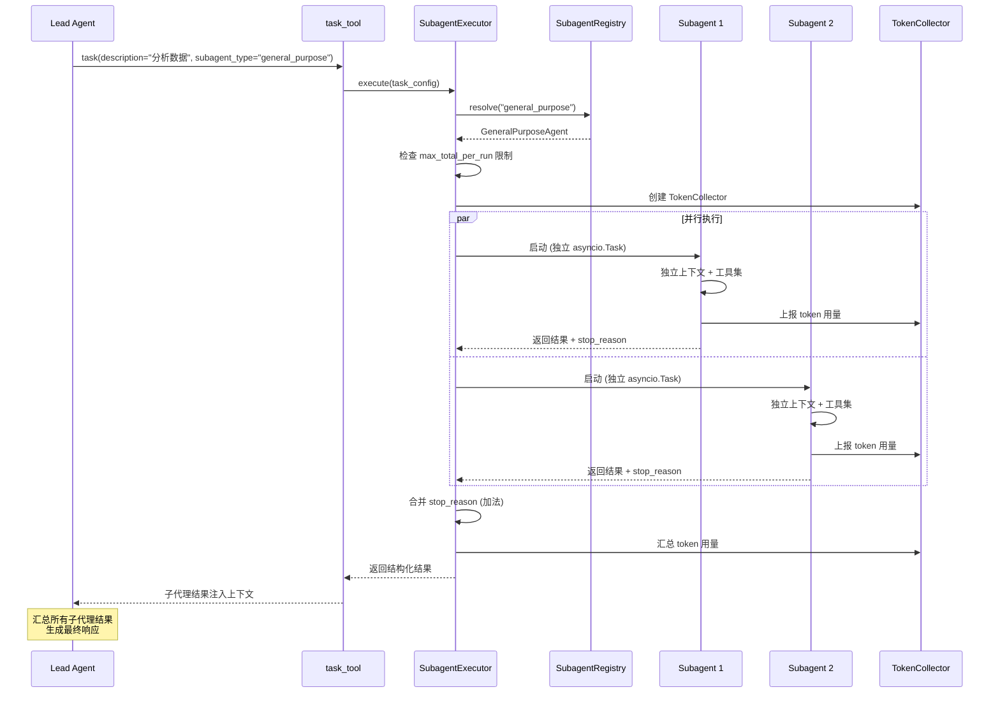

# 子代理/编排

## 读前思考

- 一个复杂任务需要拆分成多个子任务并行执行。你怎么隔离每个子代理的上下文，同时让主代理汇总结果？
- 子代理执行可能失败或超时。你的状态合约怎么在不新增状态枚举的前提下表达"部分完成 + 失败原因"？

## 核心问题

子代理系统解决的核心问题是：**将复杂任务分解为独立的子任务，每个子代理在隔离的上下文中并行执行，最后由主代理汇总结果**。

DeerFlow 的子代理系统通过 `SubagentExecutor` 的隔离事件循环执行、三层配置解析、以及加法式 `stop_reason` 状态合约实现。

## 方案展示

### 设计选择一：隔离事件循环执行

每个子代理运行在独立的 asyncio.Task 中，有自己的事件循环和上下文。这确保了：

1. **上下文隔离**：子代理看不到主代理或其他子代理的消息历史
2. **故障隔离**：一个子代理崩溃不影响其他子代理
3. **资源隔离**：每个子代理有独立的 token 预算和 recursion limit

### 设计选择二：三层配置解析

子代理的配置来自三个层级，按优先级：

1. **task_tool 参数**：模型在调用 `task` 工具时可以指定 `model`、`recursion_limit` 等参数
2. **SubagentConfig**：`config.yaml` 中 `subagents` 段的配置（如 `max_total_per_run`）
3. **全局默认值**：硬编码的 fallback（如 `recursion_limit=50`）

这种分层让模型可以在运行时调整子代理行为，同时有全局限制防止资源滥用。

### 设计选择三：加法式 stop_reason 状态合约

子代理的完成状态不用新增状态枚举，而是用加法式 `stop_reason` 字段：

- `completed`：正常完成
- `failed`：执行失败
- `max_turns_reached`：达到最大轮次
- `token_budget_exhausted`：token 预算用完
- 多个原因可以组合：`completed|max_turns_reached`

这种设计的好处是前后端兼容——前端只需要检查是否包含 `failed`，不需要理解新的状态枚举。

## 完整执行流：子代理从委派到汇总

整个流程分为四个阶段：

1. **任务委派**：Lead Agent 通过调用 `task` 工具发起子代理任务。模型可以在调用参数中指定 `subagent_type`（如 `general_purpose` 或 `bash_agent`）、`model`、`recursion_limit` 等参数。`task_tool` 将请求转发给 `SubagentExecutor`。

2. **配置解析与限制检查**：`SubagentExecutor` 从 `SubagentRegistry` 解析子代理类型，然后检查三层配置——task_tool 参数 > SubagentConfig > 全局默认值。关键的限制检查包括 `max_total_per_run`（单次 run 最多启动多少子代理），超限则拒绝启动新子代理。

3. **并行执行**：每个子代理在独立的 asyncio.Task 中运行，有自己的事件循环、上下文和工具集。`TokenCollector` 收集每个子代理的 token 用量。长时间运行的子代理在启用 summarization 时会压缩旧历史并重新注入摘要。Provider/Model 请求失败时报告为 `failed` stop_reason，而不是静默返回空结果。

4. **结果汇总**：所有子代理完成后，`SubagentExecutor` 合并 stop_reason（加法式，如 `completed|max_turns_reached`），汇总 token 用量并归因到 dispatching step。结构化结果注入 Lead Agent 上下文，Lead Agent 汇总所有子代理结果生成最终响应。Web UI 的折叠卡片显示有效模型和累计 token 总数。

## 子代理提示词结构

DeerFlow 的子代理编排指令不是独立的 prompt 文件，而是主 system prompt 中的 \<subagent_system\> 段落（由 _build_subagent_section() 生成，仅 subagent_enabled=True 时注入）。包含：

| 部分 | 内容 |
|------|------|
| 分解-委派-综合流程 | 教导 Lead Agent 将复杂任务分解为子任务，委派给子代理，然后综合结果 |
| 并发上限 | 默认最多 3 个子代理/轮，总量上限可配置 |
| 多批次执行示例 | 展示如何分批次委派（第一批研究 → 第二批实施） |
| 可用子代理类型 | general-purpose（通用研究/分析）、bash（命令执行，依赖沙箱配置）、自定义类型 |

子代理本身不使用独立的 system prompt——它们继承 Lead Agent 的模型配置，但工具集受限（由 SubagentLimitMiddleware 控制）。\<critical_reminders\> 中的子代理提醒（“你已启用子代理，请用它来分解任务”）也是条件性注入的。

## 工程优化

**Token 归因**：`TokenCollector` 不仅汇总子代理的 token 用量，还归因到 dispatching step，让主代理的 token 统计包含子代理消耗。

**Summarization 集成**：长时间运行的子代理在启用 summarization 时，会压缩旧历史并重新注入摘要作为 guarded hidden durable context，确保最近的工具调用有上下文支撑。

**Provider/Model 失败处理**：子代理的 LLM 请求失败时报告为 `failed` stop_reason，而不是静默返回空结果，让主代理可以做出反应（重试或换策略）。

**Collapsed Card 展示**：Web UI 的折叠子代理卡片显示有效模型和累计 token 总数，每次子代理 LLM 调用后更新，reload 后仍保留。

**技能目录共享**：子代理从与主代理相同的 user-scoped catalog 解析技能，确保用户自定义技能对子代理可用，但不会暴露其他用户的版本。

## 面试要点

**1. 为什么子代理要用独立的 asyncio.Task 而不是在同一个 task 中串行执行？**

独立 task 实现了真正的并行执行——多个子代理可以同时调用 LLM 和工具，总耗时取决于最慢的子代理而非所有子代理之和。串行执行会让复杂任务的耗时线性增长。代价是每个 task 需要独立的上下文和错误处理，增加了系统复杂度。

**2. 加法式 stop_reason 相比状态枚举有什么劣势？**

主要劣势是：无法表达互斥状态（如"成功但超时"和"失败但超时"在加法语义下都是 `completed|max_turns_reached` 或 `failed|max_turns_reached`，但前者可能需要不同的后续处理）。对于当前场景，子代理的后续处理逻辑只关心"是否失败"，不关心具体的成功子状态，所以加法语义足够。

**3. 子代理的上下文隔离会不会导致信息丢失？**

会。子代理看不到主代理的对话历史，只能通过 `task` 工具的 `description` 参数接收任务描述。如果任务描述不够详细，子代理可能缺少必要的背景信息。这是上下文隔离的代价：换取了聚焦和效率，但丢失了全局视野。主代理在委派时需要写好任务描述来弥补这个信息差。
