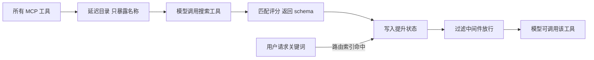
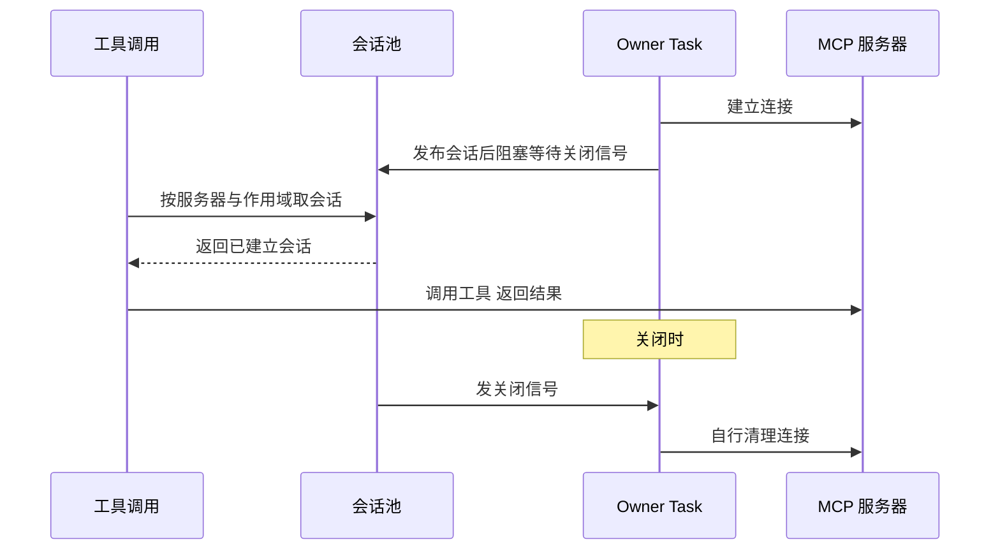
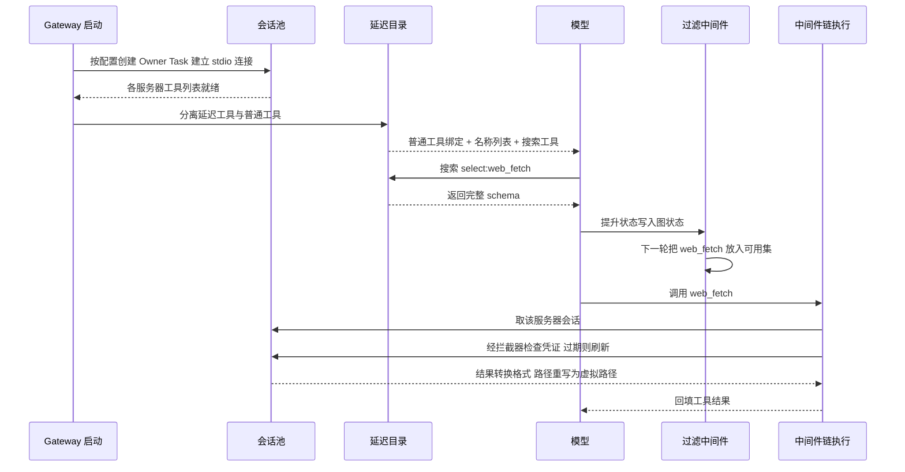

# 工具与扩展生态

## 读前思考

- 一个框架可能接入几十上百个 MCP 工具，每个工具的 schema 都要占上下文空间。怎么做到"让模型知道有这些工具，但不为每个 schema 预付 token"？如果答案是一次按需搜索，搜索本身又该怎么设计才能让模型一次命中？
- 工具、MCP、技能、扩展中间件来自四类不同来源，名称会冲突、连接会失效、配置会热改。你把这些能力放进同一套中间件链，还是各建一套管理面？deer-flow 的选择是后者——但每一层都要回答同一个问题：失效时是静默降级还是直接拒绝？

## 核心问题

**deer-flow 的工具面以"token 预算优先"组织：注册阶段多源聚合按优先级去重，发现阶段对 MCP 工具做延迟加载，执行阶段全部收敛进中间件链，扩展阶段用 config 声明式注入。** 它是四个项目中唯一把"模型看见工具"本身做成按需付费的项目。

| 维度 | deer-flow 的选择 |
|------|-----------------|
| 工具来源 | config 声明 > 内置 > MCP > ACP 四级优先级去重 |
| 模型可见性 | MCP 工具进延迟目录，搜索或关键词提升后才放行 schema |
| MCP 连接 | Owner Task 会话池（仅 stdio）+ OAuth 拦截器 + 内容签名热更新 |
| 执行路径 | 中间件链统一处理权限、护栏、预算 |
| 技能 | 分层存储 + 用户隔离 + 延迟目录 + 斜杠激活 + allowed-tools 软约束 |
| 扩展 | config 声明式中间件注入，fail_closed 可配 |

## 方案展示

### 设计选择一：延迟工具发现 + 关键词自动提升

工具聚合完成后，延迟目录机制把 MCP 工具从模型绑定中隐藏，只暴露名称列表，同时注册一个搜索工具。搜索支持三种查询模式：按名称精确选择、按关键词加相关性排序、按正则匹配；每次最多返回五个工具的完整 schema，防止一次搜索把 schema 预算打爆。搜索结果写入图状态的提升字段，过滤中间件在下一轮模型调用前把对应 schema 放进可用集（源码：DeferredToolCatalog、DeferredToolFilterMiddleware、tool_search）。

除了模型主动搜索，路由中间件还维护一份由工具元数据中关键词与优先级构成的路由索引，用户请求命中关键词时直接把对应 MCP 工具从延迟状态提升为可用，省去一次搜索往返（源码：McpRoutingMiddleware）。这相当于给高频工具开了预加载通道。

**为什么这么选**：每个 MCP 工具 schema 占用数百 token，全量绑定几十个工具就可能吃掉小窗口模型大半空间。延迟发现把固定开销从"工具数 × schema 大小"降为"工具数 × 名称大小 + 实际使用数 × schema 大小"。代价是多一轮模型往返，增加约一两秒延迟；路由提升只对配置了关键词的高频工具有效，长尾工具仍要付搜索成本。

### 设计选择二：Owner Task 会话池 + 内容签名热更新

MCP 会话要在多次工具调用间保持状态，但 anyio 的取消域语义要求连接在同一个异步任务中打开和关闭。deer-flow 的解法是 Owner Task 模式：每个 stdio 会话由一个专属异步任务持有完整生命周期——它进入上下文管理器建立连接、把会话发布进池、然后阻塞等待关闭信号；工具调用从池里取会话直接用，关闭时只发信号让 owner 自行退出。仅 stdio 被池化，HTTP/SSE 因使用任务组而无法从其他任务安全关闭，每次调用按需建连。HTTP/SSE 的 OAuth 由拦截器在每次调用时检查 token 有效性、过期自动刷新，上层完全无感；凭证刷新涉及的安全面见 09-guardrails.md。

配置热更新用"解析路径 + 修改时间 + 文件大小 + 内容摘要"四元组签名检测变更，签名变化时关闭所有会话并重建工具列表。不只看修改时间是因为它在同秒编辑、版本控制回退、网络挂载等场景下有盲区。

**为什么这么选**：会话池是对取消域技术约束的直接回应，也让子进程类连接的建立成本只付一次。代价是 HTTP/SSE 无法池化（技术约束而非选择），以及池容量需要 LRU 淘汰管理。

### 设计选择三：技能的分层存储、延迟激活与 allowed-tools 软约束

技能存储用模板方法模式：抽象基类固定加载、安装、历史序列化等流程，把目录迭代与写入留作抽象操作；用户隔离实现只重写路径逻辑，把自定义技能重定向到用户专属目录。用户没有自定义技能时回退展示全局目录为只读遗留层，一旦创建第一个技能，遗留层即被遮蔽——多用户部署中各自技能互不干扰。

激活分两条路：系统提示词只注入技能名称索引，模型通过描述工具取元数据、再读文件加载完整内容（技能索引占多少 token、何时进提示词，见 05-context.md）；用户也可以斜杠命令显式激活，运行时直接注入技能内容。激活后，技能的 allowed-tools 声明生效：策略中间件取所有激活技能的 allowed-tools 并集过滤工具列表，框架内建的技能发现类工具始终保留，确保模型仍能发现其他技能。

**为什么这么选**：多用户企业部署里技能来源不可信、用户之间必须隔离；allowed-tools 让"数据分析"技能只能摸到数据类工具。官方定位明确这是尽力而为的行为限定而非硬安全边界：模型仍可能通过被允许的工具读取另一个技能的内容，安装期的双重扫描机制见 09-guardrails.md。代价是双重扫描增加安装延迟，软约束防不住语义级绕过。

### 设计选择四：config 声明式扩展注入

deer-flow 没有插件市场或 SDK。扩展通过在配置文件里声明中间件类路径实现：构建 Agent 时按声明反射加载类，插入内置中间件链的固定位置——运行时基础中间件之后、终止响应层之前。缺失的包、无效的类一律抛异常让 Agent 创建失败（fail loud），配合可配的 fail_closed 失败模式，生产环境宁可报错也不静默丢功能。其中基于角色的装配过滤与运行时拦截双层属于执行前审批范畴，见 09-guardrails.md。

**为什么这么选**：企业运维需要可审计的声明式注入——配置文件里就能看清加载了哪些扩展。代价是扩展能力有限（只能注入中间件，不能加新工具、新模型或新通道），且配置文件因此成为受信任的操作员文件，中间件路径就是代码执行。

## 完整执行流：一个延迟 MCP 工具从启动到执行

以用户配置了一个 stdio 的网页抓取 MCP 服务器、模型最终调用其抓取工具为例：

**阶段一：启动加载。** Gateway 启动时读取扩展配置，按传输类型分别处理：stdio 创建 Owner Task 建立持久连接，HTTP/SSE 先取初始凭证再建连。所有服务器并发加载，单个失败不影响其他；加载完成为每个工具打上来源标记，并按四级优先级（config > 内置 > MCP > ACP）去重。

**阶段二：延迟目录构建。** 延迟目录把 MCP 工具从绑定中隐藏，只暴露名称列表并注册搜索工具。目录本身是不可变结构，带有惰性计算的哈希——提升状态与目录哈希绑定，防止目录变更后旧的提升放行暴露出不同的工具。

**阶段三：按需提升。** 模型调用搜索工具获取 schema，结果写入图状态的提升字段；过滤中间件在下一轮放行。关键词路由是旁路：用户请求命中路由索引时直接提升，跳过搜索。

**阶段四：执行与结果转换。** 提升后的工具与普通工具同等待遇，经中间件链的授权、护栏、循环检测、预算检查后执行。MCP 结果转换为框架格式时做路径重写——主机真实路径替换为虚拟路径，防止信息泄漏。

**边界路径——MCP 恢复失败。** 延迟目录在 MCP 工具恢复失败时直接抛异常拒绝绑定，走 fail-closed：让模型看到工具名却执行失败，比启动时明确报错体验更差。

**边界路径——凭证过期。** HTTP/SSE 调用时拦截器发现 token 过期会自动刷新；刷新失败则抛认证异常，工具调用转为错误结果交回模型，由模型决定重试或换路。

## 工程优化

**同步异步桥接**：为异步工具提供同步调用路径时，用线程池在已有事件循环的场景下新建循环执行，并保持上下文变量传播，避免工具作者被迫区分两种调用模式。

**进行中去重**：会话池用一张进行中请求表让同一服务器同一作用域的并发创建请求共享同一个未来对象，避免重复建会话。

**搜索降级**：模型输出的查询可能包含不平衡括号导致正则编译失败，此时降级为字面量匹配而不是报错。

**技能缓存异步刷新**：预解析的技能索引缓存过期后在后台异步刷新，对话路径不因文件系统扫描阻塞。

**原子写入与名称规范化**：自定义技能写入走临时文件加原子替换；技能名强制连字符小写格式并限长，防止路径注入；技能元数据展示前做 HTML 转义，防止 frontmatter 值伪造框架标签。

**取消安全**：会话池的锁获取与等待用取消屏蔽保护，任务被取消时仍确保锁被释放、owner 任务被正确关闭。

## 面试要点

**1. 延迟发现省下的 token 和付出的往返，什么时候划算？关键词提升是不是让延迟发现变得多余？**

划算条件是全量 schema 成本高于搜索往返成本乘以平均搜索次数。小窗口模型下几十个 MCP 工具全量绑定近乎不可接受，延迟发现是必选；大窗口下收益缩小但依然为正。关键词提升不是替代而是补丁：它只覆盖配置了关键词的高频工具，本质是预加载，长尾工具仍走搜索。判断标准是"工具数量 × schema 单价"与"往返成本 × 搜索频次"的对比，前者越大越该延迟，后者越高越该预加载高频项。

**2. 为什么只池化 stdio 传输？如果非要池化 HTTP/SSE，要付出什么？**

直接原因是技术约束：HTTP/SSE 基于任务组，无法从打开连接的任务之外安全关闭，跨任务关闭会触发运行时错误。深层原因是收益不对称：stdio 子进程建立成本高（拉起进程加握手），池化收益大；HTTP 请求无状态，重建成本低。非要池化 HTTP/SSE，就要放弃任务组的结构化并发，自己管理连接对象的跨任务关闭与异常传播，复杂度显著上升而收益有限。判断标准是"连接建立成本 × 复用频率"是否值得为它重写生命周期管理。

**3. 扩展只允许注入中间件、且 fail loud，这个设计的代价在哪？**

代价有两层。能力上，企业只能拦截和观察已有流程，不能新增工具、模型或通道——想要这些就得动核心代码。安全上，配置文件变成受信任的操作员文件，声明一个类路径等于执行一段代码，所以网关的写接口刻意不暴露修改扩展声明的路径。换来的收益是可审计：加载了什么、插在链上什么位置、失败时是报错还是跳过，全部在配置里一目了然。判断标准是"扩展需求的多样性 × 运维对可审计性的要求"——企业运维场景后者通常压倒前者。
