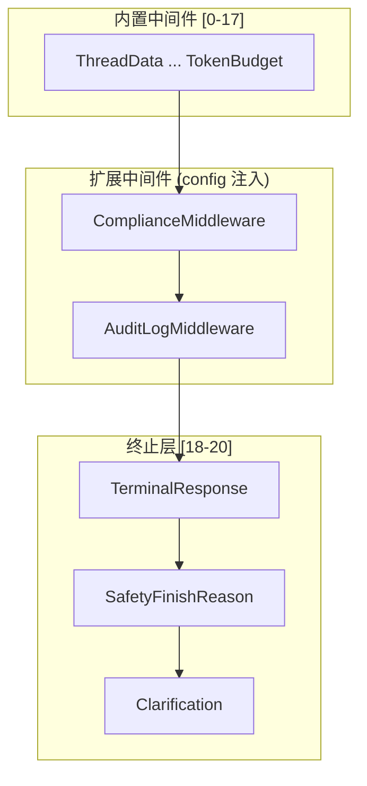
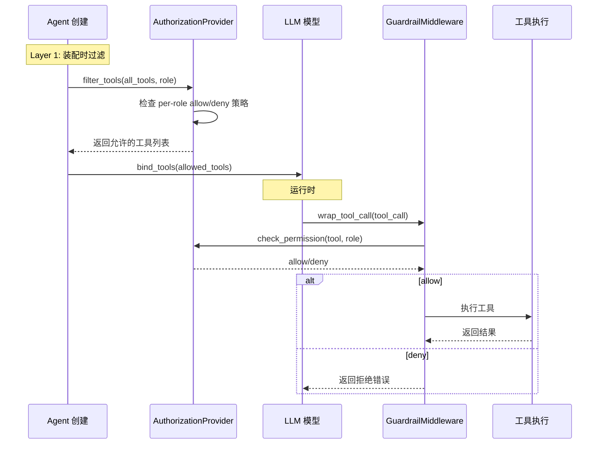
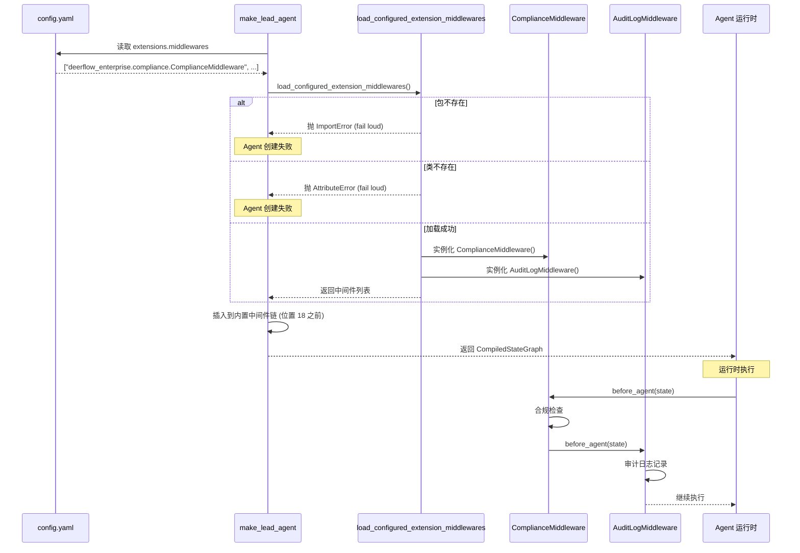

# 插件/扩展系统

## 读前思考

- DeerFlow 没有传统意义上的独立插件系统（如 VS Code 的扩展市场）。那它怎么让企业用户注入自定义逻辑？
- 38 个内置中间件已经覆盖了大部分场景，但如果企业需要添加领域特定的护栏（如合规检查、审计日志），你会怎么设计扩展点？

## 核心问题

DeerFlow 的扩展系统解决的核心问题是：**通过中间件链的 config 声明式注入 + 护栏/授权的双层执行，让企业用户可以在不修改核心代码的前提下添加自定义逻辑**。

DeerFlow 没有独立的插件市场或插件加载器，但它通过三个扩展点实现了同等能力：

1. **`extensions.middlewares` 配置**：在 `config.yaml` 或 `extensions_config.json` 中声明自定义中间件类路径
2. **护栏系统（guardrails/）**：可配置的输入/输出过滤
3. **授权系统（authz/）**：RBAC 角色权限控制

## 方案展示

### 设计选择一：Config 声明式中间件注入

企业用户可以在 `config.yaml` 中声明自定义中间件：

```yaml
extensions:
  middlewares:
    - deerflow_enterprise.compliance.ComplianceMiddleware
    - deerflow_enterprise.audit.AuditLogMiddleware
```

`load_configured_extension_middlewares()` 在 agent 创建时加载这些类，插入到内置中间件链的特定位置：**在 runtime 中间件和 loop/token guards 之后，但在 terminal-response/safety/clarification 尾部之前**。



这个设计的好处是：企业扩展不需要修改 DeerFlow 源码，只需要实现 `AgentMiddleware` 接口并在 config 中声明。代价是 config 文件变成了受信任的 operator-controlled 文件——中间件路径就是代码执行。

### 设计选择二：护栏/授权的双层执行

护栏和授权都采用双层执行模式：

**Layer 1（装配时过滤）**：在工具绑定到模型之前，`AuthorizationProvider` 过滤掉被拒绝的工具，被拒绝的工具不会出现在模型的 schema 中。

**Layer 2（运行时拦截）**：在每次工具执行前，`GuardrailMiddleware` 再次检查权限，防止模型通过 `tool_search` 或其他途径绕过 Layer 1。



内置的 RBAC provider 支持 per-role 的 tool allow/deny 策略，并验证 `default_role` 命名了一个已配置的角色。授权默认关闭。

### 设计选择三：失败模式配置

护栏和授权都支持 `fail_closed` 配置：

- `fail_closed: true`：配置错误或 provider 不可用时拒绝所有请求
- `fail_closed: false`：配置错误时允许所有请求（宽松模式）

这个配置让运维可以根据安全需求选择严格或宽松模式。生产环境通常设为 `true`，开发环境可以设为 `false` 避免阻塞。

## 完整执行流：扩展中间件从配置到执行



整个流程分为三个阶段：

1. **配置读取与加载**：`make_lead_agent` 在构建中间件链时，从 `config.yaml` 的 `extensions.middlewares` 段读取自定义中间件类路径列表。`load_configured_extension_middlewares()` 通过 importlib 加载每个类——缺失的包、无效的类、损坏的模块都会 fail loud（抛异常），而不是静默忽略。这避免了“配置写了但没生效”的隐蔽 bug。

2. **位置插入**：加载的扩展中间件被插入到内置中间件链的特定位置——在 runtime 中间件和 loop/token guards 之后（位置 18 之前），但在 terminal-response/safety/clarification 尾部之前。这个顺序是经验总结：内置中间件负责基础设施（沙箱、上下文、token 计数），必须在扩展之前执行；终止层必须在最后执行，确保扩展的逻辑不会被提前截断。

3. **运行时执行**：扩展中间件与内置中间件同等对待，参与 `before_agent`/`after_agent`/`wrap_tool_call` 的完整生命周期。企业可以在这里实现合规检查、审计日志、领域特定护栏等自定义逻辑。代价是 `config.yaml` 和 `extensions_config.json` 变成了受信任的 operator-controlled 文件——中间件路径就是代码执行。

## 工程优化

**Fail loud 策略**：缺失的包、无效的类、损坏的模块在 agent 创建时就失败，而不是在运行时静默忽略。这避免了"配置写了但没生效"的隐蔽 bug。

**Config 文件安全**：文档明确要求 `config.yaml` 和 `extensions_config.json` 视为 trusted operator-controlled files。中间件路径就是代码执行，与自定义工具、模型、沙箱、MCP 服务器声明同等敏感。

**Gateway API 保护**：Gateway 的 skill/MCP toggle endpoints 保留 `extensions.middlewares` 字段但不暴露 API 写路径，防止通过 API 注入恶意中间件。

**Per-context 参数化不支持**：当前扩展中间件不支持 per-context 参数化（如不同用户用不同合规规则），也不支持 separate lead-only/subagent-only 中间件列表。这是已知的限制。

## 面试要点

**1. 为什么 DeerFlow 不做独立的插件市场，而是用 config 声明式注入？**

独立的插件市场需要解决版本管理、依赖冲突、安全审核、自动更新等问题，复杂度高。DeerFlow 的目标用户是企业运维和高级开发者，他们更倾向于直接控制加载了哪些扩展，而不是依赖一个自动化的市场。Config 声明式注入简单、透明、可审计，适合企业场景。

**2. 护栏/授权的双层执行是否冗余？**

不冗余。Layer 1 过滤减少了模型的 tool schema 数量（节省 token），Layer 2 拦截防止了绕过——模型可能通过 `tool_search` 发现被 Layer 1 隐藏的工具，或者通过 prompt injection 让模型尝试调用被拒绝的工具。双层执行是纵深防御策略。

**3. 扩展中间件的执行顺序为什么固定在内置中间件之后、终止层之前？**

内置中间件负责基础设施（沙箱、上下文、token 计数），必须在扩展之前执行，确保扩展有完整的上下文可用。终止层（TerminalResponse、Clarification）必须在最后执行，确保扩展的逻辑不会被提前截断。这个顺序是经验总结：如果扩展在基础设施之前执行，它可能访问未初始化的沙箱；如果在终止层之后执行，它的输出可能被 Clarification 覆盖。
