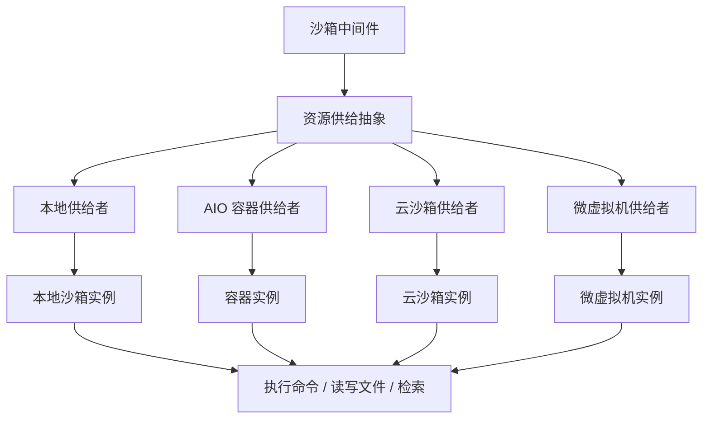
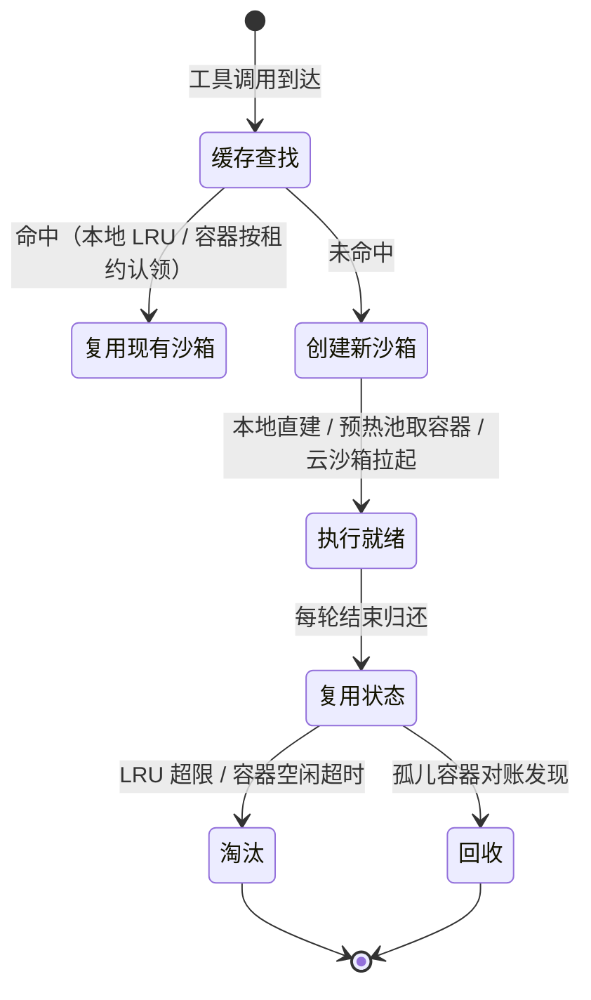
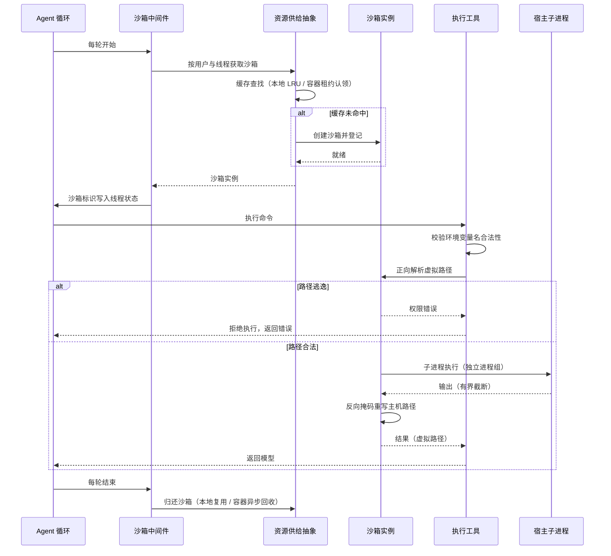

# 执行运行时与隔离

## 读前思考

- 一个多轮任务里，模型可能要先装依赖、再写代码、再跑测试。如果每轮工具调用都新建一个沙箱，装好的依赖、生成的文件全丢；如果全程复用同一个沙箱，沙箱越堆越多，谁来回收？你会怎么平衡"状态延续"与"资源回收"？
- 模型在沙箱里跑命令，它看到的文件路径应该是真实的主机路径，还是一个编出来的虚拟路径？两种选择各自损失什么？

## 核心问题

**执行时隔离要解决的是：让模型与工具在受控环境里执行文件与命令操作，环境可以按部署场景切换（本地、容器、云、微虚拟机），且模型视角的路径与后端无关。**

deer-flow 的沙箱系统把这个问题拆成两层抽象加一个中间件：沙箱抽象（Sandbox）定义"一个沙箱能做什么"，资源供给抽象（SandboxProvider）定义"沙箱从哪来、怎么复用、何时回收"，沙箱中间件（SandboxMiddleware）在每轮循环里完成获取与归还。四种后端共享同一套契约，模型视角的路径与后端无关——这是它的核心承诺；差异化卖点是生命周期管理，细节见设计选择三。命令级的危险模式拦截属执行前治理，见 09-guardrails；工具注册与调度见 07-tools。

| 维度 | deer-flow 的选择 |
|------|------------------|
| 隔离架构 | 沙箱 / 资源供给双层抽象 + 中间件织入循环 |
| 后端 | 本地进程内 / AIO 容器 / E2B 云沙箱 / BoxLite 微虚拟机 |
| 路径策略 | 虚拟路径 + 双向掩码（正向解析、反向掩码） |
| 生命周期 | per-thread LRU 复用 + 预热池 + 租约 + 孤儿回收 |
| 执行前治理 | 命令级审计中间件分级拦截（机制见 09-guardrails） |

## 方案展示

### 设计选择一：双层抽象——执行契约与资源供给分离

沙箱抽象定义单个沙箱的操作契约：执行命令、读文件、写文件、下载、列目录、检索。资源供给抽象管理沙箱的获取、释放与生命周期：按用户与线程维度发放、缓存、回收。两层之间是单向依赖——资源供给层返回沙箱实例，上层只认沙箱契约。一个中间件在每轮 Agent 循环开始前获取沙箱、结束后归还，并把沙箱标识写进线程状态实现跨轮复用。

**为什么这么选**：四种后端的隔离强度、启动成本、生命周期差异极大——本地沙箱秒开但零隔离，容器秒级启动，云沙箱按次计费。把"单个沙箱的操作"与"沙箱资源的供给"分开，四种后端独立演进，新增后端不改上层任何代码，改一个配置字段即可切换。**牺牲了什么**：两层抽象带来配置与理解的复杂度；本地后端作为最便宜的实现，安全边界不成立，必须靠门控兜底——系统默认禁用宿主 shell 与 shell 子代理，错误信息诚实提示"当前无真隔离，请切换 AIO 后端或显式开启"。

### 设计选择二：虚拟路径双向掩码——模型永远看不到真实路径

沙箱内的可见路径全部是虚拟形态：工作区、上传区、输出区挂在统一前缀下，技能目录另立前缀。请求方向的路径由路径映射正向解析为宿主或容器真实路径，解析时检测逃逸——越过挂载根（上级目录、绝对路径）直接抛权限错误拒绝执行；输出方向相反，bash 输出与检索结果里的主机真实路径经反向掩码正则重写回虚拟路径，且只重写沙箱自己写入过的路径，避免误伤合法输出。

**为什么这么选**：虚拟路径带来三重收益——模型视角的路径统一稳定，提示词不随后端迁移变化；主机目录结构不外泄（模型不会知道用户目录布局）；每个线程只见自己的路径前缀，天然防止跨线程文件访问。掩码只作用于沙箱写入过的路径，是"重写收益"与"误伤风险"之间的折中。**牺牲了什么**：每次文件操作都要双向翻译，有解析开销；反向掩码若覆盖过宽会误改合法输出，覆盖过窄又会漏掉应隐藏的路径，边界需要持续维护。

### 设计选择三：生命周期工程——跨轮复用与容器回收

本地后端采用"每线程一个沙箱"的缓存模型：同一个用户与线程的沙箱实例长期驻留，LRU 上限兜底淘汰最久未用的；释放接口是空操作——有意不销毁，让多轮任务延续安装状态与生成文件。容器侧的生命周期更重：预热池提前拉起容器；跨进程实例所有权用租约登记，防止多实例同时操作同一容器；孤儿容器定时对账回收，空闲检查器回收长期闲置的容器。

**为什么这么选**：多轮任务是常态——装依赖、写代码、跑测试必须共享同一环境，每调用新建沙箱会让任务无法推进；但资源不能无限膨胀，所以用 LRU 上限、空闲检查、孤儿回收三件套把"复用"与"回收"同时做进生命周期。**牺牲了什么**：沙箱常驻意味着资源占用长期存在，缓存与回收逻辑本身是复杂度来源；租约与对账需要额外的一致性维护，若回收不及时，容器数量会缓慢爬升。

## 核心机制执行流：一次工具执行的全链路

以模型调用一次命令执行为例，走完获取、执行、掩码、归还的完整链路：

**阶段一：沙箱获取。** 中间件在每轮循环开始前向资源供给层请求沙箱，供给层按用户与线程维度查缓存——本地后端命中 LRU 直接复用，容器后端从预热池取或新建并登记所有权租约。竞态处理上，供给层单例的构造在锁外、引用交换在锁内、竞争失败方主动关闭自己，防止并发初始化互相踩踏。沙箱标识随线程状态持久化，会话恢复后可重挂同一沙箱（会话状态持久化机制见 04-state）。

**阶段二：执行前校验与路径解析。** 工具先校验传入环境变量的键名合法性（防注入），再走路径映射正向解析。这是执行时的第一道硬边界：逃逸检测失败直接抛权限错误，命令不落地；越界拦截同时覆盖下载上限与命令长度上限，超限直接拒绝。

**阶段三：执行与输出治理。** 本地后端起独立进程组执行，输出经有界管道捕获并截断，防止失控命令撑爆内存；后台进程持有管道时由独立线程持续排空，避免父进程被挂死。容器后端走串行锁——同一容器内同一时刻只允许一条命令，防止并发请求破坏容器内的单一持久会话。

**阶段四：输出反向掩码。** 结果返回前，输出中的主机真实路径经反向掩码重写为虚拟路径，且只重写沙箱写入过的路径。这一步保证模型始终看到统一的虚拟路径，也防止通过工具输出反推主机目录结构。

**阶段五：归还与回收。** 每轮结束归还沙箱：本地后端是空操作（有意复用），容器后端由空闲检查与孤儿对账异步回收。LRU 超限时淘汰最久未用的沙箱。

**边界路径——镜像过旧**：容器后端遇到旧镜像缺少执行接口时快速失败，返回运维提示要求升级镜像，而不是让模型盲目重试。**边界路径——复合命令**：执行前审计中间件对复合命令做引号感知的拆分，引号未闭合按高危处理（该中间件的判定机制归 09-guardrails）。

## 工程优化

**供给层单例竞态控制**：锁外构造、锁内对账、输家关闭的三角设计避免并发初始化互踩；锁只保护引用交换，回调移出锁外防止持锁死锁。

**细粒度文件操作锁**：按沙箱与路径维度发放文件操作锁，用弱引用字典存储，锁对象无引用时自动回收，防止长时间运行的网关内存泄漏。

**有界管道与进程组强杀**：输出截断防内存撑爆；独立进程组保证超时后一条信号杀尽全部子孙进程，后台进程持管道也由排空线程兜底。

**容器生命周期四件套**：预热池降低首调用延迟，所有权租约防止多实例争抢同一容器，孤儿对账回收崩溃残留，空闲检查回收长期闲置容器。

**环境变量清洗**：子进程继承环境前过滤疑似凭据的变量，只读检查加显式授权覆盖两级控制（清洗机制归 09-guardrails）。

## 面试要点

**1. 为什么要跨轮复用沙箱而不是每次调用新建？复用带来的资源问题怎么解决？**

参考答案方向：多轮任务强依赖环境延续——装过的包、生成的文件必须还在，新建沙箱等于每次从零开始，任务根本无法推进。但复用必然带来资源常驻，解法是三层兜底：缓存上限淘汰最久未用的、空闲检查回收闲置容器、孤儿对账回收崩溃残留。判断标准是"任务内状态延续需求 × 冷启动成本"：状态延续需求高、冷启动成本大时复用不可替代，反之每次新建更省心。

**2. 输出路径掩码为什么只重写沙箱写入过的路径？掩码的误伤风险在哪？**

参考答案方向：全量重写主机路径会把合法输出改错——比如模型本来就想查看某个真实路径。只重写沙箱自己产生过的路径，既隐藏了内部目录结构，又不干扰模型需要的真实信息；代价是"哪些路径算沙箱写入"的判定需要维护，覆盖过宽误伤、过窄漏掩。判断标准是"路径可见性收益 × 误伤合法输出的成本"：收益大而误伤可控时重写划算，否则应退回拒绝式策略。

**3. 本地后端零隔离，为什么还要保留？安全边界由什么兜底？**

参考答案方向：本地后端换来零依赖、秒级启动的开发体验，隔离与便捷的取舍交给部署方——本地开发与轻部署直接用，生产切真隔离后端。安全边界不成立这件事被显式处理：默认禁用宿主 shell 与 shell 子代理，错误信息诚实说明当前无隔离并给出切换路径，把"这里没有边界"写进行为而不是藏着。判断标准是"部署便捷性 × 威胁等级"：威胁等级低时零隔离后端是合理选项，等级升高必须切换。
