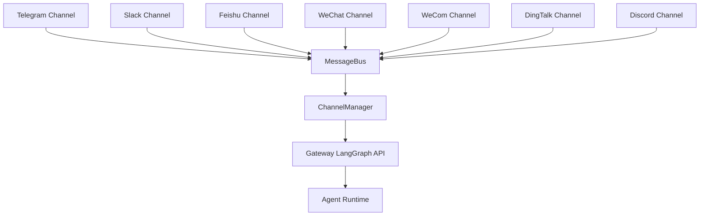
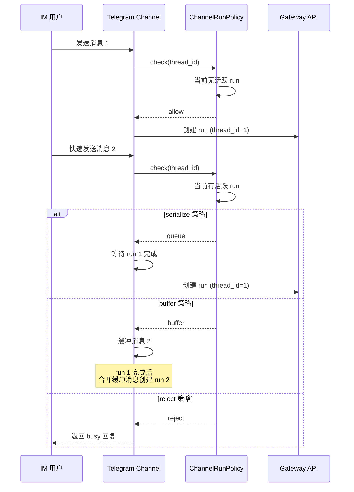
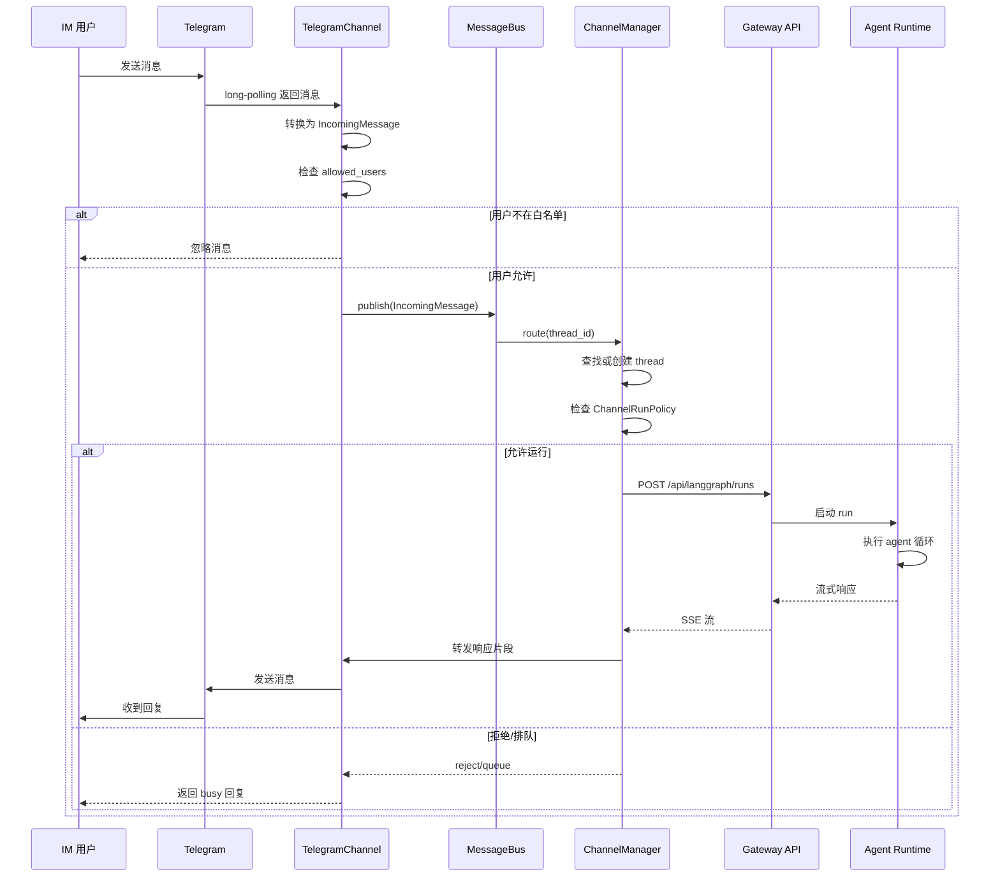

# 消息通道/IM 集成

## 读前思考

- 如果要支持 7 个 IM 平台（Telegram、Slack、Discord、飞书、微信、企业微信、钉钉），每个平台的传输方式都不同（long-polling、WebSocket、Socket Mode、webhook）。你怎么设计统一抽象？
- IM 消息需要映射到 DeerFlow 的 thread/run 模型。如果用户在 IM 中快速发送多条消息，你怎么处理并发？

## 核心问题

消息通道系统解决的核心问题是：**将 7 个 IM 平台的消息统一映射到 DeerFlow 的 thread/run 模型，同时处理各种传输方式的差异和并发控制**。

DeerFlow 通过 `Channel` 抽象 + `MessageBus` 解耦 + `ChannelManager` 统一调度实现三层架构，8 个平台实现覆盖 long-polling、WebSocket、webhook 三种传输方式。

## 方案展示

### 设计选择一：Channel 抽象 + 传输解耦

每个 IM 平台实现 `Channel` 接口，负责：

1. **消息接收**：从平台获取消息（long-polling/WebSocket/webhook）
2. **消息映射**：将平台消息转换为 DeerFlow 的 `IncomingMessage`
3. **消息发送**：将 DeerFlow 响应转换回平台格式



传输方式的选择由平台决定：

| 平台 | 传输方式 | 特点 |
|------|---------|------|
| Telegram | Bot API long-polling | 不需要公网 IP |
| Slack | Socket Mode | 不需要公网 IP |
| 飞书 | WebSocket 长连接 | 不需要公网 IP |
| 微信 | Tencent iLink long-polling | 需要 token 持久化 |
| 企业微信 | WebSocket | 不需要公网 IP |
| 钉钉 | Stream Push WebSocket | 不需要公网 IP |
| Discord | Gateway WebSocket | 不需要公网 IP |

所有渠道都不需要公网 IP——这是 DeerFlow 的设计目标之一，降低了部署门槛。

### 设计选择二：ChannelRunPolicy 策略模式

每个通道可以声明式定义运行行为：

- `fire_and_forget`：每条消息创建新 run，不等待完成
- `serialize`：同一 thread 的 run 串行执行，后到的消息排队
- `buffer`：缓冲快速连续的消息，合并为一次 run
- `reject`：如果当前 thread 有活跃 run，直接拒绝新消息



### 设计选择三：用户绑定 + 会话隔离

IM 消息需要映射到 DeerFlow 用户。DeerFlow 支持两种模式：

1. **全局 session**：所有 IM 消息共享一个 `assistant_id` 和配置
2. **Per-user session**：通过 `channels.<platform>.session.users` 为特定用户配置不同的 `assistant_id`、`recursion_limit` 等

```yaml
channels:
  telegram:
    session:
      assistant_id: mobile-agent
      users:
        "123456789":
          assistant_id: vip-agent
          recursion_limit: 150
```

IM 渠道的 `assistant_id` 如果是自定义 agent 名，DeerFlow 会走 `lead_agent` 并注入 `agent_name`，让自定义 agent 的 SOUL 配置生效。

## 完整执行流：IM 消息从接收到响应



整个流程分为四个阶段：

1. **消息接收与转换**：IM 平台通过各自的传输方式（long-polling/WebSocket/Socket Mode）将消息推送到对应的 `Channel` 实现。Channel 将平台特定格式的消息转换为统一的 `IncomingMessage`，同时检查 `allowed_users` 白名单。不在白名单中的用户消息被静默忽略。

2. **路由与 thread 映射**：通过 `MessageBus` 发布后，`ChannelManager` 根据消息内容查找或创建对应的 DeerFlow thread。每个 IM 会话映射到一个 thread，确保对话连续性。`ChannelRunPolicy` 检查当前 thread 是否有活跃 run，根据策略决定是允许、排队、缓冲还是拒绝新消息。

3. **Gateway 调用**：允许运行时，`ChannelManager` 调用 Gateway 的 LangGraph-compatible API（`POST /api/langgraph/runs`）启动 agent run。IM 渠道 worker 自动附加进程内内部认证 + CSRF cookie/header 对，不需要外部认证配置。Agent 执行完成后通过 SSE 流式返回响应。

4. **响应转发**：Manager 将 SSE 流中的响应片段转发给 Channel，Channel 转换为平台特定格式后发送给用户。如果 run 被拒绝或排队，Channel 返回 busy 回复告知用户稍后再试。

## 工程优化

**飞书快速跟进消息队列**：飞书渠道对同一 `thread_id` 的快速连续消息进行队列化处理，而不是立即返回 busy 回复。topic 回复保持 per-message card，跨 queued/running/final 阶段更新。

**微信 token 持久化**：微信渠道在 `state_dir` 中持久化 `get_updates_buf` 游标和登录状态，Docker Compose 部署时需要放在持久化卷上，确保重启后不丢失。

**钉钉 AI Card 流式回复**：可选配置 `card_template_id` 启用打字机效果的流式 AI 卡片回复，需要申请 `Card.Streaming.Write` 权限。

**IM 渠道内部认证**：IM 渠道 worker 调用 Gateway API 时自动附加进程内内部认证 + CSRF cookie/header 对，不需要外部认证配置。

**Docker Compose 服务发现**：IM 渠道在 `gateway` 容器内执行时，`channels.langgraph_url` 和 `channels.gateway_url` 不能用 `localhost`，需要用容器服务名（如 `http://gateway:8001/api`）。

## 面试要点

**1. 为什么所有 IM 渠道都选择"不需要公网 IP"的传输方式？**

DeerFlow 的默认部署场景是本地可信环境（开发者机器或企业内网）。要求公网 IP 会显著增加部署门槛——需要域名、SSL 证书、防火墙配置等。Long-polling 和 WebSocket 出站连接只需要互联网访问，不需要入站端口开放。代价是：这些传输方式在断网重连时需要额外处理（如微信的 token 持久化、飞书的连接恢复）。

**2. ChannelRunPolicy 的 buffer 策略和 serialize 策略有什么区别？**

Serialize 策略让同一 thread 的消息严格串行执行——消息 2 等待消息 1 完成后才开始新 run。Buffer 策略在 run 执行期间缓冲新消息，run 完成后将缓冲消息合并为一次 run。Buffer 减少了 run 数量（节省 LLM 调用），但可能丢失中间状态；Serialize 保证每条消息都被独立处理，但 run 数量更多。

**3. IM 渠道的用户绑定安全吗？**

当前 IM 渠道的用户绑定基于平台提供的 user_id（如 Telegram 的 chat_id、Slack 的 user_id）。如果 `allowed_users` 为空，所有用户都可以使用。在多用户场景中，需要显式配置白名单。更深层的风险是：IM 平台的 user_id 可以被伪造（如 Telegram bot 可以被添加到群聊中），DeerFlow 信任了平台提供的 user_id，没有额外的身份验证。
