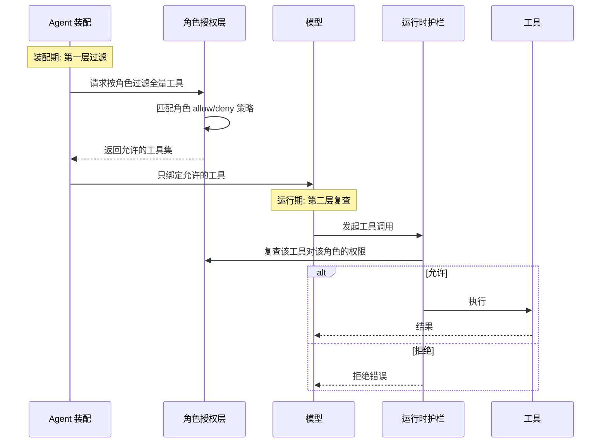
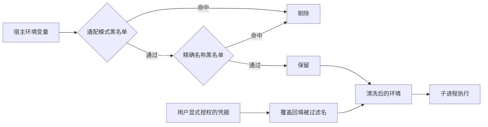
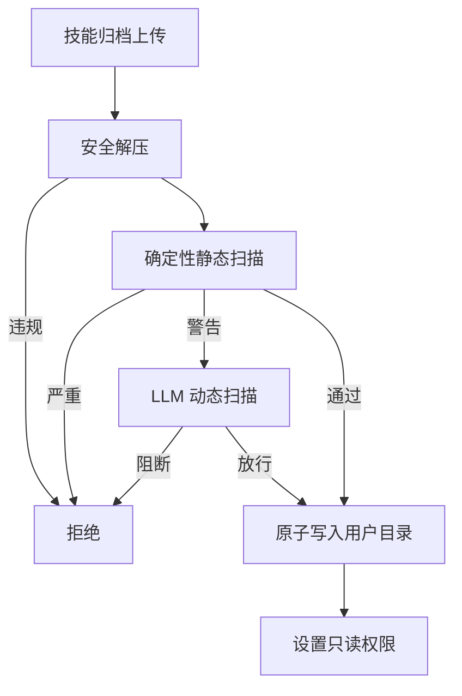
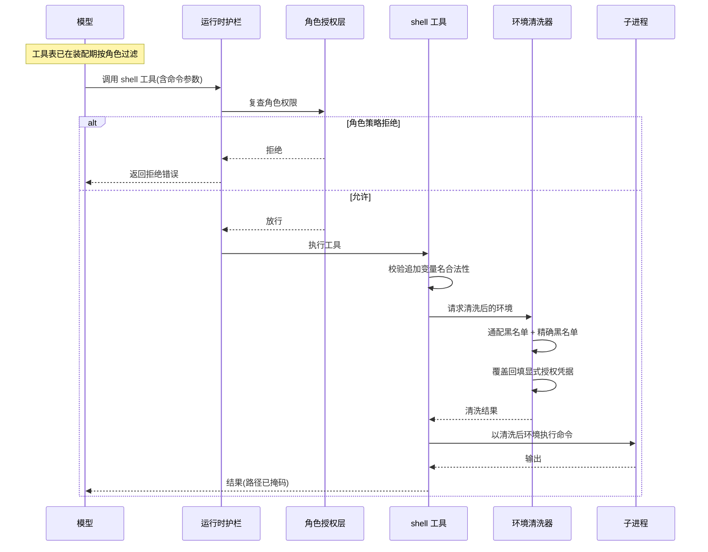

# 执行前拦截与信任治理

## 读前思考

- deer-flow 是多租户企业部署，用户可以上传自己的技能归档、声明自己的 MCP 服务器。这些全是不可信的第三方输入——你会把安全审查放在安装时（一劳永逸但可能漏掉运行期变化）还是每次使用时（覆盖全但开销大）？
- 如果你用 RBAC 在 Agent 装配时就把被禁止的工具从模型的工具表里删掉，模型还有没有办法调到这些工具？如果有可能，第二道检查应该放在哪？

## 核心问题

执行前拦截解决的核心问题是：**在多用户互不信任的前提下，通过角色化授权、环境变量清洗和安装时扫描控制 Agent 的能力面与输入面，同时把无法静态判定的部分交给执行时隔离兜底。**

deer-flow 在执行前拦截上的定位是"决策前置、粒度到工具面"：它没有逐条命令的人工审批（服务化场景没有人在回路），而是让角色决定模型能看到哪些工具，让清洗决定子进程能看到哪些环境变量，让扫描决定哪些第三方技能可以落盘。命令放行之后在哪个沙箱后端里执行、输出路径如何掩码，属于执行时隔离，见 08-runtime。

| 维度 | deer-flow 的选择 |
|------|------------------|
| 权限模型 | RBAC 按角色的工具 allow/deny 策略，双层执行 |
| 人工介入 | 无逐次审批，授权默认关闭 |
| 失败语义 | fail_closed 可配，默认出错即拒 |
| 密钥治理 | 子进程环境变量双层黑名单清洗 + 显式授权覆盖 |
| 安装时扫描 | 技能双重扫描（确定性静态 + LLM 动态） |
| 敏感配置 | 配置值支持环境变量引用，缺失即报错 |

## 方案展示

### 设计选择一：护栏/授权的双层执行

授权系统分两层执行同一套角色策略。第一层在装配期：Agent 创建、工具绑定到模型之前，授权提供方按角色的允许/拒绝策略把不允许的工具整体过滤掉，被拒绝的工具根本不会出现在模型的工具 schema 里。第二层在运行期：每次工具执行前，护栏中间件再对同一策略复查一次，拒绝则直接返回拒绝错误，不触达工具本体。

内置的角色授权提供方支持 per-role 的工具 allow/deny 策略，并校验默认角色名指向一个真实配置过的角色；授权整体默认关闭，由运维显式开启。护栏与授权都暴露同一个失败模式开关：fail_closed 为真时，配置错误或提供方不可用会拒绝所有请求，为假时则宽松放行。

**为什么这么选**：第二层不是冗余。装配期过滤只决定"模型默认看不到"，但模型可能通过工具搜索等动态发现途径找到被隐藏的工具名，或在 prompt injection 诱导下直接尝试调用。运行期复查把这类绕过路径堵死，装配过滤则额外省下被禁工具的 schema token。fail_closed 让运维可以按环境选择：生产宁可全拒不放过，开发环境放宽以免阻塞调试。

**牺牲了什么**：授权粒度只到工具级，无法像命令审批那样按参数内容判定（"允许读文件但禁止读 /etc"这类需求表达不了）。双层意味着每次工具调用多一次策略查询。授权默认关闭也意味着不开启配置的部署天然没有这层保护。

### 设计选择二：子进程环境变量的双层黑名单清洗

子进程默认继承宿主的全部环境变量，而宿主环境往往躺着各种平台凭据。deer-flow 在把环境变量交给子进程之前做两层过滤：先是通配模式黑名单（变量名包含密钥、令牌、口令、凭据、连接串等敏感词的整类剔除），再是精确名称黑名单（点名常见的云厂商密钥、数据库连接串、个人访问令牌等）。被过滤掉的名字并非永远不可见——用户显式注入的请求级凭据可以覆盖回填，让技能脚本拿到明确授权过的那一份。

工具侧还有一道前置校验：工具请求追加的环境变量名先过 POSIX 命名正则，不合法的名字直接拒绝，防止通过畸形变量名注入。

**为什么这么选**：多租户环境里，一个用户的工具子进程如果继承了宿主的平台凭据，等于跨租户泄露。黑名单而不是白名单，是因为宿主环境的合法变量集合无法穷举；双层结构让"按命名习惯扫荡"和"点名已知凭据"互补。显式覆盖机制给保守策略留了逃生口。

**牺牲了什么**：通配模式会误伤——任何名字恰好含敏感词的合法变量（比如某个以 KEY 结尾的开关量）都会被滤掉，用户必须通过显式授权补回来。这是刻意的保守：宁可误过滤也不泄漏凭据。

### 设计选择三：技能安装的双重安全扫描

第三方技能归档在落盘前经过一条安全流水线。第一步是安全解压：拒绝路径穿越、符号链接、可执行二进制、嵌套归档和解压比异常的 zip 炸弹，条目数与总大小有硬上限。第二步是确定性静态扫描：三十多条规则覆盖已知危险模式——路径穿越、密钥嵌入、解释器的动态执行调用、云元数据地址访问等，零 LLM 成本、结果可重现。第三步是 LLM 动态扫描：只处理静态阶段留下的模糊边界——提示词注入意图、上下文相关的风险定级。严重级发现直接阻断安装，警告级转给 LLM 复核，LLM 判阻断同样拦截。

扫描通过后，技能文件原子写入用户隔离的存储目录，并把文件与目录权限收紧为只读。

**为什么这么选**：多用户部署里技能来源不可信，且技能内容最终会进入模型上下文——恶意技能就是一段定向的 prompt injection。静态扫描负责已知模式的确定性拦截（便宜、可重现、可审计），LLM 扫描负责语义级判断（静态规则无法判定"这段自然语言是否在诱导外泄数据"）。两级分工让成本与覆盖面各得其所。

**牺牲了什么**：LLM 扫描增加安装延迟和 API 成本。静态扫描对复杂语法结构（列表推导、海象运算符等复杂绑定）刻意不做追踪——这些场景静态分析误报率高，保守策略是不产生发现，宁可漏报也不让用户因误报而失去对扫描器的信任。

## 核心机制执行流：一次工具调用的双层授权与环境清洗

以某角色的用户激活了一个技能、模型随后发起一次 shell 工具调用为例：

**阶段一：运行期复查。** 护栏中间件包裹每一次工具调用，先向授权层复查"这个工具对这个角色是否允许"。这一步独立于装配期过滤存在——即使模型通过工具搜索发现了被隐藏的工具名并尝试调用，也会在这里被拒绝。授权提供方不可用时，按 fail_closed 配置决定全拒还是放行。

**阶段二：环境准备。** 放行后，shell 工具先校验调用方请求追加的环境变量名是否符合 POSIX 命名（防注入），再把宿主环境交给清洗器做双层黑名单过滤，最后把用户显式授权的凭据覆盖回填。子进程拿到的是一份"最小必要"的环境。

**阶段三：执行与输出。** 命令在沙箱后端中执行（后端选择与隔离细节见 08-runtime），输出返回前经过路径掩码重写，主机真实路径被替换为虚拟路径。

**边界路径——授权配置出错。** 若角色策略文件损坏或默认角色指向不存在的角色，装配期就会校验失败；运行期提供方异常则走 fail_closed 语义——生产配置下所有工具调用被拒，错误可见且方向安全。

**边界路径——模型调用被隐藏工具。** 装配期过滤让该工具不在 schema 中，正常情况下模型不会生成这个调用；一旦模型经其他途径生成了，第二层复查返回拒绝错误，模型收到错误后可自行改路。

## 工程优化

**fail_closed 的双面语义**：护栏和授权共用一个失败模式开关。真值时配置错误、提供方缺失都导致全拒——适合生产；假值时出错放行——适合开发。运维按环境选择，安全方向的默认是拒绝。

**静态扫描的保守不追踪**：确定性扫描器会追踪简单名称绑定到已知外泄客户端的模式，但对复杂绑定结构刻意不追踪、不产生发现。误报会让用户忽略所有告警，漏报则还有 LLM 扫描和运行期拦截兜底。

**技能元数据的防伪造处理**：技能注入上下文前，名称、描述、允许工具声明都经过 HTML 转义，防止 frontmatter 值伪造框架标签；技能名强制连字符小写格式并限长，从源头杜绝路径注入。

**配置文件即受信任文件**：扩展中间件通过配置里的类路径声明注入，类路径就是代码执行，因此配置文件被明确定位为运维受控文件；Gateway 的技能与 MCP 开关接口保留该字段但不暴露写路径，防止通过 API 注入恶意中间件。

## 面试要点

**1. 护栏/授权的双层执行是否冗余？只保留装配期过滤行不行？**

参考答案方向：不冗余。装配期过滤解决的是"模型默认接触不到"，同时省下被禁工具的 schema token；但它改变不了模型的生成自由——模型可能通过工具搜索发现被隐藏工具的名字，或在注入诱导下直接尝试调用。运行期复查针对的正是这类绕过：策略在执行的最后一刻仍然有效。只保留装配层，等于把安全性寄托在"模型不会尝试调它看不见的东西"上。判断标准是"可见性控制 × 执行期强制"——前者降概率，后者保底线，纵深两层缺一不可。

**2. 环境变量清洗用通配模式黑名单（名字含敏感词即滤）会不会误伤？为什么不按白名单放行？**

参考答案方向：会误伤，名字恰好含敏感词的合法变量会被滤掉，需要用户通过显式授权补回来。不用白名单是因为宿主环境的合法变量集合无法穷举——不同部署、不同技能需要的变量组合千差万别，白名单会把大量正常功能卡死。黑名单假设"敏感凭据的命名有共性"，这个假设在企业环境里大体成立。deer-flow 选了保守方向：误过滤是可恢复的（显式覆盖），泄漏是不可逆的。判断标准是"误伤的修复成本 × 泄漏的事故成本"，后者高出一个量级时保守策略胜出。

**3. 双重扫描里确定性阶段为什么不追踪复杂的语法绑定？这算不算扫描器的漏洞？**

参考答案方向：这是刻意的取舍而非疏忽。复杂绑定的数据流分析误报率高——把安全代码标成危险，用户会开始无视所有告警，扫描器等于自废。保守策略是复杂场景不产生发现，把语义级判断让给 LLM 动态扫描，再靠运行期的工具面授权兜底。安全体系的可靠性不取决于单点扫描的召回率，而取决于各层的互补。判断标准是"静态扫描的精确率 × 漏报部分的兜底覆盖"——有兜底时精确率优先。
