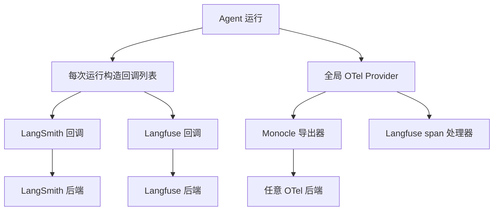
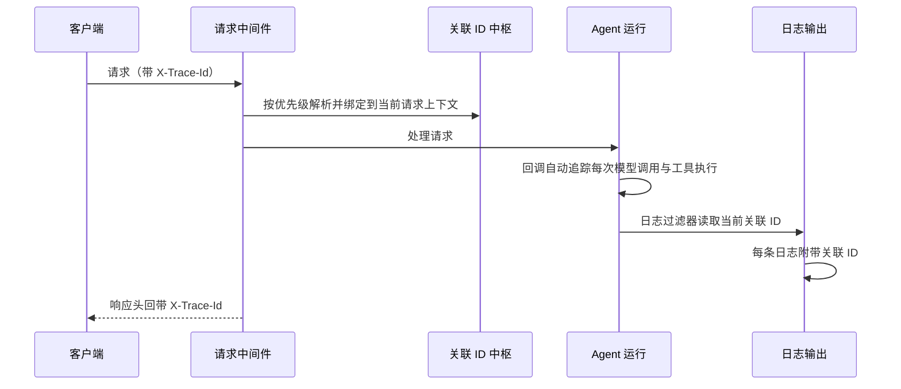
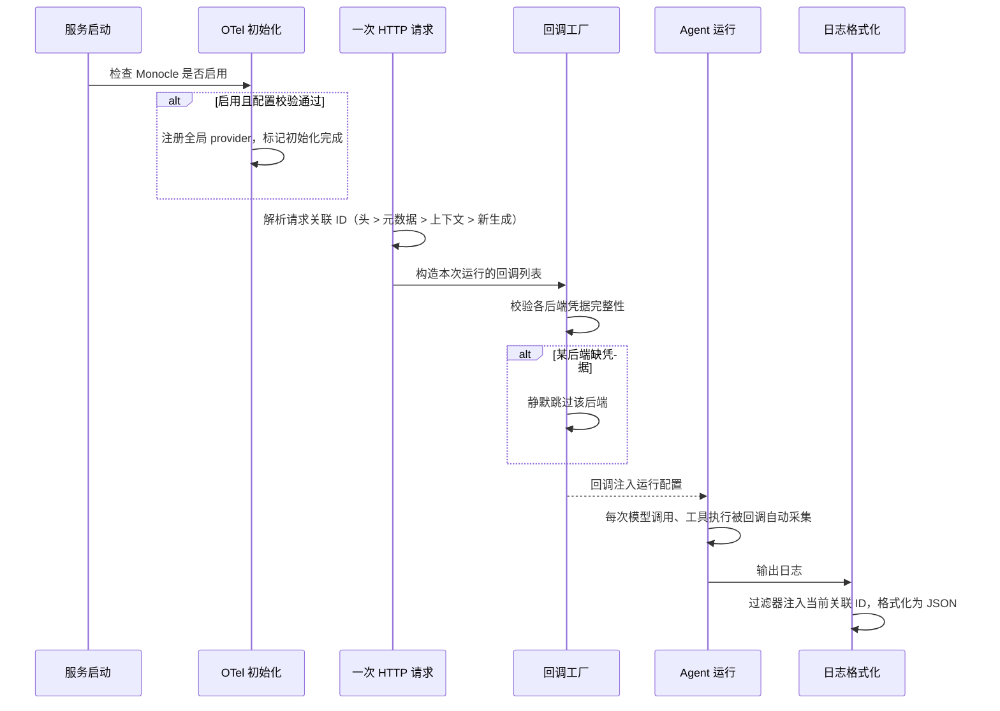

# 可观测性

## 读前思考

- 你的企业客户里，有的用 LangSmith，有的用自托管的 Langfuse，有的要求接公司统一的 OTel 后端。如果你的框架只支持一种追踪后端，其余客户要么放弃接入、要么自己写胶水代码。你会怎么设计一个"多后端共存且不互相干扰"的追踪层？
- 追踪 Agent 时你会遇到两套 ID：HTTP 请求有一个 ID，每次模型调用在追踪平台里又生成了一个 ID。如果这两套 ID 对不上，你就无法回答"这条慢请求慢在哪次模型调用"。你会用什么机制把它们关联起来？进一步：如果想基于这些 trace 离线评估"运行质量好不好"，trace 数据需要携带什么？

## 核心问题

可观测性解决的核心问题是：**让每次 Agent 运行可被追踪、可被关联、可被计费，且追踪配置出错时不阻塞主流程**。

deer-flow 是企业级框架，可观测性的定位是"接入企业已有的 APM 基础设施，而不是自建"：支持三种追踪后端任意组合，同时用一个自有的请求关联 ID 打通 HTTP 层与 LLM 调用层。

| 维度 | deer-flow 的选择 |
|------|-----------------|
| 追踪后端 | LangSmith / Langfuse（回调）+ Monocle（OTel）双轨 |
| trace 关联 | 自有请求关联 ID，经 X-Trace-Id HTTP 头传播 |
| token 采集 | 中间件链中每次模型调用采集 |
| 日志 | 结构化 JSON + 请求关联 ID 注入每条日志 |
| 评估 | 无内建评估器，评估外包给追踪后端 |

## 方案展示

### 设计选择一：回调与 OTel 双轨

LangSmith 和 Langfuse 走 LangChain 的回调机制——每次运行前构造回调列表注入运行配置；Monocle 走 OTel 路线，在服务启动时注册全局 TracerProvider。两条轨道可以共存：后初始化的库复用已存在的全局 provider，各自附加自己的 span 处理器，不会丢 span。三种后端因此可以任意组合启用（源码：tracing 目录下的工厂与初始化模块）。

**为什么这么选**：企业的 APM 基础设施不统一——LangSmith 是 LangChain 生态的原生选择，Langfuse 是可自托管的开源替代，Monocle 基于 OTel 可接任意兼容后端。双轨设计让框架适配客户已有设施，而不是强制迁移。

**牺牲了什么**：两套接入代码要长期维护；两个基于 OTel 的后端共享全局 provider 时，一方的导出器会看到另一方的 span，这种行为必须在文档里讲清楚，否则用户会看到"多出来的数据"。

### 设计选择二：自有请求关联 ID

deer-flow 维护一个独立于任何追踪平台的请求关联 ID（deerflow_trace_id），通过 X-Trace-Id HTTP 头传播。解析优先级：请求头 > 元数据注入 > 当前请求上下文 > 新生成。ID 有严格的字符校验——只允许可打印 ASCII 并有长度上限，防止非法字符导致响应头编码崩溃或日志注入；校验失败则回退到自动生成。

**为什么这么选**：追踪平台内部的 ID 是"按平台规则生成的"，HTTP 层拿不到、日志也对不上。自有一个 ID 作为锚点，把 HTTP 请求头、日志、平台 trace、运行时上下文四方对齐，才能做到端到端追踪。一个请求关联 ID 可能对应多个平台侧 trace（同一请求触发多次运行），两者通过元数据字段互相关联。

**牺牲了什么**：多维护一套 ID 体系，用户要理解"自有 ID 与平台 ID 不是一回事"。

### 设计选择三：平台元数据映射

每次运行时，框架把 LangGraph 的会话结构映射到追踪平台的保留字段（源码：metadata.py）：thread_id 映射为平台的 session（同一对话的 trace 归组）、有效用户 ID 映射为用户聚合维度、assistant_id 映射为 trace 名称，并把环境、模型写成标签。写入时用"已存在则不覆盖"的语义，保证调用方显式设置的元数据优先。

**为什么这么选**：追踪平台的价值在于聚合查询——"这个用户这周的对话""gpt-4 在 prod 环境的 trace"。不做映射，trace 就是一堆孤立记录。映射到平台保留键而非自定义字段，可以直接用上平台的聚合界面。

**牺牲了什么**：与 Langfuse 的保留键协议绑定，平台升级字段语义时要跟着改。

## 核心机制执行流：从服务启动到一条日志带上关联 ID

**阶段一：启动期初始化。** 只有启用 Monocle 时才做 OTel 初始化，且先校验导出器配置（名称、API key）再注册全局 provider——配置写错在启动时就暴露，而不是在每次运行路径上失败。初始化完成会留下模块级标记，嵌入式或 TUI 进程能据此判断自己是否跳过了网关侧的初始化。

**阶段二：每次运行构造回调。** 回调工厂先检查各后端的"已启用且凭据完整"状态，缺 API key 的后端直接不进回调列表。这一步是"无凭据静默降级"的关键：追踪配置错误永远不会让 Agent 运行报错。

**阶段三：请求级关联。** 中间件解析出请求关联 ID 并绑定到当前请求上下文后，日志过滤器在每条日志输出时读取它，响应头也回带该 ID。于是"用户报了哪条请求慢"可以直接用这个 ID 在日志和追踪平台里双向检索。

**边界路径——配置写错**：Monocle 的导出器名称拼错时，启动期校验直接拒绝初始化，Agent 主流程无感知；若是每次运行才校验，一次 typo 会影响所有请求。

## 工程优化

**延迟导入防循环依赖**：元数据模块引用运行时用户上下文时，把导入推迟到函数体内执行，避免运行时层与追踪层互相导入形成环。

**初始化幂等**：OTel 初始化本身可重复调用，配合模块级完成标记，多进程场景下不会重复注册 provider，也能检测是否跳过过初始化。

**JSON 结构化日志**：日志格式化器输出包含时间戳、级别、日志器名、关联 ID、消息的结构化 JSON，适配生产环境的日志采集系统（源码：JsonTraceFormatter）。

**token 用量采集**：token 用量与预算在应用配置中独立开关，通过 LangChain 回调自动采集每次模型调用的消耗（源码：TokenUsageMiddleware），不需要业务代码埋点。

## 评估机制

deer-flow 没有内建评估器，它对"输出质量怎么评"的回答是**外包给追踪后端**：框架保证每次运行上报的 trace 带有完整关联字段（会话、用户、环境、模型标签），LangSmith 或 Langfuse 侧的评估器就可以在这些 trace 上离线打分、做 LLM 裁判或人工标注。评估数据基础就是 trace 完整性——这也是元数据映射要把环境和模型写进标签的原因：评估器要能按维度切片。系统健康度方面，deer-flow 依赖回归测试（中间件链、追踪集成的 pytest 用例）保证改动不破坏主流程，运行期没有质量评分或异常检测。

**代价**：换一个追踪后端，评估工作流也要跟着换；没有后端凭据的环境（如本地开发）完全没有评估能力。

## 面试要点

**1. 为什么支持三种追踪后端而不是只选一个？两个基于 OTel 的后端同时启用会发生什么？**

参考答案方向：单后端假设了客户的 APM 现状，企业里 LangSmith、自托管 Langfuse、统一 OTel 后端并存是常态。代价是维护两套接入代码和处理共存场景——两个 OTel 后端共享全局 provider 时，一方的导出器会看到另一方的 span，这是共享全局状态的必然结果，只能靠文档和初始化顺序约定来管理。判断标准是"客户现有基础设施的异构程度 × 框架愿意承担的集成维护成本"。

**2. 自有请求关联 ID 和追踪平台自己生成的 trace ID，为什么要并存而不是二选一？**

参考答案方向：平台 ID 按平台规则在运行粒度生成，HTTP 层和日志拿不到；请求关联 ID 在请求粒度生成，能把日志、响应头、平台 trace 对齐。两者是不同粒度：一个请求关联 ID 可对应多个平台 trace。只用平台 ID，日志关联做不了；只用自有 ID，平台的聚合查询用不上。判断标准是"关联发生在哪个粒度 × 哪些消费方需要它"。

**3. deer-flow 为什么不做内建评估（质量评分），而是外包给追踪后端？什么情况下这个选择会后悔？**

参考答案方向：评估需要数据集、裁判模型、标注流程，这些与企业自身的业务标准强绑定，框架内建一套通用评分反而没人用。trace 完整上报后，评估变成后端平台的配置工作，框架零维护成本。会后悔的场景：客户不用任何追踪后端（纯本地部署），或评估需要干预运行过程（比如质量不达标时自动重试）——后者 deer-flow 完全不支持，参考 openclaw 的压缩质量守卫是另一种做法（见 docs/openclaw/10-observability.md）。判断标准是"评估发生在离线分析还是在线干预 × 项目是否承担平台职责"。
