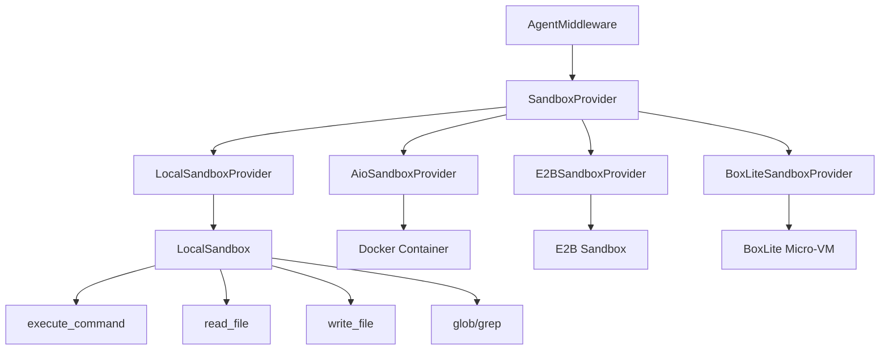
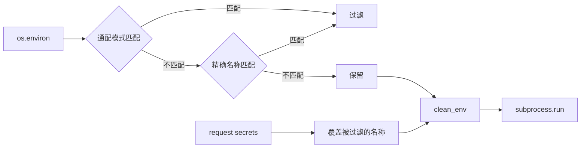
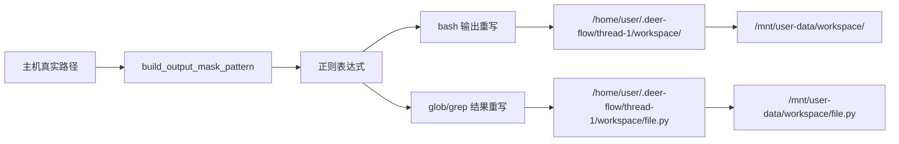
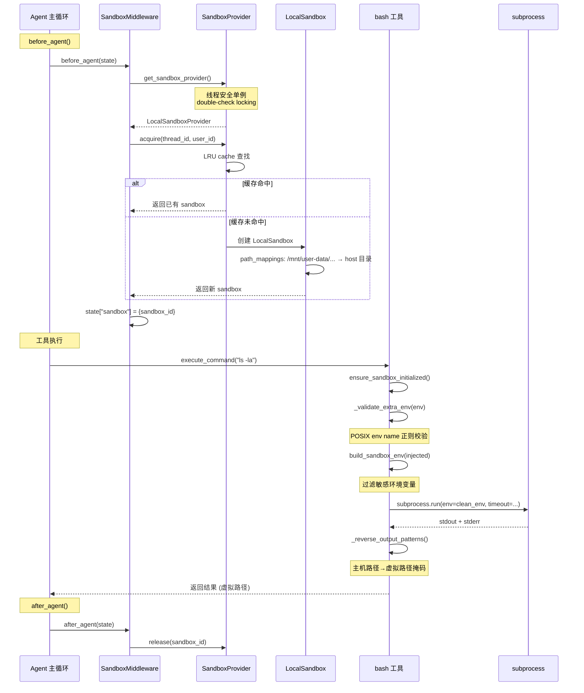

# 安全与沙箱

## 读前思考

- Agent 可以执行 bash 命令、读写文件、访问网络。你怎么在"让 agent 有足够能力完成任务"和"防止 agent 做危险操作"之间取得平衡？
- 沙箱执行有四种后端（Local、Docker AIO、E2B、BoxLite）。你怎么让上层代码完全不感知后端差异？

## 核心问题

安全与沙箱系统解决的核心问题是：**通过双层抽象（Sandbox + SandboxProvider）支持多种执行后端，同时在路径映射、环境变量、输出掩码三个维度实施安全隔离**。

DeerFlow 的沙箱系统以 `Sandbox` ABC 定义单个沙箱的操作接口，`SandboxProvider` ABC 管理沙箱的获取/释放/生命周期，LangGraph AgentMiddleware 驱动沙箱的 acquire→use→release 流程。

## 方案展示

### 设计选择一：双层抽象（Sandbox + SandboxProvider）

- **Sandbox**：定义单个沙箱的操作接口（execute_command, read_file, write_file, glob, grep）
- **SandboxProvider**：管理沙箱的获取/释放/生命周期（acquire, release, shutdown）

四种后端可以独立演进，上层 middleware 和 tools 完全不感知后端差异。切换后端只需修改 `config.yaml` 的 `sandbox.use` 字段。

### 设计选择二：环境变量清洗策略

子进程默认继承 `os.environ`，但 `build_sandbox_env()` 在继承前用双层过滤防止平台凭据泄漏：

1. **通配模式黑名单**：`*KEY*`、`*SECRET*`、`*TOKEN*`、`*PASS*`、`*CREDENTIAL*`、`*DSN*`
2. **精确名称黑名单**：`DATABASE_URL`、`GH_PAT`、`AWS_SECRET_ACCESS_KEY` 等

注入的 request secrets 可以覆盖被过滤的名称，让 skill 脚本可以访问用户显式授权的凭据。

### 设计选择三：输出路径掩码

`build_output_mask_pattern()` 是主机路径→虚拟路径正则的唯一来源。bash 输出、glob/grep 结果都通过这个掩码重写，确保 sandbox 内部看到的始终是虚拟路径（如 `/mnt/user-data/workspace/`），而非主机真实路径。

`_SEGMENT_BOUNDARY` 防止部分前缀匹配（如 `/skills` 误匹配 `/skills-extra`），`separator_agnostic` 参数适配 Windows 反斜杠场景。

## 完整执行流：沙箱从初始化到执行

整个流程分为三个阶段：

1. **沙箱获取**：`SandboxMiddleware.before_agent()` 在每轮 agent 执行前获取沙箱。`get_sandbox_provider()` 使用 double-check locking 确保线程安全单例，构造和 shutdown 在锁外执行避免死锁。Provider 根据 thread_id 从 LRU 缓存（上限 256）中查找或创建沙箱实例。LocalSandbox 在创建时设置路径映射——将虚拟路径（如 `/mnt/user-data/workspace/`）映射到主机上的 per-thread 目录。

2. **工具执行**：模型调用 bash/read_file/write_file 等工具时，首先验证环境变量名（POSIX 正则校验防注入），然后通过 `build_sandbox_env()` 过滤敏感环境变量（通配模式 + 精确名称双层黑名单）。子进程执行完成后，输出通过 `_reverse_output_patterns()` 重写——主机真实路径被替换为虚拟路径，确保 sandbox 内部始终看到统一的虚拟路径。

3. **沙箱释放**：`SandboxMiddleware.after_agent()` 在每轮 agent 执行完成后调用 `provider.release(sandbox_id)`。对于 LocalSandbox，释放只是将沙箱归还 LRU 缓存而非销毁；对于 Docker/E2B 等容器沙箱，释放可能触发容器回收。

## 工程优化

**Provider 单例的线程安全**：`get_sandbox_provider()` 使用 double-check locking，但构造和 shutdown 在锁外执行——避免 plugin 代码持锁导致死锁。竞争失败方调用 `provider.shutdown()` 防止资源泄漏。

**文件操作锁用 WeakValueDictionary**：`(sandbox_id, path)` 为 key，锁在无引用时自动回收，防止长时间运行的 Gateway 内存泄漏。

**LocalSandboxProvider LRU 缓存**：`_thread_sandboxes` 用 `OrderedDict` 实现，上限 256（可配），超限时驱逐最久未使用的沙箱。

**有界管道捕获**：`_BoundedPipeCapture` 用 10MB 上限的有界管道捕获子进程输出，防止失控命令占满内存。

**search.py 忽略模式优化**：将 50+ 个 IGNORE_PATTERNS 拆分为精确名称 `frozenset`（O(1) 查找）和 glob 正则（一次编译），避免每个目录条目执行 50 次 fnmatch。

**SSRF 防护**：`download_file()` 在检测到路径遍历或超出虚拟前缀时抛 `PermissionError`；`find_grep_matches()` 用 `is_relative_to(root)` 阻止符号链接逃逸。

## 面试要点

**1. 为什么沙箱要分 Sandbox 和 SandboxProvider 两层？**

Sandbox 定义单个沙箱的操作接口（execute_command 等），SandboxProvider 管理沙箱的获取/释放。这种分离让 Local、Docker、E2B、BoxLite 四种后端可以独立实现操作接口，而 Provider 层处理跨沙箱的生命周期管理（LRU 缓存、并发控制、shutdown）。如果合并成一层，每个后端都要自己实现缓存和并发控制，代码重复度高。

**2. 环境变量清洗的通配模式（*KEY*、*SECRET*）会不会误过滤？**

会。如果用户有合法的变量名包含 "KEY"（如 `MONKEY_PATCH=True`），会被过滤掉。但 DeerFlow 选择了保守策略：宁可误过滤也不泄漏凭据。用户可以通过 request secrets 显式注入被过滤的变量。这是一个安全优先的设计选择。

**3. 输出路径掩码的安全价值是什么？**

路径掩码不仅是为了美观（让 sandbox 内部看到统一的虚拟路径），更重要的是防止信息泄漏。如果 bash 输出中包含主机真实路径（如 `/home/admin/.ssh/`），模型可能会在后续操作中使用这些路径，导致跨 thread 的文件访问。掩码确保每个 thread 只能看到自己的虚拟路径前缀。
