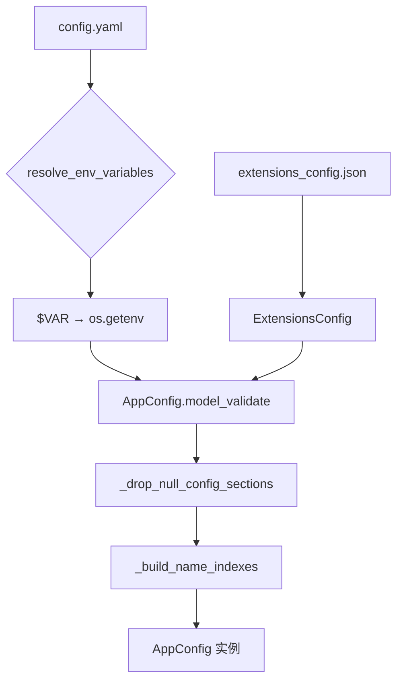
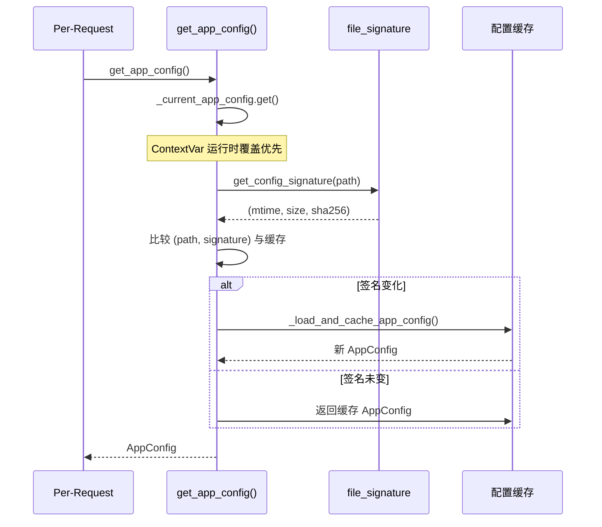
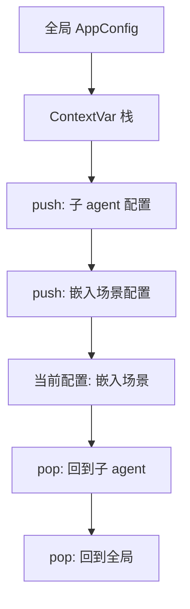
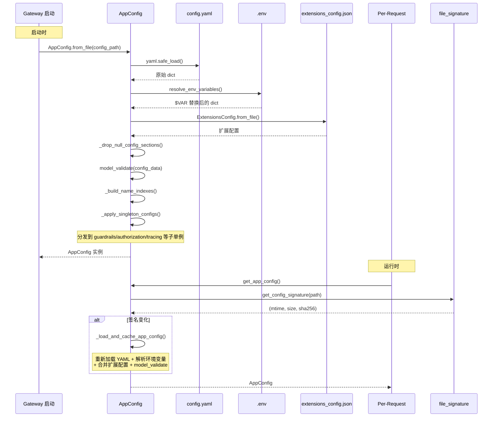

# 配置与环境管理

## 读前思考

- 一个企业级 Agent 系统有 42+ 个配置模块。你怎么组织这些配置，让它们在"启动时加载"和"运行时热重载"之间取得平衡？
- 配置来自三个源头（config.yaml、.env、extensions_config.json）。你怎么处理它们的优先级和合并逻辑？

## 核心问题

配置系统解决的核心问题是：**以 AppConfig (Pydantic) 为根节点，通过三层配置源合并实现 per-request 热重载，同时用 reload_boundary 显式注册 startup-only 字段**。

DeerFlow 的配置系统以 `config.yaml` + `.env` + `extensions_config.json` 三层配置源合并为基础，通过文件签名检测实现热重载，通过 ContextVar 栈支持运行时配置覆盖。

## 方案展示

### 设计选择一：三层配置源合并

| 优先级 | 配置源 | 用途 |
|--------|--------|------|
| 1（最高） | config.yaml | 主配置：模型、工具、沙箱、渠道等 |
| 2 | extensions_config.json | 扩展配置：MCP 服务器、技能启用状态 |
| 3（最低） | 默认值 | Pydantic 字段的 default_factory |

环境变量引用（`$VAR`）在 YAML 加载后递归解析。`config.yaml` 的 `extensions` 段优先于 `extensions_config.json`（`exclude_unset=True` 合并），确保主配置的 hot-reload 合约不被扩展文件破坏。

### 设计选择二：热重载 + startup-only 边界

`get_app_config()` 每次调用都检查文件签名（mtime+size+sha256），变化时自动重加载。但 `reload_boundary.py` 明确注册了 12 个 startup-only 字段：

- `database`、`checkpointer`
- `sandbox`
- `log_level`、`logging`
- `channels`
- `scheduler`
- 等

这些字段在启动时一次性捕获到引擎/单例中，运行时修改不生效。每个字段的 `Field(description=)` 自动带 `startup-only:` 前缀，IDE hover 可见。

### 设计选择三：ContextVar 配置栈

`push_current_app_config()` / `pop_current_app_config()` 允许在子 agent 或嵌入场景中临时覆盖配置，不影响全局单例。`_current_app_config` 是 `ContextVar`，天然支持 async 并发隔离。

## 完整执行流：配置从加载到热重载

整个流程分为三个阶段：

1. **启动加载**：Gateway 启动时，`AppConfig.from_file()` 按优先级解析配置源——先读 `config.yaml` 并递归解析 `$VAR` 环境变量引用（缺失则 `raise ValueError` 快速失败），再合并 `extensions_config.json`（config.yaml 的 `extensions` 段优先），然后 `_drop_null_config_sections` 容错处理 YAML 注释导致的 None 值，最后 `model_validate` 构建 Pydantic 实例。`_build_name_indexes()` 构建 O(1) 名称索引字典，`_apply_singleton_configs()` 将子配置分发到 guardrails/authorization/tracing 等模块级单例。

2. **热重载检测**：每次 `get_app_config()` 调用时，先检查 ContextVar 栈是否有运行时覆盖（子 agent/嵌入场景），没有则计算文件签名 `(mtime, size, sha256)` 并与缓存比较。签名变化时自动重加载。三重签名防止了纯 mtime 比较的所有已知盲区——同秒替换、git checkout 恢复旧时间戳、网络挂载 mtime 不精确等。

3. **startup-only 边界**：`reload_boundary.py` 明确注册了 12 个 startup-only 字段（database、sandbox、channels 等），这些字段在启动时一次性捕获到引擎/单例中，运行时修改 config.yaml 不会生效。每个字段的 `Field(description=)` 自动带 `startup-only:` 前缀，IDE hover 可见。这个设计明确区分了“可以热重载”和“必须重启”的配置。

## 工程优化

**O(1) 名称索引**：`_build_name_indexes()` 在 model_validator 中构建 `_models_by_name` / `_tools_by_name` / `_tool_groups_by_name` 字典，避免热路径上 O(n) 线性扫描。

**文件签名三重校验**：`(mtime, size, sha256)` 组合防止了纯 mtime 比较的所有已知盲区——同秒替换、backup restore、network mount 等。

**null 配置段容错**：`_drop_null_config_sections` 将 YAML 中注释导致的 `None` 值自动替换为默认值，避免首次 `cp config.example.yaml` 后的 pydantic 报错。

**config_version 检查**：启动时比较用户 config.yaml 与 config.example.yaml 的版本号，过期则 warning 提示 `make config-upgrade`。

**环境变量缺失快速失败**：`resolve_env_variables()` 遇到 `$VAR` 但 `os.getenv(VAR)` 为 None 时直接 `raise ValueError`，启动失败而非静默使用空值。

**子模块单例模式统一**：guardrails、authorization、tracing、memory、title 等子配置各自维护模块级单例 + `load_xxx_config_from_dict()` + `reset_xxx_config()`，由 `_apply_singleton_configs()` 统一分发。

## 面试要点

**1. 为什么用 (mtime, size, sha256) 三重签名而不是纯 mtime？**

纯 mtime 比较有多个盲区：同秒编辑（某些文件系统 mtime 精度只有 1 秒）、git checkout 恢复旧时间戳、网络挂载的 mtime 不精确、`cp -p` 保留 mtime 但内容不同。sha256 虽然计算成本高，但配置文件的访问频率很低（每次请求检查一次），且文件通常很小（几 KB）。相比误判导致的配置丢失或重复加载，sha256 的成本可以忽略。

**2. startup-only 字段的设计有什么好处和限制？**

好处是：明确区分了"可以热重载"和"必须重启"的配置，避免用户在运行时修改了 `sandbox.use` 但发现不生效时的困惑。限制是：某些配置（如 `channels`）在运行时添加新渠道需要重启 Gateway，无法做到真正的热插拔。这是工程上的妥协：完全热重载需要所有组件都支持动态注册/注销，复杂度过高。

**3. ContextVar 配置栈在什么场景下有用？**

主要场景是嵌入式和子 agent：`DeerFlowClient` 在进程内使用时，可能需要临时覆盖配置（如切换模型或沙箱模式）而不影响全局单例。子 agent 可能需要不同的 `recursion_limit` 或 `thinking_enabled`，ContextVar 栈让这种覆盖在 async 并发中安全隔离。
