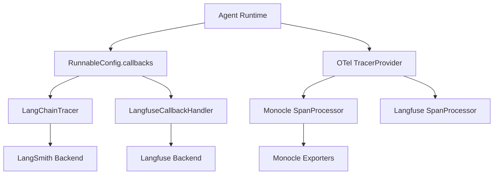
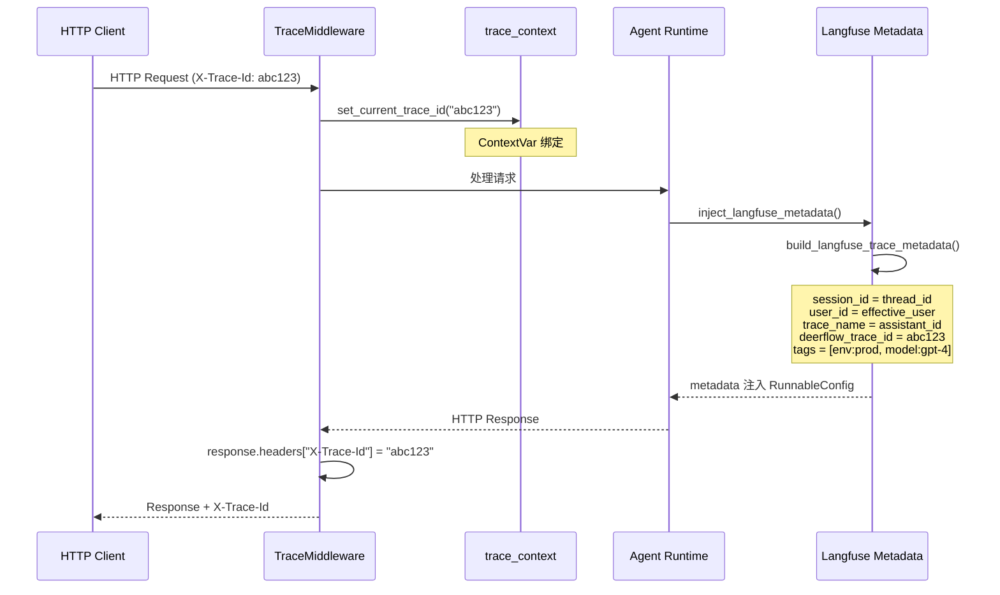
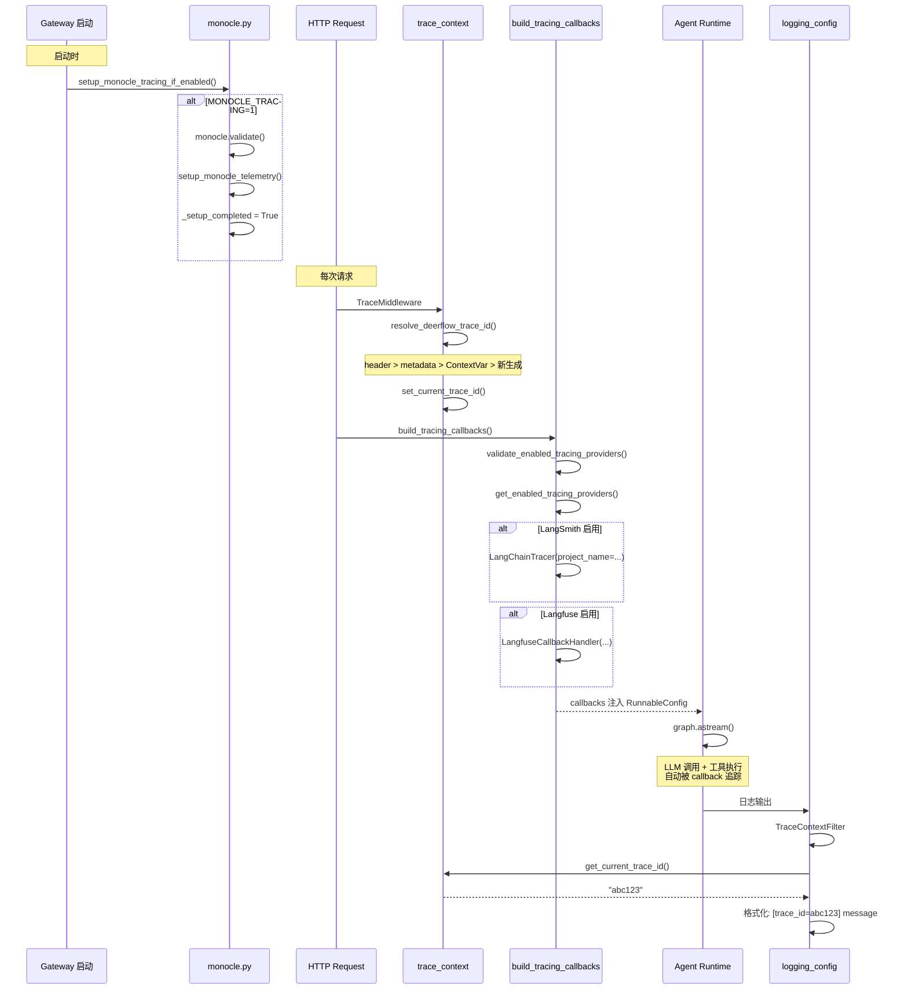

# 可观测性

## 读前思考

- 一个 Agent 系统需要追踪 LLM 调用、工具执行、子代理运行等多个层面。你会选择接入一个可观测性后端还是支持多个？多个后端之间怎么避免冲突？
- HTTP 请求级的 trace ID 和 LLM 调用级的 trace ID 是不同的概念。你怎么让它们关联起来，实现"从 HTTP 请求到 LLM 调用"的端到端追踪？

## 核心问题

可观测性系统解决的核心问题是：**支持 LangSmith、Langfuse、Monocle 三种追踪后端任意组合，同时实现 HTTP 请求级和 LLM 调用级的 trace 关联**。

DeerFlow 的可观测性系统以 `factory.py` 为回调入口构造 LangSmith/Langfuse callback，以 `monocle.py` 为 OTel 全局 instrumentor，以 `trace_context.py` 为请求级关联 ID 中枢。

## 方案展示

### 设计选择一：回调 vs OTel 双轨

LangSmith 和 Langfuse 通过 LangChain `CallbackHandler` 机制工作（per-run 回调列表），而 Monocle 通过 `setup_monocle_telemetry()` 注册 OTel 全局 `TracerProvider`。两者共存已验证：后初始化的库复用已有的 global provider，各自附加 span processor，不丢 span。

三种后端可以任意组合启用。如果同时启用 LangSmith 和 Langfuse，DeerFlow 会挂载两个追踪 callback。Monocle 和 Langfuse 都基于 OTel，共享 global TracerProvider 时 Monocle 的 exporter 也会看到 Langfuse 的 span。

### 设计选择二：trace 关联字段设计

`trace_context.py` 维护 DeerFlow 自己的 `deerflow_trace_id`（独立于 Langfuse trace id 和 run id），通过 `X-Trace-Id` HTTP header 传播。优先级：请求 header > metadata 注入 > ContextVar 上下文 > 新生成。

`normalize_trace_id()` 严格限制为可打印 ASCII (0x20-0x7E)，防止 Starlette latin-1 header 编码崩溃和日志注入。`_MAX_TRACE_ID_LENGTH = 512`，超长值被拒绝为 None，回退到自动生成。

### 设计选择三：Langfuse 元数据协议

`metadata.py` 利用 Langfuse v4 CallbackHandler 的保留键将 LangGraph thread 映射到 Langfuse Session：

| Langfuse 保留键 | DeerFlow 映射 | 作用 |
|----------------|---------------|------|
| `langfuse_session_id` | `thread_id` | 同一对话的所有 trace 归为一组 |
| `langfuse_user_id` | `get_effective_user_id()` | Users 页面聚合 |
| `langfuse_trace_name` | `assistant_id` | 区分不同 agent |
| `langfuse_tags` | `[env:prod, model:gpt-4]` | 按环境/模型过滤 |
| `deerflow_trace_id` | 请求关联 ID | 与 HTTP header 对齐 |

`inject_langfuse_metadata()` 用 `setdefault` 确保前端注入的元数据优先，不覆盖调用方已设的值。

## 完整执行流：从请求到 trace 的端到端关联

整个流程分为三个阶段：

1. **Gateway 启动初始化**：如果启用了 Monocle（`MONOCLE_TRACING=1`），`setup_monocle_tracing_if_enabled()` 在 Gateway lifespan 启动时调用 `monocle.validate()` 校验 exporter 名称和 API key，然后调用 `setup_monocle_telemetry()` 注册 OTel 全局 `TracerProvider`。配置校验前置确保了 typo 不会在 per-run 路径上失败。同时设置 `_setup_completed = True` 模块标记，让嵌入式/TUI 进程能检测是否跳过了初始化。

2. **Per-Run 回调构建**：每次 agent run 时，`build_tracing_callbacks()` 先校验启用的追踪 provider 凭据完整性，然后构造对应的回调——LangSmith 用 `LangChainTracer`，Langfuse 用 `LangfuseCallbackHandler`。回调注入 `RunnableConfig.callbacks` 后，LangChain 的每次 LLM 调用和工具执行都自动被追踪。同时 `inject_langfuse_metadata()` 将 LangGraph thread_id 映射为 Langfuse session_id、user_id 映射为 Users 页面聚合、assistant_id 映射为 trace_name，实现跨 run 的 trace 聚合。

3. **请求级 trace 关联**：`TraceMiddleware` 在每次 HTTP 请求时解析 `deerflow_trace_id`（优先级：header > metadata > ContextVar > 新生成），通过 ContextVar 绑定到当前请求。`TraceContextFilter` 在日志输出时读取 `get_current_trace_id()` 注入每条日志，响应头也包含 `X-Trace-Id`。这样 HTTP header、日志、Langfuse trace、runtime context 四方对齐，实现了从 HTTP 请求到 LLM 调用的端到端追踪。

## 工程优化

**延迟导入防循环**：`metadata.py` 中 `from deerflow.runtime.user_context import DEFAULT_USER_ID` 延迟到函数体内，避免 `deerflow.runtime` → run worker → `deerflow.tracing` 的循环导入。

**Monocle setup 幂等性**：`setup_monocle_telemetry()` 本身幂等，`monocle.py` 加 `_setup_completed` 模块标记让 `build_tracing_callbacks()` 能检测嵌入式/TUI 进程是否跳过了 Gateway lifespan 初始化。

**配置校验前置**：`MonocleTracingConfig.validate()` 在 Gateway 启动时校验 exporter 名称和 API key，而非在 per-run 路径上失败——配置 typo 不会中断 agent 运行。

**无凭据静默降级**：`enabled_providers` 属性检查 `is_configured`（enabled + 凭据完整），缺少 API key 的 provider 不进入回调列表，不会在 per-run 路径上报错。

**JSON 日志格式**：`JsonTraceFormatter` 输出结构化 JSON（timestamp, logger, level, trace_id, message, exc_info），适配生产环境日志采集系统。

**Token 用量追踪**：`TokenUsageConfig` + `TokenBudgetConfig` 在 AppConfig 中独立配置，通过 LangChain callback 自动采集每次 LLM 调用的 token 消耗。

## 面试要点

**1. 为什么支持三种追踪后端而不是只选一个？**

不同团队有不同的可观测性偏好：LangSmith 是 LangChain 生态原生选择，Langfuse 是开源替代且支持自托管，Monocle 基于 OpenTelemetry 可以接入任意 OTel 后端（如 Okahu）。支持三种后端让 DeerFlow 适配不同的企业环境。代价是需要处理三者共存的场景——Monocle 和 Langfuse 共享 OTel provider 时，Monocle 的 exporter 也会导出 Langfuse 的 span，需要在文档中明确说明。

**2. deerflow_trace_id 和 Langfuse trace id 有什么区别？**

`deerflow_trace_id` 是 DeerFlow 自己的请求关联 ID，通过 HTTP `X-Trace-Id` header 传播，用于关联同一个 HTTP 请求的所有日志和 trace。Langfuse trace id 是 Langfuse 内部为每次 agent run 生成的 ID。一个 `deerflow_trace_id` 可能对应多个 Langfuse trace id（如同一请求触发了多次 run）。两者通过 `metadata.deerflow_trace_id` 字段关联。

**3. 请求级 trace correlation 的性能开销有多大？**

开销很小：每次请求生成或读取一个 trace ID（UUID 或 header 值），设置一个 ContextVar，在日志 formatter 中读取并格式化。`normalize_trace_id()` 的正则校验和长度检查都是 O(1) 操作。主要开销在日志格式化——如果启用了 JSON 格式，每条日志都需要构造 JSON 对象，但这通常由 logging handler 的 IO 主导，trace 关联的 CPU 开销可以忽略。
