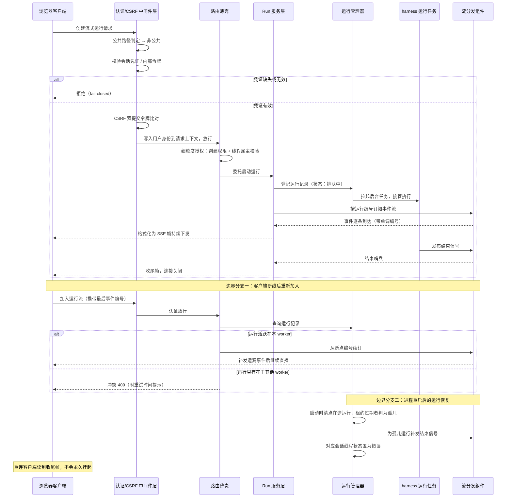

# Gateway/对外服务层

## 读前思考

- 如果自家的 IM 渠道层和 Agent 运行时跑在同一个进程里，渠道要发起一次 Agent 执行，你是进程内直接调用，还是绕一圈走 HTTP 调自己？直调省一跳网络、省一次序列化，为什么 deer-flow 偏偏选择绕一圈？
- 运维希望改完配置文件不用重启就生效，但运行时引擎（数据库连接池、事件流管道）是启动时一次性装配的，热重载动不了它们。这个矛盾你会怎么拆？

## 核心问题

Gateway 解决的核心问题是：**作为 harness 运行时唯一的 HTTP/SSE 服务门面，把认证、授权、配置解析、运行生命周期管理和事件流分发统一收口，让浏览器、IM 渠道、定时任务这些完全不同的调用方走同一条路径驱动 Agent 执行**。

deer-flow 在这件事上的定位很特殊：它不是给 Agent 加一个"顺便暴露的 API"，而是把 API 网关本身当成系统的边界定义——连进程内部的渠道层也必须走同一个入口。应用工厂在构建时就完成中间件链和全部路由的注册，生命周期钩子负责启动期装配和关停期拆除，请求进来时只剩下一条固定路径可走。

边界声明：IM 平台的传输适配（long-polling/WebSocket/webhook）、消息到 thread/run 的映射、渠道级并发策略属于 09 篇《消息通道/IM 集成》的内容；本篇只讲渠道把消息转成标准请求之后，gateway 作为入口本身是怎么工作的——涉及渠道侧行为处会明确指向 09 篇。

## 方案展示

### 设计选择一：gateway 是 harness 的唯一入口，连自家渠道也不例外

**设计选择**：所有想驱动 Agent 执行的调用方——浏览器前端、IM 渠道 worker、定时任务调度器——统一调用 gateway 的 LangGraph 兼容 HTTP API。最能说明问题的是 IM 渠道：渠道管理器和 gateway 运行在同一个进程里，它本可以直接拿到运行时的引用发起执行，但实际上它构造了一个指向自家 gateway 的 HTTP 客户端（直接复用官方 LangGraph SDK），发起标准的运行创建请求，请求头里附带进程内内部认证令牌和 CSRF 的 cookie/header 配对。渠道层拿到响应后消费的也是标准 SSE 流，与外部集成方没有任何区别。渠道侧如何把 IM 消息映射成这次调用、如何转发响应，见 09 篇。

**为什么这么选**：统一入口的收益是系统性的。认证、授权、CSRF 防护、请求追踪、配置解析这些横切关注点只在一条路径上实现一次，任何新调用方自动继承全部治理能力。渠道层不需要跟着运行时内部接口的演化走——只要 HTTP 协议不变，运行时内部怎么重构都不影响渠道。渠道层复用官方 SDK 还带来一个附带好处：它的行为与外部集成方完全一致，针对 API 的测试同时覆盖了渠道路径，不存在"内部直调路径没有测试"的盲区。进程内令牌的设计也没有因为走内网就放弃安全：令牌在进程启动时生成（也可通过环境变量显式指定以便多进程共享）、校验用常量时间比较防时序攻击，并且请求头里还携带渠道所属用户的身份标识，让文件路径、记忆、技能解析都落到正确的账号上，而不是全部退化成默认用户；这个身份标识在写入前会经过规范化，防止包含路径分隔符的原始渠道编号逃逸出用户目录。

**牺牲了什么**：每次渠道调用多一跳本地 HTTP 往返和两次序列化，对高频率小消息场景是纯开销。更隐蔽的代价是耦合方向反转了——渠道层依赖 HTTP 服务可用，而它们明明在同一个进程里；gateway 启动失败或重启期间渠道也跟着不可用，进程内直调则不会。此外进程内令牌的安全边界只在单进程内成立：令牌是进程级的，无法区分同进程内的不同调用组件，多进程部署时必须通过环境变量显式共享同一个令牌，这本身是一个需要管理的部署细节。

### 设计选择二：LangGraph 兼容 API + 事件流扇出

**设计选择**：gateway 对外暴露 threads/runs/assistants 这套 LangGraph Platform 兼容的资源模型，二十多条路由覆盖运行的创建、流式、等待、取消、加入，以及消息、事件、工作区变更的回放查询。SSE 事件的产生与消费被一个流分发组件（StreamBridge）隔开：harness 侧的 run 任务作为生产者把事件发布到这个组件，gateway 侧的 SSE 端点作为消费者订阅它，两边互不持有对方的引用。组件的抽象接口定义了四个动作——发布单条事件、发布结束信号、订阅（可指定起始编号和心跳间隔）、清理。SSE 帧格式严格对齐 LangGraph 平台的线上格式（事件名、JSON 载荷、可选编号三段），流式创建的响应头还携带运行资源的定位地址，官方前端 hook 和 SDK 可以直接对接。

**为什么这么选**：协议兼容意味着 deer-flow 不用维护自己的客户端生态，现成的 SDK 和前端组件拿来即用。事件扇出的解耦则解决了一个实际问题：run 在后台异步执行，一个 run 的事件流可能要同时服务多个消费者——发起请求的客户端、中途加入的第二个客户端、断线重连的同一个客户端。生产和消费解耦后，"加入一个正在进行的 run"就变成了一次普通的订阅操作：每个事件带单调递增的编号，编号同时作为 SSE 帧的编号字段下发，断线重连时客户端带上最后收到的编号即可从断点续读，不丢帧也不重复。无事件到达时组件按固定间隔发出心跳哨兵，消费者据此保活；生产者发布结束信号后，所有订阅者收到结束哨兵，流自然收敛。

**牺牲了什么**：兼容协议继承了 LangGraph 平台的概念负担——assistants 这类资源在本项目里只是占位实现，本地行为与官方平台的差异需要兼容层持续抹平，这是一笔长期维护成本。更实质的限制在多 worker 部署：流分发组件的默认实现是进程内的，订阅只能命中事件正在产生的那个 worker；命中不了时路由不会静默挂起，而是返回 409 冲突并告知重试时机，跨进程分发必须换成更重的实现（组件接口为此预留了能力标志位）。

### 设计选择三：双轨配置 + fail-closed 认证栈

**设计选择**：配置分成两条轨道。引擎轨道：流分发组件、持久化引擎、检查点存储、全局存储、运行事件存储这些在应用生命周期钩子内一次性装配，绑定启动时读取的配置快照，改这些配置必须重启——它们持有活连接和单例资源，运行中热替换会让任务处于不一致状态。"哪些字段重启才生效"有一份权威清单，同时镜像在配置模型的字段描述里，IDE 悬停就能看到。请求轨道：配置文件刻意不缓存到应用状态上，每个请求进来时重新解析，按文件修改时间判断是否重载，模型参数这类无状态配置改完下一次请求立即生效。认证栈则是 fail-closed 设计：全局认证中间件对所有非公共路径强制校验，缺凭证或凭证无效直接拒绝；只有登录、健康检查、OAuth 回调、webhook 等少数路径列入白名单，webhook 用提供方签名（如 HMAC 签名头）自证身份，且对应的路由在没配置验签密钥时干脆不挂载，直接返回 404。

**为什么这么选**：双轨配置是对"全量热重载做不到、全量重启体验差"的务实折中。如果所有配置都用启动快照，改一个模型参数也要重启；如果所有配置都热重载，正在执行的 run 可能一半用旧配置一半用新配置，事件存储甚至会出现"配置指向新后端、实例还绑着旧后端"的错配。把边界按"是否持有启动期单例"切开后，请求级消费者拿到的永远是"最新配置 + 与之匹配的事件存储配置"的成对组合。fail-closed 来自真实的安全教训：认证如果只在个别路由上检查，漏掉一个路由就是一个未鉴权入口——历史上确实出现过带着畸形 cookie 也能通过非隔离路由的问题，现在中间件对任何畸形凭证都在入口层严格拒绝，细粒度的错误码原样返回。中间件校验通过后把用户对象和授权上下文写入请求状态，路由层的权限装饰器直接短路复用，不必二次解码。首次启动时系统不自动创建管理员，而是要求运维访问专门的初始化页面建号，避免远程攻击者抢先初始化；从"无认证"升级到"有认证"的存量部署，启动时会把没有属主的孤儿会话线程分页遍历、批量迁移到管理员名下，保证升级不丢数据也不出现无主数据。

**牺牲了什么**：双轨制增加了认知成本——同一个配置文件里的字段生效方式不一致，运维必须查清单才知道改某个字段要不要重启；清单与字段描述两处维护，存在不同步的可能。fail-closed 中间件让所有请求都多一次 JWT 解码和数据库用户查询（靠请求状态暂存避免了二次解码，但首次解码不可避免），公共路径白名单本身也是一个需要维护的攻击面——每加一个公共路径都要评估它是否可能被滥用。

## 核心机制执行流：一次流式运行的全链路

以浏览器发起 POST /threads/{id}/runs/stream 为例，从请求进来到 SSE 帧送达的完整链路：

逐步讲解这条链路的每个阶段：

**认证拦截**。请求先经过中间件层。认证中间件先做公共路径判定——命中白名单（健康检查、登录、webhook 等）直接放行，否则检查凭证。浏览器请求走会话 cookie 里的 JWT，严格校验签名、过期时间、签名用户是否存在、令牌版本是否过期（改密后旧令牌即失效），任何畸形 cookie 都在这一层被拒绝并返回细粒度错误码，而不是放行进路由再碰运气。渠道 worker 的请求则命中进程内内部令牌分支，同时从请求头提取渠道属主身份写入用户上下文。校验通过后，用户对象和授权上下文写入请求状态，并同步进请求级的用户上下文变量——这样持久化层的属主过滤可以自动生效，不必每个仓储都显式传用户编号。

**CSRF 校验**。状态变更类请求接着过 CSRF 中间件：cookie 里的令牌必须与请求头里的令牌一致（双提交 Cookie 模式），跨站伪造请求带不出自定义头，因此被挡在门外。渠道 worker 自调用也要手工配对这对令牌，没有任何豁免。

**路由薄壳与授权**。路由函数本身只有几行——先过细粒度授权装饰器，校验"创建运行"权限且该线程确属当前用户（防止用户 A 猜出用户 B 的线程地址越权执行），然后取出启动时装配好的流分发组件和运行管理器单例，把请求体连同线程编号委托给服务层。

**服务层与运行管理器**。服务层的启动运行函数负责落一条运行记录（初始状态排队中），然后交给运行管理器拉起后台任务。从这一刻起，harness 的 Agent 执行与这条 HTTP 连接彻底解耦——连接断了 run 还在跑，这是后面"加入"语义成立的前提。

**事件扇出与 SSE 消费**。服务层的消费协程按运行编号订阅流分发组件（如果请求带了断线重连的最后编号，就从该编号续订）。harness 任务每产生一个事件就发布一次，消费协程拿到后格式化成 SSE 帧（事件名、JSON 载荷、单调编号）写入响应流。期间若无事件到达，组件按固定间隔给出心跳哨兵，消费协程将其渲染为 SSE 注释帧保活。生产者发布结束信号后，消费协程收到结束哨兵，下发收尾帧并关闭连接。连接关闭前的清理分支按 run 声明的断连策略执行——"取消"则中止后台任务，"继续"则任务照常跑。

**边界分支一：中途加入与断线重连**。客户端中途加入一个已存在的 run 时，请求走"加入"路由：先查运行记录确认存在且属于该线程，再判断运行是否活跃在当前 worker——多 worker 部署下事件流默认进程内，如果这个 run 正在另一个 worker 上执行，本 worker 无法提供流，返回 409 冲突并提示租约到期后的重试时间；若流分发实现声明支持跨进程分发则直接放行。活跃场景下，订阅从客户端携带的最后事件编号续读，断线期间的事件被补发，然后无缝接续直播。"对已有流发起取消再继续消费"也是同一模式的变体：先执行取消动作，再把剩余缓冲事件流给客户端，让它观察到干净的收尾。

**边界分支二：重启恢复**。进程崩溃或被重启时，在途 run 的执行任务随进程消失，但运行记录还留在存储里处于"执行中"。gateway 在启动装配阶段（对外服务之前）就做一次孤儿清点：单 worker 模式下没有租约概念，所有在途记录都被回收；多 worker 模式下只回收租约过期的，别的 worker 正在执行的心跳租约不动。被回收的 run 会被补发结束信号——这样重连的客户端读到的是干净的收尾帧而不是永远挂起的连接——对应的会话线程状态被置为错误，客户端可以明确知道这次执行失败了。

## 工程优化

**薄壳路由与厚服务层的分工**。路由文件里几乎所有端点都是几行的薄壳：授权装饰器、取单例、参数校验，然后委托给一千二百多行的服务层。SSE 帧格式化、消费协程、断线语义、运行记录到响应的转换全部沉淀在服务层，路由只负责 HTTP 语义。这个分工让同一套运行启动逻辑可以同时被"流式、等待、后台"三个端点复用，渠道层的调用走 HTTP 进来后也落在同一份代码上——不存在两套启动逻辑漂移的空间。

**SSE 断线的两种语义**。消费协程的清理分支实现了可声明的断连策略：运行可以声明客户端断开后"取消"或"继续"。取消语义下连接一断后台任务即中止，省算力；继续语义下任务照常执行、事件照常发布，客户端随时可以重新加入续读。心跳间隔内消费协程还会顺带检查运行记录是否已被孤儿恢复流程接管——如果是，直接下发收尾帧退出，避免消费者挂在一个永远不会再有事件的流上。

**关停时的排空顺序**。关停流程的顺序是刻意安排的：先停渠道服务和定时任务（切断新 run 的来源），再给在途 run 一个有限时间的排空窗口，窗口结束才释放检查点存储的连接池。排空协程做了双重防护——即使关停过程本身被第二次中断信号取消（信号风暴正是这类问题的常见来源），排空任务也会被保护着跑完自己的时限，防止"运行任务还在写检查点、连接池已经关了"的资源竞争。排空预算和渠道关停预算是分开定义的两个常量，各自管各自的拆除步骤；在容器部署里，这些预算之和必须塞进平台的优雅终止窗口，否则强制终止会让排空保护失效。记忆后端还有一步独立的关停刷写，把待写入的记忆更新在退出前尽量落盘。

**重启恢复的收尾细节**。孤儿清点的结果不只是改数据库状态：补发的结束信号带一个延迟清理任务，给晚到的订阅者留出把剩余事件读完的窗口；如果进程在延迟期内又要退出，关停流程会取消这些延迟任务并立即清理，流分发组件自身的过期时间作为最后兜底。被恢复的 run 如果恰好是所属线程的最新一次执行，线程状态会被同步置为错误——这一步必须在开始对外服务之前完成，因为线程元数据存储无法表达"仅当最新 run 是被恢复的那个时才更新"的原子条件更新，提前做就避开了与并发新 run 的读写竞争。多 worker 部署还有一条周期性恢复路径，靠租约心跳把同样逻辑持续应用到运行期，而不仅限于启动时。

**多 worker 的启动门禁**。多 worker 部署在启动时被强制检查三个前提：数据库必须是支持并发写的后端（文件型数据库的写锁撑不住多进程）、运行租约心跳必须开启、浏览器会话这类进程内资源必须禁用。任何一条不满足，进程直接拒绝启动并给出明确原因——因为缺了心跳，所有运行都没有租约，孤儿清点会把别的 worker 正在执行的健康 run 全部误杀，每次滚动更新都会造成批量中断。把这类配置错误拦在启动期而不是运行期，错误信息清晰且损失为零。

**请求追踪与可观测性**。请求追踪中间件给每个 HTTP 请求绑定一个追踪编号并写进响应头，方便把一次请求的日志串起来；它的开关和日志格式都从启动快照读取，避免运行中切换开关导致日志格式与中间件不同步。Agent 级的链路追踪在启动期初始化，配置错误只记日志不中断启动——可观测性永远不应该拖垮服务本身。

## 面试要点

**1. 如果去掉多用户约束，这个 gateway 会退化成什么？**

去掉多用户（只剩单用户、本地可信环境）后，认证中间件、属主校验、孤儿线程迁移、用户上下文传播这一整套都可以简化为一个固定的默认用户——项目本身也留了禁用认证的开关作为这条退化路径的正式出口。但 gateway 不会因此退化成一个可有可无的壳：运行生命周期管理（记录登记、异步执行、事件扇出、断线重连、重启恢复）和双轨配置与多用户无关，它们是"长时异步任务 + 流式输出"这个运行模式的固有需求。判断标准是：**认证层的复杂度取决于调用方身份多样性 × 资源属主隔离需求，而运行层的复杂度取决于任务时长 × 连接不可靠程度**——两组约束独立变化，去掉一组另一组不变。这也解释了为什么单用户部署下 deer-flow 依然保留完整 gateway 而不是换轻量方案：省掉的只是认证层，运行层一分不少。

**2. 渠道走 HTTP 自调用，在什么场景下值得换成进程内直调？**

直调的优势是省掉本地网络往返、序列化和 HTTP 可用性依赖；HTTP 自调用的优势是所有调用方共用一条经过认证、授权、追踪、CSRF 保护的路径，且渠道层与运行时内部接口解耦。换成直调值得考虑的场景是：调用频率极高且单次载荷小（本地回环的固定开销占比被放大），或者部署形态保证渠道与运行时生命周期完全一致、不需要独立重启。但只要满足以下任一条，HTTP 自调用就仍然更优：存在多种调用方需要统一治理、运行时需要独立演进、希望渠道层复用标准 SDK 从而与外部集成方行为一致。判断标准：**取决于调用频率 × 治理统一性需求**——低频调用下统一入口的边际成本几乎为零，高频且无外部调用方的场景才有动机为性能放弃统一入口。还可以追问一层代价：自调用让认证逻辑在"防外部攻击者"和"信任内部组件"之间出现了双轨（外部走 JWT、内部走进程令牌），这个双轨本身需要显式管理，是选择 HTTP 自调用时容易被忽略的长期成本。

**3. 双轨配置为什么不做成全量热重载？边界画在哪？**

全量热重载的障碍在于有状态组件：数据库连接池、事件流管道、检查点存储都是启动时一次性装配并持有活资源的，运行中替换它们意味着正在执行的任务可能一半用旧配置一半用新配置，事件存储甚至可能出现配置指向新后端、实例还绑着旧后端的错配。deer-flow 的边界划法是：**一个配置字段背后是否挂着启动期单例**——挂着的就是重启生效，并在配置模型的字段描述里标注；不挂的就走请求级热重载，且配置文件刻意不缓存，保证请求永远看到最新值。代价是同一文件里字段生效方式不一致，运维需要查清单。判断标准：**取决于组件是否持有活资源 × 运行中切换的一致性风险**——无状态字段热重载收益大风险小，有状态字段热重载收益小（改连接配置本来就需要重建连接）而风险大，所以按组件状态切分而不是按字段重要性切分，这是该设计可推广到其他系统的关键。
