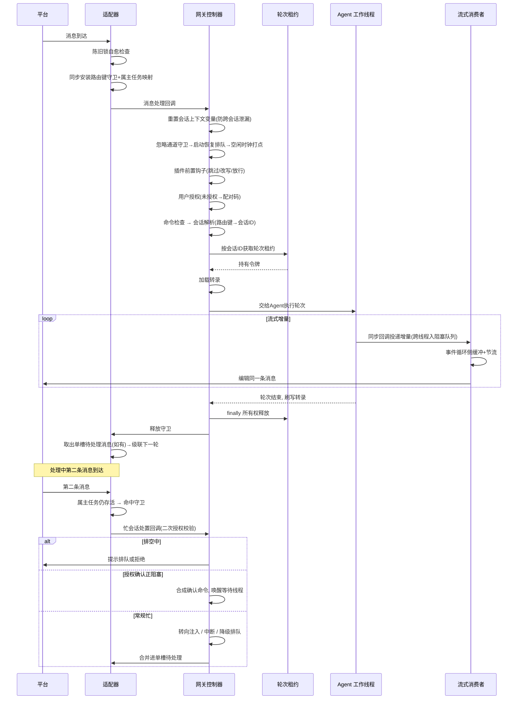

# 对外服务层与消息通道

## 读前思考

- 一个常驻进程同时服务 30+ 聊天平台：不开任何对外协议端口，所有平台的收发、路由、并发都在进程内解决。当同一个会话的两条消息几乎同时到达，都想加载对话历史、跑一轮 Agent、再写回同一份转录——你在哪一层挡住它们？如果这两条消息来自不同的路由入口（同一个会话在两个聊天里都能触达），按入口加锁还够用吗？
- 这个进程刻意不开任何对外的控制端口。那么运维面板想让它"排空重启"，指令要怎么送进去？进程被重启之后，这条指令还有效吗？

## 核心问题

本主题在 hermes-agent 中的定义是：**让一个常驻单体进程同时管理 30+ 平台适配器，在"多平台 × 多会话 × 多线程"的组合爆炸下保证消息不丢、转录不写坏、生命周期可控——而且不开任何对外协议端口，服务层就是运行时本身。**

| 维度 | hermes-agent 的选择 |
|------|--------------------|
| 服务形态 | 进程内巨型消息运行时，无对外协议端口 |
| 通道抽象 | 适配器基类 + 统一消息事件 + 能力标志 |
| 消息路由 | 会话键三层分层（平台 + 聊天 + 线程） |
| 并发控制 | 三层守卫：路由键守卫 / 忙待槽 / 轮次租约 |
| 流式投递 | 流式编辑（占位后反复编辑）+ 节流；不支持编辑的平台一次发送 |
| 连接级认证 | 配对码：短寿命、低尝试次数的人工首次授权 |
| 生命周期治理 | 标记文件 + 实例纪元、缩零休眠、关停取证、重启熔断 |
| 配置治理 | 五层优先级链（CLI > 环境变量 > 项目 > 用户 > 默认值） |

动作级的审批（危险命令确认放行与否）归 09-guardrails；会话超时回收与多 Profile 实例隔离归 04-state。

## 方案展示

### 设计选择一：单体控制器 + 回调注入装配 + 能力标志适配器

**设计选择**。网关的全部运行时逻辑收敛在一个单体控制器（约 2.4 万行的系统最大单文件）里，通过 Mixin 组合出授权、看板监听、斜杠命令等能力切面。装配方式是回调注入：启动时按平台逐个创建适配器，向每个适配器注入消息处理、致命错误、会话存储、忙会话处置四个回调，外加可选的表情回应、授权检查；注入完成后才发起连接。所有平台收到的消息被转换为统一的消息事件（平台、聊天编号、用户、文本、附件），控制器只处理这种统一事件，不感知平台细节。平台差异不用继承层次表达，而是能力标志字典——每个适配器声明自己支持什么（流式编辑、输入指示、消息长度上限、附件、线程），控制器按标志组合选投递策略：支持编辑的先发占位消息再反复编辑，不支持的等完整响应一次发送，超长的自动分段。

启动有严格时序：适配器一连上就可能收到消息，但被上次重启打断的会话还没恢复，所以启动期间入站消息全部进排队区，恢复流程完成后才统一放行；连接失败的平台不拖死整体启动——失败即清理残留资源，按"错误是否可重试"分流进重连队列或启动失败清单。

**为什么这么选**。适配器只需要几个函数引用，不需要知道网关内部结构；控制器只编排生命周期，不了解平台连接细节——30+ 平台因此可以独立开发、独立失败、独立重连，装配点只有一处。能力标志是扁平的：Telegram 支持编辑、SMS 不支持、Discord 编辑有 15 分钟窗口，这些差异用继承树表达会分裂出大量中间类，用标志声明则新增平台只需填写一个字典。

**牺牲了什么**。所有状态（活跃 Agent 表、运行代数、排空标志）共享同一个命名空间和同一个事件循环，任何一处改状态都要考虑其他路径的可见性；回调是鸭子类型契约，注入错一个只会在运行期炸。统一事件模型是"最小公分母"，平台特有的交互式组件（行内键盘、卡片）无法表达；能力标志把条件限制（如"编辑 15 分钟后失效"）推回适配器内部，上层不感知。

### 设计选择二：会话键分层路由

**设计选择**。每条消息的会话键由三层组成：平台 + 聊天编号 + 线程编号（可选）。相同会话键的消息路由到同一个会话（共享对话历史），不同会话键完全隔离——每个活跃会话有独立的 Agent 实例。

**为什么这么选**。一个群组里可能有多个话题，每个话题应该是独立的对话上下文；只按聊天编号路由会把不同话题混进同一个对话。三层键保证"同平台、同聊天、同线程"共享上下文，其余完全隔离。

**牺牲了什么**。会话键粒度固定——无法实现"同一用户在不同群组共享记忆"；活跃会话数等于平台 × 聊天 × 线程的组合，每会话一个 Agent 实例，内存随活跃会话数线性增长，不活跃会话的超时回收到磁盘与恢复机制见 04-state。

### 设计选择三：三层并发守卫——路由键守卫、忙/待槽、轮次租约

**设计选择**。同一会话的并发消息要穿过三层守卫，每层的键不同、解决的问题不同：

| 层 | 键 | 职责 |
|----|----|------|
| 路由键守卫 | 路由键（平台+聊天+线程） | 同步安装中断事件，挡住同键第二条消息 |
| 忙/待槽 | 路由键 | 单槽待处理消息、中断/排队/转向、旁路命令 |
| 轮次租约 | 解析后的会话 ID | 串行化"加载转录→跑轮次→刷写"区段 |

第一层的关键在时机：守卫必须在派发后台任务之前同步安装，否则两条几乎同时到达的消息会双双通过活跃性检查、各起一个重复任务；守卫同时登记属主任务映射，会话终止命令才能精确取消对的任务。第二层为活跃会话提供单槽待处理消息（连续文本合并进同一槽）、三种忙时行为（中断、排队、转向注入）和一批旁路命令——授权确认类命令直接内联派发（否则 Agent 正阻塞在确认上，确认回复却被当成新轮次排队，形成死锁）。第三层暴露了前两层的盲区：路由键到会话 ID 是多对一映射（在第二个聊天里恢复命名会话、命令行续接、委派回指都制造别名），两个路由键各自通过自己的守卫、在同一份转录上并发刷写——任何按路由键的守卫都看不见这个碰撞，因为碰撞发生在两个不同的键上。轮次租约按解析定型后的会话 ID 加锁，释放带所有权和运行代数校验，等待超时则失败开放——降级为不串行继续跑并大声报错，宁可冒转录交错的风险也不把会话卡死。

**为什么这么选**。前两层负责交互体验（中断要快、排队要合并、命令要旁路），第三层负责数据正确性。同键消息被第一层挡住，租约只在别名键路径上真正竞争，锁开销可忽略。

**牺牲了什么**。租约是进程内、单事件循环可见的——通过命令行共享同一会话的进程在锁的可见范围之外，这对组合需要数据库级租约另行设计。三套状态各自的清理路径必须对齐：守卫泄漏靠自愈、Agent 表泄漏靠逐出、租约靠所有权释放——每层都要有自己的泄漏对策，这是分层设计的必然要求。

### 设计选择四：无外部控制通道的生命周期工程

**设计选择**。运行中的网关没有任何外部控制通道——没有管理端口，没有 RPC。生命周期指令只能通过斜杠命令、进程信号、标记文件进入。排空因此被实现为文件契约：运维面板写排空标记文件，网关后台监视器周期性读取；看到带当前实例纪元的标记就翻转为排空状态、拒收新轮次，删除标记即取消。纪元解决的是一个真实事故：排空要保护的破坏性操作（自动更新、镜像迁移）恰恰都会重启机器，而标记文件在持久卷上跨重启存活——没有纪元，新实例读到孤儿标记会把自己永远锁在排空态（线上曾有一个实例因此拒绝所有请求约 50 分钟）。纪元由内核启动时间与 1 号进程启动时间组合而成：重启机器换纪元（旧标记自动作废），只重启网关进程则纪元不变（在途排空继续被尊重）。配套还有四件事：缩零休眠（三条件合取判空闲后由部署平台冻结、唤醒地址命中时恢复）、关停取证（信号处理器内毫秒级快照先落盘）、关停看门狗（独立线程在事件循环冻结时转储并强制退出）、重启循环熔断（启动过密即跳过自动恢复，防止 Agent 诱导网关反复重启）。

**为什么这么选**。控制面就是攻击面，不开端口意味着排空/重启/关停无法被网络侧触发；"存在即状态"让取消操作就是删文件、天然幂等；纪元的本质是给持久存储上的指令加时效维度。

**牺牲了什么**。文件轮询有响应延迟；契约演化必须双向兼容；缩零休眠依赖部署平台的冻结语义，跨平台移植要重做；面板看不到网关实时状态，只能靠网关写出的状态文件反推。所有机制都是"事后归因 + 自愈"型——不阻止事故，只保证事故可诊断、可恢复。

### 设计选择五：五层配置优先级链

**设计选择**。配置值按五层优先级解析：CLI 参数 > 环境变量 > 项目配置 > 用户配置 > 内置默认值，每一层只覆盖它下面的层。运行时可以用配置命令临时修改当前会话的配置——默认不持久化，显式保存才写回文件，这样"试试别的模型"的尝试不会永久改变配置。配置结构用 JSON Schema 校验，版本变更自动迁移，配套差异展示命令回答"我的配置实际做了什么"。敏感信息（API key、令牌）不存入主配置文件，分离到环境文件或系统钥匙串，机制见 09-guardrails；多 Profile 的完全实例隔离（独立配置/环境/技能/会话）见 04-state。

**为什么这么选**。hermes-agent 在多种场景下使用（CLI/gateway/定时任务），每种场景可能需要不同配置。五层遵循"越具体越优先"——CLI 参数是"这一次我要用 X"，环境变量是"这个环境用 X"，项目配置是"这个项目用 X"，用户可以稳定预测行为。

**牺牲了什么**。调试"为什么我的配置没生效"时要检查五层，这正是差异展示命令存在的原因；运行时修改默认只影响当前会话，用户可能困惑"我明明改了为什么下次启动又变回去了"，缓解手段是修改时明确提示持久化方式。

## 核心机制执行流：一条消息的全链路与忙时分支

以用户发一条消息、处理中又发第二条为例：

**阶段一：入口自愈与守卫安装**。消息到达后先做陈旧锁自愈：路由键上还挂着守卫、但属主任务已退出，说明守卫是泄漏的——清掉放行，否则这个聊天会被困在假忙状态直到重启。自愈后若仍无守卫，就同步安装中断事件并登记属主任务，然后才派发后台任务。"先装锁后起任务"的顺序关掉了两条消息各起一个重复任务的竞态窗口。

**阶段二：十步串行管线**。回调运行在按消息创建的异步任务里，任务会继承派生时刻的上下文快照——若并发消息已绑定自己的会话变量，本任务继承的就是别人的会话身份，所以管线入口先把上下文变量重置为未设置，让泄漏窗口变成"无会话"而不是"错会话"。随后依次是：忽略通道守卫、启动恢复期排队、空闲时钟打点、插件前置钩子（刻意跑在授权之前，让插件能处置未授权发送者）、用户授权（私聊未授权走配对码、群聊静默忽略，配对机制见 09-guardrails）、命令检查、会话解析。管线顺序本身就是安全设计：丢弃性守卫在前，状态建立在后。

**阶段三：租约与轮次**。会话解析把路由键定型为会话 ID 后获取轮次租约，加载转录，把轮次交给按会话缓存复用的 Agent 实例。Agent 在工作线程中同步执行，每产生一段流式输出就同步调用增量回调——回调把增量投递进线程安全的阻塞队列，事件循环侧的消费者取出后缓冲、节流（编辑类消息每 500 毫秒最多一次，防止触发平台限流），反复编辑平台上的同一条消息。轮次结束刷写转录，在 finally 中按令牌所有权释放租约——被停止命令顶掉的旧清理只能释放自己的令牌，碰不到新轮次的锁。

**阶段四：忙时分支**。第二条消息命中守卫走忙会话处置回调，入口先做二次授权校验——冷路径在创建会话前查授权，忙路径必须重复，否则共享聊天里的未授权用户能向不属于自己的活跃会话注入消息。之后依次判断：排空中则提示排队或拒绝；Agent 阻塞在危险命令确认上，则把自然语言确认合成为标准确认命令并唤醒等待线程；子代理或压缩进行中，则把中断降级为排队——一次随手插话不该摧毁几分钟的子代理工作，显式停止命令不受降级影响；其余按配置分流为转向、中断或排队。当前任务结束后释放守卫、从单槽取出消息级联处理——单槽设计意味着连续轰炸只保留最近合并后的一条。

**边界路径——别名键竞态**。两个路由键映射到同一会话 ID 时，两者的路由键守卫互不可见，消息各自推进到轮次租约处才相撞：后到者等待先到者刷写完成，并记一条同时点名会话 ID 和两个路由键的告警；等待超时则失败开放，降级为不串行运行。

## 工程优化

**消息去重与附件懒下载**。webhook 模式下平台可能重复投递同一消息，适配器按消息编号去重——已处理的编号记入最近使用缓存，重复消息直接丢弃。消息事件中的附件初始只有地址，只有当 Agent 实际需要处理时才下载，避免大文件的无用下载。

**多平台格式适配**。Agent 的响应是统一 Markdown，但各平台方言不同（有的要转义特殊字符、有的粗体语法不同），格式转换全部在适配器内完成，控制器不感知。

**陈旧锁自愈与属主映射**。自愈判据很克制：只有"登记过属主任务且该任务已退出"才算陈旧，没有属主记录的守卫不动——自愈只处理生产环境的裂脑场景，不过度推断。"守卫 + 属主 + 条件删除"这三件套是把一个不可靠的异步生命周期变成可确定性对账的关键。

**配对码的连接级认证参数**。未知用户私聊触发的配对流程按低熔断值设参：无歧义字母表取 8 位、密码学随机、一小时有效期、每平台最多三个待批码、每用户十分钟一次限流、五次失败锁定一小时、数据文件严格权限、配对码不进日志。安全性靠短寿命加低尝试次数堆出来，而不是靠码本身的长度；动作级的危险命令审批是另一层，见 09-guardrails。

**把 HTTP API 做成平台适配器**。OpenAI 兼容的 HTTP API 不是独立服务，而是一个平台适配器：对话补全、流式运行事件、会话管理都挂在同一个适配器上，和聊天消息走完全相同的管线、受完全相同的三层守卫保护。代价是 HTTP 的无状态语义要挤进面向聊天建模的事件结构，靠可选的会话头打补丁。当一个新入口复用既有管线的收益足够大时，把它建模为"又一个平台"比建一条专用通道更划算。

## 面试要点

**1. 为什么用"按解析后会话 ID 的轮次租约"，而不是全局锁或按路由键的锁？**

按路由键的锁正是被绕过的那层：路由键到会话 ID 是多对一映射，两个不同路由键各持自己的锁、在同一份转录上并发刷写，任何按路由键的守卫都看不见这个碰撞。全局锁能堵住洞，但把所有会话串成一条线——一个跑工具的长轮次可以持续几分钟，期间所有无关会话都被阻塞。租约按解析后的会话 ID 加锁，竞争只发生在真正的别名键路径上，其余路径零竞争；局限是只覆盖进程内，跨进程共享会话需要数据库级租约。判断标准：**锁的键取决于被保护资源的属主是谁 × 路由键到属主的映射是否多对一**——两者不一致时必须在解析定型后补一把按属主的锁。还要讲得出两个安全属性：所有权加代数校验的释放、超时失败开放——后者体现可用性优先于强一致性：转录交错事后可以检测和修复，会话永久卡死则不可接受。

**2. 无外部控制通道、用"标记文件 + 实例纪元"做排空契约，代价在哪？什么场景下不成立？**

代价有三层：文件轮询的响应延迟；契约演化必须双向兼容（损坏的标记被刻意当作"排空生效"——宁可多排空也不放行）；可观测性受限，面板只能靠网关写出的状态文件反推。正面考量也要讲：不开控制端口把生命周期攻击面降到零，"存在即状态"让取消天然幂等，而纪元本质是给持久存储上的指令加时效维度——指令写得比进程寿命更久，就必须携带"写给哪一世进程"的身份，否则一次自动更新就能把实例永远锁死在排空态。多实例部署下方案不成立：标记文件是单进程契约，两个实例共享同一文件会互相干扰。判断标准：**取决于控制指令的存储寿命 × 进程实例的更替频率**——指令活得比实例久，就必须引入纪元类失效机制。

**3. 30+ 平台用统一事件加能力标志，这个抽象的"泄漏"在哪？**

泄漏点有三类：交互式组件（行内键盘、卡片按钮）无法用文本字段表达；消息编辑语义各平台不一致（编辑是否换编号、有无时间窗口）；群组权限（有的平台需要管理员身份）。hermes-agent 的处理是让适配器在内部消化这些差异，控制器只关心"消息进、响应出"。如果某个平台的核心交互模式不是"文本进文本出"（如语音助手），统一模型就不适用了。判断标准：**取决于平台交互模式与"文本往返"的同构程度 × 平台数量**——同构且平台多时统一模型收益最大，出现异构核心交互时宁可单独建模也不要硬塞进最小公分母。
