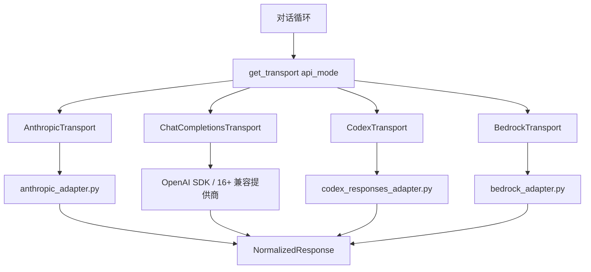
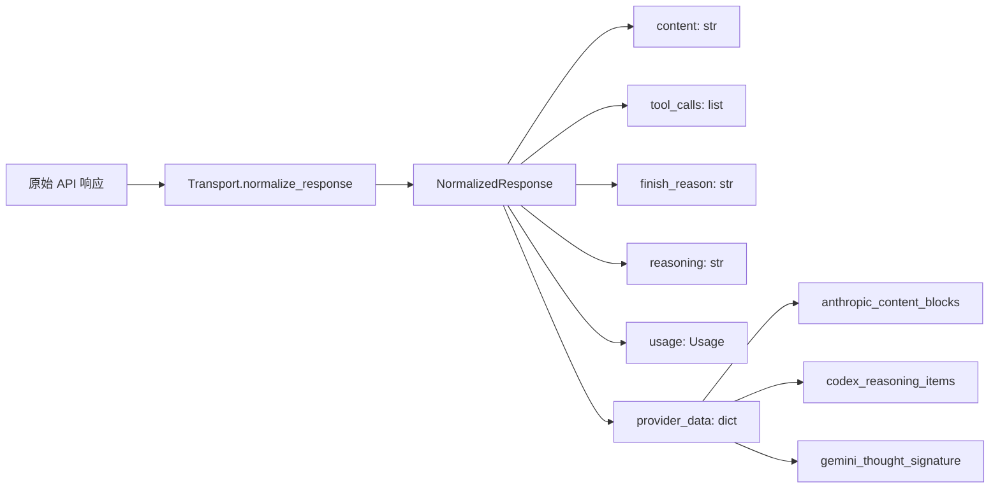
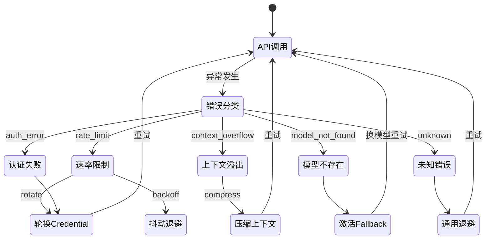
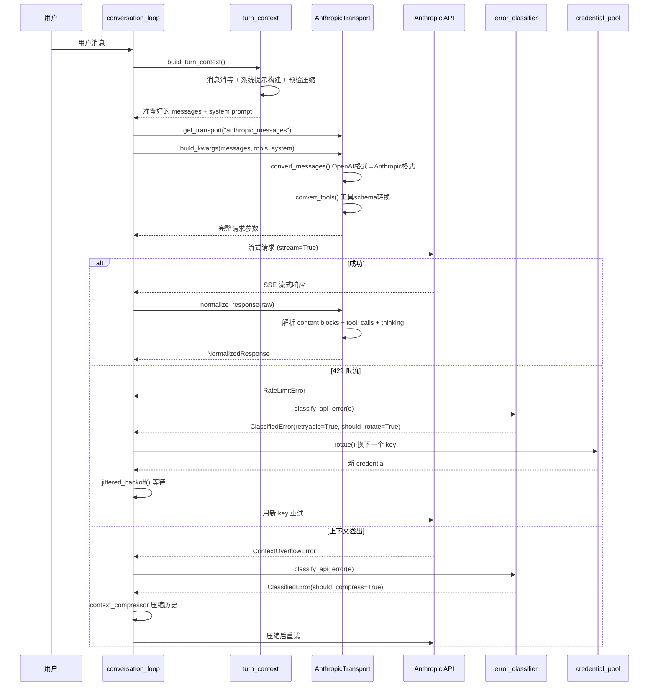

# LLM 接入层

## 读前思考

- 如果你需要同时支持 Anthropic、OpenAI、AWS Bedrock、Gemini、Codex 五种完全不同协议的 LLM API，你会怎么设计抽象层？是在调用点写 if-else 分支，还是把差异封装到某个统一接口后面？
- 当某个提供商返回 429 限流时，你是该立即重试、换一个 API key、还是切换到另一个提供商？这三种策略能共存吗？

## 核心问题

LLM 接入层解决的核心问题是：**如何让上层对话循环完全不感知底层 API 协议差异，同时在错误发生时自动选择最优恢复策略？**

Hermes Agent 的定位是"个人全能助手"，需要接入尽可能多的模型提供商（30+），且用户可能同时配置多个 API key 和 fallback 模型。这决定了它的接入层必须同时解决两个问题：协议差异的屏蔽和故障时的自动恢复。

| 维度 | Hermes 的选择 |
|------|--------------|
| 协议覆盖 | 5 种原生协议（Anthropic Messages、OpenAI Chat Completions、OpenAI Responses、Bedrock Converse、Gemini Native） |
| 抽象模式 | Transport 策略模式 + 注册表 |
| 错误恢复 | 分类学驱动（20+ 种 FailoverReason 枚举） |
| 认证管理 | Credential Pool（多 key 轮换 + 冷却 + DEAD 状态） |
| 辅助调用 | 独立的 auxiliary_client（压缩/摘要/视觉任务复用同一套 transport） |

## 方案展示

### 设计选择一：Transport 策略模式 + 注册表

Hermes 没有选择在对话循环中写协议分支，而是将每种协议封装为一个独立的 Transport 类。所有 Transport 实现同一个抽象基类 `ProviderTransport`，只需提供四个方法：`build_kwargs()`（构建请求参数）、`normalize_response()`（规范化响应）、`convert_messages()`（消息格式转换）、`convert_tools()`（工具 schema 转换）。

Transport 在模块导入时自动注册到全局注册表，对话循环通过 `get_transport(api_mode)` 一行代码获取对应实例。新增提供商只需写一个 Transport 文件，对话循环零修改。

**为什么这么选**：Hermes 支持的提供商数量是动态增长的（MiniMax、小米 MiMo、腾讯 TokenHub 等不断加入），if-else 分支会随提供商数量线性膨胀。策略模式让新增提供商的成本从"修改核心循环"降为"添加一个文件"。

**牺牲了什么**：每个 Transport 是薄委托层（如 AnthropicTransport 仅 252 行），真正的转换逻辑在独立的 adapter 大文件中（anthropic_adapter.py 2861 行）。这造成双层间接调用——调试一个 Anthropic 格式问题需要跳转两个文件。此外，`get_transport()` 返回 None 时允许回退到旧代码路径，这意味着系统中同时存在新旧两套调用逻辑。

### 设计选择二：NormalizedResponse + provider_data 逃逸舱

所有提供商的响应被规范化为统一的 `NormalizedResponse` 结构，包含 content、tool_calls、finish_reason、reasoning、usage 五个标准字段。但协议特有的状态（Anthropic 的签名 thinking 块、Codex 的加密 reasoning 条目、Gemini 的 thought_signature）无法用共享字段表达，这些被放入 `provider_data` 字典——一个受控的"逃逸舱"。

**为什么这么选**：对话循环有 45+ 个调用点只读标准字段，不需要知道协议细节。但 Anthropic 的 thinking 块签名必须在重放时保持原始顺序（否则 HTTP 400），Codex 的加密内容必须按发行方过滤——这些信息必须有地方存。`provider_data` 让标准路径保持简洁，特殊路径有出口。

**牺牲了什么**：`provider_data` 是无类型字典，新字段的消费者必须知道键名，没有编译期检查。`ToolCall.function` 属性返回 self（为了兼容 `tc.function.name` 的 45+ 个旧调用点），是一个语义上的 hack。

### 设计选择三：错误分类学驱动恢复策略

Hermes 定义了一个 `FailoverReason` 枚举（20+ 种错误类型），`classify_api_error()` 函数将任意异常映射为 `ClassifiedError`，携带四个布尔恢复提示：`retryable`（是否重试）、`should_compress`（是否压缩上下文）、`should_rotate_credential`（是否换 key）、`should_fallback`（是否切换模型）。重试循环只读这些提示，不再自己解析错误字符串。

**为什么这么选**：之前是散落在各处的内联字符串匹配（`"rate limit" in str(e)`），同一错误在不同代码路径有不同处理，新增错误类型需要修改多处。集中分类后，新增错误只需在一处添加规则，所有调用方自动获得正确行为。

**牺牲了什么**：分类器本身是 1700 行的规则库，需要持续维护。`unknown` 兜底类型意味着未分类错误仍走通用退避，可能不是最优策略。分类器无法覆盖所有提供商的错误格式变体。

## 核心机制执行流：一次完整的 API 调用

以用户发送一条消息、触发 Anthropic 模型调用为例：

**阶段一：Turn 前置准备。** `turn_context.build_turn_context()` 做三件事：消息消毒（去除 surrogate 字符）、系统提示构建（通过 prompt_builder 组装身份/技能索引/上下文文件）、预检压缩（如果当前 token 数已接近窗口上限，先压缩再发请求）。`api_content` sidecar 机制确保每条消息发送给 API 的字节与上一轮完全相同——这是 Anthropic/OpenAI prompt cache 前缀命中的必要条件。

**阶段二：格式转换。** Transport 的 `build_kwargs()` 将 OpenAI 通用格式的消息和工具 schema 转换为目标提供商的原生格式。对 Anthropic 而言，system 消息从 messages 数组中提取为独立参数，tool_result 需要嵌套在 user 消息内。

**阶段三：流式调用与规范化。** 响应以 SSE 流式返回，Transport 的 `normalize_response()` 将原始 content blocks 解析为统一的 NormalizedResponse。如果存在签名 thinking 块与 tool_use 块的交错顺序，会存入 `provider_data["anthropic_content_blocks"]` 以保持重放顺序。

**阶段四：错误恢复。** 异常被 `classify_api_error()` 分类后，对话循环根据布尔提示执行对应恢复策略。Credential Pool 支持 fill_first、round_robin、random、least_used 四种轮换策略，被标记为 DEAD 的 OAuth token 24 小时后自动清理。

## 工程优化

**懒加载 SDK（冷启动优化）**：anthropic SDK 导入耗时约 220ms，openai SDK 约 240ms。两者均不在模块顶层导入，而是通过 `_get_anthropic_sdk()` 在首次调用时懒加载并缓存。这让 `hermes --help` 等不需要 API 调用的命令启动速度提升近半秒。

**跨 session 速率限制共享**：`nous_rate_guard.py` 将 429 状态写入共享文件（`~/.hermes/rate_limits/nous.json`），所有 session（CLI、gateway、cron）在发请求前检查。这防止了每个 session 独立重试导致的 RPH 放大——如果 3 个 session 各自重试 3 次，就是 9 次 API 调用打到同一个限流端点。

**抖动退避防惊群**：`jittered_backoff()` 用 `time_ns ^ counter` 作为随机种子，确保多个并发 session 的重试时间戳去相关。如果所有 session 在同一秒收到 429 并在同一秒重试，提供商会再次限流，形成恶性循环。

**Credential 池的 DEAD 状态管理**：OAuth token 被提供商撤销（`token_invalidated`/`token_revoked`）后标记为 STATUS_DEAD，不再参与轮换。手动添加的 DEAD 条目 24 小时后自动清理，防止用户更换 token 后旧标记永久阻塞。

**持久事件循环**：`model_tools.py` 维护长生命周期事件循环而非每次 `asyncio.run()`。后者创建后立即关闭循环，导致缓存的 httpx/AsyncOpenAI 客户端在 GC 时抛出 "Event loop is closed" RuntimeError。

## 面试要点

**问题一：为什么选 Transport 策略模式而不是更简单的适配器函数（一个函数一个提供商）？**

策略模式的核心收益是"开闭原则"——新增提供商不修改核心循环。但代价是引入了注册表间接层和双层委托（Transport → Adapter）。如果提供商数量固定在 2-3 个，适配器函数更简单直接。Hermes 面对的是 30+ 提供商且持续增长的场景，策略模式的维护成本摊薄后低于 if-else 的修改风险。判断标准：如果提供商数量预期超过 5 个且协议差异大于参数差异，策略模式值得；否则一个带配置的多路复用函数就够了。

**问题二：错误分类学（Taxonomy）方案在什么情况下会失效？你会怎么改进？**

分类学假设错误可以被有限枚举覆盖。失效场景：新提供商返回的错误格式不在规则库中（走 unknown 兜底），或者同一 HTTP 状态码在不同提供商含义不同（如 400 可能是参数错误也可能是上下文溢出）。改进方向：让分类器支持插件式规则注册（每个 Transport 自带分类规则），而非全局 1700 行规则库。代价是分散后难以保证全局一致性——某个 Transport 的规则可能与其他 Transport 冲突。

**问题三：provider_data 逃逸舱的设计边界在哪？什么时候该把字段"毕业"为标准字段？**

判断标准：如果某个 provider_data 字段被 3 个以上 Transport 写入、且对话循环中有 2 个以上调用点读取，它就应该毕业为 NormalizedResponse 的标准字段。目前 reasoning 字段就是这样毕业的（最初只有 Anthropic 有 thinking，后来 Gemini 和 Codex 也有了）。逃逸舱的价值在于降低"第一个吃螃蟹"的成本——新协议特性不需要立即修改公共接口，等到模式稳定后再固化。
