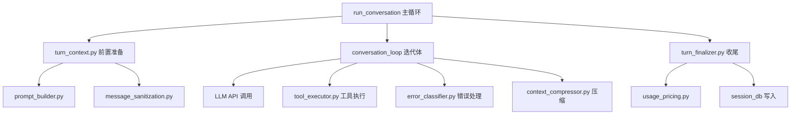
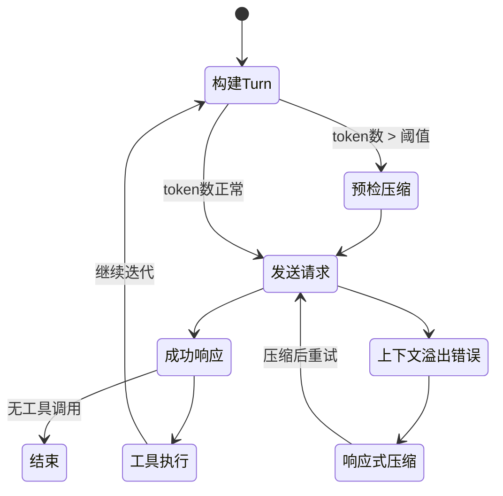
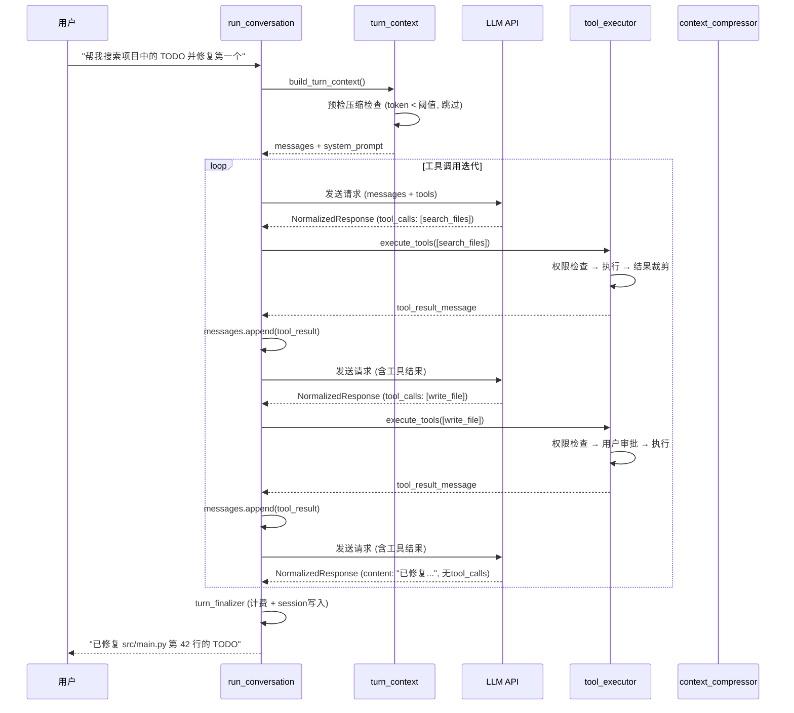

# Agent 主循环

## 读前思考

- 一个 Agent 的对话循环看起来很简单——收消息、调 LLM、执行工具、返回结果。但如果工具执行失败、上下文窗口快满了、模型返回空响应、用户中途按了 Ctrl+C，你该怎么处理？这些异常路径的代码量会远超"正常路径"吗？
- 如果一个文件已经膨胀到 12000 行，你是该重写它，还是有办法在保持单一控制流的同时把职责拆出去？

## 核心问题

Agent 主循环解决的核心问题是：**如何在一个持续交互的对话中，可靠地驱动"LLM 推理 → 工具执行 → 结果回注"的迭代，同时处理上下文膨胀、错误恢复、并发中断等工程现实？**

Hermes 的主循环设计反映了它的定位——一个运行在用户本机、需要长时间持续工作的个人助手。它不是处理单次请求的 API 服务，而是一个需要管理多轮工具调用、跨 session 记忆、上下文压缩的有状态运行时。

| 维度 | Hermes 的选择 |
|------|--------------|
| 循环结构 | 单一控制流（run_conversation 6517 行）+ 模块化提取 |
| 宿主对象 | AIAgent God Object（run_agent.py 6914 行） |
| 上下文管理 | 自动压缩（中间轮次摘要）+ 预检压缩 |
| 错误恢复 | 5 级空响应恢复 + 分类学驱动重试 |
| 中断处理 | 线程级中断信号 + 优雅取消 |

## 方案展示

### 设计选择一：单体循环 + God-File Decomposition

Hermes 的核心对话循环 `run_conversation()` 保持在单一函数中（6517 行），没有拆分为多个状态机节点或中间件链。但它通过"God-File Decomposition"将前置准备（turn_context.py）、工具执行（tool_executor.py）、收尾处理（turn_finalizer.py）、错误分类（error_classifier.py）等职责提取为独立模块，主循环只负责编排调用顺序。

**为什么这么选**：Agent 循环的状态转换不是线性的——工具执行失败可能需要压缩上下文后重试，空响应可能需要 5 级递进恢复，用户中断可能发生在任何阶段。将这些逻辑保持在单一控制流中，避免了状态机方案中"状态爆炸"的问题（N 个阶段 × M 种异常 = N×M 个转换边）。提取出的模块是"被调用的子程序"而非"独立的状态节点"，主循环始终知道当前执行到哪一步。

**牺牲了什么**：6517 行的单函数极难做 code review——任何修改都需要理解整个函数的上下文。新人上手成本高。AIAgent 作为 God Object 承载了所有子系统的引用（credential_pool、memory_manager、curator 等），修改任何子系统都需要理解它与 AIAgent 的耦合方式。

### 设计选择二：自动上下文压缩

当对话历史的 token 数接近模型上下文窗口上限时，Hermes 自动触发压缩：选取中间轮次（保留最近 N 轮和最早的系统消息），调用辅助 LLM 对被选中的轮次生成摘要，用摘要替换原始消息。压缩有两个触发时机：Turn 开始前的"预检压缩"（防止请求发出后才发现溢出）和 API 返回 context_overflow 错误后的"响应式压缩"。

**为什么这么选**：个人助手场景的对话可能持续数十轮甚至上百轮工具调用，上下文膨胀是必然的。相比截断（直接丢弃旧消息），摘要压缩保留了关键信息的语义。使用辅助 LLM（通常是更便宜的模型）做摘要，主模型不需要感知压缩的存在。

**牺牲了什么**：压缩本身消耗 token 和时间（一次辅助 LLM 调用）。摘要不可避免地丢失细节——如果第 5 轮的某个文件路径在第 30 轮被引用，摘要可能没有保留它。此外，压缩后的消息字节与原始不同，会破坏 prompt cache 的前缀命中（所以 Hermes 有"反抖动压缩保护"——不在每次接近阈值时都压缩，而是留足余量避免频繁触发）。

### 设计选择三：5 级空响应恢复

模型有时返回空内容（content 为空字符串且无 tool_calls）。Hermes 不是简单重试，而是按 5 级递进策略恢复：(1) 检查是否是合法的 end_turn（模型确实无话可说）；(2) 检查是否是 refusal（Claude 4.5+ 的拒绝响应）；(3) 注入 "please continue" 提示重试；(4) 切换温度参数重试；(5) 放弃并告知用户。

**为什么这么选**：空响应的原因多样——可能是模型 bug、可能是 prompt 格式问题、可能是模型真的完成了任务。单一的重试策略要么浪费 token（对合法 end_turn 重试），要么过早放弃（对可恢复的格式问题直接报错）。递进策略以最小代价尝试最可能的修复。

**牺牲了什么**：5 级策略增加了代码路径复杂度。每级之间的判断条件需要针对不同提供商做适配（Anthropic 的 refusal 和 OpenAI 的 refusal 格式不同）。

## 核心机制执行流：一次多轮工具调用的完整迭代

以用户请求"帮我搜索项目中的 TODO 并修复第一个"为例：

**阶段一：Turn 前置。** `build_turn_context()` 组装完整的请求上下文。系统提示词包含身份定义、技能索引（只有名称和描述，不含完整内容）、上下文文件。消息消毒去除可能导致 API 报错的 surrogate 字符。如果 token 数已超过窗口的 75%，预检压缩先执行。

**阶段二：迭代体。** 主循环进入 while 循环，每次迭代：调用 LLM → 检查响应 → 如果有 tool_calls 则执行工具并将结果回注 messages → 继续下一次迭代。循环终止条件：(a) 响应无 tool_calls（模型完成回答）；(b) 达到最大迭代次数；(c) 用户中断。

**阶段三：工具执行。** tool_executor 判断执行策略——单个工具或含交互式工具走顺序执行，多个 parallel-safe 工具走并发执行。执行前经过 guardrail 检查（防止模型陷入重复调用同一工具的死循环）和权限审批（危险命令需要用户确认）。

**阶段四：收尾。** `turn_finalizer` 计算本轮 token 用量和费用，写入 session 数据库。如果配置了记忆提取，异步触发 memory_manager 从对话中提取值得记住的信息。

**边界路径——上下文溢出：** 如果阶段二中 LLM 返回 context_overflow 错误，主循环调用 `context_compressor` 压缩中间轮次，然后用压缩后的 messages 重新进入迭代。压缩有"反抖动保护"——如果上一轮刚压缩过（token 数仍然超限），说明是单条消息过大而非历史过长，此时走截断而非再次压缩。

**边界路径——用户中断：** 用户按 Ctrl+C 或发送 /stop 时，中断信号通过 `tools/interrupt.py` 的 per-thread ident 集合传播。顺序执行中，剩余 tool_call 被跳过并生成 cancelled 结果；并发执行中，未启动的 future 被取消，运行中的线程收到 interrupt 信号后有 3 秒优雅退出期。

## 系统提示词结构

Hermes 的 system prompt 由 agent/system_prompt.py 的 build_system_prompt_parts() 组装，采用三层（tiers）架构，设计目标是前缀缓存友好：stable 层会话内字节稳定，context 层会话级稳定，volatile 层每次构建可变。三层以 \n\n 拼接为最终字符串。

**Tier 1: stable（身份 + 行为指导，18 个组件）：**

| 序号 | 部分 | 核心内容 | 条件 |
|------|------|---------|------|
| 1 | Agent Identity | " You are Hermes Agent, an intelligent AI assistant created by Nous Research..."，可由 ~/.hermes/SOUL.md 完全覆盖 | 始终 |
| 2 | Help Guidance | 指向 hermes-agent 文档 URL + skill_view 提示 | 始终 |
| 3 | Task Completion | 交付真实工件，不写 stub/计划就停，不伪造输出 | 有工具时 |
| 4 | Parallel Tool Call | 独立工具调用合并到一个 turn，减少 round-trip | 有工具时 |
| 5 | Tool-specific Guidance | memory/skills/kanban/session_search 各工具的使用规范 | 按工具存在性注入 |
| 6 | Steer Channel Note | mid-turn 用户消息的 [OUT-OF-BAND] 标记格式 | 有工具时 |
| 7 | Computer Use | 桌面控制工具操作流程、安全规则（按 macOS/Windows/Linux 渲染） | 仅 computer_use 工具存在 |
| 8 | Nous Subscription | 订阅功能状态（web tools、image gen、TTS 等） | 仅 managed_nous_tools |
| 9 | Tool-Use Enforcement | "必须用工具执行，不要只描述意图" | 按模型名匹配（gpt/gemini/grok/qwen 等） |
| 10 | Model-specific Guidance | Google/OpenAI 模型专用操作指南 | 按模型名 |
| 11 | Skills Index | "## Skills (mandatory)" + 按分类列出所有可用 skill | 扫描技能目录 |
| 12 | Environment Hints | Host OS / home / cwd / WSL / Windows bash 提示 | 按运行环境 |
| 13 | Coding Posture | 编码操作简报 + git 分支/状态/最近提交快照 + edit-format 建议 | 仅代码工作区 + 交互平台 |
| 14 | Environment Probe | Python/pip/uv 工具链非默认状态描述 | 仅非默认时 |
| 15 | Active Profile | 当前 Hermes profile 名 + 跨 profile 写保护 | 按活跃 profile |
| 16 | Platform Hint | 各通信平台的格式/能力说明（telegram/discord/cli/tui 等 20+） | 按 agent.platform |

**Tier 2: context（项目上下文，会话级稳定）：**

| 部分 | 核心内容 |
|------|----------|
| Caller system_message | 调用方传入的自定义指令（可选） |
| Project Context Files | 按优先级发现并加载一个：.hermes.md > AGENTS.md > CLAUDE.md > .cursorrules；有截断上限（默认 20K chars），经 threat scan 过滤注入攻击 |

**Tier 3: volatile（每次构建可变）：**

| 部分 | 核心内容 |
|------|----------|
| Memory Snapshot | 用户持久记忆（偏好、环境细节、约定） |
| USER.md Profile | 用户画像 |
| External Memory Provider | 第三方记忆插件的 prompt block |
| Timestamp/Session/Model | 对话开始时间、模型名、Provider 名 |

**缓存策略：** 系统提示词构建一次后缓存起来，整个 session 复用，仅上下文压缩事件或模型切换才触发重建。另有一条不进缓存、不落库的临时系统提示词通道，用于批处理/数据生成场景注入一次性指令。

## 工程优化

**Prompt 缓存不变量**：`api_content` sidecar 机制为每条消息维护一份"发送给 API 的精确字节"副本。下一轮重放时使用这份副本而非重新序列化，确保字节级一致性。Anthropic 和 OpenAI 的 prompt cache 是前缀匹配的——只要前 N 条消息的字节与上次请求完全相同，就能命中缓存，节省 90% 的输入 token 计费。

**反抖动压缩保护**：不在每次 token 数接近阈值时都触发压缩。如果两次压缩间隔小于 N 轮，说明问题不是历史过长而是单条消息过大，此时改用截断策略。这避免了"压缩→仍然超限→再压缩"的无限循环。

**空响应的提供商感知**：Anthropic 的 `end_turn` stop_reason 表示合法的"无话可说"，不应触发恢复策略。Claude 4.5+ 的 `refusal` stop_reason 表示模型拒绝回答，需要向用户展示拒绝原因而非重试。这些判断在 `validate_response()` 中按提供商分支处理。

**增量 session 持久化**：每次工具执行完毕后立即将新消息写入 session 数据库（`_flush_session_db_after_tool_progress()`），而非等整个 turn 结束。如果进程在工具执行中途崩溃，下次启动可以从最后一个 checkpoint 恢复，而非丢失整个 turn 的进度。

## 面试要点

**问题一：为什么保持 6517 行的单函数而不是拆成状态机或中间件链？**

核心权衡是"控制流可见性 vs 模块化"。状态机方案（如 LangGraph）将每个阶段建模为节点，转换边显式声明——好处是可以可视化、可以单独测试每个节点。坏处是状态爆炸：Agent 循环的异常路径太多（工具失败、压缩、中断、空响应、fallback），每增加一种异常就要增加多条转换边，最终状态图比单函数更难理解。Hermes 的选择是"保持单一控制流 + 子程序提取"——主循环像一本目录清晰的书，每个章节（子程序）可以独立阅读，但阅读顺序是确定的。这在 12K LOC 规模下是务实的选择，但如果团队超过 5 人同时修改这个函数，合并冲突会成为严重问题。

**问题二：上下文压缩的"摘要替换"方案在什么场景下会出问题？有更好的替代吗？**

摘要丢失细节是固有问题。典型失败场景：第 3 轮工具返回了一个文件路径列表，第 20 轮模型需要引用其中某个路径——摘要大概率不会保留完整列表。替代方案：(a) 分层记忆——将工具结果中的结构化数据（路径、变量名）提取为"事实"存入独立存储，压缩时只压缩自然语言部分；(b) 滑动窗口 + 关键帧——保留最近 N 轮完整消息 + 每 K 轮一个关键帧（完整快照），而非全部压缩为摘要。Hermes 没有采用这些方案，因为实现复杂度显著增加，且辅助 LLM 的摘要质量在大多数场景已经够用。

**问题三：AIAgent 作为 God Object 承载所有子系统引用，这个设计的长期风险是什么？**

短期收益明显：任何子系统都可以直接访问其他子系统（memory_manager 需要 credential_pool、curator 需要 auxiliary_client），不需要复杂的事件总线或依赖注入。长期风险：(a) 测试困难——mock 一个子系统需要构造完整的 AIAgent；(b) 并发风险——gateway 场景下多个 session 共享一个 AIAgent 实例，任何可变状态都是竞态条件源；(c) 重构阻力——拆分子系统时需要处理大量交叉引用。Hermes 的缓解措施是将 AIAgent 视为"依赖容器"而非"逻辑容器"——逻辑在独立模块中，AIAgent 只持有引用和转发调用。
