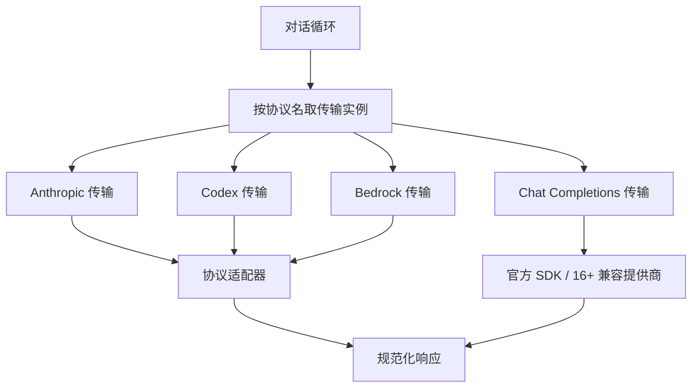
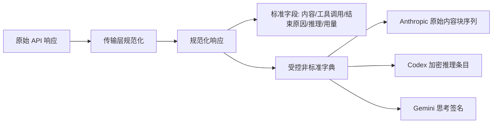
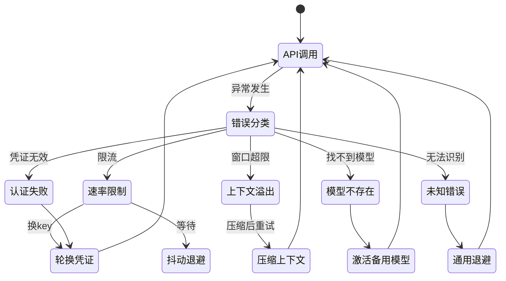
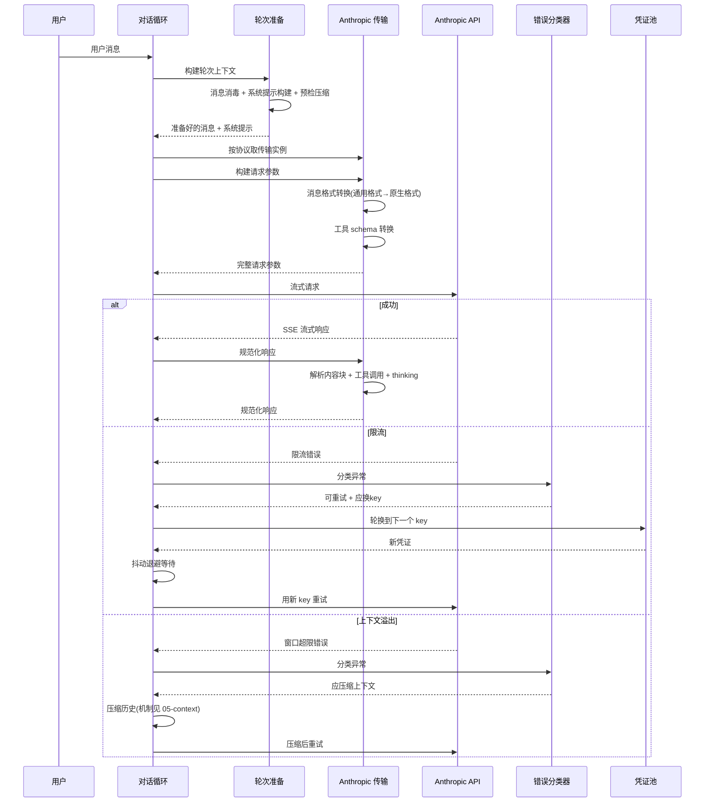

# 模型接入层

## 读前思考

- 如果你需要同时支持 Anthropic、OpenAI、AWS Bedrock、Gemini、Codex 五种协议完全不同的模型 API，且提供商数量还在增长，你会怎么设计抽象层？是在调用点写协议分支，还是把差异封装到某个统一接口后面？
- 当某个提供商返回限流错误时，你是该立即重试、换一个 API key、还是切换到备用模型？这三种策略能共存吗？谁来统一决定走哪条？

## 核心问题

模型接入层解决的核心问题是：**如何让上层对话循环完全不感知底层 API 协议差异，同时在错误发生时自动选择最优恢复策略。**

hermes-agent 的定位是"个人全能助手"，需要接入尽可能多的提供商（30+），且用户可能同时配置多个 API key 和备用模型。这决定了它的接入层必须同时解决两个问题：协议差异的屏蔽和故障时的自动恢复。

| 维度 | hermes-agent 的选择 |
|------|--------------------|
| 协议覆盖 | 5 种原生协议（Anthropic Messages、Chat Completions、Responses、Bedrock 会话式、Gemini 原生） |
| 抽象模式 | Transport 策略模式 + 导入时自动注册表 |
| 响应规范化 | 统一结构 + 非标准字段受控字典 |
| 错误恢复 | 分类学驱动（20+ 种错误枚举、四维恢复提示） |
| 凭证管理 | 凭证池（多 key 轮换 + 冷却 + 失效标记） |
| 结构化输出 | 插件补全通道支持 JSON 模式与 schema 校验 |
| 辅助调用 | 独立轻量客户端，压缩/摘要/视觉任务复用同一套传输 |

## 方案展示

### 设计选择一：Transport 策略模式 + 注册表

hermes-agent 没有在对话循环中写协议分支，而是把每种协议封装为一个独立的传输类。所有传输实现同一个抽象基类的四个方法：构建请求参数、规范化响应、转换消息格式、转换工具 schema（源码：ProviderTransport）。传输在模块导入时自动注册到全局注册表，对话循环按协议名一行代码取到对应实例。新增提供商只需写一个传输文件，对话循环零修改。

**为什么这么选**：提供商数量动态增长（MiniMax、小米 MiMo、腾讯 TokenHub 等不断加入），协议分支会随提供商数量线性膨胀。策略模式让新增提供商的成本从"修改核心循环"降为"添加一个文件"。

**牺牲了什么**：每个传输是薄委托层，真正的转换逻辑在独立的适配器大文件中，形成双层间接——调试一个 Anthropic 格式问题需要跳转两个文件。此外取传输实例返回空时允许回退旧代码路径，系统中同时存在新旧两套调用逻辑。

### 设计选择二：规范化响应 + 非标准字段受控出口

所有提供商的响应被规范化为统一结构，包含内容、工具调用、结束原因、推理内容、用量五个标准字段。但协议特有的状态——Anthropic 带签名的 thinking 块、Codex 的加密推理条目、Gemini 的思考签名——无法用共享字段表达，这些被放进规范化响应里的一个受控字典（源码：NormalizedResponse 的 provider_data 字段）。

**为什么这么选**：对话循环的四十多个调用点只读标准字段，不需要知道协议细节。但 Anthropic 的 thinking 块签名必须在回放时保持原始顺序（否则 API 直接拒绝请求），Codex 的加密内容必须按发行方过滤——这些信息必须有地方存。受控字典让标准路径保持简洁，特殊路径有出口。

**牺牲了什么**：这个字典是无类型的，新字段的消费者必须知道键名，没有编译期检查。工具调用对象上保留了一个向后兼容的自引用属性，属于语义上的历史包袱。

### 设计选择三：错误分类学驱动恢复策略

hermes-agent 定义了一个错误原因枚举（20+ 种），分类函数把任意异常映射为携带四个布尔恢复提示的结构：是否可重试、是否应压缩上下文、是否应换 key、是否应切换模型（源码：classify_api_error）。重试循环只读这些提示，不再自己解析错误字符串。

**为什么这么选**：之前是散落在各处的内联字符串匹配（在错误文本里搜"rate limit"字样），同一错误在不同代码路径有不同处理，新增错误类型要改多处。集中分类后，新增错误只需在一处添加规则，所有调用方自动获得正确行为。

**牺牲了什么**：分类器本身是上千行的规则库，需要持续维护；未知兜底类型意味着未分类错误仍走通用退避，可能不是最优策略，也无法覆盖所有提供商的错误格式变体。

### 设计选择四：结构化输出的双轨——插件通道正式支持，主循环不掺和

hermes-agent 的结构化输出能力挂在插件补全通道上（源码：plugin_llm 的 complete_structured）：插件发起补全时可声明 JSON 模式或交出一份完整的 JSON schema，接入层做三件事——

1. **请求侧**：在系统提示里追加"只输出单个 JSON 对象、不要散文和代码围栏"的指令，把 schema 序列化后附在用户消息里；对支持响应格式参数的提供商，通过附加请求体透传该参数。
2. **响应侧**：先剥离 markdown 代码围栏再解析 JSON；如果给了 schema，用 jsonschema 库做严格校验，校验不通过直接报"结构不匹配"错误；解析失败或模型拒绝时不报错，而是把内容类型标记为纯文本返回。
3. **结果形态**：同时返回原文文本和解析结果两个字段，外加内容类型标志，调用方自己决定信哪一份。

主对话循环则完全不使用 JSON 模式——对话响应的结构化靠工具调用通道完成，工具参数在规范化阶段一次性解析，不做流式增量解析。

**为什么这么选**：结构化需求主要来自插件侧的辅助任务（分类、抽取、评分），这类任务对失败敏感、需要可验证的结果；主循环面对的是开放对话，强行 JSON 化没有意义。把能力做成可选通道，声明了才启用，不污染通用路径。

**牺牲了什么**：schema 校验依赖可选库，库不在时静默跳过校验，调用方可能拿到"声称合法但未验证"的结果；JSON 指令写在提示里，模型仍可能不遵守，最终靠响应侧解析兜底。

## 核心机制执行流：一次完整的 API 调用

以用户发送一条消息、触发 Anthropic 模型调用为例：

**阶段一：轮次前置准备。** 轮次上下文构建做三件事：消息消毒（去除代理对残留等非法字符）、系统提示构建（身份/技能索引/上下文文件组装）、预检压缩（当前 token 数已接近窗口上限就先压缩再发请求）。每条消息发送给 API 的字节与上一轮保持完全一致——这是 prompt cache 前缀命中的必要条件。

**阶段二：格式转换。** 传输层把通用格式的消息和工具 schema 转换为目标提供商的原生格式。对 Anthropic 而言，系统消息从消息数组中提取为独立参数，工具结果需要嵌套在用户消息内。

**阶段三：流式调用与规范化。** 响应以 SSE 流式返回，规范化过程把原始内容块解析为统一响应结构。如果存在签名 thinking 块与工具调用块交错的顺序，原始块序列会被存入受控字典以保持回放顺序——签名对位置敏感，乱序回放会被 API 拒绝。

**阶段四：错误恢复。** 异常被分类后，对话循环根据布尔提示执行对应恢复策略。凭证池支持四种轮换策略（优先填满、轮询、随机、最少使用），被标记为失效的 OAuth token 在规定时间后自动清理。两条边界路径——限流走换 key 加退避，上下文溢出走压缩后重试——的恢复动作都由分类提示驱动，循环本身不含任何错误字符串判断。

## 工程优化

**懒加载 SDK（冷启动优化）**。两家官方 SDK 的导入耗时合计接近半秒，均不在模块顶层导入，而是在首次调用时懒加载并缓存。这让不需要 API 调用的命令（如查看帮助）启动速度提升近半秒。

**跨会话速率限制共享**。限流状态写入共享文件，所有会话（命令行、gateway、定时任务）在发请求前检查。这防止了每个会话独立重试导致的配额放大——三个会话各自重试三次，就是九次调用打到同一个限流端点。

**抖动退避防惊群**。退避等待用纳秒时间与计数器的组合做随机种子，确保多个并发会话的重试时间去相关。如果所有会话在同一秒收到限流又在同一秒重试，提供商会再次限流，形成恶性循环。

**凭证池的失效状态管理**。OAuth token 被提供商撤销后标记为失效，不再参与轮换；手动添加的失效条目在一天后自动清理，防止用户更换 token 后旧标记永久阻塞。凭证的多源管理与作用域隔离见 [09-guardrails](./09-guardrails.md)。

**持久事件循环**。辅助调用模块维护长生命周期事件循环而非每次调用创建即销毁。后者会导致缓存的异步客户端在垃圾回收时抛出"事件循环已关闭"错误。

## 面试要点

**1. 为什么选 Transport 策略模式而不是更简单的适配器函数（一个函数一个提供商）？**

策略模式的核心收益是开闭原则——新增提供商不修改核心循环。但代价是引入了注册表间接层和双层委托（传输层到适配器文件）。如果提供商数量固定在两三个，适配器函数更简单直接。hermes-agent 面对的是 30+ 提供商且持续增长的场景，策略模式的维护成本摊薄后低于协议分支的修改风险。判断标准是"提供商数量预期 × 协议差异是否大于参数差异"：超过五个且差异是结构性的，策略模式值得；否则一个带配置的多路复用函数就够了。

**2. 错误分类学方案在什么情况下会失效？你会怎么改进？**

分类学假设错误可以被有限枚举覆盖。失效场景有二：新提供商返回的错误格式不在规则库中（走未知兜底）；同一 HTTP 状态码在不同提供商含义不同（400 可能是参数错误也可能是上下文溢出）。改进方向是让分类器支持插件式规则注册——每个传输自带自己的分类规则，而非全局一个规则库。代价是分散后难以保证全局一致性，某个传输的规则可能与其他传输冲突。判断标准是"错误空间的稳定性 × 提供商增长速度"。

**3. 非标准字段受控字典的设计边界在哪？什么时候该把字段"毕业"为标准字段？**

判断标准是"写入方数量 × 读取方数量"：如果某个字典字段被三个以上传输写入、且对话循环中有两个以上调用点读取，它就应该毕业为规范化响应的标准字段。推理内容字段就是这样毕业的——最初只有 Anthropic 有 thinking，后来 Gemini 和 Codex 也有了。受控字典的价值在于降低引入新协议特性的成本：新特性不需要立即修改公共接口，等到模式稳定后再固化。
