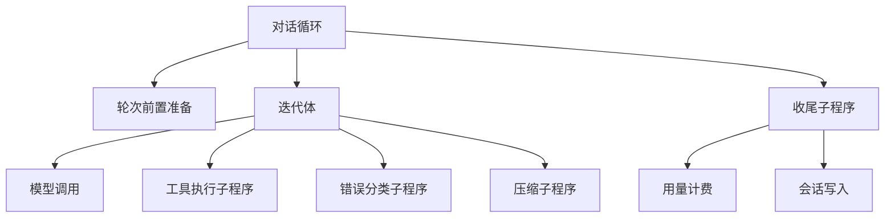
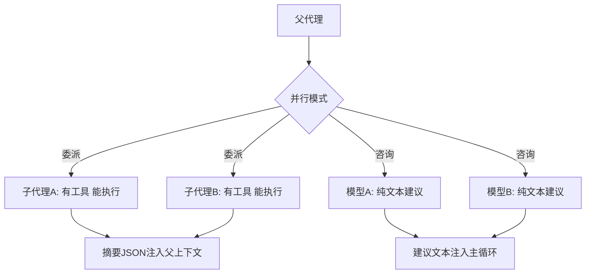
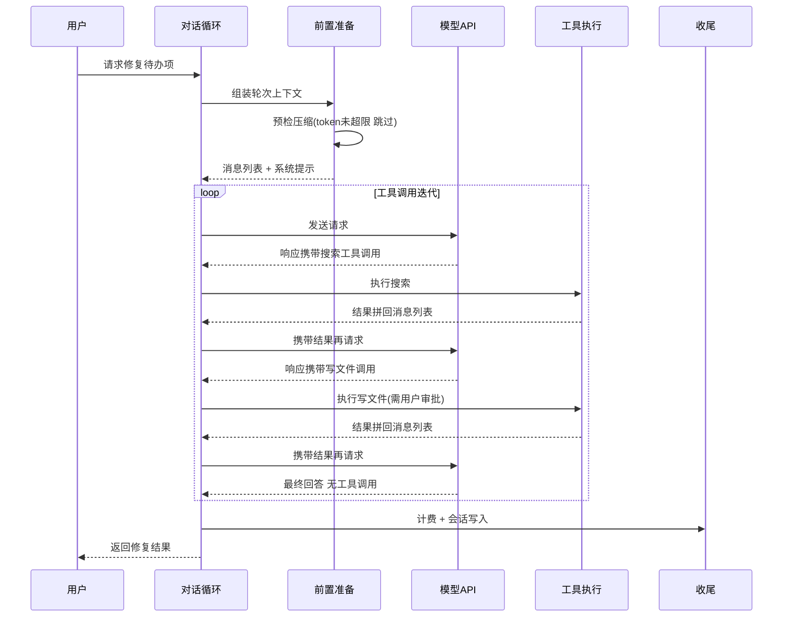

# 编排与主循环

## 读前思考

- 对话循环的正常路径只有四步，但异常路径有一长串：工具失败、上下文快满、模型返回空响应、用户中途按键中断。这些异常该建模成状态机的转换边，还是保持在单一控制流里？如果状态机的阶段数和异常数相乘后转换边爆炸，你还有别的选择吗？
- 把复杂任务拆给子代理时，"让多个模型只出主意不动手"和"让一个子代理独立干完活"看起来都是并行调用多个模型，它们的边界应该画在哪？子代理该继承父代理的哪些东西？

## 核心问题

编排与主循环解决的核心问题是：**在长时间持续交互的运行时中，可靠驱动"推理 → 工具执行 → 结果回注"的迭代，处理空响应与上下文膨胀等工程现实，并把复杂任务拆分委派出去。**

hermes-agent 的定位是运行在用户本机、需要长时间工作的个人助手，不是处理单次请求的服务。它的主循环用单一控制流承载所有异常路径，调度侧则用"委派 + 咨询"双模式覆盖两类不同的并行需求。

| 维度 | hermes-agent 的选择 |
|------|--------------------|
| 循环结构 | 单一控制流（对话循环函数约六千行）+ 子程序提取 |
| 宿主对象 | 代理主对象持有所有子系统引用，充当依赖容器 |
| 终止判断 | 最大迭代次数硬限制 |
| 错误恢复 | 空响应五级递进 + 提供商感知 + 分类学驱动重试 |
| 调度 | 委派（有工具能执行）与咨询（纯文本建议）双模式 |
| 中断 | 线程级中断信号 + 优雅取消 |

## 方案展示

### 设计选择一：单体循环 + 子程序提取

核心对话循环（源码：run_conversation）保持在单一函数中，不拆状态机节点也不拆中间件链。职责通过子程序提取出去：轮次前置准备、工具执行、收尾处理、错误分类、压缩各自是独立模块，主循环只编排调用顺序。主对象持有凭证池、记忆管理、技能管理等所有子系统的引用，充当依赖容器——逻辑在独立模块中，主对象只持有引用与转发调用。

**为什么这么选**：Agent 循环的状态转换不是线性的——工具失败可能需要压缩后重试，空响应需要多级递进恢复，中断可能发生在任何阶段。状态机方案要把这些建模为"N 阶段 × M 异常"条转换边，状态图比单函数更难读。保持单一控制流，每个异常分支都按确定顺序排列可读；提取出的模块是被调用的子程序而非独立状态节点，主循环始终知道当前执行到哪一步。**牺牲了什么**：六千行单函数极难做代码评审，新人上手成本高；主对象作为依赖容器让任何子系统的修改都要理解它与整体的耦合方式，多会话共享实例时可变状态都是竞态来源。

### 设计选择二：五级空响应恢复与提供商感知

模型有时返回空内容（无文本也无工具调用）。hermes-agent 不做简单重试，而是五级递进：先判断是否是合法的"无话可说"（模型确实完成了），再判断是否是拒绝回答（需要向用户展示拒绝原因而非重试），然后注入"请继续"提示重试，再切换采样参数重试，最后才放弃并告知用户。递进的每一级都按提供商分支适配——不同提供商对"合法结束"与"拒绝"的信号格式不同，恢复前先识别提供商语义。

**为什么这么选**：空响应的原因多样，单一重试策略要么浪费 token（对合法结束做重试），要么过早放弃（对可恢复的格式问题直接报错）。递进策略按"最可能的修复代价最小"排序试探。**牺牲了什么**：五级路径增加代码复杂度，每级的判断条件都要针对提供商做适配和维护。

压缩在循环中的位置：轮次开始前做一次预检（估算超阈值就先压缩再发请求），请求收到上下文溢出错误后做响应式压缩再重试。压缩本身消耗一次辅助模型调用、不占用对话轮次；保留策略、摘要形态、防抖与缓存对抗的完整机制见 05-context。

### 设计选择三：委派与咨询双模式调度

hermes-agent 有两种并行机制，都用线程池扇出，但结果使用方式完全不同。委派模式（源码工具：delegate_task）创建的子代理是完整代理实例：有工具、能执行、独立完成任务，有独立的对话历史、会话存储、终端环境；同时继承父代理的工具集（取交集语义——父代理禁用的工具子代理也不能用）、凭证池（共享引用而非复制，父代理的密钥轮换对子代理立即生效）与降级链。关键约束是子代理被标记为跳过记忆写入——多个子代理并发写共享记忆会产生竞态。咨询模式（多模型并行分析）中多个模型只返回纯文本分析、不能调用工具，结果作为建议文本注入主循环，主代理综合多个观点后自己决策。

**为什么这么选**：委派适合"可独立完成的子任务"（搜代码、写文件），咨询适合"需要多视角的决策"（方案评估、风险分析）——后者不需要为工具、会话、终端付出开销。咨询模式更安全（不能执行危险操作）但能力更有限（不能实际验证方案）。**牺牲了什么**：两套并行机制的维护成本；子代理看不到父对话历史，需要背景信息时父代理必须写进任务描述；子代理的执行经验因跳过记忆写入而不会被记住（记忆注入策略见 06-memory）。

## 核心机制执行流：一次多轮工具调用的完整迭代

以用户请求"搜索项目中的待办项并修复第一个"为例：

**阶段一：轮次前置。** 组装完整请求上下文：系统提示（身份、技能索引、环境信息，三层结构见 05-context）、消息消毒（去除会导致 API 报错的非法字符）。若 token 数已超过窗口阈值的大半，预检压缩先执行。

**阶段二：迭代体。** 每次迭代：调模型 → 检查响应 → 有工具调用则执行并把结果拼回 → 进入下一轮。终止条件有三个：响应无工具调用（模型完成回答）、达到最大迭代次数、用户中断。

**阶段三：工具执行。** 执行器判断策略——单个工具或含交互工具的顺序执行，多个并发安全工具走并行。执行前有防重复调用的守卫与权限审批（危险命令需用户确认，审批机制归 09-guardrails）。

**阶段四：收尾。** 计算本轮用量与费用，写入会话存储（工具执行后立即增量落盘、崩溃后可从最后进度恢复的机制见 04-state），必要时异步触发记忆提取。

**边界路径——上下文溢出**：模型返回溢出错误时，循环调用压缩子程序压缩中间轮次后重试；若刚压缩过仍然超限，说明是单条消息过大而非历史过长，改走截断而非再次压缩（防抖与降级细节见 05-context）。

**边界路径——用户中断**：用户按键或发送停止命令时，中断信号按线程传播。顺序执行中剩余工具调用被跳过并生成取消结果；并发执行中未启动的任务被取消，运行中的线程收到信号后有短暂的优雅退出期。

## 子代理提示词结构

子代理不使用独立的系统提示文件，而是继承父代理缓存好的系统提示，加上任务专用的用户消息：

| 组件 | 内容 |
|------|------|
| 继承的系统提示 | 父代理已缓存的完整提示（身份、技能索引、环境） |
| 任务描述 | 委派时生成的具体指令，作为子代理第一条用户消息 |
| 看板引导段 | 仅在任务环境变量存在时注入的看板任务协议 |
| 后台审查提示 | 派生代理继承父提示，用户消息为专用审查指令 |

工具集取交集保证安全策略的传递性；子代理不能再创建子代理，嵌套默认只允许一层。

## 工程优化

**空响应的提供商感知**：恢复前先识别提供商语义——某提供商的"结束"停止原因表示合法完成，不该触发恢复；"拒绝"停止原因表示模型拒答，应展示原因而非重试。这些判断按提供商分支处理，避免把正常结束当成故障浪费 token。

**凭证共享而非复制**：子代理引用父代理的凭证池对象，任何一方的限流触发密钥轮换后，另一方的后续请求立即使用新密钥——轮换在委派树内全局生效。

**守护线程加超时强制终止**：子代理运行在守护线程中，父进程退出时自动终止；每个任务有独立超时，超时后取消任务并向子代理发送中断信号。已完成的文件修改保留不回滚，但子代理可能停在半完成状态。

**文件边界的竞态缓解**：两个子代理可能同时修改同一文件，缓解手段是任务描述中明确划分目录边界，但没有文件级锁——边界没划清时竞态仍可能发生。这是委派模式"无中间通信"的固有代价。

## 面试要点

**1. 为什么保持六千行的单函数而不拆状态机或中间件链？这个选择在什么条件下会失败？**

参考答案方向：核心权衡是控制流可见性与模块化。状态机的好处是节点可单独测试、转换边显式可见，坏处是异常路径太多时每增加一种异常就增加多条转换边，状态图反而更难理解。单体循环加子程序提取让主循环始终知道执行到哪一步，每个章节可独立阅读但顺序确定。失败条件是团队规模——超过五人同时修改这个函数，合并冲突会成为主要成本，此时应向中间件链迁移。判断标准是"异常路径交互密度 × 并行修改人数"。

**2. 委派（有执行能力）和咨询（只出建议）在什么场景下应互相替代？有没有两者都不适合的场景？**

参考答案方向：委派适合可独立执行的明确任务，咨询适合需要多视角的决策。两者都不适合的是需要紧密协作的并行任务——两个子代理需要频繁交换中间结果时，委派的隔离性阻断了中间通信，咨询又无法执行操作。这种场景需要共享工作区加多轮协调的更复杂编排。判断标准是"子任务间是否需要运行时通信"：不需要就委派或咨询，需要就升级到共享状态编排。

**3. 子代理"隔离但继承"的边界画在哪？继承太多或太少各会怎样？**

参考答案方向：继承太多（如完整对话历史）会挤占子代理的任务空间，还可能让它把父代理的闲聊误当任务上下文；继承太少（如凭证）则每个子代理都要重复配置，启动开销和配置复杂度上升。hermes-agent 的边界是"继承配置、隔离状态"：凭证、工具集、降级链这类不随对话变化的配置项继承，对话历史、记忆这类随对话变化的状态项隔离。跳过记忆写入是这条边界的延伸——记忆是跨会话共享状态，并发写入有竞态。判断标准是"继承项随对话变化与否"。
