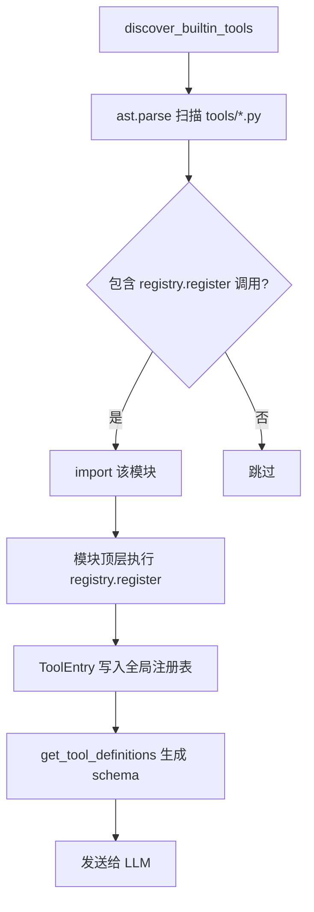
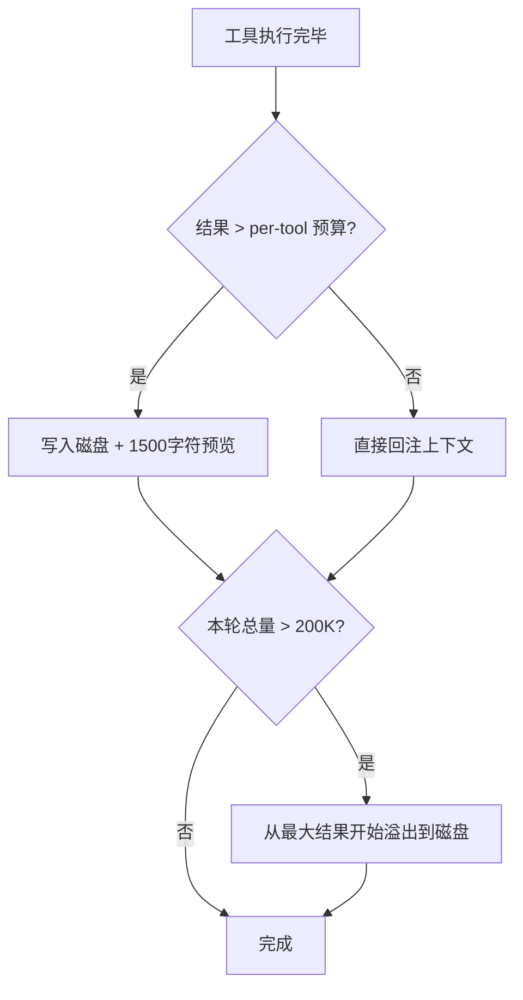
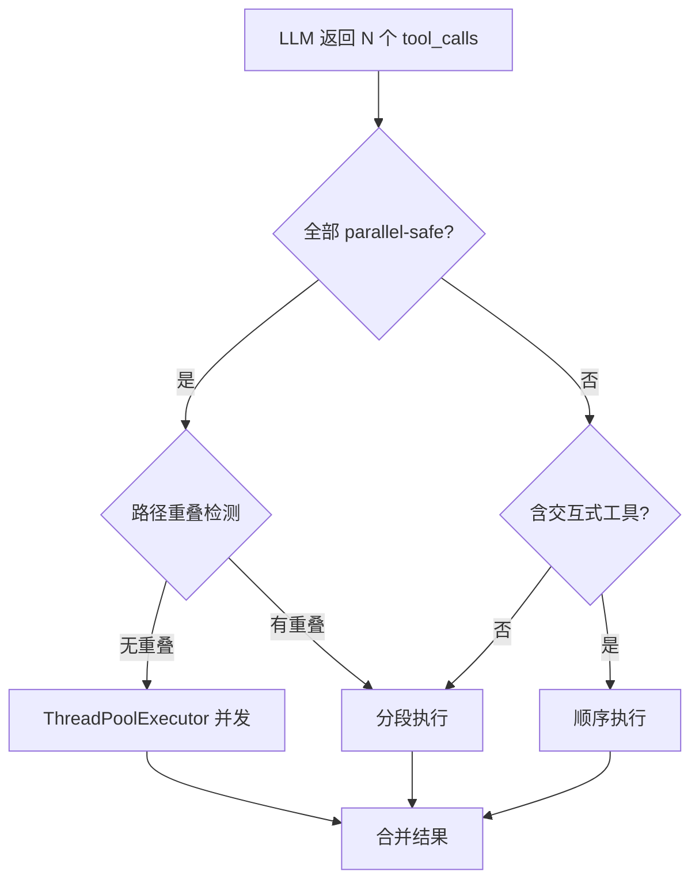
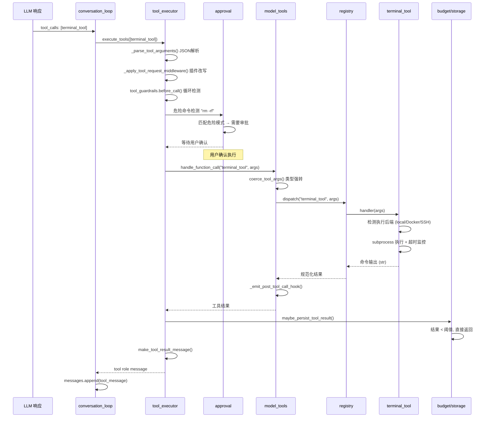

# 工具系统

## 读前思考

- 如果一个 Agent 有 100+ 个工具，你是该在启动时全部加载（简单但慢），还是按需发现（快但复杂）？如果选按需发现，怎么让 LLM 知道有哪些工具可用？
- 工具执行返回了 500KB 的输出（比如 grep 搜了整个项目），直接塞进上下文窗口会怎样？你会在哪个环节做截断——工具内部、调度层、还是回注消息前？

## 核心问题

工具系统解决的核心问题是：**如何将 LLM 输出的结构化 tool_call 意图，安全、可靠地路由到 100+ 个异构工具 handler 执行，并将结果控制在上下文窗口可承受的范围内？**

Hermes 的工具系统反映了它"个人全能助手"的定位——工具覆盖终端操作、文件 I/O、Web 搜索、浏览器自动化、子代理委派、记忆操作等全部桌面场景。工具数量多、执行环境异构（本地/Docker/SSH/云端）、安全要求高（用户本机执行），这三个约束共同塑造了它的设计。

| 维度 | Hermes 的选择 |
|------|--------------|
| 发现机制 | 自注册 + AST 静态扫描 |
| 执行策略 | 顺序/并发/分段三种模式 |
| 结果控制 | 三层预算体系（per-tool → per-result → per-turn） |
| 安全 | 危险命令审批 + YOLO 模式冻结 + guardrail 循环检测 |
| 工具集 | 30+ 平台 bundle，递归解析 + 环检测 |

## 方案展示

### 设计选择一：自注册 + AST 静态扫描发现

每个工具文件在模块顶层调用 `registry.register()` 完成注册。启动时，`discover_builtin_tools()` 不是盲目 import tools/ 下所有文件，而是用 `ast.parse` 扫描每个 .py 文件的 AST，只导入那些包含顶层 `registry.register()` 调用的模块。

**为什么这么选**：消除中心化清单的维护负担——新增工具只需写文件，无需修改任何索引。AST 预筛（而非 import all）避免导入无工具注册的辅助模块（如 environments/base.py），减少启动副作用和导入失败风险。100+ 个工具文件中，实际注册工具的可能只有 70 个，其余是辅助代码。

**牺牲了什么**：注册发生在 import time，模块级异常会静默丢失工具（只记 warning 不 crash）。AST 检测只识别字面 `registry.register()` 模式，动态注册或条件注册无法被发现。如果一个工具文件因为缺少可选依赖而 import 失败，该工具会静默消失，用户可能不知道。

### 设计选择二：三层结果预算体系

工具结果的大小控制分三层递进：Layer 1 是工具内部自行截断（如 search_files 限制输出行数）；Layer 2 是 `maybe_persist_tool_result()` 按注册表中的 max_result_size 阈值将超限结果写入磁盘，内联只保留 1500 字符预览；Layer 3 是 `enforce_turn_budget()` 在一轮所有工具完成后，若总量超过 200K 字符，从最大结果开始溢出到磁盘。

**为什么这么选**：小上下文模型（65K token 窗口）一个 100K 字符的工具结果就能撑爆。三层递进保证无论工具作者是否自觉做了截断，上下文都不会溢出。per-tool 预算按模型上下文窗口比例缩放（`budget_for_context_window()`），大窗口模型允许更大的单条结果。

**牺牲了什么**：磁盘 I/O 开销（每个超限结果一次写入）。模型需要额外 read_file 轮次才能获取完整输出，增加了交互延迟和 token 消耗。`read_file` 被 pin 为永不 persist（预算无穷大），防止 persist→read→persist 的无限循环。

### 设计选择三：并发执行 + 安全判定

当 LLM 一次返回多个 tool_calls 时，tool_executor 判断执行策略：如果所有工具都在 `_PARALLEL_SAFE_TOOLS` 白名单中且操作路径不重叠，走并发执行（ThreadPoolExecutor）；如果含交互式工具（需要用户输入），走顺序执行；混合情况走分段执行（先并发安全工具，再顺序执行不安全的）。

**为什么这么选**：并发执行多个独立工具（如同时搜索 3 个文件）可以将延迟从串行的 3×T 降为 T。但并发写同一文件会竞态，并发执行需要用户审批的工具会阻塞线程池。安全判定让系统在"能并发就并发"和"不能并发就退化为顺序"之间自动切换。

**牺牲了什么**：`_PARALLEL_SAFE_TOOLS` 是硬编码白名单，新增工具需要手动标注。路径重叠检测是启发式的（基于参数字符串匹配），无法覆盖所有竞态场景（如两个工具通过不同路径访问同一文件）。并发执行中某个工具超时时，已完成工具的结果保留，超时工具生成 timeout 结果——但无法回滚已执行工具的副作用。

## 核心机制执行流：一次工具调用的完整生命周期

以 LLM 发出 `terminal_tool(command="rm -rf /tmp/build")` 为例：

**阶段一：解析与中间件。** tool_executor 首先解析 LLM 输出的 JSON 参数。如果参数是非法 JSON，直接返回结构化错误消息，工具不执行。然后经过插件中间件链——插件可以改写参数（tool_request_middleware）、拦截执行（pre_tool_call block）、或自动批准（pre_tool_call approve）。

**阶段二：安全审批。** `tools/approval.py` 对命令做危险模式匹配（rm -rf、sudo、chmod 777 等）。匹配到危险模式时，通过 ContextVar 隔离的 per-session 审批状态决定是否询问用户。YOLO 模式（环境变量 `HERMES_YOLO=1`）在 import time 冻结，运行时 skill 无法通过 os.environ 注入绕过。

**阶段三：执行。** `registry.dispatch()` 查找 ToolEntry，根据 is_async 标志决定同步调用还是通过 `_run_async()` 桥接异步调用。terminal_tool 支持多后端（local subprocess、Docker container、Modal cloud、SSH remote），根据配置选择执行环境。执行过程中轮询中断信号（`is_interrupted()`），用户取消时优雅终止子进程。

**阶段四：结果处理。** 结果经过预算检查（超限写磁盘）、格式规范化（非 str 结果转为 error JSON）、错误消毒（剥离可能的 prompt injection 内容）后，构造为 tool role message 回注对话上下文。

## 工程优化

**check_fn 瞬态失败抑制**：工具注册时可以附带 `check_fn`（如检查 Docker daemon 是否运行）。check_fn 有 30s TTL 缓存 + 60s grace window——Docker daemon 短暂超时不会立即剥夺 terminal 工具，而是沿用上次成功结果。grace 过期后才真正降级。这防止了瞬态故障导致工具列表抖动。

**参数类型强转**：`coerce_tool_args()` 修复 LLM 常见的类型漂移——`"42"` → 42、`"true"` → True、裸标量 → [scalar]。这不是可选的优化而是必要的防御：LLM 经常把数字参数输出为字符串，如果工具 handler 不做类型检查就会 crash。

**Schema 消毒**：MCP server 返回的工具 schema 经常不规范（string 类型节点缺少 enum、object 缺少 properties、$ref 旁有兄弟键）。`sanitize_tool_schemas()` 在发送给 LLM 前修复这些问题，防止 Anthropic/llama.cpp 等严格后端拒绝请求。

**工具注册防覆盖**：跨 toolset 同名注册被拒绝（除非显式 override=True + 操作员 opt-in）。这防止插件静默替换内置工具——恶意插件不能注册一个同名 `terminal_tool` 来劫持所有命令执行。

**DaemonThreadPoolExecutor**：worker 线程为 daemon 线程，避免一个卡死工具（如无限等待网络响应）阻塞整个 Python 进程退出。主进程 Ctrl+C 后，daemon 线程随进程终止，无需显式 join。

## 面试要点

**问题一：为什么用 AST 扫描而不是更简单的 os.listdir + import all？**

import all 的问题不是性能（100 个文件的 import 也就几百毫秒），而是副作用。tools/ 目录下有辅助模块（environments/base.py、computer_use/ 下的平台特定文件），import 它们可能触发平台检测、依赖检查、甚至 GUI 初始化。AST 扫描只导入"确实注册了工具"的模块，将启动副作用最小化。代价是动态注册无法被发现——如果一个工具在 `if platform == "linux":` 条件下注册，AST 扫描看不到。Hermes 认为这是可接受的：需要平台条件的工具应该用 check_fn 而非条件注册。

**问题二：三层预算体系是否过度设计？一层（直接在回注前截断）不够吗？**

一层截断的问题在于"在哪截断"的决策权归属。如果只在回注前截断，工具作者无法控制截断位置（可能截掉关键信息）。如果只在工具内部截断，不自觉的工具作者会忘记。三层的设计是"每层解决不同问题"：Layer 1 让工具作者有语义感知的截断权（知道哪部分重要）；Layer 2 是系统级安全网（无论工具作者怎么做，单条结果不会超过阈值）；Layer 3 是全局安全网（即使每条都没超，总量也不能超）。如果只做一层，要么太粗（丢失信息），要么太细（每个工具都要自己算预算）。

**问题三：并发工具执行中，如果工具 A 创建了一个文件、工具 B 要读这个文件，但 A 和 B 被判定为 parallel-safe 并发执行了，怎么办？**

这是路径重叠检测的局限性。Hermes 的 `_PARALLEL_SAFE_TOOLS` 白名单只包含"读操作"或"幂等操作"（如 search_files、read_file），写操作（write_file、terminal_tool）默认不在白名单中。所以"A 写 B 读"的场景不会并发——A 是写操作，走顺序执行。真正的风险是两个 terminal_tool 并发执行时操作同一文件——但 terminal_tool 不在 parallel-safe 白名单中，也不会并发。启发式检测的盲区在于：两个"看起来安全"的工具通过间接路径（如环境变量、临时文件）产生依赖。这在实践中极少发生，Hermes 选择不为此增加更复杂的依赖分析。
