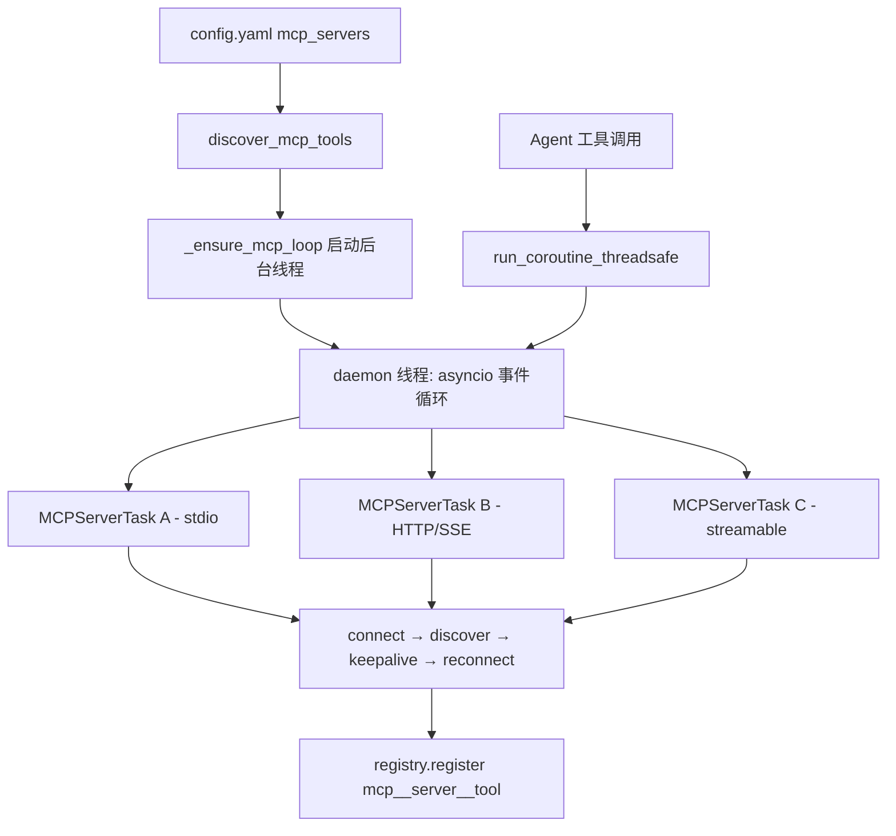
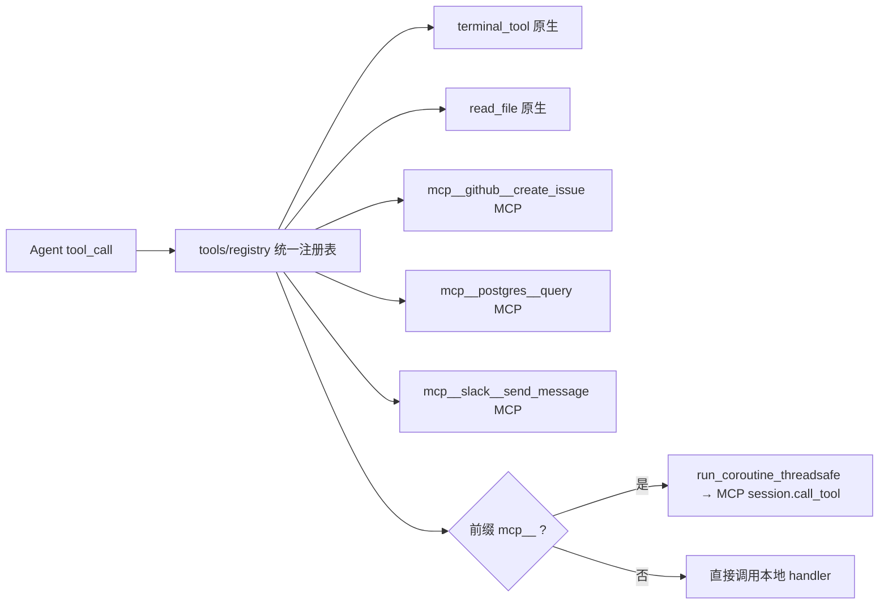
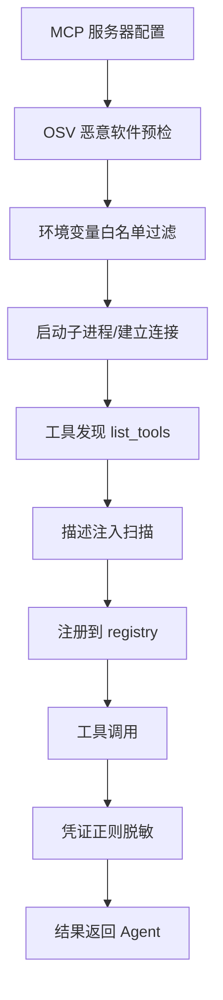

# MCP 集成

## 读前思考

- MCP 服务器可能随时崩溃、网络可能断开、子进程可能变成孤儿——如果你要同时管理 10 个 MCP 服务器的长连接，你会把连接管理放在主线程还是后台线程？连接断开后是立即重连还是等一等？
- MCP 工具和原生工具对 Agent 来说应该有区别吗？如果 Agent 不需要知道某个工具来自 MCP 还是本地，你需要在哪个层面做"透明化"？

## 核心问题

MCP 集成解决的核心问题是：**如何让 Agent 无缝使用外部 MCP 服务器提供的工具，同时管理好这些服务器的生命周期（连接、发现、重连、安全）？**

Hermes 的 MCP 集成是双向的——它既是 MCP 客户端（连接外部 MCP 服务器、使用它们提供的工具），也是 MCP 服务器（通过 mcp_serve.py 将自己的消息会话暴露给外部 MCP 客户端）。客户端侧是核心复杂度所在。

| 维度 | Hermes 的选择 |
|------|--------------|
| 连接管理 | 专用后台 asyncio 事件循环 + 每服务器独立 Task |
| 工具注册 | 统一注册表 + `mcp__<server>__<tool>` 命名空间前缀 |
| 传输协议 | stdio / HTTP+SSE / Streamable HTTP 三种 |
| 重连策略 | 指数退避 + 永久失败分类 + park/自探测 |
| 安全 | 环境变量白名单 + 凭证脱敏 + 描述注入扫描 + OSV 预检 |

## 方案展示

### 设计选择一：专用后台事件循环 + 每服务器独立 Task

所有 MCP 连接运行在一个共享的 daemon 线程 asyncio 事件循环（`_mcp_loop`）上，每个服务器是一个长生命周期的 asyncio Task（`MCPServerTask`）。工具调用通过 `run_coroutine_threadsafe()` 从同步的工具系统跨线程调度到异步的 MCP 连接上。



**为什么这么选**：anyio 的 cancel-scope 要求连接在同一个 Task 中打开和关闭，不能跨 Task 共享连接。每个服务器一个 Task 保证了连接的生命周期完整性。服务器之间互不阻塞——一个服务器的 keepalive 失败不影响其他服务器的正常工作。对调用方（同步的工具系统）完全透明——`run_coroutine_threadsafe()` 让同步代码可以等待异步结果。

**牺牲了什么**：跨线程复杂度——需要 `_lock` 保护共享状态，ContextVar 不自动传播到 asyncio Task（需要手动快照+重放）。stdio 是单 JSON-RPC 流，同一服务器的并发工具调用必须序列化（`_rpc_lock`），限制了吞吐量。

### 设计选择二：统一注册表 + 命名空间前缀

MCP 工具以 `mcp__<server>__<tool>` 格式注册到与原生工具相同的 `tools/registry`。Agent 的 tool-use 循环完全不需要知道某个工具来自 MCP 还是本地——它只看到统一的工具列表，调用时走统一的 dispatch 路径。



**为什么这么选**：零侵入——Agent 的对话循环和工具执行逻辑不需要任何 MCP 感知代码。冲突保护——双下划线前缀确保 MCP 工具永远不会覆盖内置工具（原生工具名不含双下划线）。动态性——MCP 服务器发送 `tools/list_changed` 通知时，可以热更新注册表（注册新工具或注销已删除工具）。

**牺牲了什么**：工具名变长（`mcp__github__create_issue`），消耗更多 token。用户配置错误时（如服务器名包含特殊字符），前缀解析可能出错。MCP 工具的 schema 质量不可控（外部服务器可能返回畸形 schema），需要额外的消毒步骤。

### 设计选择三：分层安全模型

MCP 工具运行在用户本机（stdio 子进程）或通过网络通信（HTTP），安全威胁面包括：secret 泄漏（子进程继承环境变量）、prompt injection（工具描述注入恶意指令）、供应链攻击（恶意 npm 包）。Hermes 对每种威胁有独立的防护层。



**为什么这么选**：stdio 子进程默认继承父进程的全部环境变量（可能包含 API key、数据库密码），白名单过滤确保子进程只能看到明确允许的变量。工具描述直接进入 LLM 上下文，是 prompt injection 的攻击面——恶意描述可以指示 LLM 执行危险操作。OSV 预检在启动前检查 npm 包是否在已知恶意软件数据库中。

**牺牲了什么**：白名单过严会导致某些 MCP 服务器无法正常工作（需要特定环境变量）。描述扫描是启发式的，无法检测所有注入模式。OSV 数据库有滞后性，零日攻击无法防护。

## 核心机制执行流：从配置到工具调用的完整链路

以用户配置了一个 GitHub MCP 服务器（stdio 传输）并调用 `mcp__github__create_issue` 为例：

```mermaid
sequenceDiagram
    participant CFG as config.yaml
    participant DT as discover_mcp_tools
    participant Loop as _mcp_loop 后台线程
    participant Task as MCPServerTask
    participant Proc as stdio 子进程
    participant Reg as tools/registry
    participant Agent as Agent 工具调用

    CFG->>DT: mcp_servers: github: command: npx...
    DT->>Loop: _ensure_mcp_loop() 启动后台线程
    DT->>Task: asyncio.gather(_discover_one("github", cfg))
    Task->>Task: _run_stdio(config)
    Task->>Proc: stdio_client() 启动子进程
    Proc-->>Task: stdin/stdout 管道建立
    Task->>Proc: session.initialize() MCP 握手
    Proc-->>Task: 握手成功
    Task->>Proc: list_tools() 发现工具
    Proc-->>Task: [create_issue, list_repos, ...]
    Task->>Reg: register("mcp__github__create_issue", handler)
    Task->>Task: _ready.set() 进入 keepalive 循环

    Note over Agent: 用户请求创建 issue
    Agent->>Reg: dispatch("mcp__github__create_issue", args)
    Reg->>Loop: run_coroutine_threadsafe(session.call_tool(...))
    Loop->>Proc: JSON-RPC call_tool
    Proc-->>Loop: 工具结果
    Loop-->>Reg: 结果返回
    Reg-->>Agent: 格式化结果
```

**阶段一：启动发现。** `model_tools.discover_builtin_tools()` 在完成原生工具发现后调用 `mcp_tool.discover_mcp_tools()`。后者读取 `~/.hermes/config.yaml` 中的 `mcp_servers` 配置，为每个服务器启动一个 `MCPServerTask`。所有服务器的发现是并行的（`asyncio.gather`），一个服务器的连接失败不阻塞其他。

**阶段二：连接与握手。** 对 stdio 传输，Task 启动子进程（如 `npx @modelcontextprotocol/server-github`），通过 stdin/stdout 管道建立 JSON-RPC 通信。握手成功后调用 `list_tools()` 获取工具列表（支持分页，最多 50 页安全阀）。每个工具以 `mcp__github__<tool_name>` 格式注册到统一注册表。

**阶段三：Keepalive 与重连。** 注册完成后，Task 进入 keepalive 循环——定期 ping 服务器（不支持 ping 时降级为 list_tools）。连接断开时触发重连：指数退避（jittered）+ 最多 5 次重试。永久失败（401/403/ENOENT）立即进入 park 状态——注销工具，每 300 秒自探测一次，恢复后重新注册。

**阶段四：工具调用。** Agent 调用 MCP 工具时，registry 路由到 `_make_tool_handler` 创建的闭包，后者通过 `run_coroutine_threadsafe()` 将 `session.call_tool()` 调度到后台事件循环。结果（TextContent/ImageContent/ResourceLink）被格式化为字符串返回。错误消息经过凭证正则脱敏（剥离可能包含的 token/key）。

**边界路径——服务器崩溃：** stdio 子进程异常退出时，Task 检测到管道关闭，触发重连流程。如果子进程变成孤儿（父进程已退出但子进程未终止），`mcp_stdio_watchdog.py` 的看门狗机制通过 PID 快照 + pgid 追踪进行清理。

**边界路径——Sampling 请求：** MCP 服务器可以反向请求 LLM 调用（Sampling）。Task 的 `sampling_callback` 接收请求，通过 `agent/auxiliary_client.call_llm()` 完成调用，将结果返回给 MCP 服务器。这允许 MCP 服务器在不自己持有 API key 的情况下使用 LLM 能力。

## 工程优化

**mtime 短路轮询**（mcp_serve.py 的 EventBridge）：MCP 服务器侧需要轮询 state.db 获取新消息。200ms 轮询间隔通过 `st_mtime` 检查跳过无变化的周期——数据库文件未修改时，轮询几乎零开销（一次 stat 系统调用）。

**连接冷却防重启风暴**：失败的服务器进入冷却期（`_connect_cooldown_active`），防止每次 discovery 都重新生成失败进程。这解决了 #50394 报告的问题——配置了一个不可用的 MCP 服务器后，每次工具发现都尝试连接，产生大量失败子进程。

**Stdio stderr 重定向**：所有 stdio MCP 子进程的 stderr 重定向到 `~/.hermes/logs/mcp-stderr.log`。如果不重定向，子进程的调试输出会混入 stdout（JSON-RPC 通道），破坏协议通信。同时防止 stderr 输出损坏 TUI 渲染。

**Keepalive 降级锁存**：`ping` 不支持时降级为 `list_tools`，并通过 `_ping_unsupported` 标志锁存。一旦锁存，后续 keepalive 不再尝试 ping，避免"ping 失败→重连→ping 又失败"的循环。

**Session 健康证明**：握手成功不等于健康（#62212）。必须通过 keepalive 成功或工具调用成功来"证明"session 健康，才清除重连预算。这防止了"连接建立但实际不可用"的假阳性。

## 面试要点

**问题一：为什么用专用后台事件循环而不是在主线程中用 asyncio.run() 管理 MCP 连接？**

`asyncio.run()` 每次创建并关闭事件循环。MCP 连接是长生命周期的（需要 keepalive），不能用"创建→使用→关闭"的模式。更重要的是，anyio 的 cancel-scope 语义要求连接在同一个 Task 中打开和关闭——如果在主线程的 `asyncio.run()` 中打开连接，下次 `asyncio.run()` 时连接已经属于"上一个循环"，无法正确关闭。专用后台循环让连接的生命周期与循环绑定，工具调用通过 `run_coroutine_threadsafe()` 跨线程调度，对同步调用方透明。代价是跨线程的状态同步复杂度。

**问题二：MCP 工具注册到统一注册表（透明化）vs 独立的 MCP 工具管理器（显式区分），各有什么 trade-off？**

透明化的收益是零侵入——Agent 循环不需要任何 MCP 感知逻辑，新增 MCP 服务器不需要修改 Agent 代码。代价是丧失了"MCP 特有"的优化机会——比如 MCP 工具调用可以批量发送（一个 JSON-RPC batch），但统一注册表的 dispatch 是逐个调用的。显式区分可以在调度层做批量优化、可以做 MCP 特有的重试策略（如连接断开时先重连再重试），但 Agent 循环需要感知"这个工具是 MCP 的"，增加了耦合。Hermes 选择透明化是因为 MCP 工具数量通常较少（每个服务器 5-20 个），批量优化的收益不大，而零侵入的维护收益是持续的。

**问题三：永久失败 vs 瞬态失败的分类如果判断错了（把瞬态当永久 park 了，或把永久当瞬态无限重试），后果分别是什么？怎么缓解？**

把瞬态当永久：工具被注销，用户需要手动重启或等 300 秒自探测。影响是功能暂时不可用，但不会造成资源浪费。把永久当瞬态：无限重试产生大量失败子进程（restart storm），消耗系统资源，日志被淹没。Hermes 的缓解：(a) 永久失败分类只覆盖确定性场景（401/403/ENOENT），不确定的走瞬态路径；(b) 瞬态重试有上限（5 次），超过后也进入 park；(c) 连接冷却防止短时间内重复生成进程。判断标准：如果错误信息明确指向"配置错误"或"权限不足"，归为永久；如果指向"网络"或"超时"，归为瞬态。
