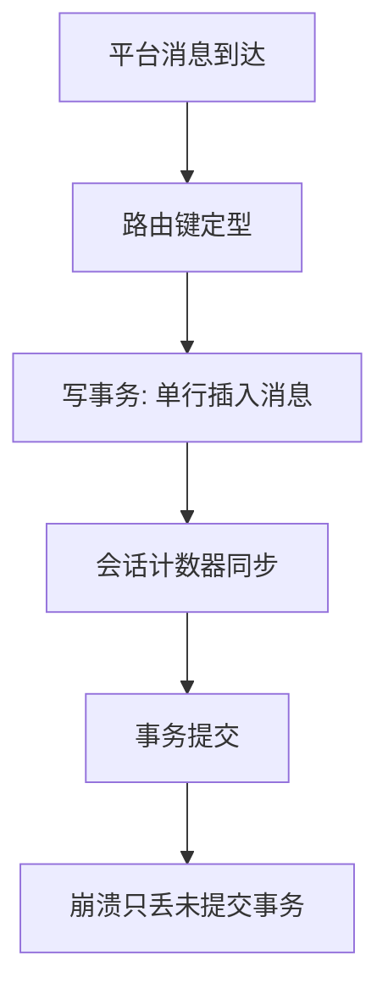
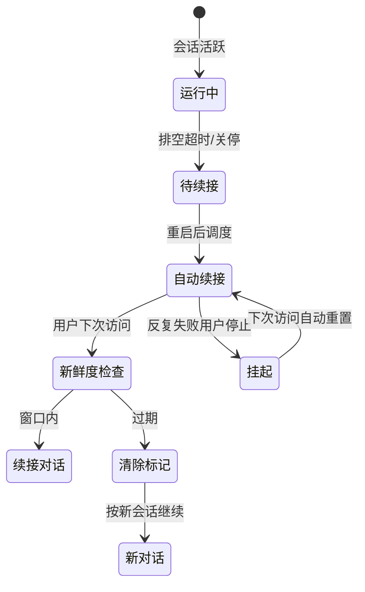
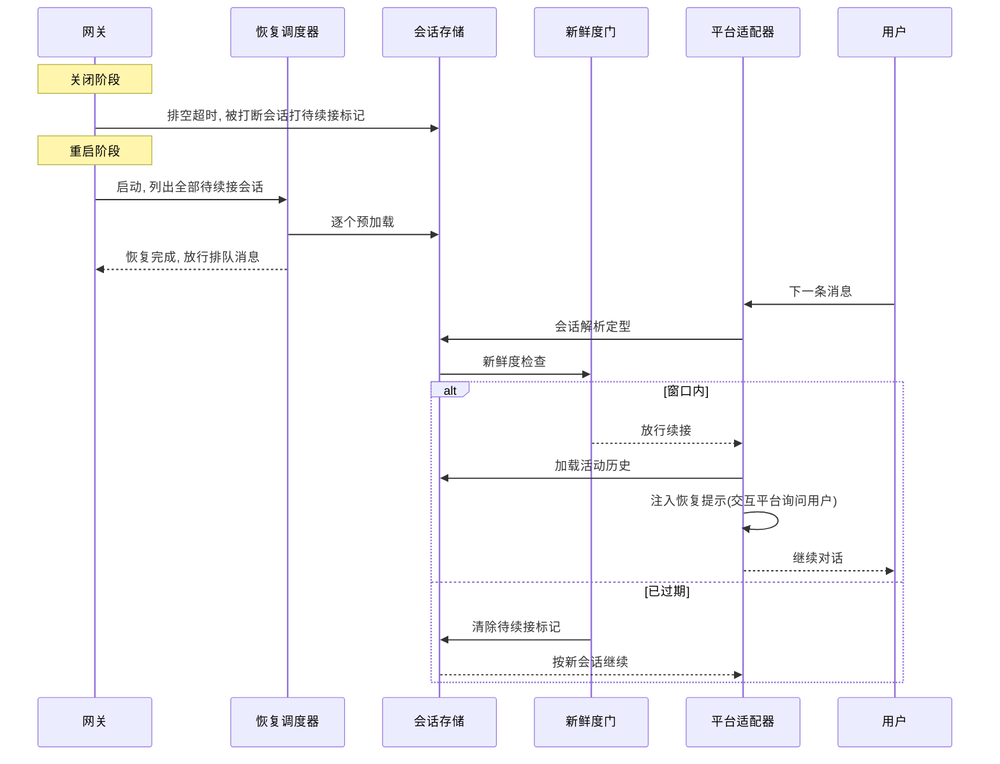

# 会话状态与持久化

## 读前思考

- 一个消息网关有 30+ 平台同时进消息，同一段对话可能从多个入口进来。数据库里"会话"该怎么建模，才能让多平台的消息落成同一条主线而不是各记各的？
- 进程重启后，被打断的对话要不要自动继续？自动继续，用户可能已经忘了上一轮在干什么；不继续，IM 用户期望的对话连续性就断了。你会在什么条件下继续、什么条件下放弃？

## 核心问题

**如何为多平台消息网关维护"会话身份 → 对话流持久化 → 执行串行化 → 崩溃续接"的完整状态链，让每条消息都落盘、每个会话都不并发、每次重启都不打断对话。**

hermes-agent 的状态层服务于"个人全能助手"定位：会话不是文件而是 SQLite 里持久化的对话流，状态管理同时解决四个问题——多平台消息到会话的确定性路由、同会话并发消息的串行化、压缩导致的会话分裂、进程重启后的自动续接。代码里密集的真实事故编号注释（每个对应一次线上事故修复）表明这套体系是从生产事故中打磨出来的，而不是一次性设计出来的。

| 维度 | hermes-agent 的选择 |
|------|------------------|
| 会话身份 | 确定性路由键（平台/聊天类型/线程组合）|
| 持久化 | SQLite WAL，消息单行增量写 |
| 历史与压缩 | 压缩分裂会话链 + 软删除可撤销 |
| 崩溃恢复 | 自动续接 + 新鲜度窗口 + 挂起退出机制 |
| 并发纪律 | 按会话 ID 的进程内轮次租约 |

## 方案展示

### 设计选择一：SQLite WAL 单行增量持久化

每条消息在写事务内单行插入，会话级计数器同步更新；工具执行完毕也立即落盘，而不是等整个轮次结束批量写。表结构相当庞大：会话表约 50 列（来源、路由键、父会话、结束原因、回退计数、交接状态、压缩冷却字段、归档标志），消息表带软删除标志、压缩标志、API 内容字节级保真旁路；另有用量表、路由表、压缩锁表、异步委派表。schema 版本独立追踪，全文检索索引版本单独管理。

**为什么这么选**：多平台并发写要求行级增量与事务安全，SQLite WAL 提供读写并发且零依赖；单行增量让崩溃只丢未提交的那一条；全文检索让"这个用户上次说过什么"可查。**牺牲了什么**：schema 演化负担极重（版本号已经到 23，每次变更都要迁移脚本）；WAL 在网络文件系统上不可靠，必须检测脆弱版本并回退（详见工程优化）。

### 设计选择二：压缩即会话分裂 + 软删除可撤销

上下文压缩不覆盖历史消息，而是开一个新的子会话继续，用父会话字段把链串起来；回退把目标消息之后的行软删除（活动标志置为不活动）而非物理删除，磁盘保留供审计，并提供撤销入口。孤儿压缩会话——父会话已因压缩终结、子会话零调用且超时——被后台任务标记为孤儿压缩，只标记不破坏数据。

**为什么这么选**：全历史可审计、撤销可逆、压缩失败可回退——对长期个人助手，用户可能三个月后要找回压缩前的一句话。**牺牲了什么**：跨会话追踪复杂，会话链需要专门的孤儿清理；恢复加载要沿链走到正确的子会话，而不是简单读一个文件。

### 设计选择三：自动续接 + 新鲜度窗口

优雅关闭时排空超时会把被打断的会话打上待续接标记（记录原因）；重启后自动续接这些会话；但续接要过新鲜度门——超过窗口（默认一小时，可调）就清除标记按新对话处理。续接时注入适配器感知的恢复提示：交互平台（IM）报告恢复并询问用户是否继续，非交互平台直接继续未完成工作；还有空消息安全网保证模型绝不收到空白轮次。手动路径：续接命令复用旧会话 id 并可重新打开已终结会话；停止命令置挂起标记，打破反复恢复失败的循环。

**为什么这么选**：IM 场景的对话连续性是用户体验底线——用户不会接受"重启后对话就归零"；新鲜度门防止"三天前的话题被自动续上"的荒谬。**牺牲了什么**：双信号检查（标记 + 窗口）、适配器感知提示、挂起退出机制组成的状态机相当复杂，任何一个分支处理错都会以周为周期复现。

### 设计选择四：按会话 ID 的轮次租约

路由键到会话 ID 是多对一映射（别名键路径：在第二个聊天里恢复命名会话、命令行续接、委派回指都会制造别名），两个不同路由键可能各自放行、在同一份转录上并发刷写——任何按路由键的守卫都看不见这个碰撞。轮次租约在会话解析定型之后、加载转录之前按会话 ID 获取，串行化"加载历史-运行-刷写"区间；释放带所有权与运行代数校验，等待超时失败开放（宁可降级不串行也不卡死会话），注册表有界、只驱逐空闲项；压缩中途会话 id 轮换时，同一租约对象重新绑定到新 id。

**为什么这么选**：按路由键加锁看不见别名键碰撞，按会话 ID 加锁让竞争只发生在真正的别名路径上，其余路径零竞争；失败开放保证可用性优先于强一致性。**牺牲了什么**：只覆盖进程内——CLI 与网关多进程共享同一会话是已知限制，文档注明需要数据库级租约。

### 设计选择五：多 Profile 实例隔离

同一台机器上可以并存多个互不干扰的"实例"：每个 Profile 是独立的配置目录，包含自己的配置、环境文件、技能目录和会话数据库，未指定时使用默认 Profile。切换 Profile 只需一个 CLI 参数，不改任何文件。技能与记忆默认不跨 Profile 共享，但技能目录可显式声明指向其他 Profile（只读共享），记忆可配置指向共享的数据库文件——隔离默认、共享显式。

**为什么这么选**：同一用户有多种使用场景（工作用企业凭证与受限工具面，个人用私人凭证与全部工具），完全隔离让两个场景的状态互不污染；完全隔离的代价是重复，所以共享必须显式配置。**牺牲了什么**：Profile 之间不共享状态——在 work Profile 创建的技能在 personal 不可见；每个 Profile 有独立的会话数据库，磁盘占用成倍；Profile 缺键不回退到默认 Profile 而是直接回退到内置默认值，每个 Profile 需要完整配置。

### 设计选择六：不活跃会话的超时回收

长时间不活跃的会话（默认 30 分钟无消息）被序列化回磁盘，内存中的 Agent 实例随之释放；下次消息到达时从磁盘恢复实例与对话历史。活跃会话数等于平台 × 聊天 × 线程的组合——一个 Telegram 大群里 1000 个用户同时触发，就会有 1000 个 Agent 实例（各含对话历史与工具注册表）驻留内存，规模可达数 GB，回收把内存占用与活跃度挂钩而不是与历史会话总数挂钩。

**为什么这么选**：完全隔离的会话模型（每会话一个实例）没有上下文切换逻辑，但内存随活跃会话数线性增长；回收让"冷会话不占内存"，与上下文压缩（见 05-context）配合才能支撑千级并发会话。**牺牲了什么**：恢复有磁盘读与反序列化延迟，冷会话的首次响应明显变慢；回收阈值过短会让频繁进出的会话反复经历落盘与恢复。

## 核心机制执行流：一次进程重启后的会话续接

以网关进程在轮次中途被重启为例：

**阶段一：关闭打标记。** 优雅关闭的排空窗口超时后，被打断的会话打上待续接标记并记录原因——这是"重启不打断对话"承诺的持久化基础。如果进程是直接崩溃（没有优雅关闭），标记可能没来得及打，恢复依赖数据库里已有的消息与状态。

**阶段二：启动调度续接。** 重启后恢复调度器列出全部待续接会话逐个预加载。注意时序：启动期间入站消息全部进排队区，恢复完成才放行——否则新消息和被恢复的旧轮次会在同一会话上交错（启动时序的网关侧细节见 01-gateway）。

**阶段三：新鲜度门。** 用户下一条消息访问会话时先过新鲜度检查。窗口内：加载活动历史（软删除与压缩掉的内容不加载）、注入适配器感知的恢复提示——交互平台报告"上次对话被中断，要我继续吗"，非交互平台直接继续未完成工作；空消息安全网保证模型收到的轮次至少有一条有效内容。窗口外：清除标记按新对话继续，不打扰用户。

**边界路径——反复恢复失败：** 自动续接每次都失败时，用户可用停止命令置挂起标记打破循环，下次访问自动重置。**边界路径——回退：** 用户回退到某条消息时，之后的行软删除但保留在磁盘，撤销入口可恢复，恢复加载不受影响。**边界路径——孤儿压缩会话：** 父会话已终结、子会话零调用且超时，由后台任务标记为孤儿压缩，仅标记不破坏数据，防止会话链无限膨胀。

## 工程优化

**WAL 可靠性防护**：检测到脆弱 SQLite 版本拒绝启用 WAL；网络文件系统场景回退 DELETE 日志模式并打锁定协议标记——WAL 在 NFS 上会静默损坏数据，这是真实事故换来的防护（事故编号 #69784）。

**压缩锁 TTL + 进程探测**：压缩锁表带过期时间，死进程占用的锁用进程探测回收，Windows 平台仅靠 TTL 兜底。

**租约安全属性**：释放校验所有权与运行代数（防止旧清理误释放新轮次的锁）、等待超时失败开放、有界注册表只驱逐空闲项、压缩中途重新绑定——四个属性分别对应一起真实事故。

**上下文变量替代环境变量**：会话上下文用上下文变量传递而非环境变量，修复并发消息互相覆盖；哨兵值区分"从未设置"与"显式清空"；重置入口修复跨会话继承泄漏。

**路径安全防御**：会话条目反序列化时有路径穿越防护与会话键合法性检查；模型覆盖参数剥离凭证字段再落盘。

## 面试要点

**1. 为什么选 SQLite 单行增量而不是 JSONL 追加或每轮全量写？**

参考答案方向：JSONL 追加对并发写需要锁、对历史查询无能为力；全量写有写放大。SQLite 单行增量同时解决三个需求：并发读写（WAL）、崩溃只丢未提交事务、SQL 聚合查询（"这个会话花了多少钱"一条语句）。代价是 schema 版本治理和迁移脚本成为长期负担。判断标准是"并发写入者数量 × 对历史数据的查询需求"：两者都低用文件足够，任一高就需要数据库。

**2. 自动续接为什么还要新鲜度窗口？直接无条件续接会出什么问题？**

参考答案方向：无条件续接的极端是"隔了很久的话题被自动继续"，用户早已切换上下文，续接反而制造混乱；新鲜度窗口把"对话连续性"限定在合理时间尺度内。窗口太短，一次跨夜讨论就被切断；太长，过期上下文污染新对话。判断标准是"会话中断时长 × 用户上下文切换频率"——IM 日常对话窗口可以短，长任务窗口要长。

**3. 轮次租约为什么按会话 ID 而不是按路由键加锁？**

参考答案方向：按路由键加锁的盲区在于路由键到会话 ID 是多对一——两个路由键各自通过自己的守卫，在同一份转录上并发刷写，任何按路由键的守卫都看不见这个碰撞。按会话 ID 加锁让竞争只发生在真正的别名路径上。代价是锁只在进程内有效，跨进程共享会话需要数据库级租约。判断标准是"被保护资源的属主 × 路由键到属主的映射是否多对一"——映射多对一时必须在解析定型后按属主加锁。
