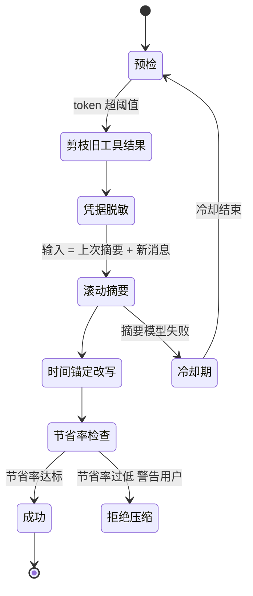
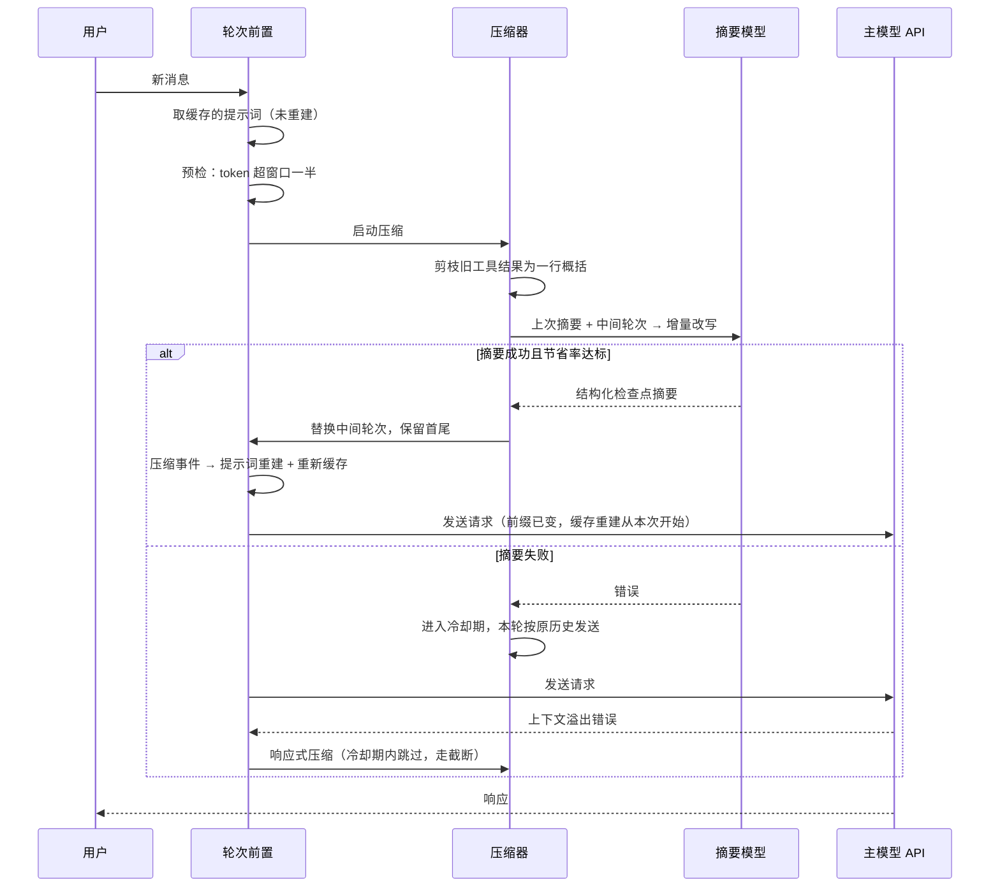

# 上下文工程

## 读前思考

- 一个以天为单位持续运行的个人助手，每轮请求都要发送系统提示词。如果提示词里混着时间戳和记忆快照这类每次都变的内容，前缀缓存永远命中不了。怎么组织提示词，才能让"大部分字节"在整个会话里一个字节都不变？
- 会话持续上百轮之后，压缩会变成高频事件。上一次压缩生成的摘要，下一次压缩时是该重读全部历史重写，还是在旧摘要基础上增量改写？两种做法各自会积累什么样的错误？

## 核心问题

上下文工程解决的核心问题是：**让长期会话的提示词尽可能字节稳定以持续命中缓存，同时用足够健壮的压缩机制撑过上百轮工具调用。** hermes-agent 的定位是运行在用户本机、持续工作数天甚至数周的个人助手，这决定了它的两端都往"稳定"方向设计：组装端按稳定性分三层、构建一次缓存复用；压缩端层层设防，宁可少压缩也不压缩坏。

| 维度 | hermes-agent 的选择 |
|------|---------------------|
| 提示词结构 | 三层（stable / context / volatile）按稳定性分级 |
| 重建时机 | 会话内复用缓存，仅压缩事件或模型切换触发重建 |
| 上下文文件 | 单文件优先级发现（自有格式 > AGENTS.md > CLAUDE.md > 编辑器规则） |
| 记忆注入 | 会话开始时快照注入，全程冻结 |
| 压缩阈值 | 默认窗口一半，小窗口模型抬升到四分之三 |
| 摘要形态 | 结构化检查点模板 + 滚动增量更新 |
| 失败防御 | 冷却期 + 节省率追踪 + 反抖动截断 |

## 方案展示

### 设计选择一：三层稳定性分级的提示词组装

系统提示词由提示词构建函数（源码：build_system_prompt_parts）组装，采用三层（tiers）架构，设计目标是前缀缓存友好：stable 层会话内字节稳定，context 层会话级稳定，volatile 层每次构建可变。三层以空行拼接为最终字符串。

**第一层 stable（身份 + 行为指导，约 18 个组件）：**

| 类别 | 组件 | 条件 |
|------|------|------|
| 身份 | Agent Identity（可由用户的 SOUL.md 完全覆盖）、帮助指引 | 始终 |
| 工具规范 | 任务完成要求、并行工具调用、各工具使用规范 | 有工具时 |
| 渠道与平台 | 运行中插话标记格式、各通信平台格式说明（20+ 平台） | 按平台 |
| 模型适配 | 工具使用强制、特定模型专用指南 | 按模型名匹配 |
| 技能索引 | 按分类列出所有可用技能（仅名称和描述） | 扫描技能目录 |
| 环境感知 | 主机系统/目录/shell 提示、编码姿态 + git 状态快照、工具链探测 | 按运行环境 |
| 身份保护 | 当前 Profile 名 + 跨 Profile 写保护 | 按活跃 Profile |

**第二层 context（项目上下文，会话级稳定）：**

| 部分 | 核心内容 |
|------|----------|
| 调用方指令 | 调用方传入的自定义系统消息（可选） |
| 项目上下文文件 | 按优先级发现并只加载一个：自有格式 > AGENTS.md > CLAUDE.md > 编辑器规则文件；有截断上限（默认约两万字符），经注入攻击扫描过滤 |

**第三层 volatile（每次构建可变）：**

| 部分 | 核心内容 |
|------|----------|
| 记忆快照 | 用户持久记忆（偏好、环境细节、约定） |
| 用户画像 | USER.md 内容 |
| 外部记忆 | 第三方记忆插件的提示词块 |
| 时间与会话 | 对话开始时间、模型名、提供商名 |

构建完成后整个字符串被缓存，整个会话复用，仅上下文压缩事件或模型切换才触发重建。此外还保留了一条旁路：批处理/数据生成场景可以走临时系统提示词通道注入一次性指令，这条通道不进缓存、不落库。

**为什么这么选**：缓存按前缀命中，把可变内容全部压到最后一层，前面的稳定层就能在整个会话里持续命中；只加载一个上下文文件则避免了多规则文件互相冲突。**牺牲了什么**：三层各自的条件逻辑让构建函数庞大；记忆快照冻结在会话开始时，会话中途新增的记忆要等下次会话才可见（注入策略的完整讨论见 06-memory.md）。

### 设计选择二：字节级缓存不变量

前缀缓存要求"前 N 条消息的字节与上次请求完全相同"。hermes 为此给每条消息维护一份"发送给 API 的精确字节"副本（源码中的 api_content 伴生字段）：下一轮重放时直接使用这份副本，而不是重新序列化消息对象。重新序列化可能因字典顺序、转义差异产生字节级漂移，让缓存静默失效；伴生字段把"发给 API 的字节"固化为状态的一部分。这条不变量是压缩策略的前提——只有保证非压缩部分字节恒定，"减少压缩次数保住缓存"的账才成立。

**为什么这么选**：缓存失效是静默的，账单上只会看到输入 token 费用悄悄上涨，没有任何报错。**牺牲了什么**：每条消息多一份存储副本，会话持久化体积增大；消息内容被修正时必须同步更新副本，遗漏就是缓存泄漏。

### 设计选择三：滚动摘要 + 多级降级压缩

压缩器（源码：context_compressor.py，约五千行）把全部防御逻辑都集中在了这一层。默认阈值取窗口的一半；当模型窗口较小（低于约 512K 量级）时，阈值自动上抬至四分之三——原因写在源码注释里：系统提示词、工具 schema、保护尾、滚动摘要构成"不可压缩底座"，小窗口下用一半阈值触发，腾出的空间有限，会话会陷入每一两轮就要重压一次的抖动。

压缩分两步走：第一步是剪枝——旧工具结果被替换成一行语义概括（而非空占位符，模型仍知道"当时读了什么、结果大概是什么"）；压力极大时连保护尾内的大块工具输出也降级，但最后三条消息永远保留原文。第二步才是真正的摘要，采用**滚动更新**：以上次摘要为底稿增量改写，不重读全部历史。摘要按结构化检查点模板产出，其中两处设计在其他项目中见不到：凭据脱敏——生成摘要前先把密钥类内容替换掉，阻断敏感信息随摘要二次扩散；时间锚定——把"正在做 X"改写成"某日已完成 X"，避免续接会话的模型把已完成的动作再做一遍。

失败处理也分级：摘要模型调用失败后进入冷却期，期内不再重试；若一次压缩的节省率过低，记为无效压缩，累计多次后压缩器拒绝继续工作并向用户发出警告——这是对压缩抖动的显式拦截。

**为什么这么选**：以天为单位的助手会话里，压缩是高频事件，任何一处没设防的边界情况都会在长期运行中反复暴露；滚动更新则把摘要调用的输入压成恒定小——只读"上次摘要 + 新消息"，不随会话长度膨胀。**牺牲了什么**：阈值抬升、剪枝分级、冷却、反抖动每个机制都带自己的配置项和状态，整体复杂度很高；滚动摘要还有个结构性风险——错误会跨压缩传递，一次写坏的摘要会持续污染后续所有增量更新。

## 核心机制执行流：一次触发压缩的轮次

以"第 80 轮工具调用后历史超过阈值"为例：

**阶段一：轮次前置。** 轮次构建先取缓存的系统提示词——会话内不重建是常态。随后做预检压缩检查，这是压缩的第一个触发时机，发生在请求发出之前。

**阶段二：分层压缩。** 剪枝先行，成本为零；只有剪枝不够时才调用摘要模型。摘要采用滚动更新，输入只是"上次摘要 + 新增消息"，不必重读上百轮历史。

**阶段三：重建缓存。** 压缩改写了消息历史，也触发了提示词重建——这是整个会话里仅有的两个重建时机之一。重建后新前缀从本次请求开始重新积累缓存。

**边界路径——摘要失败进冷却**：冷却期内不再尝试摘要。如果此时 API 仍报上下文溢出，走响应式分支：反抖动逻辑判断距上次压缩过近，说明问题不在历史长度而在单条消息过大，改用截断而非再次压缩。

**边界路径——无效压缩拒止**：压缩完成但节省率过低（底座太大），记为无效压缩；累积多次后压缩器拒绝继续压缩并向用户发出警告，建议开新会话，而不是无限循环地做无用功。

## 工程优化

**反抖动压缩保护**：不在每次 token 接近阈值时都触发压缩。两次压缩间隔过近时，判定问题是单条消息过大而非历史过长，改用截断策略，避免"压缩 → 仍超限 → 再压缩"的死循环。

**压缩事件驱动提示词重建**：提示词缓存的失效时机被显式绑定到压缩事件上，而不是每轮重算。这让"重建成本"变成可预期的低频事件，而不是隐性的每轮开销。

**临时提示词通道**：批处理/数据生成场景需要注入一次性指令，这些指令既不该进缓存（只用一次）也不该落库（与持久会话无关），因此走独立的旁路通道。

**时间锚定防重复执行**：跨天续接的会话里，"正在做 X"这类进行时表述会让模型重做已完成的工作。摘要生成时统一改写为带日期的完成时，把时序信息固化进摘要。

## 面试要点

**1. 提示词按稳定性分三层，和"全部拼在一起每次重建"相比，收益和代价分别是什么？**

参考答案方向：收益是缓存命中率——稳定层在会话内字节不变，前缀命中可以持续到压缩事件为止，长期会话下输入 token 成本大幅下降。代价有三：构建逻辑要维护每层的条件分支；可变层排在最后意味着模型对记忆快照等内容的注意力位置靠后；重建时机必须显式管理（压缩、换模型），漏掉一个触发条件就会发送过期内容。判断标准是"会话长度 × 请求频率"：会话短则缓存收益覆盖不了分层复杂度，会话以天计则值得。

**2. 滚动摘要和全量重摘，错误累积模式有什么不同？什么场景该选哪个？**

参考答案方向：滚动摘要的错误是累积性的——一次写坏的摘要会作为下次的输入，错误沿链条传播且无法自我修正，但它每次只需读"上次摘要 + 新消息"，输入恒定小。全量重摘的错误是独立性的——每次都从头读历史，上次写坏不影响这次，天然有自我修正机会，但输入随会话长度线性膨胀，摘要调用本身可能先溢出。选哪个取决于"摘要出错的概率 × 会话长度"：会话越长滚动越省，但对摘要质量的监控要求越高（hermes 用结构化模板和节省率检查补这个监控）。

**3. 记忆快照在会话开始时注入一次就冻结，会话中途新记起的信息就看不到了。这个取舍合理吗？**

参考答案方向：合理的前提是"会话中途产生的新信息大多不紧急"——用户偏好、环境细节这类长期记忆，晚一个会话生效通常无害；而每轮重新检索注入会同时破坏字节稳定性（缓存失效）和增加检索开销。不合理的场景是"会话内自我学习"：如果助手在同一会话里被用户纠正了重要偏好，冻结快照让它下次会话才记住之前显得迟钝。hermes 的折中是保留模型主动调记忆工具的能力——写入即时生效，读取等下次会话。判断标准是"记忆新鲜度价值 × 缓存折扣"：新鲜度价值高的场景需要实时注入通道。
