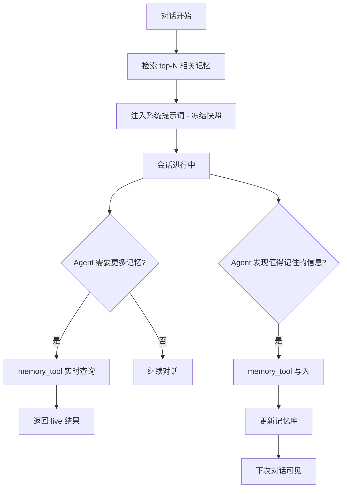
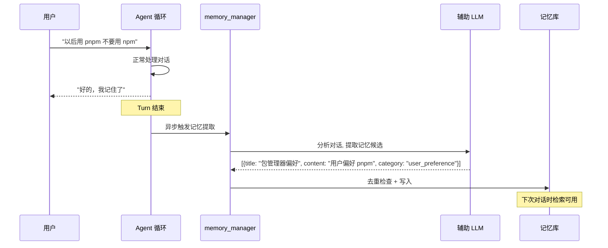
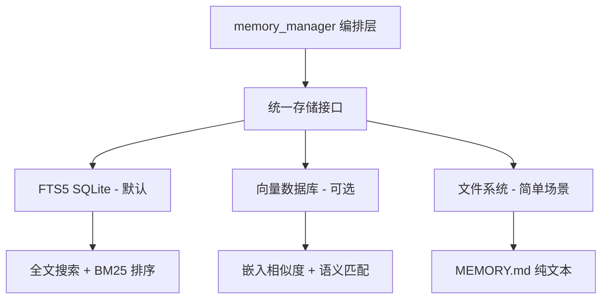
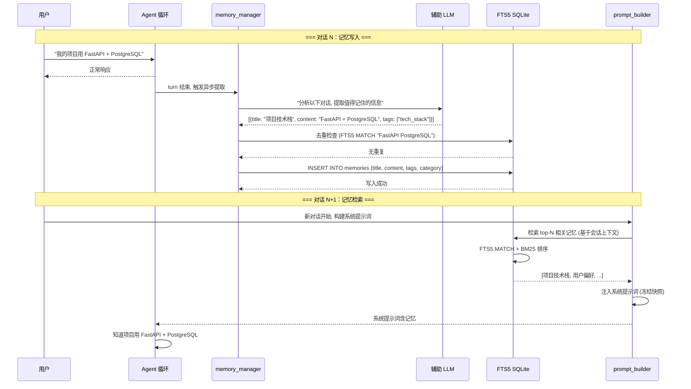

# 记忆系统

## 读前思考

- Agent 的"记忆"应该存在哪？如果存在上下文窗口里，对话结束就忘了；如果存在数据库里，每次对话都要检索。你会怎么平衡"记住一切"和"不浪费 token 加载无关记忆"？
- 如果 Agent 在对话中自动提取记忆（"用户喜欢用 TypeScript"），这个提取应该在对话中实时做（影响响应速度）还是对话后异步做（可能丢失上下文）？

## 核心问题

记忆系统解决的核心问题是：**如何让 Agent 跨会话保留和检索关键信息（用户偏好、项目事实、历史决策），同时不显著增加每次对话的 token 开销？**

Hermes 的记忆系统反映了它"个人全能助手"的定位——一个助手如果不记得用户的偏好和之前的对话，每次都要从头介绍自己，就不是合格的助手。但记忆不能全部塞进上下文（太多），也不能完全不加载（太少），需要"恰到好处"的检索。

| 维度 | Hermes 的选择 |
|------|--------------|
| 存储后端 | 多后端插件化（FTS5 SQLite 默认，向量数据库可选） |
| 检索方式 | 全文搜索（FTS5）+ 语义相似度（可选向量） |
| 注入时机 | 系统提示词冻结快照 + 工具实时查询 |
| 提取方式 | 对话后异步提取（辅助 LLM） |
| 记忆格式 | 结构化条目（title + content + tags + category） |

## 方案展示

### 设计选择一：冻结快照 + 实时查询双通道

记忆通过两个通道进入 Agent 的感知：(1) 系统提示词中的冻结快照——对话开始时从记忆库检索 top-N 相关记忆，注入系统提示词，整个会话期间不变；(2) memory_tool 实时查询——Agent 在对话中随时可以调用 memory 工具搜索/读取/写入记忆。

**为什么这么选**：冻结快照保证了 prompt cache 的前缀命中——如果记忆在会话中动态变化，每次 API 调用的系统提示词字节都不同，cache 永远无法命中。实时查询弥补了冻结的不足——Agent 在对话中发现需要更多背景信息时，可以主动搜索。写入是即时的（写磁盘），但系统提示词中的快照不变，通过 tool response 返回 live state 让模型感知最新状态。

**牺牲了什么**：冻结快照意味着会话中写入的新记忆不会出现在系统提示词中——模型只能通过 tool response 知道"我刚记住了 X"，但下一轮的系统提示词仍然没有 X。这是一个性能-一致性权衡：为了 prefix cache 命中率（节省 90% 输入 token 计费），接受了会话内的最终一致性。

### 设计选择二：对话后异步提取

记忆的提取不在对话中实时进行，而是在 turn 结束后由辅助 LLM 异步分析对话内容，提取值得记住的信息（用户偏好、项目事实、决策结论）。提取结果写入记忆库，下次对话可用。

**为什么这么选**：实时提取会占用主对话的 token 预算和时间——每次用户说话都要额外调用一次 LLM 判断"这值得记住吗"。异步提取不影响响应速度，且可以在 turn 结束后看到完整对话上下文（而非只看单条消息），提取质量更高。使用辅助 LLM（通常是更便宜的模型）降低成本。

**牺牲了什么**：异步提取有延迟——如果用户在同一个会话中先说"我喜欢 TypeScript"，然后 5 分钟后问"我喜欢什么语言？"，记忆可能还没提取完。此外，异步提取依赖辅助 LLM 的判断——什么"值得记住"是主观的，可能提取无用信息或遗漏重要信息。

### 设计选择三：多后端插件化存储

记忆存储通过插件系统支持多种后端：默认的 FTS5 SQLite（全文搜索）、可选的向量数据库（语义检索）、甚至纯文件系统。`plugins/memory/` 下的不同 provider 实现统一的存储接口。

**为什么这么选**：不同用户有不同的基础设施——个人用户用 SQLite 就够了（零配置、单文件），企业用户可能需要向量数据库做语义检索。插件化让默认路径极简（SQLite 随 Python 标准库），高级路径可选。FTS5 的 BM25 排序对关键词匹配场景（"用户叫什么名字"）效果已经很好，不需要向量的语义模糊匹配。

**牺牲了什么**：多后端意味着测试矩阵膨胀——每个功能需要在所有后端上验证。FTS5 对语义相似但关键词不同的查询效果差（"编程语言偏好" vs "喜欢用什么语言"）。向量后端需要额外的嵌入模型依赖。

## 核心机制执行流：一次记忆的写入与检索

以用户说"我的项目用 FastAPI + PostgreSQL"为例，展示记忆从提取到下次检索的完整链路：

**阶段一：异步提取。** Turn 结束后，memory_manager 将对话内容发送给辅助 LLM，提示词要求提取"用户偏好、项目事实、决策结论"等结构化记忆。辅助 LLM 返回候选记忆列表，每条包含 title、content、tags、category。

**阶段二：去重与写入。** 写入前通过 FTS5 全文搜索检查是否已有相似记忆。如果存在高相似度条目，执行合并（更新 content 而非新建）。写入使用 SQLite 事务保证原子性。

**阶段三：检索与注入。** 下次对话开始时，prompt_builder 根据当前会话上下文（用户的第一条消息、工作目录等）构建检索查询，从 FTS5 中检索 top-N 相关记忆。结果注入系统提示词的 `[MEMORIES]` 段落，整个会话期间冻结不变。

**阶段四：实时补充。** 如果 Agent 在对话中需要更多背景（如"之前我们讨论过的数据库 schema 是什么？"），可以调用 memory_tool 实时搜索。实时搜索返回 live 结果（包含本次会话中新写入的记忆），弥补冻结快照的延迟。

**边界路径——并发写入：** gateway 场景下多个 session 可能同时触发记忆提取。SQLite 的 WAL 模式支持并发读写，写入通过 `BEGIN IMMEDIATE` 事务序列化。去重检查在事务内执行，防止两个 session 同时写入相同记忆。

**边界路径——记忆冲突：** 用户先说“我喜欢 npm”，后来改口“以后用 pnpm”。异步提取会生成新记忆“包管理器偏好: pnpm”。去重检查发现已有“包管理器偏好: npm”，执行更新而非新建。但如果两条记忆的 title 不同（如“npm 偏好” vs “pnpm 偏好”），去重可能失败，导致矛盾记忆共存。

## 记忆系统提示词结构

Hermes 的记忆在 system prompt 的 volatile 层（Tier 3）中注入，包含三个部分：

| 部分 | 来源 | 内容 |
|------|------|------|
| Memory Snapshot | 记忆存储格式化的"memory"视图 | 用户持久记忆（偏好、环境细节、约定） |
| USER.md Profile | 记忆存储格式化的"user"视图 | 用户画像（角色、专业、工作习惯） |
| External Memory Provider | 记忆管理器构建的插件 prompt | 第三方记忆插件的 prompt block |

另外，stable 层（Tier 1）中的 MEMORY_GUIDANCE 常量定义了记忆工具的使用规范（写什么、不写什么、何时更新），仅在 memory 工具存在时注入。

记忆放在 volatile 层而非 stable 层的原因是：记忆内容每次构建可能不同（用户可能在上轮对话中新增了记忆），放在 volatile 层确保每次构建都能获取最新记忆。代价是记忆变化会导致整个 system prompt 的缓存失效（但 volatile 层本来就在最后，不影响 stable 和 context 层的前缀缓存）。

## 工程优化

**FTS5 CJK 分词**：中日韩文本没有空格分词，标准 FTS5 的 unicode61 tokenizer 无法正确索引。Hermes 通过 `native/fts5_cjk/` 下的自定义分词器（基于 n-gram）支持 CJK 全文搜索。

**冻结快照的 prompt cache 优化**：系统提示词中的记忆段落使用固定的格式化模板，确保只要记忆内容不变，字节序列就不变。这保证了 Anthropic/OpenAI 的 prompt cache 前缀命中——记忆段落通常在系统提示词的固定位置，前面的身份/技能索引不变时，cache 可以命中到记忆段落。

**提取的 token 预算控制**：异步提取不是把整个对话历史发给辅助 LLM，而是只发送最近 N 轮（或压缩后的摘要）。这控制了提取成本——一个 100 轮对话的提取不应该消耗 100 轮的 token。

**记忆条目的大小限制**：单条记忆的 content 有最大长度限制（通常 500 字符）。辅助 LLM 被提示"每条记忆应该是一个原子事实"，防止提取出冗长的段落。

## 面试要点

**问题一：冻结快照（性能优先）vs 实时注入（一致性优先），Hermes 为什么选了冻结？在什么场景下这个选择会出问题？**

冻结的核心收益是 prompt cache 命中率——Anthropic 的 cache 可以节省 90% 的输入 token 计费，对一个高频使用的个人助手来说，这是显著的成本差异。出问题的场景：用户在对话开头说"记住我叫 Alice"，然后 50 轮后问"我叫什么？"——如果冻结快照中没有这条记忆（因为是本次会话写入的），Agent 只能通过 memory_tool 实时查询才能回答。Hermes 的缓解是 Agent 在写入记忆时会通过 tool response 告知模型"已记住"，模型在后续轮次中可以从对话历史（而非系统提示词）中回忆。但如果对话被压缩了（中间轮次被摘要替换），这个回忆也可能丢失。

**问题二：FTS5 全文搜索 vs 向量语义检索，各自的适用场景是什么？为什么 Hermes 默认选 FTS5？**

FTS5 擅长精确关键词匹配——"用户的邮箱是什么"可以精确匹配到 title 含"邮箱"的记忆。向量检索擅长语义模糊匹配——"怎么联系他"可以匹配到"邮箱""电话""微信"等语义相关记忆。Hermes 默认 FTS5 的原因：(a) 零依赖——SQLite 随 Python 标准库，不需要额外的向量数据库进程；(b) 确定性——相同查询总是返回相同结果，便于调试；(c) 个人助手场景的记忆数量通常在几百到几千条，FTS5 的 BM25 排序在这个规模下效果足够。向量检索在记忆数量达到万级以上、且查询模式以语义模糊为主时更有优势。

**问题三：异步提取的"什么值得记住"判断如果做错了（记了不该记的，或没记该记的），后果是什么？怎么缓解？**

记了不该记的：噪声记忆稀释检索质量——top-N 检索中充满无用条目，真正有用的记忆被挤出。缓解：Curator 定期清理低质量记忆（use_count == 0 且创建超过 N 天的条目）。没记该记的：用户期望 Agent 记住但实际没记，下次对话需要重复说明。缓解：Agent 在对话中可以主动调用 memory_tool 写入（不依赖异步提取），系统提示词中有"如果用户表达了偏好，主动记住"的指令。根本问题是"值得记住"是主观判断——辅助 LLM 的判断标准可能与用户期望不一致，这需要持续调优提取提示词。
