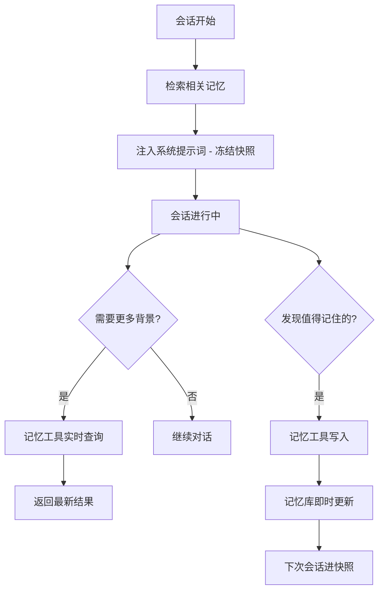
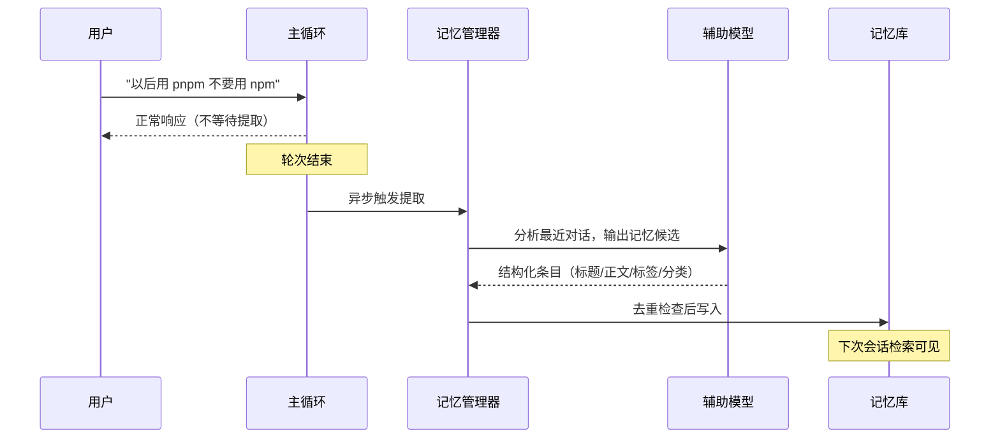
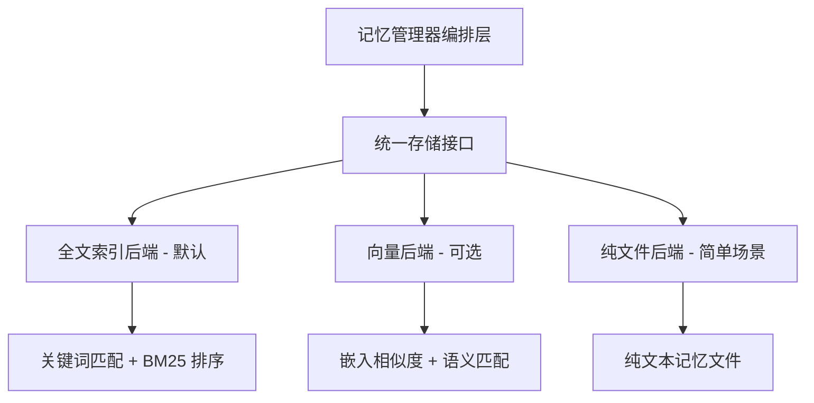
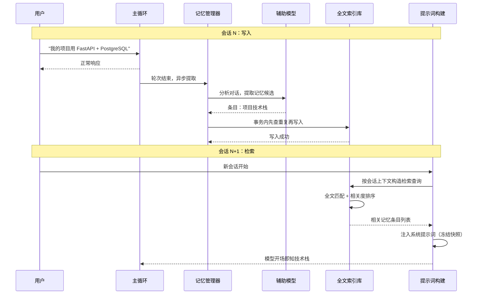

# 长期记忆

## 读前思考

- 一个个人助手如果每次对话都要用户重新自我介绍，就不算合格的助手。但记忆也不能全塞进上下文——几百条记忆全量加载会占用大量 token，完全不加载又等于没记。你会怎么设计"恰到好处"的加载策略？
- 加载策略还牵动另一笔账：如果系统提示词里的记忆内容每轮都在变，提示词前缀缓存就永远命中不了。你愿意用多大的"记忆新鲜度"去换缓存命中率？

## 核心问题

记忆系统解决的核心问题是：**如何让 Agent 跨会话保留和检索关键信息（用户偏好、项目事实、历史决策），同时不显著增加每次对话的 token 开销。**

hermes-agent 的记忆系统反映其"个人全能助手"定位：检索走全文索引默认、向量可选的多后端路线，注入走"冻结快照 + 工具实时查询"双通道，提取在轮次结束后异步进行。边界说明：会话消息的完整落盘（SessionDB）不是记忆——恢复用途见 [04-state](04-state.md)，回放与审计用途见 [10-observability](10-observability.md)；单会话内的压缩属短期记忆，见 [05-context](05-context.md)。本篇只讲跨会话的长期记忆。

| 维度 | hermes-agent 的选择 |
|------|------------------|
| 存储后端 | 多后端插件化：全文索引库默认（SQLite FTS5），向量库可选 |
| 检索方式 | 全文关键词检索（BM25 排序），可选向量语义检索 |
| 注入时机 | 系统提示词冻结快照 + 记忆工具实时查询 |
| 提取方式 | 轮次结束后异步提取（辅助模型） |
| 记忆格式 | 结构化条目：标题 + 正文 + 标签 + 分类 |
| 整合与过期 | 无自动整合；低质量条目由定期清理机制处理 |

## 方案展示

### 设计选择一：冻结快照 + 实时查询双通道

记忆通过两条通道进入模型感知。第一条是系统提示词中的冻结快照：会话开始时根据上下文检索一批相关记忆注入系统提示词，整个会话期间不变。第二条是记忆工具的实时查询：对话中模型随时可以搜索、读取、写入记忆，返回的是最新状态。

**为什么这么选**：冻结的直接收益是 prompt cache 前缀命中——记忆若随会话动态变化，系统提示词字节序列每次都不同，缓存永远命中不了，而前缀缓存能省下大头输入计费。实时查询弥补冻结的盲区：写入是即时的，模型通过工具返回值知道"我刚记住了什么"，最新状态由工具通道兜底。**牺牲了什么**：会话中写入的新记忆不会出现在系统提示词里，只能靠对话历史或再次查询找回来——这是拿会话内最终一致性换缓存命中率的明确取舍（缓存机制分析见 [05-context](05-context.md)）。

### 设计选择二：轮次后异步提取

记忆提取不在对话中实时做，而是在轮次结束后由辅助模型异步分析对话内容，提取用户偏好、项目事实、决策结论等结构化条目，写入记忆库供下次会话使用。

**为什么这么选**：实时提取意味着用户每说一句话都要额外等一次模型判断，响应速度和 token 预算双重受损；异步提取不占主对话时间，且轮次结束后能看到完整对话而非单条消息，提取质量更高；用更便宜的辅助模型进一步压成本。**牺牲了什么**：提取有延迟——同一会话里先说偏好、马上追问"我喜欢什么"，记忆可能还没落库；"什么值得记住"是主观判断，辅助模型可能记噪声或漏要点。

### 设计选择三：多后端插件化存储与检索

记忆存储走统一接口 + 多后端插件：默认全文索引后端（SQLite 内建 FTS5），可选向量后端做语义检索，甚至纯文件后端。检索查询经同一入口分发到所选后端。

**为什么这么选**：从 RAG 视角看，个人助手场景的查询以"用户的邮箱是什么"这类精确问题为主，全文索引的关键词命中已经够用；它的额外优势是零依赖（SQLite 随标准库自带）和确定性（同样查询永远返回同样结果，便于调试）。向量后端留给记忆量大、查询偏语义模糊的进阶用户，不强制引入嵌入模型依赖。**牺牲了什么**：多后端的测试矩阵膨胀；全文检索对"措辞不同、语义相同"的查询失准（"怎么联系他"匹配不到标题为"邮箱"的条目）。

## 核心机制执行流：一次记忆的写入与检索

以用户说"我的项目用 FastAPI + PostgreSQL"为例，走一遍记忆从写入到下次会话被检索的完整链路：

**阶段一：异步提取。** 轮次结束后，记忆管理器把最近对话发给辅助模型，提示词要求输出结构化条目（标题、正文、标签、分类）。为控制成本，只发送最近若干轮或压缩后的摘要，而不是整个会话历史。

**阶段二：去重与写入。** 写入前先用全文检索查是否已有相似条目，命中则合并更新而非新建。写入在数据库事务内完成，查重与插入同属一个事务。

**阶段三：检索与注入。** 下次会话开始时，提示词构建器根据当前上下文（首条消息、工作目录等）构造检索查询，取出排序靠前的一批条目，注入系统提示词的记忆段落，整个会话期间冻结不变。

**阶段四：实时补充。** 会话中若需要快照之外的背景（"之前讨论过的数据库结构是什么"），模型调记忆工具实时搜索，返回结果包含本次会话新写入的记忆，弥补冻结快照的延迟。

**边界路径——并发写入：** 多会话场景下可能同时触发提取。数据库用并行写模式（WAL）支持读写并发，写入事务序列化执行，查重在事务内完成，防止两个会话写入同一条记忆。

**边界路径——偏好冲突：** 用户先说"用 npm"，后改口"用 pnpm"。新提取的条目与旧条目标题一致时，查重命中、执行更新；但若两次提取给出的标题不同（"npm 偏好"对"pnpm 偏好"），查重会漏掉，矛盾记忆共存——这是全文查重做语义去重的固有盲区。

## 记忆系统提示词结构

hermes-agent 的记忆相关内容在系统提示词的易变层注入（分层结构与组装时机见 [05-context](05-context.md)），本节只讲记忆内容的来源构成：

| 部分 | 来源 | 内容 |
|------|------|------|
| 记忆快照 | 记忆存储格式化的记忆视图 | 用户持久记忆：偏好、环境细节、约定 |
| 用户画像 | 记忆存储格式化的用户视图 | 角色、专业领域、工作习惯 |
| 外部记忆段 | 第三方记忆插件构建 | 插件自带的提示词块 |

另有记忆工具使用规范（写什么、不写什么、何时更新）放在稳定层，仅当记忆工具存在时注入。

记忆放易变层而非稳定层的原因：记忆内容跨会话会变，放易变层保证每次构建取到的都是最新记忆。代价是记忆变化会使该段之后的缓存失效——但易变层本来就排在提示词末尾，身份、技能索引等前缀段落不受影响，这正是"冻结快照 + 稳定格式化模板"组合能把缓存损失压到最小的原因：只要记忆内容不变，模板保证字节序列完全一致。

## 工程优化

**中日韩全文分词**：标准全文索引的空格分词对中日韩文本无效，hermes-agent 提供基于 n-gram 的自定义分词器支持中文记忆的正确索引与检索——对个人助手场景，用户记忆大量是中文，这是全文检索路线成立的前提。

**冻结快照的字节稳定性**：记忆段落用固定格式化模板渲染，记忆内容不变则字节序列不变，保证前缀缓存能命中到记忆段落之前的全部稳定内容。

**提取的 token 预算控制**：异步提取只发送最近若干轮或压缩摘要，而非整个会话历史——百轮会话的提取不应消耗百轮的 token。

**条目原子化与大小限制**：单条记忆正文有最大长度限制，提取提示词要求"每条记忆是一个原子事实"，防止提取出冗长段落稀释检索质量。

## 面试要点

**1. 冻结快照（性能优先）和实时注入（一致性优先），hermes-agent 为什么选冻结？什么场景下这个选择会出问题？**

参考答案方向：冻结的核心收益是前缀缓存命中，对高频使用的个人助手是显著的成本差异。出问题的场景：会话开头写入的记忆，几十轮后被追问——它不在冻结快照里，模型只能靠记忆工具实时查询或从对话历史回忆；而对话历史若被压缩，回忆路径也可能断掉。缓解是写入时工具返回值明确告知"已记住"。判断标准是"会话平均轮次 × 会话内记忆写入频率"：乘积小，冻结几乎无损；乘积大，冻结的盲区会频繁暴露。

**2. 全文检索和向量语义检索各自的适用场景是什么？为什么 hermes-agent 默认全文？**

参考答案方向：全文检索擅长精确关键词命中——查询中包含与记忆一致的标识符或关键词时又准又确定；向量检索擅长语义模糊匹配——"怎么联系他"能对上"邮箱"类记忆。默认全文的理由：零依赖（索引库随标准库）、结果确定便于调试、个人助手的记忆规模（几百到几千条）下全文排序效果足够。判断标准是"记忆规模 × 查询模糊度"：规模小、查询精确，全文占优；规模上万、查询以自然语言描述为主，向量才值得引入依赖。

**3. 异步提取的"什么值得记住"判断做错了（记了噪声、漏了要点），后果和缓解分别是什么？**

参考答案方向：记了噪声会稀释检索质量——top-N 快照被无用条目占满，真正有用的记忆被挤出；缓解是定期清理机制处理长期未被使用的条目，加上条目原子化约束。漏了要点则用户下次要重复说明；缓解是模型可以在对话中主动调记忆工具写入，不完全依赖后台提取，且工具使用规范里有"用户表达偏好就主动记住"的指令。判断标准是"噪声容忍度 × 提取提示词的调优成本"：对噪声敏感就收紧提取标准并强化清理，对遗漏敏感就加强模型主动写入通道。
