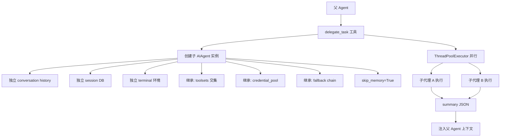
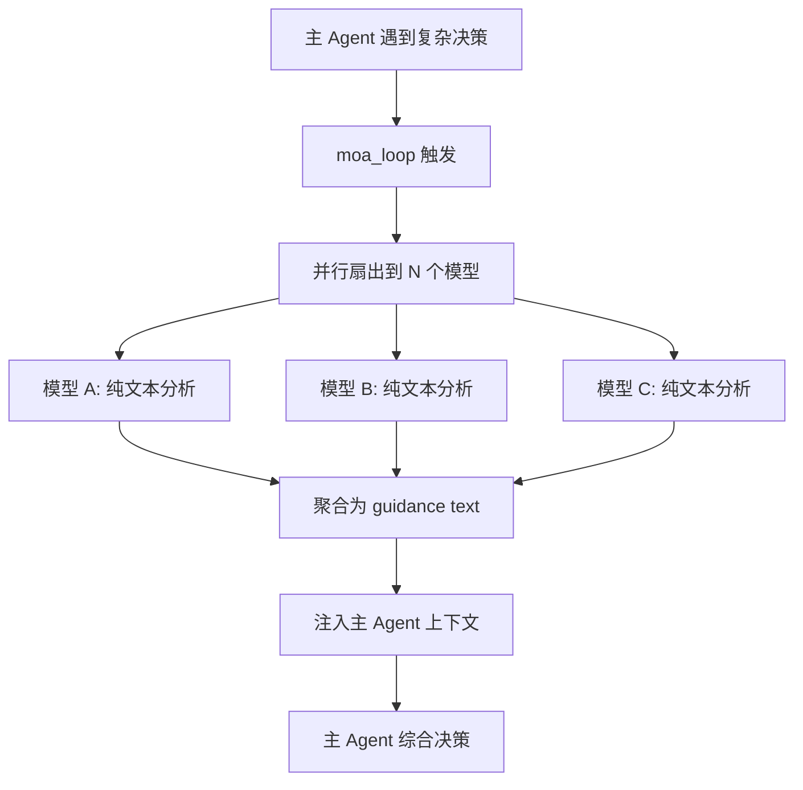
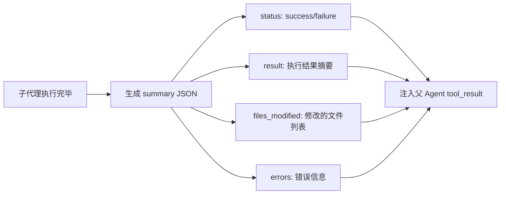
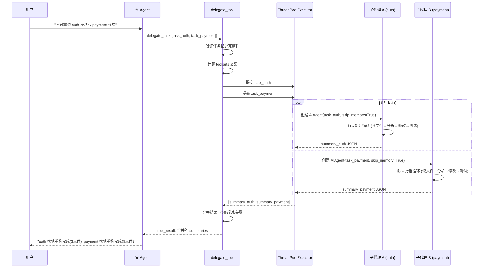

# 子代理/编排

## 读前思考

- 如果你要让一个 Agent 把复杂任务拆成子任务并行执行，子代理应该和父代理共享上下文（知道之前聊了什么）还是完全隔离（只看到自己的任务描述）？各有什么风险？
- "Mixture of Agents"（让多个模型同时分析同一问题再综合）和"子代理委派"（让一个子模型独立完成任务）看起来都是"并行调用多个 LLM"，它们的本质区别是什么？

## 核心问题

子代理/编排解决的核心问题是：**如何让 Agent 将复杂任务分解为可并行执行的子任务，同时管理好子代理的隔离性、资源控制和结果合并？**

Hermes 有两种并行机制：`delegate_task`（子代理委派——子代理是 acting agent，有工具、能执行）和 `moa_loop`（Mixture of Agents——多个模型是 advisory-only，纯文本分析，不能执行）。两者都用 ThreadPoolExecutor 并行扇出，但结果的使用方式完全不同。

| 维度 | Hermes 的选择 |
|------|--------------|
| 委派机制 | delegate_tool 创建独立 AIAgent 实例 |
| 隔离策略 | 独立 conversation/session/terminal，继承 toolsets（交集）和 credentials |
| 并行执行 | ThreadPoolExecutor 扇出，per-task 超时 |
| 结果合并 | 子代理返回 summary JSON 注入父上下文 |
| MoA | 多模型并行分析，结果作为 guidance text 注入主循环 |

## 方案展示

### 设计选择一：隔离但继承的子代理实例

`delegate_task` 创建的子代理是完整的 AIAgent 实例，有独立的 conversation history、session 数据库、terminal 环境。但它继承父代理的 toolsets（取交集语义——子代理只能用父代理可用工具集的子集）、credentials（共享 credential_pool）、fallback chain。关键设计：`skip_memory=True`——子代理不写入共享记忆，防止并发写入竞态。

**为什么这么选**：完全隔离防止子代理的操作污染父代理状态——子代理的工具调用结果不会出现在父代理的对话历史中，子代理崩溃不会导致父代理退出。继承 credentials 和 toolsets 避免重复配置——子代理不需要自己持有 API key。`skip_memory=True` 是关键约束：如果多个子代理并发写入共享 MEMORY.md，会产生竞态条件（后写覆盖先写）。

**牺牲了什么**：子代理不知道父代理之前的对话内容——它只看到任务描述，缺乏上下文。如果任务需要引用之前讨论的信息，父代理必须在任务描述中显式包含。独立 session 意味着子代理的工具调用记录分散在不同的 session 文件中，调试时需要跨 session 追踪。

### 设计选择二：MoA（Mixture of Agents）作为咨询层

MoA 不是子代理委派——它让多个模型（或同一模型的多次调用）并行分析同一问题，每个模型返回纯文本分析（不能调用工具），结果作为 guidance text 注入主循环的上下文中。主 Agent 综合所有分析后做最终决策。

**为什么这么选**：某些决策（如架构选择、方案评估）受益于多视角分析。MoA 让主 Agent 看到不同模型的"意见"后自己做判断，而非盲目跟随单一模型。与 delegate_task 的本质区别：MoA 的 reference 是 advisory-only（不能执行操作），delegate_task 的子代理是 acting agent（能执行操作）。这决定了 MoA 更安全（不会执行危险操作）但能力更有限（不能实际验证方案）。

**牺牲了什么**：MoA 消耗 N 倍的 token（N 个模型各分析一次）。如果模型之间意见分歧大，主 Agent 可能更难决策（"三个模型给了三个不同建议"）。MoA 的延迟取决于最慢的模型——并行扇出但需要等待全部完成。

### 设计选择三：结果合并为 Summary JSON

子代理执行完毕后，不是把完整的对话历史返回给父代理（太长），而是生成一个结构化的 summary JSON（包含 status、result、files_modified 等字段）。这个 summary 被注入父代理的上下文作为 tool_result。

**为什么这么选**：子代理的对话可能有 20 轮工具调用，完整历史有数万 token。父代理不需要知道子代理的每一步操作，只需要知道"做了什么、结果如何、改了什么文件"。Summary JSON 将子代理的输出压缩为父代理可消化的大小。

**牺牲了什么**：摘要丢失了执行细节——如果父代理需要知道"子代理为什么选择方案 A 而非方案 B"，summary 中可能没有这个推理过程。此外，summary 的生成依赖子代理的最后一条消息——如果子代理在中间崩溃，可能没有机会生成 summary。

## 核心机制执行流：一次并行子代理委派

以用户请求"同时重构 auth 模块和 payment 模块"为例：

**阶段一：任务分解。** 父 Agent 判断任务可以并行（两个模块无依赖），调用 delegate_tool 传入任务列表。delegate_tool 验证每个任务描述的完整性（是否有足够的上下文让子代理独立工作），计算子代理可用的 toolsets（父代理 toolsets 与任务需求的交集）。

**阶段二：并行创建。** 为每个任务创建独立的 AIAgent 实例。关键参数：`skip_memory=True`（不写共享记忆）、继承的 credential_pool（共享 API key）、独立的 session 文件。子代理的系统提示词包含任务描述 + 继承的上下文文件。

**阶段三：独立执行。** 每个子代理运行完整的对话循环——可以调用工具（读文件、写文件、执行命令）、可以多轮迭代。子代理的 terminal 环境独立（工作目录可以不同），防止并发文件操作冲突。每个子代理有独立的超时限制。

**阶段四：结果合并。** 所有子代理完成（或超时）后，delegate_tool 收集 summaries。如果某个子代理失败，其 summary 包含错误信息，但不影响其他子代理的结果。合并后的结果作为 tool_result 注入父代理上下文，父代理向用户汇报整体进展。

**边界路径——子代理超时：** 每个子代理有 per-task 超时（默认 300 秒）。超时后子代理被中断，生成 timeout summary。已完成的文件修改保留（不回滚），但子代理可能处于不一致状态（如修改了一半的文件）。

**边界路径——资源竞争：** 两个子代理同时修改同一个文件（如都要更新 package.json）。Hermes 的缓解是任务描述中明确划分文件边界（“你只负责 auth/ 目录”），但没有文件级锁——如果任务描述没有划清边界，竞态仍可能发生。

## 子代理提示词结构

Hermes 的子代理不使用独立的 system prompt 文件，而是继承父 agent 的 _cached_system_prompt，加上任务专用的 user message。关键提示词组件：

| 组件 | 内容 |
|------|------|
| KANBAN_GUIDANCE | 仅 $HERMES_KANBAN_TASK 环境变量存在时注入 stable 层；完整的看板任务生命周期协议（worker 和 orchestrator 两种模式） |
| Background Review prompt | fork agent 继承父 prompt，user message 为专用审查指令（memory review / skill review / combined） |
| Curator prompt | LLM 审查 skill 库的合并/归档/删除指令 |
| 任务描述 | 父 agent 在委派时生成的具体任务指令，作为子代理的第一条 user message |

子代理的工具集是父代理 toolsets 与任务需求的交集（Toolsets 交集语义），保证安全策略的传递性。子代理不能创建新的子代理（防止无限递归）。

## 工程优化

**Toolsets 交集语义**：子代理的可用工具是父代理 toolsets 与任务需求的交集。如果父代理禁用了 terminal_tool（安全考虑），子代理也不能用。这保证了安全策略的传递性——父代理的权限约束不会被委派绕过。

**Credential 共享而非复制**：子代理引用父代理的 credential_pool 对象（而非复制），这意味着父代理的 key 轮换对子代理立即生效。如果子代理遇到 429 触发了轮换，父代理的后续请求也使用新 key。

**Daemon 线程 + 超时强制终止**：子代理运行在 daemon 线程中，父进程退出时子代理自动终止。per-task 超时通过 ThreadPoolExecutor 的 future.result(timeout=N) 实现，超时后 cancel future 并向子代理发送中断信号。

**MoA 的模型多样性**：MoA 可以配置使用不同的模型（如 Claude + GPT + Gemini），而非同一模型的多次调用。不同模型的"思维模式"不同，提供真正的多视角分析。

## 面试要点

**问题一：子代理"隔离但继承"的边界应该画在哪？如果继承太多（如完整的对话历史），会怎样？如果继承太少（如不继承 credentials），又会怎样？**

继承太多：子代理的上下文窗口被父代理的历史占满，留给实际任务的空间不足。更严重的是，子代理可能"误解"父代理的历史——把父代理与用户的闲聊当作任务上下文。继承太少：子代理需要自己配置 API key、自己发现工具，增加了启动开销和配置复杂度。Hermes 的边界是"继承基础设施（credentials、toolsets），不继承状态（conversation history、memory）"。这个边界的判断标准：如果某个继承项是"配置"（不随对话变化），继承它；如果是"状态"（随对话变化），隔离它。

**问题二：delegate_task（acting agent）和 MoA（advisory-only）在什么场景下应该互相替代？有没有场景两者都不适合？**

delegate_task 适合"可独立执行的明确任务"——如重构一个模块、写一组测试。MoA 适合"需要多视角的决策"——如选择架构方案、评估技术选型。两者都不适合的场景：需要紧密协作的并行任务（如两个子代理需要频繁交换中间结果）——delegate_task 的隔离性阻止了中间通信，MoA 的 advisory-only 不能执行操作。这种场景需要更复杂的编排（如共享黑板 + 多轮协调），Hermes 目前不支持。

**问题三：skip_memory=True 防止了并发写入竞态，但也意味着子代理的执行经验不会被记住。这个 trade-off 在什么场景下是痛苦的？怎么缓解？**

痛苦场景：用户委派子代理做了一个复杂任务（如配置 CI/CD），子代理在过程中发现了重要的项目事实（如"这个项目的 Node 版本必须是 18"）。因为 skip_memory，这个发现不会被记住，下次对话用户需要重新说明。缓解：父代理在收到子代理的 summary 后，可以自己决定是否将关键信息写入记忆（父代理没有 skip_memory 限制）。但这依赖父代理的判断——summary 中是否包含了足够的信息让父代理识别"这值得记住"。
