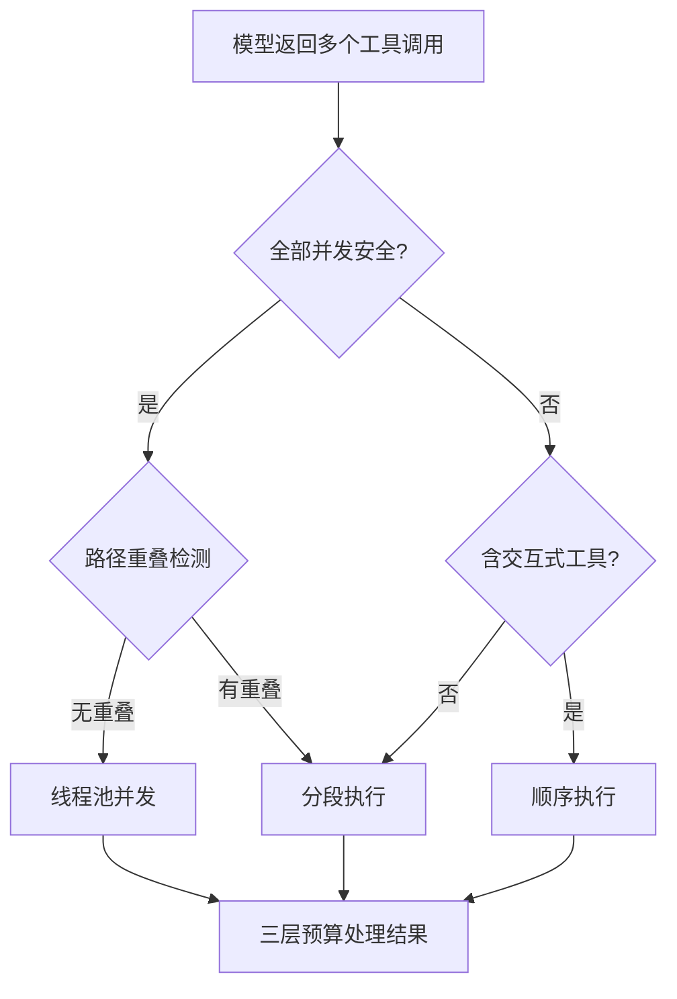
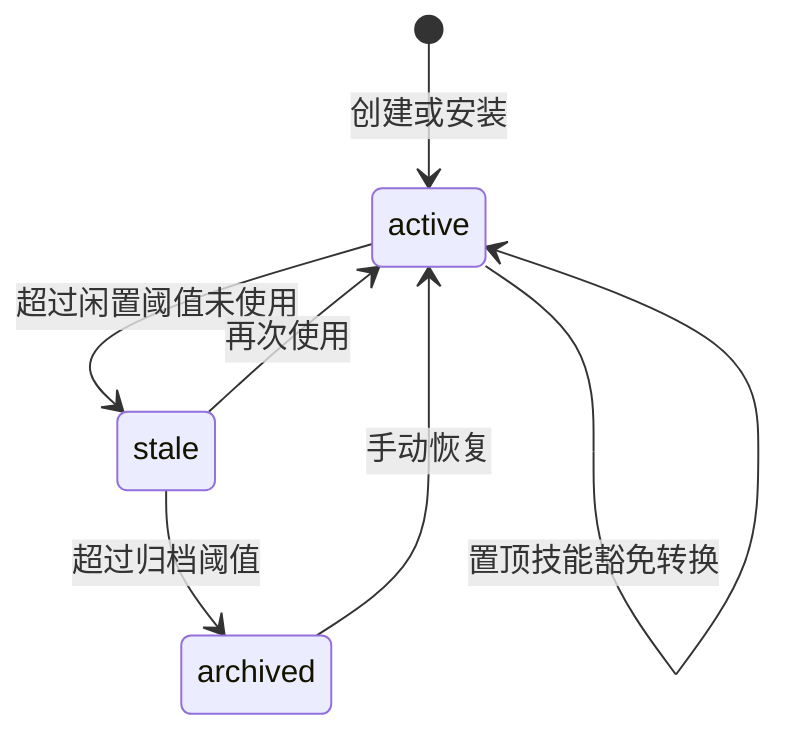
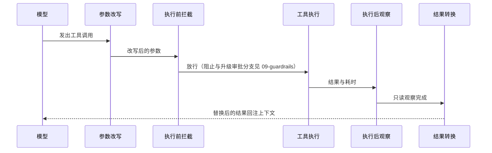

# 工具与扩展生态

## 读前思考

- 100+ 个工具文件、30+ 个平台适配器、任意数量的外部 MCP 服务器、不断被 Agent 自己创建的技能——这些能力要在同一个用户本机进程里长期共存。你会为它们建四套管理体系，还是找到一张能装下所有来源的表？如果选后者，不同来源的生命周期差异（内置的随版本走、远程的会断线、技能会被归档）在哪一层解决？
- 一次 grep 可能返回几十万字符的结果，直接回注上下文会撑爆窗口。截断应该发生在工具内部、调度层还是回注前？如果答案是"每一层都要有"，每层分别防的是什么失败？

## 核心问题

**hermes-agent 的工具面答案是"一张统一注册表贯穿四个环节"：内置工具自注册、MCP 工具命名空间注册、技能与插件各有独立管理面但工具调度路径唯一。** "个人全能助手"的定位意味着工具数量多、执行环境异构、进程长期运行，这三个约束塑造了它重注册治理、重结果预算、重连接自愈的设计。

| 维度 | hermes-agent 的选择 |
|------|--------------------|
| 工具发现 | AST 静态扫描预筛 + 模块自注册 |
| 可见性控制 | 注册时可用性检查函数（带 TTL 缓存与宽限窗口） |
| 并发执行 | 硬编码并发安全白名单 + 路径重叠检测，顺序/并发/分段三模式 |
| 结果控制 | 三层预算（工具自截断 → 单条落盘 → 整轮兜底） |
| MCP | 双向；客户端用后台事件循环 + 每服务器独立任务 + 退避重连 |
| 技能 | 渐进式三层披露 + Curator 自动生命周期 |
| 插件 | 四来源发现 + 五种类型化插件 + 平台延迟加载 |

## 方案展示

### 设计选择一：AST 静态扫描 + 自注册发现

工具发现不维护中心化清单。每个工具文件在模块顶层调用注册函数，启动时先用语法树解析扫描每个工具文件，只导入那些包含顶层注册调用的模块——辅助模块（平台检测、基类定义）因此不会被误导入，避免触发副作用（源码：discover_builtin_tools）。注册时可以附带可用性检查函数，带缓存 TTL 和宽限窗口：依赖（如容器引擎）短暂超时不会立即剥夺工具，沿用上次成功结果，宽限过期才真正降级，防止工具列表抖动。

**为什么这么选**：新增工具只需写文件，零索引维护；AST 预筛把"导入所有文件"的副作用风险挡在门外。代价是注册发生在导入期，模块级异常会让工具静默消失（只记告警）；动态或条件注册无法被 AST 识别，需要平台条件的工具被要求改用可用性检查函数而非条件注册。

### 设计选择二：三层结果预算 + 并发安全判定

结果大小控制分三层递进：第一层工具内部按语义自行截断（搜索工具知道前若干行最相关）；第二层按注册表里每个工具的上限阈值，超限结果写入磁盘、内联只留预览和文件路径；第三层在一轮所有工具完成后检查总量，超过整轮预算就从最大结果开始溢出到磁盘。单条预算按模型上下文窗口比例缩放。文件读取工具被特殊标记为永不落盘，防止"落盘→回读→再落盘"的无限循环。

模型一次返回多个调用时，调度器判定执行模式：全部在并发安全白名单中且操作路径不重叠走并发；含需要用户输入的工具走顺序；混合则分段（先并发安全组，再逐个执行不安全的）。危险命令的审批触发属于执行前拦截，见 09-guardrails.md。



**为什么这么选**：小窗口模型下一条大结果就能撑爆上下文，三层递进保证无论工具作者是否自觉截断都不溢出；白名单集中管理并发信任，第三方来源的工具默认不并发。代价是白名单硬编码需手工维护、路径检测是启发式的（两个工具经间接路径访问同一文件无法覆盖），以及超限结果要靠模型额外发起回读才能拿全。

### 设计选择三：后台事件循环的 MCP 集成 + 统一注册表

MCP 是双向的：客户端消费外部工具，服务器端把自身消息会话暴露给外部客户端（源码：mcp_serve.py）。客户端侧，所有连接运行在一个共享的守护线程事件循环上，每个服务器是一个长生命周期任务，经历连接、发现、注册、保活、重连的完整状态机；同步的工具系统通过跨线程调度把调用送进这个循环（源码：MCPServerTask、run_coroutine_threadsafe）。

MCP 工具以命名空间前缀注册进与原生工具相同的注册表，Agent 循环对来源完全无感；双下划线前缀保证远程工具永远不会覆盖内置工具。重连策略区分故障性质：权限与配置类永久失败立即进入驻留状态并注销工具，周期性自探测恢复后重新注册；瞬态失败走带抖动的指数退避，超过重试上限也转驻留。启动期四层安全模型（供应链预检、环境变量白名单、描述注入扫描、凭证脱敏）见 09-guardrails.md。

**为什么这么选**：取消域语义要求连接在同一任务中打开和关闭，专用后台循环让连接生命周期与循环绑定；统一注册表的零侵入收益是持续的——Agent 代码永远不需要 MCP 感知逻辑。代价是跨线程复杂度（锁保护、上下文变量手动传播）、stdio 单流的调用序列化瓶颈，以及命名空间前缀的额外 token。

### 设计选择四：技能渐进式披露 + Curator 生命周期

技能是 Markdown 程序性指令，不是代码。发现走三层渐进披露：系统提示词只含名称加截断描述（第一层），Agent 判断需要后调用查看工具加载完整内容（第二层），技能目录下的参考文件再按需加载（第三层）（源码：skill_view）。激活有两条路：用户斜杠命令触发（经模板变量替换与平台检查后注入为用户消息），或 Agent 自主查看。索引占用的 token 与被压缩风险属于提示词组装面，见 05-context.md；安装扫描与三级信任策略见 09-guardrails.md。

生命周期由后台 Curator 自动维护：每个技能的使用遥测存在独立的 sidecar 文件中（不污染技能内容本身），超过闲置阈值标记陈旧、超过归档阈值移入归档目录，永不删除——技能是程序性记忆，误删不可逆；用户标记置顶的技能豁免一切自动转换（源码：bump_use）。

技能来源支持多目录合并：除本地技能目录外，可在配置中声明外部技能目录（如团队共享目录或其他 profile 的目录），外部目录参与索引但只读——Curator 不归档它们，新技能始终写入本地目录。这一配置让多个隔离的配置档案之间可以显式共享技能，而不必放弃档案间的状态隔离。



**为什么这么选**：几百个技能的完整内容远超任何窗口，但名称加短描述的索引完全可承受；永不删除与归档可恢复反映了程序性记忆的定位。代价是短描述可能让功能相似的技能互相混淆、激活要多一轮工具调用，且外部目录的只读语义要求所有自动维护逻辑都区分来源。

### 设计选择五：插件四来源发现 + 五种类型

插件从四个来源发现：内置发行、用户目录、项目目录、包管理器安装（通过 entry_points 自动识别）；分五种类型——独立功能始终加载、后端按需加载、互斥后端只激活一个、平台适配器延迟加载、模型提供商按需加载。平台延迟加载是关键：30+ 平台的 SDK 只在用户实际配置了该平台时才导入，CLI 命令保持秒开。工具执行钩子作为扩展机制提供四个介入点（参数改写、执行前、结果变换、执行后观察），其作为执行拦截的阻断语义见 09-guardrails.md；项目目录来源的插件受类型限制（不能注册高权限类型），限制机制见 09-guardrails.md。

**为什么这么选**：四种来源覆盖分发场景，五种类型让管理器对不同类型应用不同加载策略。代价是类型语义边界不总是清晰、来源间优先级规则增加复杂度，且钩子间可能产生意外交互。

### 设计选择六：工具执行钩子链

插件通过四个介入点横跨工具调用的完整生命周期，按执行顺序依次是：请求中间件改写参数（tool_request_middleware）、执行前拦截判定（pre_tool_call）、执行后观察（post_tool_call）、结果转换（transform_tool_result）。请求中间件在参数进入调度前统一改写，外部来源工具的参数在此被解析修复，改写结果与追踪记录继续流向护栏检查；执行前拦截是安全类插件的介入位，对调用给出硬阻止、升级审批或放行三种判定，三分支语义见 09-guardrails.md；工具执行完成后先触发执行后观察，只读接收结果与耗时、不改内容，是审计与遥测类插件的介入位；最后是结果转换，插件用字符串替换最终结果（第一个有效返回值生效），发生在结果回注上下文之前，是格式化与规范化类插件的介入位。四个介入点都按插件优先级排序执行，单个钩子抛错只记日志，不阻断调用链。



**为什么这么选**：四个介入点覆盖工具调用从参数到结果的完整生命周期，插件按职责选介入位——安全插件拦在执行前，审计插件挂在观察位，格式化插件挂在转换位，都不需要修改核心工具代码。**牺牲了什么**：多个插件注册同一介入点时，执行顺序依赖插件优先级，存在先后与交互问题；结果转换位能替换任何结果，恶意插件可以污染工具输出，信任边界由插件来源分级约束（见 09-guardrails.md）。

## 完整执行流：一次 MCP 工具调用的完整生命周期

以用户配置了一个 stdio 的代码托管 MCP 服务器、模型调用其创建议题工具为例：

```mermaid
sequenceDiagram
    participant CFG as 启动发现
    participant LOOP as 后台事件循环
    participant TASK as 服务器任务
    participant PROC as stdio 子进程
    participant REG as 统一注册表
    participant AGENT as Agent 工具调度
    participant BUD as 结果预算

    CFG->>LOOP: 为每个配置的服务器创建任务
    TASK->>PROC: 启动子进程 握手 发现工具
    TASK->>REG: 以命名空间前缀注册工具
    TASK->>TASK: 进入保活循环

    AGENT->>REG: 解析参数 经插件中间件与护栏检查
    AGENT->>LOOP: 跨线程调度该工具的调用
    LOOP->>PROC: 经会话发送调用
    PROC-->>LOOP: 返回结果
    LOOP-->>AGENT: 结果经凭证脱敏与格式规范化
    AGENT->>BUD: 单条预算检查 超限落盘留预览
    BUD-->>AGENT: 回注对话上下文
```

**阶段一：启动发现。** 原生工具发现完成后，MCP 发现读取配置为每个服务器启动任务，所有服务器并行握手，单个失败不阻塞其他。stdio 传输拉起子进程建立标准输入输出通道，握手后获取工具列表（带分页安全阀），逐个以命名空间前缀注册。

**阶段二：保活与重连。** 注册完成后任务进入保活循环，定期探测服务器；不支持探测命令时降级为重新列举工具，并锁存该降级决定避免反复尝试。连接断开时按故障性质分流：瞬态走退避重试，永久失败注销工具进驻留状态等待自探测。

**阶段三：调度执行。** Agent 拿到工具调用后先解析参数（非法 JSON 直接转结构化错误、工具不执行），经插件中间件改写与护栏循环检测，再走审批判定；放行后按名称查注册表，MCP 前缀决定它被跨线程调度到后台循环执行。执行中轮询中断信号，用户取消时把终止传播到执行线程。

**阶段四：结果处理。** 结果经凭证脱敏、格式规范化后进入三层预算：未超限直接回注，超限写磁盘留预览与路径。一轮全部完成后若总量超标，从最大结果开始溢出。

**边界路径——子进程崩溃。** 管道关闭被任务检测到即触发重连；孤儿进程由看门狗按进程组追踪清理。重连期间工具已从注册表注销，模型下一轮看不到它们——这正是避免"僵尸工具"被反复调用的关键。

**边界路径——服务器反向请求。** MCP 服务器可以反向请求一次模型调用（Sampling），任务把请求转给辅助模型客户端完成后回传，让服务器无需自己持有密钥。

## 工程优化

**参数类型强转**：修复模型常见的类型漂移——字符串数字转整数、字符串布尔转布尔、裸标量包成列表。这是必要防御而非可选优化，否则工具处理器会因类型不符直接崩溃。

**schema 消毒**：外部服务器返回的 schema 常不规范（缺枚举、缺属性、引用旁挂兄弟键），发送模型前统一修复，防止严格后端拒绝整个请求。

**注册防覆盖**：跨工具集的同名注册默认拒绝，防止插件静默替换内置工具劫持命令执行；显式覆盖需要操作员开启。

**守护线程池**：执行线程为守护线程，卡死的工具不会阻塞进程退出；中断信号按线程标记，主线程收到取消后需显式扇出到所有工作线程。

**连接冷却与健康证明**：失败的服务器进入冷却期，防止每次发现都重复拉起失败进程；握手成功不等于健康，必须由保活或实际调用成功来证明，才清除重连预算。

## 面试要点

**1. 为什么用 AST 扫描预筛而不是直接导入所有工具文件？动态注册怎么办？**

导入所有文件的问题不在性能而在副作用：辅助模块可能触发平台检测、依赖检查甚至界面初始化。AST 预筛只导入确实包含顶层注册调用的模块，把启动副作用最小化。代价是条件注册或运行时注册无法被发现。判断标准是"工具注册是否是模块级确定性行为"——是则 AST 足够，需要条件加载的场景应改用带缓存的可用性检查函数，而不是条件注册。

**2. 三层结果预算是不是过度设计？只做一层（回注前统一截断）不够吗？**

一层截断的问题在决策权归属：只在回注前截断，工具作者无法控制截掉什么（可能丢掉关键信息）；只靠工具内部截断，不自觉的作者会忘记。三层的分工是——第一层给作者语义感知的截断权，第二层是单条结果的系统安全网，第三层是整轮总量的全局安全网，每层防不同的失败。判断标准是"工具作者的可信度 × 输出大小的方差"：内置小工具集一层够用，异构大工具集必须分层。

**3. 并发安全白名单是中心化管理，claudecode 的声明式是去中心化，第三方工具接入时哪种更安全？**

白名单更安全：第三方来源的工具默认不在名单中，走顺序执行，即使它自称并发安全也不会被放行；声明式则需要对每个非内置来源强制降级为不并发，否则框架无法校验声明真伪。白名单的代价是维护成本——每个新内置工具要人工标注。判断标准是"信任边界画在谁身上"：信任框架维护者用白名单，信任工具作者用声明式；来源越不可控越应中心化。
