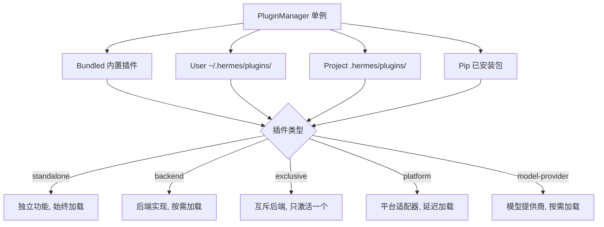
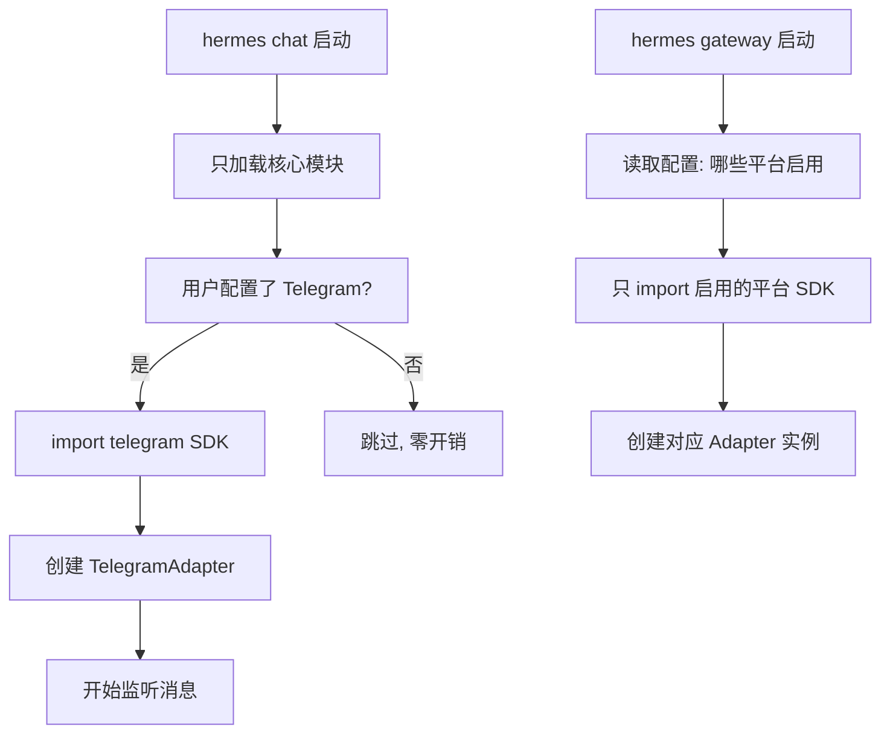
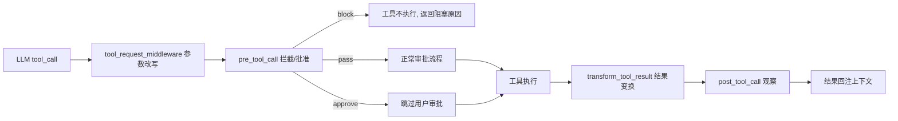
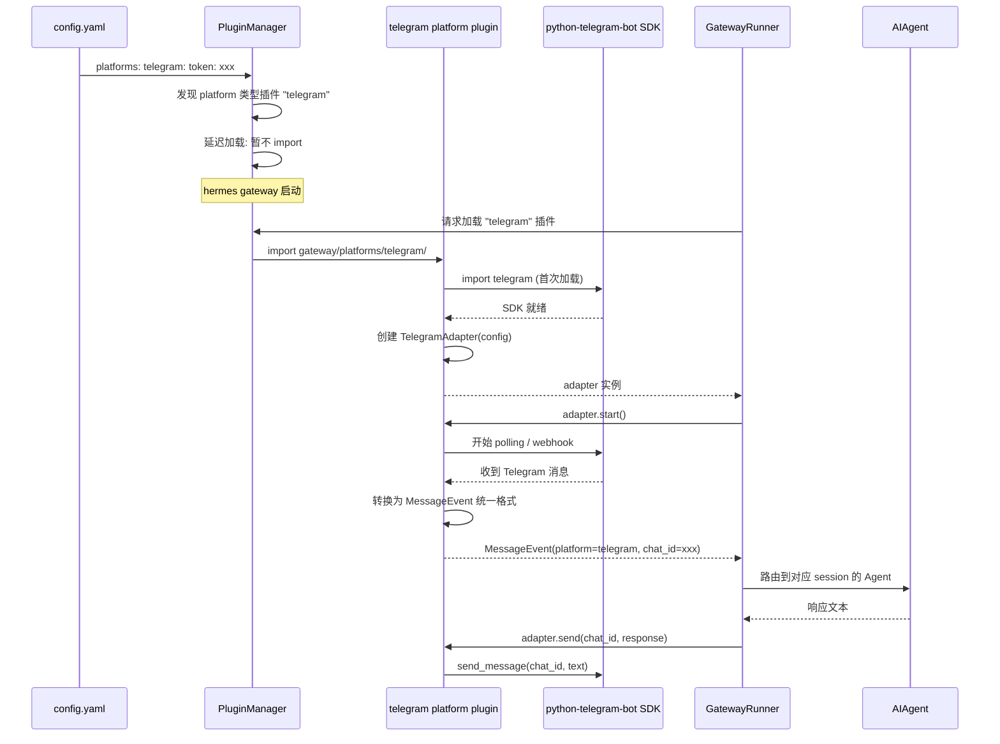

# 插件/扩展系统

## 读前思考

- 一个 Agent 框架需要支持"模型提供商扩展""记忆后端扩展""平台适配器扩展"——这些扩展的加载时机、生命周期、作用域完全不同。你会用一套统一的插件机制覆盖所有类型，还是为每种类型设计独立的扩展点？
- 如果 30 个平台适配器（Telegram、Discord、Slack...）各自依赖不同的 SDK，全部在启动时 import 会怎样？你怎么做到"只加载用户实际使用的平台"？

## 核心问题

插件/扩展系统解决的核心问题是：**如何让第三方或内置扩展以统一的方式接入 Agent 的各个子系统（模型、记忆、工具、平台），同时控制加载开销和作用域？**

Hermes 的插件系统服务于它的"全能助手"定位——需要接入 30+ 消息平台、多种模型后端、多种记忆存储。如果所有扩展都在启动时加载，冷启动时间不可接受（每个平台 SDK 的 import 可能耗时数百毫秒）。插件系统的核心挑战是"延迟加载"和"作用域隔离"。

| 维度 | Hermes 的选择 |
|------|--------------|
| 管理器 | PluginManager 单例 |
| 发现源 | 四源：Bundled / User / Project / Pip |
| 插件类型 | 五种：standalone / backend / exclusive / platform / model-provider |
| 加载策略 | 延迟加载（平台 SDK 首次使用时才 import） |
| 钩子系统 | pre_tool_call / post_tool_call / transform_tool_result / tool_request_middleware |

## 方案展示

### 设计选择一：四源发现 + 五种类型

PluginManager 从四个来源发现插件：Bundled（随 Hermes 分发的内置插件）、User（`~/.hermes/plugins/` 用户目录）、Project（项目根目录的 `.hermes/plugins/`）、Pip（通过 Python 包管理器安装的插件）。每个插件声明自己的类型，类型决定了加载时机和作用域。

**为什么这么选**：四源覆盖了插件分发的所有场景——内置功能随代码走（Bundled）、个人定制放用户目录（User）、项目特定配置跟项目走（Project）、社区生态通过包管理器（Pip）。五种类型让 PluginManager 可以对不同类型应用不同的加载策略：standalone 始终加载（如日志增强），platform 延迟加载（如 Telegram SDK 只在用户配置了 Telegram 时才 import）。

**牺牲了什么**：四源之间的优先级需要明确规则（Project 覆盖 User 覆盖 Bundled），冲突解决增加了复杂度。五种类型的语义边界不总是清晰——一个"提供新工具"的插件是 standalone 还是 backend？类型判断错误会导致加载时机不对。

### 设计选择二：平台插件延迟加载

30+ 平台适配器（gateway/platforms/ 下的 telegram/、discord/、slack/ 等）各自依赖不同的 SDK（python-telegram-bot、discord.py、slack-sdk...）。这些 SDK 的 import 可能耗时数百毫秒且可能失败（未安装）。Hermes 的解决方案是延迟加载——平台 SDK 只在用户实际配置了该平台时才 import。

**为什么这么选**：`hermes chat`（CLI 对话）不需要任何平台 SDK，如果启动时 import 全部 30 个平台，冷启动时间增加数秒。延迟加载让 CLI 命令保持快速启动，只有 `hermes gateway`（实际运行消息网关时）才加载平台 SDK。未安装的 SDK 不会导致启动失败——只有在用户配置了该平台且 SDK 缺失时才报错。

**牺牲了什么**：延迟加载意味着配置错误（如配置了 Telegram 但没装 SDK）要到运行时才暴露，而非启动时。调试"为什么我的平台不工作"时需要理解加载时机。此外，延迟加载的 import 发生在事件循环中，如果 SDK import 阻塞（如编译 C 扩展），会阻塞整个网关启动。

### 设计选择三：工具执行钩子链

插件可以通过四种钩子介入工具执行的生命周期：`pre_tool_call`（执行前拦截/批准/阻塞）、`post_tool_call`（执行后观察，不修改结果）、`transform_tool_result`（变换工具结果）、`tool_request_middleware`（改写工具参数）。钩子按插件优先级排序执行。

**为什么这么选**：钩子链让插件可以在不修改核心工具代码的情况下扩展行为——安全插件可以在 pre_tool_call 中阻塞危险操作，审计插件可以在 post_tool_call 中记录所有工具调用，格式化插件可以在 transform_tool_result 中美化输出。四种钩子覆盖了工具生命周期的所有介入点。

**牺牲了什么**：钩子链的执行顺序依赖插件优先级，多个插件注册同一钩子时可能产生意外交互（如一个插件 approve 了，另一个插件 block 了）。钩子的异常处理需要谨慎——一个插件的 pre_tool_call 抛异常不应该阻塞工具执行。transform_tool_result 可以修改结果，恶意插件可以篡改工具输出。

## 核心机制执行流：一个平台插件从发现到处理消息

以 Telegram 平台插件为例：

**阶段一：发现与延迟。** PluginManager 在启动时扫描四源，发现 telegram 平台插件（Bundled 源，位于 gateway/platforms/telegram/）。因为类型是 platform，只记录元数据（名称、配置需求），不执行 import。

**阶段二：按需加载。** `hermes gateway` 启动时，GatewayRunner 读取配置发现用户启用了 telegram。通过 PluginManager 请求加载该插件——此时才执行 `import telegram`（SDK）和 `import gateway.platforms.telegram`（适配器代码）。如果 SDK 未安装，在此刻报错并给出安装指引。

**阶段三：适配器初始化。** TelegramAdapter 继承 BasePlatformAdapter，实现 `start()`（开始 polling 或注册 webhook）、`send()`（发送消息）、`handle_update()`（处理收到的消息）。适配器负责将平台特有的消息格式转换为统一的 `MessageEvent`。

**阶段四：消息路由。** GatewayRunner 收到 MessageEvent 后，根据会话键（platform + chat_id + thread_id）路由到对应的 Agent session。Agent 处理完毕后，响应通过适配器的 `send()` 方法发回平台。

**边界路径——SDK 热更新：** 如果用户在运行时修改了 Telegram token，GatewayRunner 可以重启对应适配器（stop → 重新创建 → start），无需重启整个网关。

**边界路径——平台能力差异：** 某些平台支持编辑消息（Telegram）、某些不支持（SMS）。适配器通过能力标志（`capabilities` 字典）声明支持的功能，GatewayRunner 根据能力决定投递策略（如不支持编辑时改为追加新消息）。

## 工程优化

**Bundled 插件的零配置加载**：内置插件（如 gateway/builtin_hooks/ 下的扩展钩子）不需要用户配置，PluginManager 在发现时自动激活。这保证了核心功能（如日志、审计）开箱即用。

**Pip 插件的 entry_points 发现**：通过 Python 包的 entry_points 机制（`[project.entry-points."hermes.plugins"]`）发现已安装的插件包。用户 `pip install hermes-plugin-xxx` 后无需手动配置，PluginManager 自动发现。

**插件异常隔离**：每个插件的钩子调用都在 try/except 中执行。一个插件的异常不会传播到其他插件或核心逻辑——异常被记录到日志，钩子返回 None（表示"不介入"）。

**exclusive 类型的互斥保证**：同一类别的 exclusive 插件只能有一个活跃（如两个不同的记忆后端）。PluginManager 按优先级选择第一个可用的，其余跳过。配置中可以显式指定使用哪个。

**Project 插件的沙箱限制**：项目目录下的插件（.hermes/plugins/）可能有恶意代码（如克隆了一个含恶意插件的仓库）。Hermes 对 Project 源插件施加额外限制：不能注册 model-provider 类型（防止窃取 API key）、不能注册 exclusive 类型（防止覆盖核心后端）。

## 面试要点

**问题一：五种插件类型是否过度设计？用"优先级 + 标签"能否替代类型系统？**

类型系统的价值在于"加载策略的类型安全"——platform 类型一定延迟加载，standalone 一定立即加载。如果用标签（如 tags: ["lazy", "platform"]），加载策略变成标签的组合判断，容易出现不一致（如标记了 lazy 但没标记 platform 的插件该怎么加载？）。类型是"加载策略的枚举"，标签是"功能的描述"——两者解决不同问题。代价是类型边界不总是清晰，新插件可能不确定自己属于哪个类型。如果类型数量超过 7-8 个，可能需要引入类型继承或组合。

**问题二：延迟加载（首次使用时 import）vs 预加载（启动时全部 import），在什么场景下延迟加载反而是坏选择？**

延迟加载的坏处：(a) 首次使用有延迟——用户第一次发 Telegram 消息时，需要等 SDK import 完成（可能 1-2 秒）；(b) 错误延迟暴露——配置错误到运行时才发现；(c) 并发风险——如果两个消息同时到达，可能触发两次 import（需要锁保护）。预加载更好的场景：如果平台数量少（只启用了 1-2 个），预加载的启动开销可接受，且能在启动时发现所有配置错误。Hermes 选择延迟加载是因为它支持 30+ 平台，预加载全部的开销不可接受。

**问题三：工具执行钩子链（pre/post/transform/middleware）的安全风险是什么？如何防止恶意插件通过钩子攻击？**

攻击面：(a) pre_tool_call 可以 approve 所有操作，绕过用户审批；(b) transform_tool_result 可以篡改工具输出（如把文件内容替换为恶意指令）；(c) tool_request_middleware 可以改写工具参数（如把 `rm file.txt` 改为 `rm -rf /`）。Hermes 的缓解：Project 源插件有沙箱限制（不能注册某些类型）；钩子调用有超时（防止阻塞）；post_tool_call 是只读的（不能修改结果）。但 transform_tool_result 确实可以修改结果——这是功能需要（格式化插件），也是安全风险。完全防御需要"钩子签名"（插件声明自己要修改什么，用户确认），但这增加了使用摩擦。
