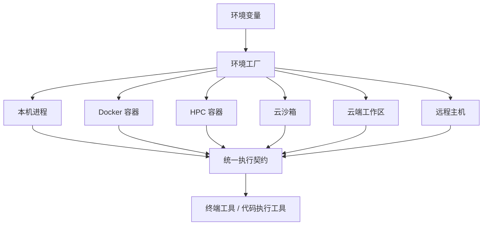
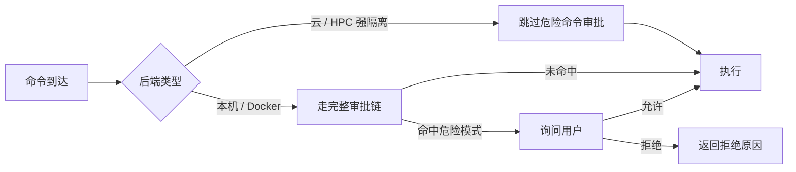
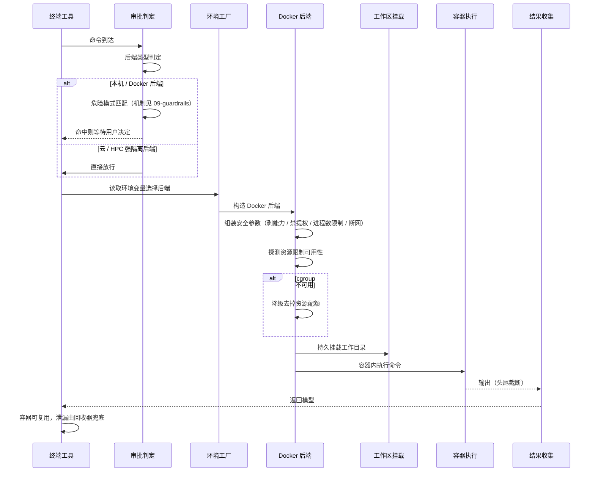

# 执行运行时与隔离

## 读前思考

- 一个执行层要支持六种环境：本机进程、Docker 容器、HPC 容器、云端沙箱、云端工作区、远程主机。安全逻辑怎么写才能不写六份？如果每种环境的安全能力不一样，你怎么决定哪些环境需要人工审批、哪些不需要？
- 终端执行用"长驻 shell"（开一个终端一直用）还是"每次调用新建"（每次执行起新进程）？长驻省启动开销但状态可能漂移，每次新建干净但每回都要恢复现场——你选哪个，为什么？

## 核心问题

**执行时隔离要解决的是：让终端与代码执行在多种隔离等级的后端之间可切换，后端选择对工具层透明，且隔离强度与治理强度联动——环境越隔离，越不需要人工审批。**

hermes-agent 运行在用户本机，终端工具可以执行任意 shell 命令。它的答案是一个环境工厂：后端选择完全由环境变量驱动，六种后端实现同一个抽象契约，工具层零分支。安全上采用"隔离强度决定治理强度"：环境自带操作系统边界的后端免去危险命令审批，环境直接接触用户机器的后端保留完整审批链。危险命令审批机制本身见 09-guardrails，本篇只讲执行环境与审批的联动接口。

| 维度 | hermes-agent 的选择 |
|------|---------------------|
| 后端 | 本机 / Docker / Singularity / Modal / Daytona / SSH 六种 |
| 驱动方式 | 环境变量驱动，代码零分支 |
| 执行模型 | 每次调用新建执行上下文，会话快照恢复状态 |
| 持久化 | 工作目录持久挂载，跨调用保留文件状态 |
| 治理联动 | 强隔离后端跳过危险命令审批 |

## 方案展示

### 设计选择一：环境变量驱动 + 环境工厂统一抽象

工具层定义抽象基类（BaseEnvironment）作为所有后端的统一契约——执行命令、获取输出、设置超时。一个工厂按环境变量的值分发构造对应的后端实例：本机后端用子进程直跑宿主；Docker 后端组装容器安全参数；Singularity 是 HPC 容器；Modal 与 Daytona 是云端执行；SSH 把命令发到远程主机。工具层与审批层只认抽象契约，完全不感知后端差异。

**为什么这么选**：个人助手的部署环境千差万别——本地开发图快，处理不信任代码要隔离，企业环境要求完全隔离。一个环境变量切换隔离等级，部署方不用改代码；统一契约让新增后端只写一个实现类，工具层永远零改动。**牺牲了什么**：六种后端能力不齐——网络、配额、通信通道各不相同，审批豁免、资源限制等逻辑必须逐后端显式适配，这是持续的适配成本；抽象掩盖了后端差异，模型可能困惑于"为什么这台机器上没有我的文件"。

### 设计选择二：隔离强度决定治理强度

危险命令审批链对每条命令做判定，但判定之前先看后端类型：容器与云后端（Singularity、Modal、Daytona）命中"跳过容器守卫"分支，直接不进审批链；本机与 Docker 后端则必须走完整审批。理由是强隔离后端自带操作系统边界，命令即使危险，破坏范围也被环境框住，再审批是重复打断。

**为什么这么选**：审批是给"危险但可解释"的命令留的人工闸门，它的价值在于兜住本机执行——那里命令真的会碰用户文件。云端与 HPC 容器里命令本来就碰不到什么，再弹窗只是浪费用户注意力。联动让"隔离"与"审批"按强度互补，而不是重复建设。**牺牲了什么**：安全假设绑定在后端语义上——如果用户把容器后端配置弱化（开了网络、挂载了目录），审批链仍是唯一防线，而"跳过"判定不会自动失效；判定逻辑本身也是逐后端维护的适配税，新增后端时容易漏配。

### 设计选择三：spawn-per-call——每次调用新建执行上下文

执行模型不是长驻 shell，而是每次调用起新的进程或容器，会话快照负责找回环境变量等状态，文件状态由持久挂载的工作目录跨调用保住；目录落在专用沙箱目录下，bind mount 进每次新建的环境。

**为什么这么选**：长驻 shell 的状态会漂移——上一次执行的残留变量、变更的目录会影响下一次结果，模型看到的行为不稳定。每次新建干净可控，执行结果可复现；丢失的"现场"用两级补偿：环境级状态靠会话快照恢复，文件级状态靠持久挂载保留。**牺牲了什么**：每次调用都有启动开销与环境恢复成本，冷启动延迟高于长驻 shell；若快照恢复不完整，环境变量等状态可能缺失，需要模型自行应对。

## 核心机制执行流：一次 Docker 后端调用

以模型调用一次终端命令、后端为 Docker 为例，走完审批联动、环境构造、执行、清理的完整链路：

**阶段一：审批联动判定。** 命令到达后先判定后端类型：云与 HPC 后端直接放行；本机与 Docker 后端进审批链——危险模式匹配、会话级记忆、用户确认（审批链全部机制归 09-guardrails）。这里的关键是联动的边界：审批决策发生在执行之前，环境选择发生在审批之后，两层的接口就是这一个"是否跳过"的判定。

**阶段二：环境构造。** 工具读取环境变量得到后端选择与镜像、超时、挂载配置，工厂分发构造 Docker 后端。构造时组装安全参数：剥光全部 Linux 能力、禁止提权、限制进程数防 fork 炸弹、探测 cgroup 可用性后追加 CPU 与内存配额、按配置断网、附加磁盘配额防写爆宿主。探测失败的场景（如 LXC 容器内）静默降级去掉资源配额，保证启动不失败。

**阶段三：工作区解析。** 持久挂载的工作目录映射进容器，宿主当前目录也可按配置映射为容器内工作区。文件状态因此跨调用保留，补偿 spawn-per-call 的"环境重置"。

**阶段四：执行与输出治理。** 容器内执行命令，超时到点杀进程。输出按"头尾保留"策略截断——头部保留上下文、尾部保留错误信息，防止工具输出撑爆模型上下文窗口。代码执行工具与执行环境之间还有一条通信通道，向环境内注入辅助脚本，让沙箱内代码能反向回调 Agent 的工具（本机走本地套接字，远程走文件通道）。

**阶段五：清理。** 容器可复用不销毁；泄漏的执行容器由后台回收器异步回收，防止长跑后资源爬升。

**边界路径——审批拒绝**：命中危险模式且用户拒绝时命令不执行，返回拒绝原因让模型改路。**边界路径——资源降级**：cgroup 不可用时资源配额静默移除，隔离强度下降但可用性保住。**边界路径——容器泄漏**：回收器兜底，不阻塞主流程。

## 工程优化

**输出头尾截断**：按头部加尾部策略截断执行输出，错误信息常在尾部，保留尾部让模型能定位失败原因，同时保护上下文预算。

**资源限制探测降级**：cgroup 不可用环境自动去掉 CPU 与内存配额，避免启动失败；磁盘配额在部分平台不支持时同样跳过。

**并发会话隔离**：审批状态与执行环境状态按会话隔离存储，多会话并发时互不串扰（此前的全局共享导致过越权漏洞，修复后以此为准）。

**孤儿容器回收器**：异步回收泄漏的执行容器，长跑服务不因资源爬升劣化。

**输出安全处理**：工具错误消息中的标记类文本剥离后再回喂模型，防止工具输出被误读为指令（输出脱敏手段归 09-guardrails）。

## 面试要点

**1. 为什么用环境变量驱动后端选择，而不是配置文件或代码分支？**

参考答案方向：环境变量在部署层就能改，容器化部署、CI 环境注入变量即可切换隔离等级，不用动代码、不用改配置模板；代码里也只保留一个工厂分发点，新增后端零侵入。代价是环境变量是全局的、隐式的，出问题时排查"当前用的是哪个后端"要翻部署配置。判断标准是"部署面切换频率 × 需要零改动的代码面"：部署频繁、代码面大时环境变量驱动收益明显。

**2. "隔离强度决定治理强度"的假设是什么？什么情况下这个联动会失效？**

参考答案方向：假设是"强隔离后端自带操作系统边界，危险命令的破坏范围被环境框住"。失效条件有二：后端配置被弱化（容器开了网络、挂了目录）而联动判定仍按类型跳过；新增后端漏配豁免规则，导致该审批的没审批或不用审批的反被拦截。失效的修复方向是让豁免条件检查实际配置而非类型标签。判断标准是"后端语义的稳定性 × 审批链的兜底价值"：语义越易漂移，越该把联动判定建立在配置事实而非类型上。

**3. spawn-per-call 和长驻 shell 各在什么条件下成立？状态恢复怎么补偿？**

参考答案方向：长驻 shell 省启动开销、适合低延迟交互，但状态漂移会让执行结果不可复现，多轮任务里"上次的残留"会污染下一次执行；spawn-per-call 干净可复现，代价是每次启动与环境恢复成本，靠会话快照恢复环境级状态、持久挂载保住文件级状态来补偿。判断标准是"状态漂移风险 × 启动成本"：任务越要求确定性、启动成本越可接受，每次新建越划算。
