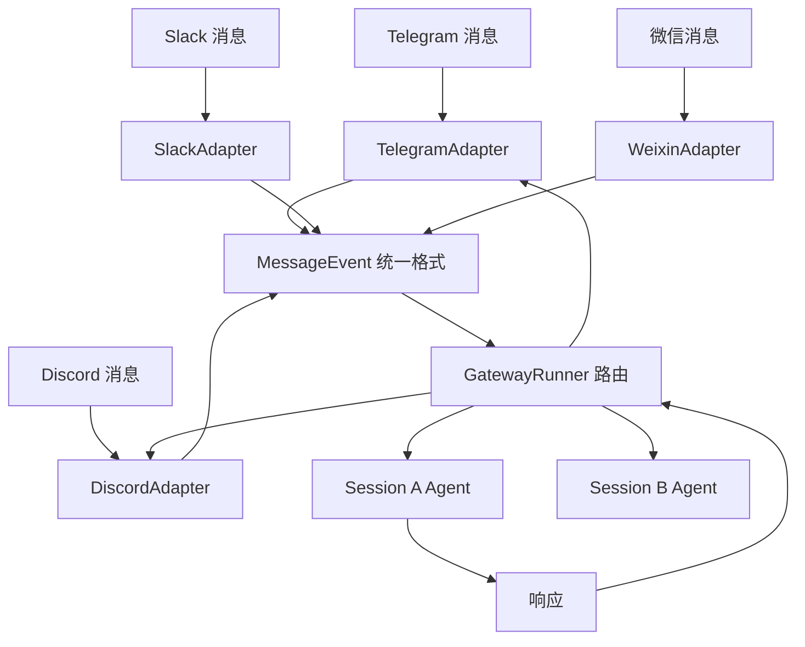
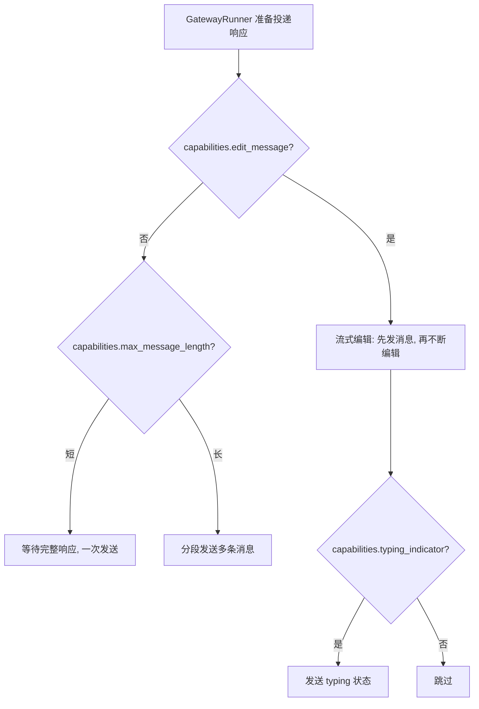
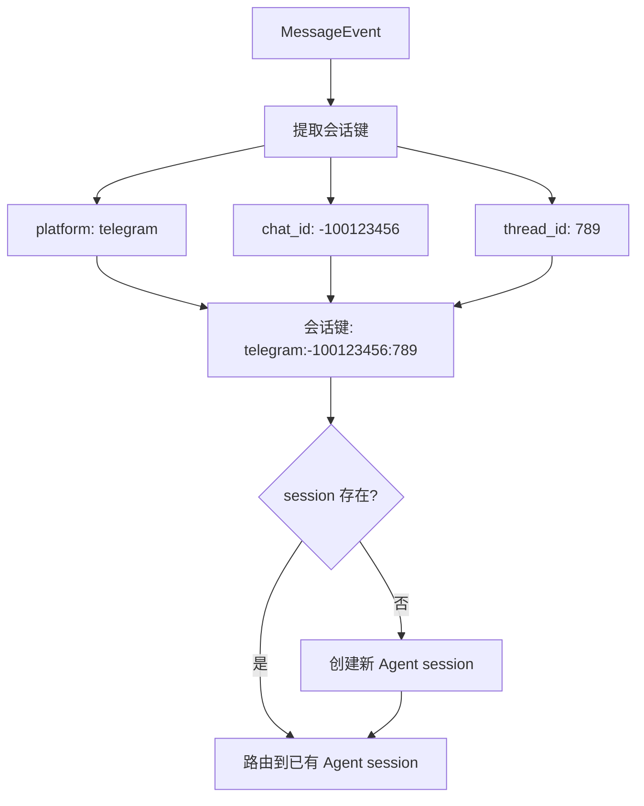
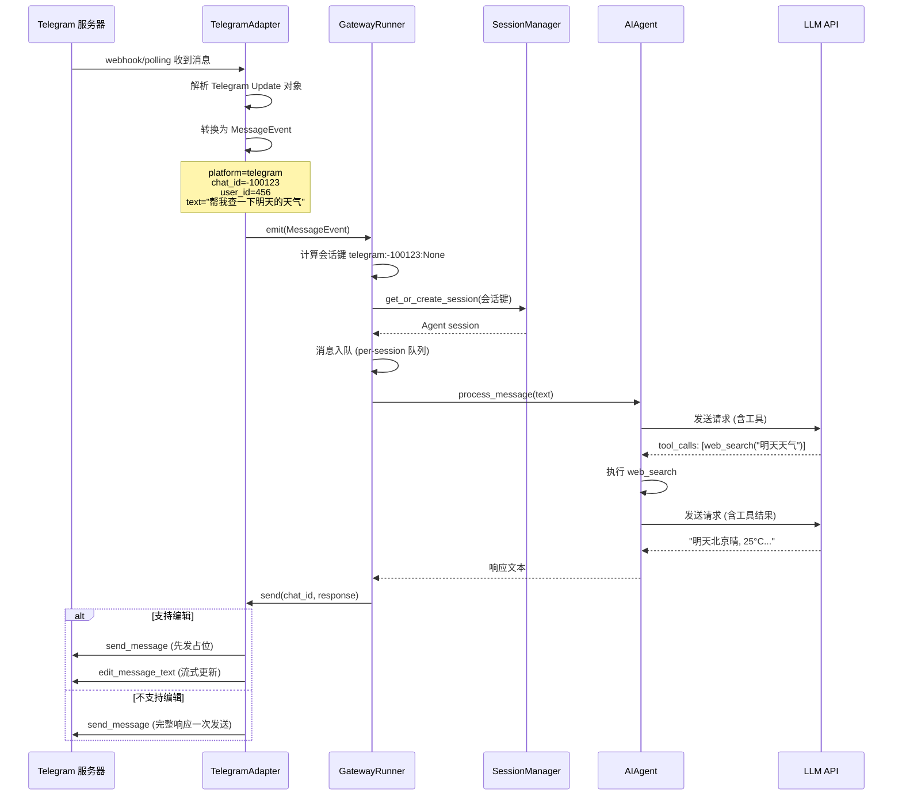

# 消息通道/IM 集成

## 读前思考

- 如果你要同时支持 Telegram、Discord、Slack、微信、飞书、邮件、SMS 等 30+ 个消息平台，你会为每个平台写一个独立的 Agent 实例，还是让所有平台共享同一个 Agent？如果共享，怎么区分"这条消息来自 Telegram 群聊"还是"来自 Slack 私聊"？
- 用户在 Telegram 上发了一条消息，Agent 正在处理时用户又在 Discord 上发了一条——这两个请求应该排队等还是并行处理？如果并行，Agent 的对话状态怎么隔离？

## 核心问题

消息通道/IM 集成解决的核心问题是：**如何让一个 Agent 同时服务 30+ 个消息平台上的多个用户/聊天，保证会话隔离、消息可靠投递、平台差异透明？**

Hermes 的 gateway 是整个系统最复杂的子系统——`gateway/run.py` 高达 24K 行，承载了消息路由、Agent 调度、流式投递、错误恢复等全部网关逻辑。它的复杂度来源于"多平台 × 多聊天 × 多线程"的组合爆炸。其运行时装配、并发守卫与生命周期治理见 14-gateway.md。

| 维度 | Hermes 的选择 |
|------|--------------|
| 抽象模型 | BasePlatformAdapter + MessageEvent 统一事件 |
| 平台差异 | 能力标志（capabilities dict）而非继承 |
| 会话隔离 | 会话键分层路由（platform + chat_id + thread_id） |
| 投递策略 | 流式编辑（支持的平台）/ 追加消息（不支持编辑的平台） |
| 并发模型 | per-session Agent 实例 + 消息队列 |

## 方案展示

### 设计选择一：BasePlatformAdapter + MessageEvent 统一事件

所有平台适配器继承 `BasePlatformAdapter` 抽象基类，实现统一的接口：`start()`（开始监听）、`stop()`（停止监听）、`send()`（发送消息）。平台收到的消息被转换为统一的 `MessageEvent` 结构（包含 platform、chat_id、user_id、text、attachments 等字段），GatewayRunner 只处理 MessageEvent，不感知平台细节。

**为什么这么选**：30+ 平台的消息格式、认证方式、投递 API 完全不同。统一事件模型让 GatewayRunner 的路由逻辑只写一次——无论消息来自哪个平台，路由、Agent 调度、会话管理的代码都是同一套。适配器负责"翻译"——将平台特有格式转为 MessageEvent（入站）和将响应转为平台 API 调用（出站）。

**牺牲了什么**：统一事件模型是"最小公分母"——某些平台特有的功能（如 Telegram 的 inline keyboard、Discord 的 embed、Slack 的 Block Kit）无法通过 MessageEvent 表达。适配器可以通过扩展字段传递，但 GatewayRunner 不会处理这些扩展。

### 设计选择二：能力标志而非继承层次

平台差异不用继承层次表达（如 EditablePlatform → TelegramAdapter），而是用能力标志字典（`capabilities = {"edit_message": True, "typing_indicator": True, "max_message_length": 4096}`）。GatewayRunner 根据能力标志选择投递策略。

**为什么这么选**：继承层次在 30+ 平台时变成"继承地狱"——如果 Telegram 支持编辑但不支持 typing，Discord 支持 typing 但编辑有 15 分钟限制，Slack 两者都支持但 API 完全不同，继承树会分裂为大量中间类。能力标志是扁平的——每个平台声明自己"能做什么"，GatewayRunner 根据标志组合选择策略。新增平台只需填写能力字典，不需要找到正确的继承位置。

**牺牲了什么**：能力标志是布尔/数值，无法表达复杂的条件限制（如"编辑只在 15 分钟内有效""编辑后不能再次编辑"）。这些条件需要在适配器内部处理（如 TelegramAdapter 在 15 分钟后自动切换为追加模式），GatewayRunner 不感知。

### 设计选择三：会话键分层路由

每个消息的会话键由三层组成：`platform`（哪个平台）+ `chat_id`（哪个聊天/群组）+ `thread_id`（哪个线程/话题，可选）。相同会话键的消息路由到同一个 Agent session（共享对话历史），不同会话键的消息完全隔离。

**为什么这么选**：一个 Telegram 群组中可能有多个话题（thread），每个话题应该是独立的对话上下文。如果只按 chat_id 路由，不同话题的消息会混在同一个对话中。三层键保证了"同一平台、同一聊天、同一线程"的消息共享上下文，其余完全隔离。

**牺牲了什么**：会话键的粒度是固定的——无法实现"同一用户在不同群组中共享记忆"（需要跨 chat_id 的共享层）。此外，30 个平台 × 每平台 N 个聊天 × 每聊天 M 个线程 = 大量 session，每个 session 有独立的 Agent 实例和对话历史，内存占用随活跃 session 数线性增长。

## 核心机制执行流：一条 Telegram 消息的完整处理

以用户在 Telegram 群组中 @bot 发送"帮我查一下明天的天气"为例：

**阶段一：消息接收与转换。** TelegramAdapter 通过 webhook 或 long polling 接收 Telegram 的 Update 对象。适配器解析消息内容（文本、图片、文件、回复引用），转换为统一的 MessageEvent。如果消息包含图片/文件，附件被下载到本地临时目录，路径放入 MessageEvent.attachments。

**阶段二：会话路由。** GatewayRunner 从 MessageEvent 提取会话键，查找或创建对应的 Agent session。每个 session 有独立的 AIAgent 实例（独立的对话历史、工具配置）。消息进入 per-session 队列——如果 Agent 正在处理上一条消息，新消息排队等待。

**阶段三：Agent 处理。** Agent 从队列取出消息，执行完整的对话循环（LLM 调用 → 工具执行 → 结果回注）。处理过程中，如果平台支持 typing indicator，适配器定期发送"正在输入"状态。

**阶段四：响应投递。** Agent 的响应通过适配器发回平台。对支持编辑的平台（Telegram、Discord），采用"流式编辑"策略：先发送一条占位消息（如"..."），然后随着 LLM 流式输出不断编辑消息内容。对不支持编辑的平台（SMS、邮件），等待完整响应后一次发送。超过平台消息长度限制时，自动分段发送。

**边界路径——并发消息：** 用户在 Agent 处理中又发了新消息。新消息进入 per-session 队列，等当前处理完毕后自动处理。如果用户发了 /stop 或 /cancel，队列被清空，当前处理被中断。

**边界路径——平台断连：** Telegram polling 超时或 webhook 不可达时，适配器自动重连（指数退避）。断连期间的消息由平台缓存（Telegram 的 polling offset 机制保证不丢消息），重连后自动补拉。

## 工程优化

**流式投递的节流**：编辑消息有 API 速率限制（Telegram 约 30 次/秒/聊天）。GatewayRunner 对流式编辑做节流——每 500ms 最多编辑一次，中间累积的文本在下次编辑时一并发送。这防止了"每个 token 一次编辑"导致的 429。

**消息去重**：webhook 模式下平台可能重复投递同一消息（网络超时后重试）。适配器通过 message_id 去重——已处理的 message_id 记入 LRU 缓存，重复消息直接丢弃。

**附件的懒下载**：MessageEvent 中的附件初始只有 URL/文件 ID，不立即下载。只有当 Agent 实际需要处理附件（如用户发了图片要求分析）时，才通过适配器的 `download_attachment()` 下载。这避免了大文件（如视频）的无用下载。

**Session 超时回收**：长时间不活跃的 session（默认 30 分钟无消息）被回收到磁盘（对话历史序列化），释放内存中的 Agent 实例。下次消息到达时从磁盘恢复。

**多平台消息格式适配**：Agent 的响应是 Markdown 格式，但不同平台的 Markdown 方言不同（Telegram 用 MarkdownV2、Discord 用标准 Markdown、Slack 用 mrkdwn）。适配器负责格式转换——如 Telegram 需要转义特殊字符（`.`、`-`、`(`），Slack 需要把 `**bold**` 转为 `*bold*`。

## 面试要点

**问题一：30+ 平台用统一 MessageEvent 抽象，这个抽象的"泄漏"在哪？什么平台特性无法被统一模型覆盖？**

泄漏点：(a) 交互式组件——Telegram 的 inline keyboard、Slack 的 Block Kit、Discord 的 button 都是"消息中的可交互 UI"，MessageEvent 的 text 字段无法表达；(b) 消息编辑语义——Telegram 编辑后原消息 ID 不变，Slack 编辑会生成新 ts，Discord 编辑有 15 分钟窗口；(c) 群组权限——Telegram 群组中 bot 可能需要管理员权限才能发消息，微信需要群主邀请。Hermes 的处理是让适配器在内部处理这些差异，GatewayRunner 只关心"消息进、响应出"。如果某个平台的核心交互模式不是"文本进文本出"（如语音助手、视频通话），统一模型就不适用了。

**问题二：per-session Agent 实例（完全隔离）vs 共享 Agent + 上下文切换（资源节约），为什么 Hermes 选了前者？在什么规模下这个选择不可持续？**

完全隔离的收益是简单——不需要"上下文切换"逻辑（保存/恢复对话状态），不需要担心并发修改。不可持续的场景：如果同时有 1000 个活跃 session（如一个 Telegram 大群中 1000 个用户同时 @bot），每个 session 一个 Agent 实例（含对话历史、工具注册表），内存占用可能达到数 GB。缓解：session 超时回收（不活跃的 session 序列化到磁盘）+ 对话历史压缩（长对话压缩为摘要）。如果规模继续增长，可能需要"Agent 池"——共享少量 Agent 实例，通过上下文切换服务多个 session。

**问题三：流式编辑（先发消息再不断编辑）vs 等待完整响应一次发送，各自的适用场景是什么？流式编辑的工程难点在哪？**

流式编辑适合长响应（如代码生成、文章写作）——用户可以看到"正在写"的过程，体验更好。一次发送适合短响应（如"明天 25°C"）——编辑的开销大于收益。工程难点：(a) 速率限制——编辑太频繁会触发平台 429，需要节流；(b) 消息闪烁——每次编辑都触发用户端通知/动画，频繁编辑导致视觉干扰；(c) 错误恢复——如果编辑 API 调用失败（网络抖动），需要决定是重试还是放弃编辑改为追加新消息；(d) 平台差异——Telegram 编辑有 4096 字符限制，超过后无法编辑只能追加。
