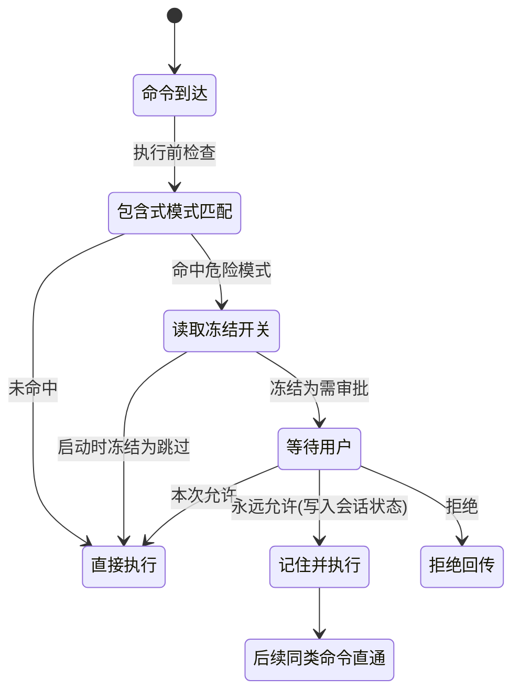
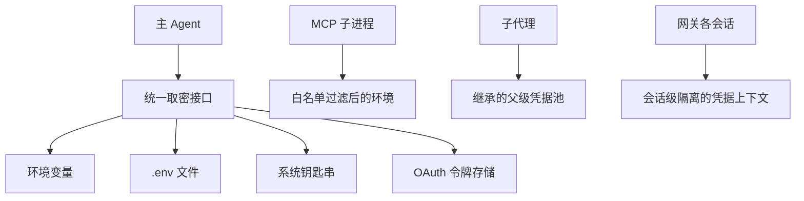
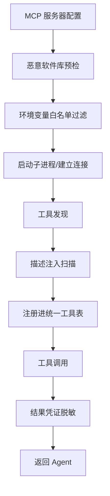
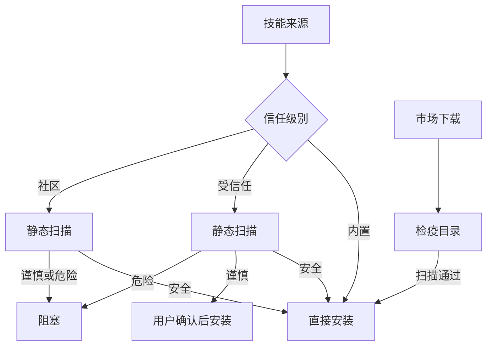
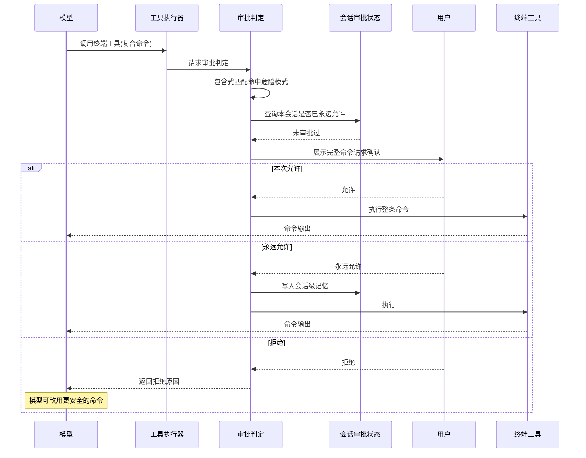

# 执行前拦截与信任治理

## 读前思考

- 一个 Agent 能在用户本机执行任意 shell 命令。如果 LLM 被 prompt injection 诱导去执行一条删除根目录的命令，你的防线画在哪——在模型输出端过滤（命令有无数变体，过滤注定追不上），还是在执行端拦截（那就得先定义"什么是危险的"）？
- 如果用户自己明确要求执行一条带危险模式的操作（合法诉求），安全系统应该阻止还是放行？"安全"和"可用"的边界怎么画？

## 核心问题

执行前拦截与信任治理解决的核心问题是：**在 Agent 拥有本机执行能力的前提下，防止误操作、恶意注入和密钥泄露，同时不过度限制用户明确想要的合法操作。**

hermes-agent 运行在用户本机，终端工具可以执行任意命令、文件工具可以读写任意路径，一次成功的注入就可能导致数据丢失；但它又是个人助手，用户期望它能做一切合法操作，不能按企业沙箱的标准收紧。这个张力决定了它的拦截形态：执行端模式匹配审批 + 会话级记忆 + 启动时冻结的旁路开关。多后端执行沙箱（本机/容器/云端/远程）属于执行时隔离，见 08-runtime。

| 维度 | hermes-agent 的选择 |
|------|---------------------|
| 权限模型 | 危险命令黑名单，包含式匹配 |
| 人工介入 | per-session 审批，支持"本会话永远允许" |
| 旁路开关 | YOLO 模式，导入时冻结不可篡改 |
| 密钥管理 | 多源统一接口 + 作用域隔离 |
| 敏感配置 | 分离到 .env 与系统钥匙串，不进主配置 |
| 外部输入防护 | MCP 四层防护、技能三级信任扫描、Hub 检疫 |

## 方案展示

### 设计选择一：危险命令审批 + YOLO 冻结

终端工具执行前，命令字符串会过一组危险模式（递归删除、提权、宽松权限位、磁盘级写入等）的包含式匹配。命中即暂停，向用户展示完整命令并请求确认，选项有三：本次允许、拒绝、本会话内同类命令永远允许。审批状态存在按会话隔离的上下文变量（ContextVar）里——网关场景下多个会话并发运行，一个会话的"永远允许"不会泄漏到另一个会话。拒绝时模型收到"用户拒绝了该命令"的工具结果，可以自行改用更安全的方案。

旁路开关是给高级用户的"我知道我在做什么"选项：环境变量 HERMES_YOLO 为开启时跳过全部审批。但它在模块导入时读取一次并冻结，此后审批逻辑只认冻结值——运行时任何代码修改环境变量都不影响审批行为。

**为什么这么选**：在模型输出端过滤不可靠——同一条危险命令可以改写成无数变体，模式匹配永远追不上生成端；执行端拦截则是"无论命令怎么生成，执行前必过一道闸"。冻结机制回应一个具体攻击：恶意工具结果诱导模型执行一条设置环境变量的命令来打开旁路，导入时冻结让这条路失效。

**牺牲了什么**：包含式匹配有误报——清理构建目录这类安全操作也命中递归删除模式，徒增交互摩擦；也有漏报——危险操作换个解释器外壳（脚本语言里调删除）就不匹配。"永远允许"缓解审批疲劳，但代价是一次注入成功后，同会话内的后续同类操作不再被拦。

### 设计选择二：多源密钥统一接口 + 作用域隔离

密钥散落在多处是现实：有人习惯环境变量，有人用 .env 文件，有人用系统钥匙串，还有 OAuth 令牌存储。hermes-agent 用统一的取密接口（get_secret）抹平来源差异，工具代码不需要知道密钥从哪来。主配置文件刻意不承载敏感信息——API key、令牌、密码全部分离到 .env（默认被版本控制忽略）或系统钥匙串，主配置因此可以安全地被 git 追踪或在求助时分享；.env 创建时收紧为仅所有者可读写，权限过宽会告警。

作用域隔离控制密钥的可见范围：MCP 子进程只能拿到白名单内的环境变量；子代理继承父代理的凭据池但碰不到其他会话的密钥；网关的不同会话各自持有独立的审批与凭据上下文。

**为什么这么选**：统一接口让密钥管理习惯因人而异不再成为架构问题；作用域收窄遵循最小权限——MCP 子进程跑的可能是第三方代码，给它全量环境变量等于把钥匙挂在门上。配置分离则保证"可分享的配置"与"不可见的密钥"物理上不在一个文件里。

**牺牲了什么**：多源引入优先级问题——环境变量和 .env 同名时取哪个，需要明确规则。白名单过严会让某些 MCP 服务器因缺少特定变量而无法工作。.env 的键值格式表达不了复杂结构（如多凭据池），这类需求只能走钥匙串或更复杂的存储。

### 设计选择三：MCP 集成的四层防护

MCP 工具的攻击面有三个：stdio 子进程默认继承全部环境变量（secret 泄漏）、工具描述直接进入模型上下文（prompt injection 注入点）、npm 包来源不可控（供应链攻击）。hermes-agent 对每种威胁各设一层，按连接生命周期展开：启动前，先查服务器依赖是否在已知恶意软件库（OSV）中；启动子进程时，环境变量经白名单过滤，只有明确列出的通用变量才传给子进程；工具发现后、注册前，扫描工具描述中的注入特征；工具调用返回结果时，错误消息和结果文本经过凭证正则脱敏，剥离可能混入的令牌与密钥。

**为什么这么选**：三层威胁互相独立，任何单层都兜不住另外两层——预检挡不住描述注入，白名单挡不住恶意包。按生命周期铺四层，每层只对自己的威胁负责。

**牺牲了什么**：白名单过严导致部分 MCP 服务器不可用；描述扫描是启发式的，覆盖不了所有注入写法；恶意软件库有滞后性，零日攻击防不住。

### 设计选择四：技能的三级信任扫描与检疫

技能是自然语言指令，模型会照做——恶意技能可以诱导模型执行危险命令或读取密钥文件。外部安装的技能先过静态分析扫描（危险 shell 命令、路径遍历、环境变量读取等模式），扫描结果与来源信任级别联合决策：内置技能直接通过；受信任来源的"谨慎级"发现需要用户确认；社区来源只要有任何发现即阻塞。从市场安装的技能先下载到检疫目录，扫描通过才移入正式技能库，扫描失败的留在检疫区等用户决策。Agent 自主创建的技能在开关允许时同样要过扫描。

**为什么这么选**：三级信任让摩擦与来源风险成正比——内置零摩擦，社区高门槛。检疫目录保证"下载"与"生效"分离，扫描失败的技能永远接触不到正式库。

**牺牲了什么**：静态分析有误报，合法技能提到删除临时文件也可能被标谨慎；语义级攻击（用自然语言包装的恶意指令）模式匹配检测不出来。检疫流程增加安装延迟。

### 设计选择五：插件执行前拦截的三分支

插件可以在执行前拦截位（pre_tool_call，四类钩子的类型学见 07-tools.md）对任意工具调用返回三种判定之一。硬阻止：工具不执行，阻断原因作为错误形态的工具结果回传模型——模型看到的是"调用被拦下"而非执行输出，可以自行改用更安全的方式。升级审批：插件声明该调用需要人类确认，调用被送入与内置危险命令审批同一个闸门——即使工具不在危险模式库内，插件也能要求人类在本次允许、拒绝、本会话永远允许之间做出选择；闸门拒绝、超时或出错一律按阻止处理（fail-closed），插件无法借这条指令跳过人类审批，能跳过审批的只有用户自己在闸门上选择"永远允许"。放行：钩子不返回判定，调用继续走内置危险模式匹配与审批流程（设计选择一）。多个插件的判定按优先级取第一个有效指令，无效返回值被静默忽略，观察型插件不受影响；被硬阻止的调用仍会触发执行后观察钩子（状态标记为已阻止），审计插件可以看到被拦下的调用。

**为什么这么选**：内置模式匹配是静态的，只能识别已知危险模式；钩子判定是动态的，策略插件能按会话、工具与参数做上下文相关的拦截决定，两者互补。**牺牲了什么**：判定逻辑移交给了插件代码，插件自身的可靠性成了安全边界的一部分——判定钩子抛错时按未给出判定处理（放行），而升级审批闸门出错则按阻止处理（fail-closed），同一条链上两个环节的错误方向相反。

## 核心机制执行流：一次危险命令的完整审批过程

以模型生成一条"递归删除构建目录后接安装依赖"的复合命令为例：

**阶段一：模式匹配。** 匹配是包含语义——复合命令中只要任何一段命中危险模式，整条命令被标记为危险，不区分哪一段危险。即使拼接的另一半是无害的安装命令，也整体送审。

**阶段二：会话状态检查。** 通过上下文变量查询当前会话是否已对该模式选择过"永远允许"。上下文变量保证并发安全——网关下多会话同时运行时，各自的审批记忆互不串扰。

**阶段三：用户交互。** 审批提示展示完整命令而非截断版本，让用户有足够信息做判断。拒绝不是终点——拒绝原因会作为工具结果回传给模型，模型有机会调整策略。

**阶段四：冻结开关。** 上述全流程之上还有一个前置判定：若导入时冻结的旁路开关为开启，直接跳过全部审批。冻结的含义是：即使恶意代码在运行时设置了旁路环境变量，审批行为也不变。

**边界路径——复合命令。** 只含一段危险的复合命令按整条审批而非拆分审批。shell 语义太复杂（管道、子 shell、变量展开），拆分可能漏掉危险段，宁可整条送审。

**边界路径——非终端工具的危险操作。** 写文件到系统配置路径同样有基于路径模式的审批检查，但覆盖面不如 shell 命令的模式库完善。

## 工程优化

**YOLO 冻结防注入**：旁路开关在模块导入时读取一次环境变量，之后不再读取。这直接封死一条攻击链——恶意工具结果指示模型执行导出环境变量的命令来关闭审批，对冻结值无效。

**ContextVar 隔离并发会话**：审批状态存在上下文变量而非全局变量，网关场景每个会话独立。一个会话的"永远允许"不泄漏到其他会话，审批记忆的作用域与信任的作用域一致。

**工具结果消毒**：工具错误消息在回传模型前，会剥离其中的角色标签、代码围栏等结构化标记，防止工具输出里的文本被模型误解为系统指令——这是针对"经工具输出的 prompt injection"的输入面防护。

**MCP 子进程环境变量白名单**：只有明确列出的通用变量（如路径、主目录、运行时路径）传给 stdio 子进程，密钥类变量默认不传递。方向与 deer-flow 的黑名单相反：黑名单滤已知敏感，白名单只放已知安全，后者对第三方代码更保守。

**.env 权限收紧**：.env 文件创建时设置为仅所有者可读写，检测到权限过宽时告警。密钥文件本身也是攻击目标，文件系统权限是最后一层。

**Project 源插件的能力收窄**：项目目录下的插件随仓库分发，克隆一个含恶意插件的仓库就会自动加载它。因此 Project 源插件被禁止注册高权限类型——不能注册模型提供商类型（防止经手并窃取 API key）、不能注册互斥后端类型（防止替换核心后端）。来源越不可信，可注册的能力类型越少。

## 面试要点

**1. 危险命令用黑名单（拦已知危险）还是白名单（只放已知安全）？hermes-agent 为什么选了前者？什么场景下应该反过来？**

参考答案方向：黑名单的假设是"大多数命令安全、少数危险"，与个人助手的使用模式匹配——用户大部分时间在做安全的文件与搜索操作。白名单的假设是"大多数命令危险、少数安全"，适合不信任用户输入的多租户场景。黑名单的风险是漏报（新危险模式不在列表），白名单的风险是过度限制（合法命令被卡死）。hermes-agent 的用户是本机所有者，信任自己、只不信任模型的判断，黑名单的误报摩擦可以靠"永远允许"消化。判断标准是"被防护对象是谁 × 合法命令空间的开放度"——用户可信且命令空间开放时黑名单，用户不可信时白名单。

**2. YOLO 冻结这个设计具体防御了什么攻击？还有没有绕过可能？**

参考答案方向：防御的攻击链是：恶意内容诱导模型执行设置旁路环境变量的命令，后续危险命令因此跳过审批。冻结后审批只认导入时的值，运行时改环境变量无效。残余的绕过可能有两类：一是用户启动进程时就开了旁路——这是用户的选择而非绕过；二是恶意代码直接改写审批模块内存中的冻结变量——但那要求恶意代码已在解释器进程内执行，系统此时已被攻陷，不在同一威胁模型内。判断标准是"配置可变性 × 安全权重"：安全关键配置必须启动时确定、运行时不可变。

**3. MCP 子进程的环境变量为什么用白名单而不是和工具侧一样的黑名单？**

参考答案方向：两个面的威胁假设不同。工具侧子进程跑的是用户自己的技能脚本，黑名单滤掉已知敏感词已够；MCP 子进程跑的可能是任意第三方 npm 包，代码完全不可信，"已知敏感词"之外的命名变体（自定义前缀的凭据变量）黑名单兜不住，只有白名单的"未列名即不给"才符合最小权限。同一个系统对两个执行面采用相反策略，说明过滤方向应由代码来源的可信度决定，而不是全局统一。判断标准是"执行代码的来源可信度 × 所需变量的可枚举性"。
