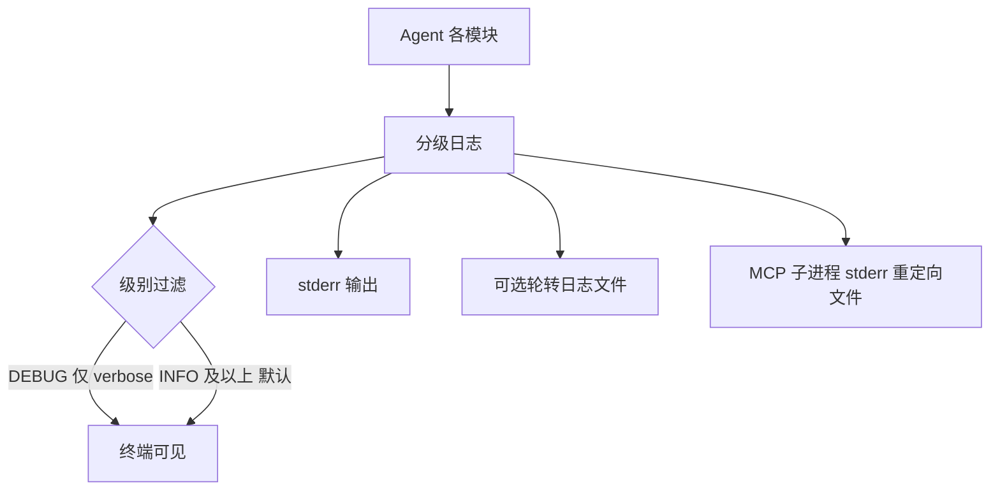
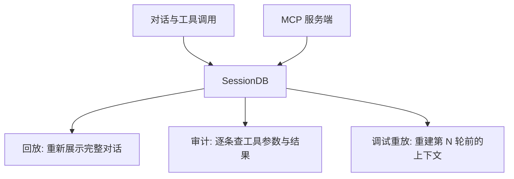
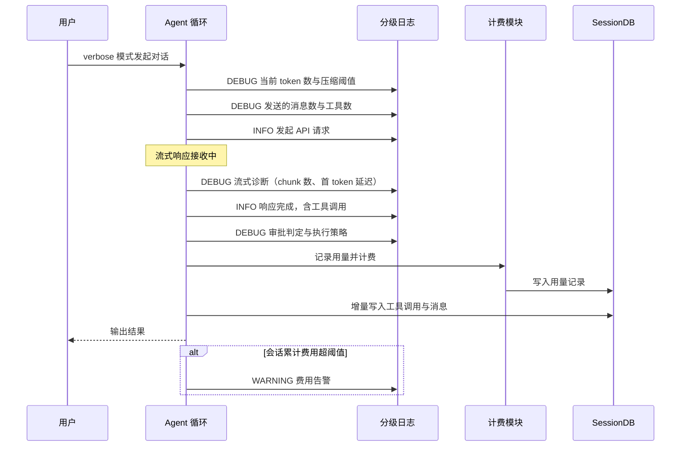

# 可观测性

## 读前思考

- 一个 Agent 执行了十几轮工具调用后给出错误答案——只有最终输出、没有中间过程时，你能回溯"它在哪一步走偏了"吗？如果把完整对话（含工具结果）都存下来，又会带来什么成本？
- 用户问"这个月我花了多少钱、哪个任务最贵"——如果你的系统没有用量追踪，你能回答吗？追踪粒度应该到每次 API 调用、每轮交互，还是每个会话？再进一步：改了提示词之后，你在零依赖约束下拿什么验证"Agent 没有变笨"？

## 核心问题

可观测性解决的核心问题是：**在没有企业级监控基础设施的本机环境里，让 Agent 的决策过程、工具调用、token 消耗、错误恢复对外可感知，支持调试、成本监控和行为审计**。

hermes-agent 是运行在用户本机的个人助手，可观测性的定位是"零外部依赖、开箱可见"：用户不能为了看 Agent 做了什么而部署一套日志平台。

| 维度 | hermes-agent 的选择 |
|------|--------------------|
| 日志 | 分级日志输出到 stderr，不干扰响应流 |
| token 追踪 | 轮次级用量记录 + 累计统计 |
| 成本监控 | 定价表实时计费，/usage 命令查看 |
| 回放审计 | SessionDB 完整对话持久化，支持事后回放 |
| 评估 | 批量回归跑分 + 费用阈值告警 |

## 方案展示

### 设计选择一：分级日志 + 零依赖输出

日志模块实现分级日志（DEBUG/INFO/WARNING/ERROR），输出到 stderr——不干扰 stdout 上的 Agent 响应流（源码：hermes_logging.py）。默认输出到终端，可选写入用户目录下的轮转日志文件；verbose 模式把级别调到 DEBUG，双 verbose 再调到 TRACE（输出完整 API 请求/响应体，仅用于深度调试）。



**为什么这么选**：个人助手场景没有 ELK 或 Datadog，日志必须开箱可见。stderr 与 stdout 分离保证管道模式下数据通道不被污染。轮转文件是可选持久化——需要事后分析时查看，不需要时零开销。

**牺牲了什么**：没有集中式聚合——gateway 场景下几十个平台的日志混在一起，按平台过滤只能靠文本搜索；轮转策略只按大小，不支持按时间或按会话分割。

### 设计选择二：轮次级用量追踪 + 实时计费

每次 API 调用返回的用量信息（输入、输出、缓存读取、缓存写入 token）被记录到轮次级别，计费模块按模型定价表实时算出费用，逐级累加到轮次、会话、全局三层统计（源码：usage_pricing.py）。用户用 /usage 命令查看当前会话的消耗与费用，缓存命中率单独展示。

```mermaid
graph TB
    A[API 响应携带用量] --> B[轮次用量记录]
    B --> C[定价表查询]
    C --> D[区分缓存命中与全价计费]
    D --> E[累加: 轮次→会话→全局]
    F[/usage 命令] --> E
    G[费用超过会话阈值] --> H[WARNING 告警]
    I[单轮上下文异常大] --> J[INFO 标注大上下文轮次]
```

**为什么这么选**：用户需要知道"这次对话花了多少钱"，尤其在使用昂贵模型时。轮次粒度能定位"哪一轮最贵"（通常是工具结果很大的那轮）。缓存读取 token 单独追踪，让用户直观看到 prompt cache 的节省效果。

**牺牲了什么**：定价表需手动维护，新模型发布后费用计算可能滞后；压缩、摘要、记忆提取等辅助调用的消耗计入总额但用户不易察觉；同一会话内多个不相关任务无法分别计费。

### 设计选择三：SessionDB 的回放与审计用途

每个会话的完整对话历史（系统提示词之外的消息、工具调用与结果、用量）持久化到 SQLite（SessionDB）。从可观测视角，它的价值在三件事：**回放**——命令行工具可以重新展示一次完整对话，回答"上次那个任务你是怎么做的"；**审计**——工具调用的参数与结果逐条可查，出错时可追责到具体哪一步；**调试重放**——"为什么 Agent 在第 10 轮做了错误决策"需要看到前 9 轮的完整上下文，日志只有事件没有上下文，SessionDB 补上了这一块。MCP 服务端也读取 SessionDB 向外部客户端暴露对话历史（源码：mcp_serve.py）。



**为什么这么选**：日志回答"发生了什么事件"，SessionDB 回答"当时模型看到了什么"。SQLite 零依赖、单文件、支持 SQL 聚合查询（"找出所有费用超过某值的会话"是一条语句），且并发读安全——MCP 多客户端同时查询不需要额外文件锁。

**牺牲了什么**：每个会话一个文件，长期使用后数量庞大且无自动清理；完整持久化包含工具结果（可能很大），磁盘占用线性增长。SessionDB 的存储结构、落盘时机与崩溃恢复用途不属于本篇，见 hermes-agent/04-state.md。

## 核心机制执行流：一次 verbose 模式下的调试过程

以用户在 verbose 模式下发起一次含工具调用的对话为例：



**阶段一：verbose 日志。** verbose 把日志级别调到 DEBUG，内部状态变化全部输出到 stderr：token 计数与压缩阈值判断、选择了哪个传输模式、发送了多少消息和工具、流式响应的 chunk 数与首 token 延迟、工具执行策略、审批判定过程、结果大小。双 verbose（TRACE）还会输出完整 API 请求/响应体。

**阶段二：用量与计费。** 每次 API 调用的用量从规范化响应中提取，含缓存读取 token。计费区分缓存命中（低价）与未命中（全价），累加到轮次与会话统计。

**阶段三：增量持久化。** 每条消息（含工具调用与结果）处理完立即写入 SessionDB，而非轮次结束批量写入——这同时服务回放完整性与崩溃恢复（恢复语义见 hermes-agent/04-state.md）。

**边界路径——错误追踪**：API 调用失败时，错误分类结果（是否可重试）记入日志；凭证轮换、上下文压缩等事件同样留痕。

**边界路径——成本异常**：会话累计费用超过配置阈值时输出 WARNING；单轮输入 token 异常大时标注"大上下文轮次"——这是 hermes-agent 唯一运行期的用量异常检测。

## 工程优化

**流式诊断**：流式请求单独记录 chunk 数量、提供商侧追踪 ID、首 token 延迟与总耗时（源码：stream_diag.py）。流式中断时，这些信息用于判断是网络问题还是提供商问题。

**TUI 安全输出**：TUI 模式下日志不能直接打 stderr（会破坏渲染），被重定向到文件并通过日志面板查看；MCP 子进程的 stderr 同样重定向到文件。

**用量聚合查询**：命令行支持按时间段聚合最近若干天的用量与费用，按模型、按天分组，数据来自各会话的用量表，用 SQL 聚合实现。

**缓存命中率提示**：/usage 展示缓存命中率（缓存读取占输入总量比例），命中率偏低时提示可能原因（频繁压缩、消息格式变化）。

## 评估机制

hermes-agent 的评估分两层。**输出质量层**靠批量回归：批处理运行器从数据集文件读取提示词，多进程并行跑 Agent，支持断点续跑（检查点容错），输出标准化轨迹（trajectory）并聚合全量工具使用统计（源码：batch_runner.py）；配套的 SWE 任务运行器用同一轨迹格式跑真实编码任务，轨迹可进入压缩管线做后续分析（源码：mini_swe_runner.py）。改提示词或换模型后重跑同一数据集，对比轨迹与统计就能发现回归。单元层则在 tests 目录用回归守卫测试固化关键行为（如会话隔离、审批隔离）。**系统健康层**只有费用阈值告警与大上下文标注（见上文边界路径），没有输出质量评分。

**代价**：批量回归依赖离线数据集与人工比对轨迹，没有自动打分；运行期不评估单条输出的质量。

## 面试要点

**1. SessionDB 用 SQLite 单文件 vs 用追加式文本日志（如 JSON Lines），为什么 hermes-agent 选了前者？**

参考答案方向：SQLite 的优势是 SQL 查询（"找出所有费用超过阈值的会话"是一条语句）、事务原子性和单文件管理；追加式文本的优势是写入快、可用标准工具处理、无锁竞争。决定性因素是 MCP 服务端要并发读会话数据，SQLite 的并发读模式天然支持，文本文件需要额外加锁。判断标准是"读侧是否需要查询与并发 × 写侧是否是单一追加者"。

**2. 用量追踪的粒度应该到哪一级？不同粒度各回答什么问题？**

参考答案方向：每次 API 调用回答"哪次调用异常贵"（调试压缩失败之类的问题）；每轮回答"哪个任务步骤最贵"；每会话回答"这次对话花了多少"（成本感知）；每项目回答"预算是否超标"（需要靠 Profile 隔离间接实现）。更细到每次工具调用没有意义——工具本身不耗 token，耗 token 的是携带工具结果的下一次 API 调用。判断标准是"要回答的成本问题是什么粒度 × 采集与存储开销是否匹配"。

**3. 用户报告"Agent 昨天做了件怪事"，你的可观测性系统怎么支持事后调查？缺什么信息？**

参考答案方向：调查路径是先按日期列出会话、再回放完整对话看输入输出与工具调用、最后查当时的日志文件看 API 细节与错误恢复。缺失的信息：没开 verbose 时 DEBUG 日志不可恢复；系统提示词当时的精确内容（技能索引、记忆快照）没进 SessionDB；未输出到响应里的推理过程不被记录。改进方向是把系统提示词的哈希记入会话元数据以便事后重建。判断标准是"回放数据覆盖了哪些层 × 缺失层能否用旁证（哈希、日志）重建"。
