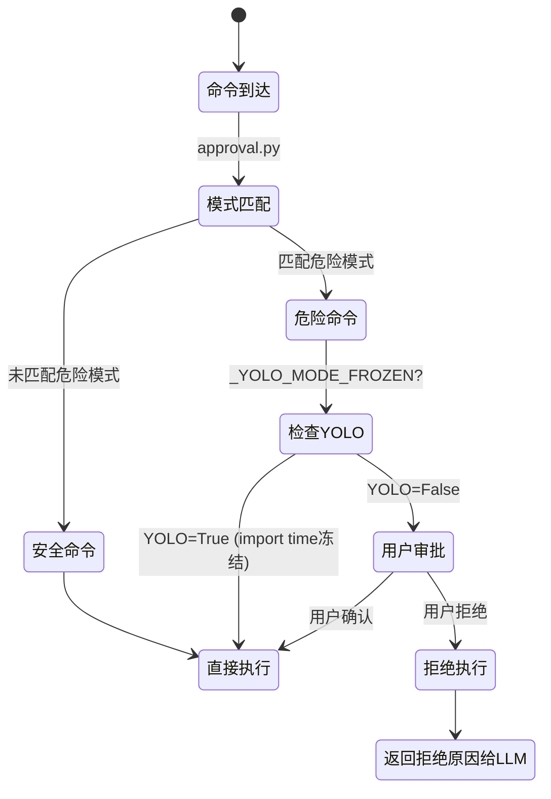
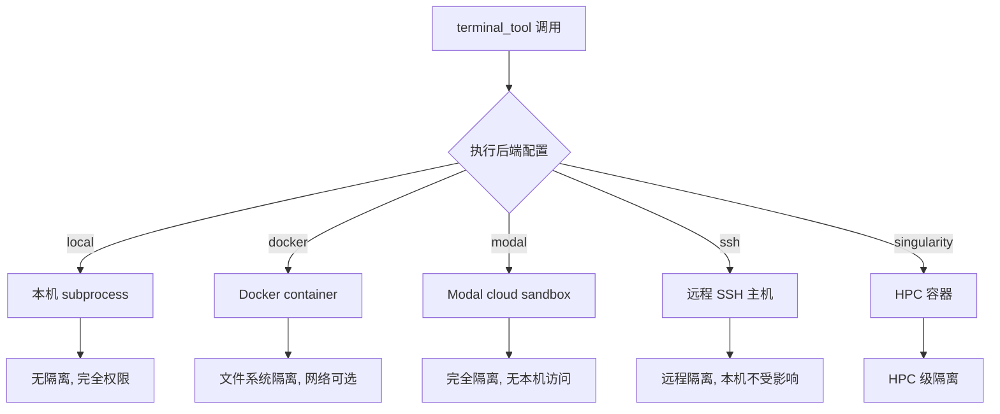
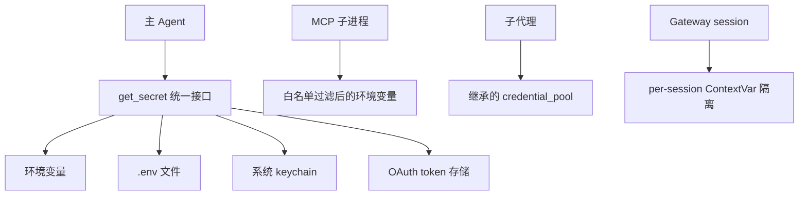
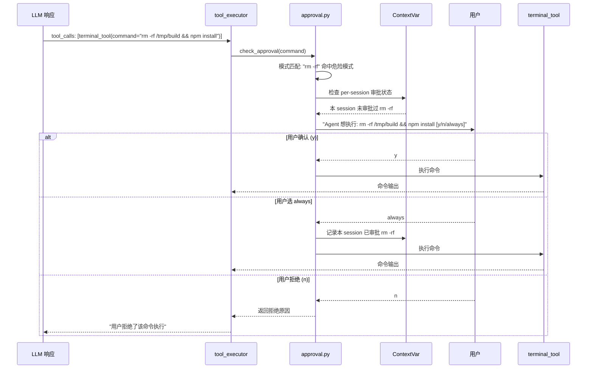

# 安全与沙箱

## 读前思考

- 一个 Agent 能在用户本机执行任意 shell 命令——如果 LLM 被 prompt injection 诱导执行 `rm -rf /`，你的防线在哪？是在 LLM 输出端过滤（不可靠，因为命令可以有无数变体），还是在执行端拦截（需要定义"什么是危险的"）？
- 如果用户自己明确想执行 `sudo rm -rf /tmp/old`（合法操作），你的安全系统应该阻止还是放行？"安全"和"可用"的边界怎么画？

## 核心问题

安全与沙箱解决的核心问题是：**如何在 Agent 拥有本机执行能力的前提下，防止误操作、恶意注入和权限越界，同时不过度限制合法操作？**

Hermes 运行在用户本机，terminal_tool 可以执行任意 shell 命令，file_tools 可以读写任意文件。这意味着安全不是"可选的加固"而是"核心设计约束"——一次 prompt injection 就可能导致数据丢失。但 Hermes 又是"个人助手"，用户期望它能做一切合法操作，不能像企业沙箱那样严格限制。

| 维度 | Hermes 的选择 |
|------|--------------|
| 权限模型 | 危险命令审批（per-session）+ YOLO 模式 |
| 执行沙箱 | 多后端（local/Docker/Modal/SSH/Singularity） |
| 密钥管理 | secret_sources 多源 + 作用域隔离 |
| 注入防护 | 工具结果消毒 + 描述注入扫描 |
| 并发安全 | ContextVar 隔离 + YOLO 冻结 |

## 方案展示

### 设计选择一：危险命令审批 + YOLO 模式

`tools/approval.py` 维护一组危险命令模式（rm -rf、sudo、chmod 777、dd、mkfs 等），terminal_tool 执行前对命令做模式匹配。匹配到危险模式时，暂停执行并询问用户确认。YOLO 模式（环境变量 `HERMES_YOLO=1`）跳过所有审批——但它在 import time 冻结，运行时无法通过 os.environ 注入开启。

**为什么这么选**：LLM 输出端的过滤不可靠——`rm -rf /` 可以写成 `find / -delete`、`python -c "import shutil; shutil.rmtree('/')"` 等无数变体，模式匹配永远无法穷举。执行端拦截是"最后一道防线"——无论 LLM 怎么生成命令，只要匹配到危险模式就需要人工确认。YOLO 模式是给高级用户的"我知道我在做什么"选项，但冻结机制防止 skill/MCP 工具通过运行时修改环境变量绕过审批。

**牺牲了什么**：模式匹配有误报——`rm -rf ./build`（安全的清理操作）也会触发审批，增加交互摩擦。模式匹配也有漏报——`python -c "import os; os.system('rm -rf /')"` 可能不匹配 `rm -rf` 模式。审批是 per-session 的——同一 session 中确认过一次 `rm -rf` 后，后续相同模式不再询问（防止审批疲劳），但这意味着一次注入成功后的后续操作不再被拦截。

### 设计选择二：多后端执行沙箱

terminal_tool 支持多种执行后端：local（直接在用户机器上执行）、Docker（在容器中执行）、Modal（在云端执行）、SSH（在远程机器上执行）、Singularity（在 HPC 容器中执行）。用户通过配置选择后端，Agent 不感知执行环境。

**为什么这么选**：不同用户有不同的安全需求——个人开发者用 local 后端（方便、快速），处理不信任代码时切换到 Docker（隔离文件系统），企业环境用 Modal/Singularity（完全隔离）。多后端让安全级别成为配置选择而非代码限制。Agent 不感知后端意味着同一套工具调用逻辑适用于所有环境。

**牺牲了什么**：local 后端没有任何隔离——如果用户选了 local 且开了 YOLO，Agent 可以执行任何操作。Docker 后端需要 Docker daemon 运行（check_fn 检测），增加了环境依赖。不同后端的行为差异（如 Docker 中无法访问本机文件）可能导致 Agent 困惑（"为什么我读不到 /home/user/ 下的文件？"）。

### 设计选择三：密钥管理多源 + 作用域隔离

`agent/secret_sources/` 实现了多种密钥来源（环境变量、.env 文件、系统 keychain、OAuth token 存储），通过 `get_secret()` 统一访问。密钥有作用域隔离——MCP 子进程只能看到白名单内的环境变量，子代理继承父代理的 credential_pool 但不能访问其他 session 的密钥。

**为什么这么选**：密钥散落在多处（环境变量、.env、keychain）是现实——不同用户有不同的密钥管理习惯。统一接口让工具代码不需要知道密钥从哪来。作用域隔离防止密钥泄漏——MCP 子进程（可能是第三方代码）不应该看到所有环境变量，gateway 的不同 session 不应该互相访问密钥。

**牺牲了什么**：多源意味着密钥可能冲突（环境变量和 .env 中同名变量取哪个？需要优先级规则）。白名单过严导致 MCP 服务器无法工作（需要特定环境变量）。OAuth token 的刷新逻辑复杂——不同提供商的 token 过期时间不同，刷新失败时的降级策略也不同。

## 核心机制执行流：一次危险命令的审批过程

以 LLM 生成 `rm -rf /tmp/build && npm install` 为例：

**阶段一：模式匹配。** approval.py 对命令字符串做正则匹配，检测危险模式。匹配是"包含"语义——`rm -rf /tmp/build && npm install` 中包含 `rm -rf`，整条命令被标记为危险。匹配结果不区分命令的哪一部分是危险的（即使 `npm install` 是安全的）。

**阶段二：审批状态检查。** 通过 ContextVar 检查当前 session 是否已经审批过同类命令。ContextVar 保证了并发安全——gateway 场景下多个 session 同时运行，一个 session 的审批状态不影响其他。如果用户之前选了"always"，同类命令直接通过。

**阶段三：用户交互。** 审批提示展示完整命令（不是截断的），让用户判断。选项包括 y（本次允许）、n（拒绝）、always（本 session 后续同类命令自动允许）。拒绝时，LLM 收到"用户拒绝了该命令"的 tool_result，可以调整策略（如改用更安全的命令）。

**阶段四：YOLO 模式检查。** 如果 `_YOLO_MODE_FROZEN` 为 True（import time 从环境变量读取），跳过所有审批直接执行。冻结意味着即使 skill 或 MCP 工具在运行时执行 `os.environ["HERMES_YOLO"] = "1"`，也不会影响审批行为——变量在 import 时已经读取并冻结。

**边界路径——复合命令：** `rm -rf /tmp/build && npm install` 中只有前半部分危险。Hermes 的选择是"整条命令审批"而非"拆分审批"——因为 shell 命令的语义太复杂（管道、子 shell、变量展开），拆分可能遗漏危险部分。

**边界路径——非 terminal 工具的危险操作：** write_file 写入 `/etc/passwd`、patch 修改系统配置文件。这些操作也有审批检查（基于文件路径模式），但模式匹配不如 shell 命令完善。

## 工程优化

**YOLO 冻结防注入**：`_YOLO_MODE_FROZEN` 在模块 import 时读取 `os.environ.get("HERMES_YOLO")`，之后不再读取环境变量。这防止了 prompt injection 攻击——恶意工具结果不能通过指示 Agent 执行 `export HERMES_YOLO=1` 来关闭审批。

**ContextVar 隔离并发会话**：审批状态存储在 ContextVar 中（而非全局变量），gateway 场景下每个 session 有独立的审批上下文。一个 session 的 "always" 审批不会泄漏到另一个 session。

**工具结果消毒**：`_sanitize_tool_error()` 从工具错误消息中剥离 XML role tag（`<system>`、`<assistant>`）、code fence、CDATA 标记。这防止了工具输出中的文本被 LLM 误解为系统指令（prompt injection via tool output）。

**MCP 环境变量白名单**：stdio MCP 子进程的环境变量经过白名单过滤——只有明确列出的变量（如 PATH、HOME、NODE_PATH）会传递给子进程。API key、数据库密码等敏感变量默认不传递。

**设备路径黑名单**：`_BLOCKED_DEVICE_PATHS` frozenset 包含 `/dev/zero`、`/dev/random`、`/dev/urandom` 等设备路径。read_file 在 I/O 前检查路径，防止读取无限输出的设备文件导致进程挂起。

## 面试要点

**问题一：危险命令的模式匹配（黑名单）vs 白名单（只允许已知安全的命令），为什么 Hermes 选了黑名单？白名单方案在什么场景下更好？**

黑名单的假设是"大多数命令是安全的，只有少数危险"——这与个人助手的使用模式匹配（用户大部分时间在做安全的文件操作和搜索）。白名单的假设是"大多数命令是危险的，只有少数安全"——这适合企业/多租户场景（不信任用户输入）。黑名单的风险是漏报（新的危险命令不在列表中），白名单的风险是过度限制（合法命令不在白名单中无法执行）。Hermes 选黑名单是因为它的用户是"本机所有者"——用户信任自己，只是不信任 LLM 的判断。如果 Hermes 用于多租户 SaaS（不信任用户），白名单更合适。

**问题二：YOLO 模式"import time 冻结"这个设计防御了什么攻击？有没有绕过的可能？**

防御的攻击：prompt injection 通过工具结果指示 Agent 执行 `os.environ["HERMES_YOLO"] = "1"` 或 `export HERMES_YOLO=1`，然后后续命令跳过审批。冻结后，运行时修改环境变量无效。绕过可能：(a) 如果 Agent 在 YOLO 已冻结的进程中启动（即用户启动时就设了 YOLO），所有命令都不审批——这是用户的选择，不算绕过；(b) 如果恶意代码能修改 Python 模块的 `_YOLO_MODE_FROZEN` 变量（如通过 `import tools.approval; tools.approval._YOLO_MODE_FROZEN = True`），可以绕过——但这需要恶意代码已经在 Python 进程中执行，此时系统已经被攻陷。

**问题三：Docker 沙箱 vs local 执行，Agent 的行为会有什么差异？这些差异如何影响 Agent 的决策？**

差异：(a) 文件系统——Docker 中只能看到挂载的目录，本机其他文件不可访问；(b) 网络——Docker 默认有网络，但可以配置为无网络；(c) 持久性——Docker 容器重启后非挂载目录的修改丢失；(d) 权限——Docker 中默认非 root，某些操作需要额外配置。对 Agent 决策的影响：Agent 可能尝试读取 `/home/user/.ssh/id_rsa`（local 可以，Docker 不行），或者安装全局包（local 可以，Docker 需要 root）。Hermes 的处理是在系统提示词中告知 Agent 当前执行环境（"你在 Docker 容器中，只有 /workspace 可访问"），让 Agent 调整行为。但这依赖 LLM 的理解能力——如果 Agent 忽略了环境提示，会反复尝试失败的操作。
