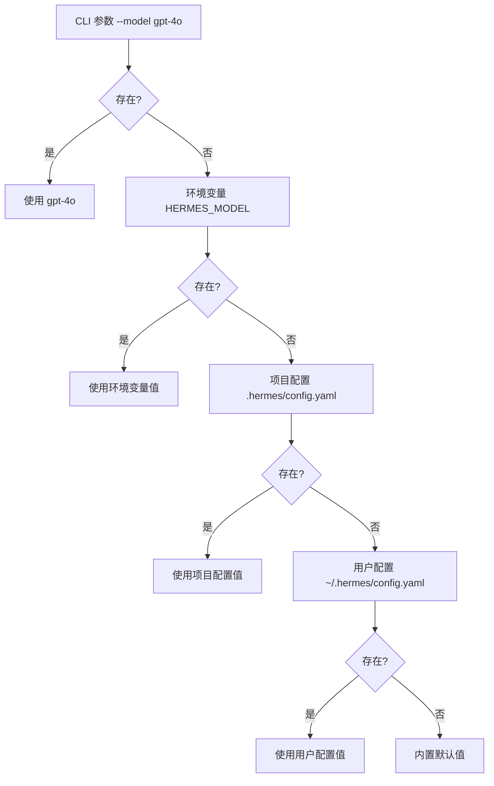
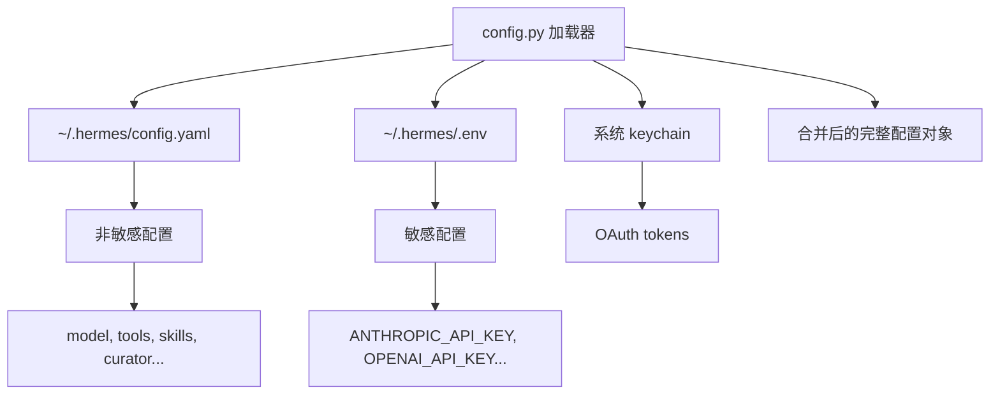
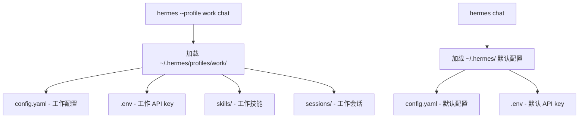
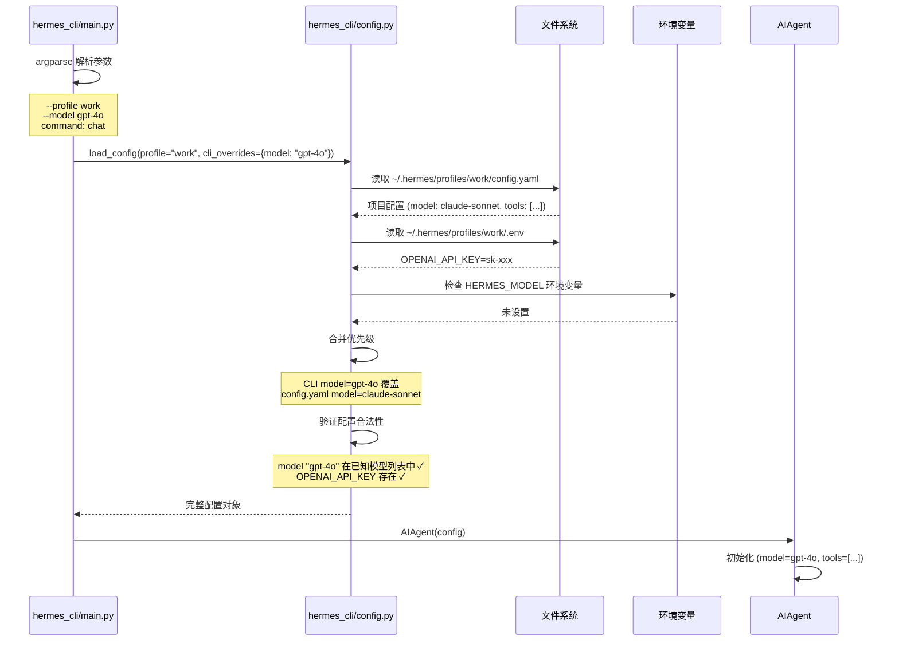

# 配置与环境管理

## 读前思考

- 一个 Agent 的配置来源可能有：全局配置文件、项目级配置、环境变量、命令行参数、运行时交互修改。如果同一个选项在多处有不同值，谁优先？你会怎么设计这个优先级链？
- 如果用户在 CLI 中用 `hermes --model gpt-4o` 启动，但配置文件中写的是 `model: claude-sonnet`，环境变量里设的是 `HERMES_MODEL=gemini-pro`——最终用哪个？这个决策对用户来说是透明的还是可预测的？

## 核心问题

配置与环境管理解决的核心问题是：**如何让一个高度可配置的 Agent 在多种配置来源（文件、环境变量、CLI 参数、运行时修改）之间建立清晰、可预测的优先级，同时支持多 profile 和多实例？**

Hermes 的配置复杂度来源于它的使用场景多样性——同一个用户可能在 CLI 中用 Claude 做代码审查、在 gateway 中用 GPT 做客服、在 cron 中用 Gemini 做日报生成。每种场景需要不同的模型、工具集、权限配置。

| 维度 | Hermes 的选择 |
|------|--------------|
| 配置格式 | YAML（~/.hermes/config.yaml） |
| 优先级链 | CLI 参数 > 环境变量 > 项目配置 > 用户配置 > 默认值 |
| Profile | 多 profile 支持（--profile 切换） |
| 运行时修改 | /config 命令 + 环境变量热读取 |
| 敏感配置 | 分离到 .env / keychain，不存入 config.yaml |

## 方案展示

### 设计选择一：五层优先级链

配置值的解析遵循严格的优先级：CLI 参数（`--model gpt-4o`）> 环境变量（`HERMES_MODEL=gemini-pro`）> 项目配置（`.hermes/config.yaml`）> 用户配置（`~/.hermes/config.yaml`）> 内置默认值。每一层只覆盖它下面的层，不存在的键透传到下一层。

**为什么这么选**：五层优先级遵循"越具体越优先"的原则——CLI 参数是"这一次我要用 X"（最具体的意图），环境变量是"这个 shell 环境中用 X"，项目配置是"这个项目用 X"，用户配置是"我通常用 X"，默认值是"什么都没配时用 X"。用户可以预测行为：如果设了 CLI 参数，一定用 CLI 的值；如果没设，看环境变量；以此类推。

**牺牲了什么**：五层查找增加了配置解析的复杂度——调试"为什么我的配置没生效"时需要检查五层。项目配置和用户配置的边界不总是清晰——如果用户在项目配置中设了 `model: gpt-4o`，但忘了这一行，会困惑为什么 CLI 中 `--model claude` 被"覆盖"了（实际是 CLI 优先级更高，但用户可能不记得自己设了 CLI 参数）。

### 设计选择二：YAML 配置 + 环境变量分离敏感信息

主配置文件是 `~/.hermes/config.yaml`，存储非敏感配置（模型选择、工具集、技能设置、curator 参数等）。敏感信息（API key、OAuth token、数据库密码）不存入 config.yaml，而是通过 .env 文件或系统 keychain 管理。`hermes_cli/config.py` 在加载配置时自动合并 .env 中的变量。

**为什么这么选**：config.yaml 可能被 git 追踪（项目级配置）或被分享（用户求助时贴配置），API key 不应出现在其中。.env 文件默认在 .gitignore 中，keychain 由操作系统保护。分离后，config.yaml 可以安全地版本控制和分享。

**牺牲了什么**：配置分散在多处，新用户可能困惑"API key 应该填在哪"。多源合并增加了加载逻辑的复杂度。.env 文件的格式限制（KEY=VALUE，不支持嵌套结构）意味着复杂配置（如多 credential 池）无法用 .env 表达。

### 设计选择三：多 Profile 支持

用户可以通过 `--profile work` / `--profile personal` 切换不同的配置 profile。每个 profile 是 `~/.hermes/profiles/<name>/` 下的独立配置目录，包含自己的 config.yaml、.env、skills/、sessions/。未指定 profile 时使用 default。

**为什么这么选**：同一用户可能有多种使用场景——工作中用企业 API key + 受限工具集，个人用个人 API key + 全部工具。Profile 让每种场景有完全独立的配置空间，互不干扰。切换 profile 不需要修改任何文件，只需一个 CLI 参数。

**牺牲了什么**：Profile 之间不共享状态——在 work profile 中创建的技能在 personal 中不可见（除非手动复制）。多 profile 增加了磁盘占用（每个 profile 有独立的 sessions 数据库）。Profile 的继承语义不明确——如果 work profile 的 config.yaml 中缺少某个键，是回退到 default profile 还是回退到内置默认值？Hermes 选择后者（直接回退到默认值），这意味着每个 profile 需要完整配置。

## 核心机制执行流：一次配置加载的完整过程

以用户执行 `hermes --profile work --model gpt-4o chat` 为例：

**阶段一：CLI 参数解析。** argparse 解析命令行参数，提取 `--profile`、`--model` 等显式覆盖项，以及子命令（chat/gateway/cron）。这些参数作为 `cli_overrides` 字典传递给配置加载器。

**阶段二：配置文件加载。** 根据 profile 名称确定配置目录（`~/.hermes/profiles/work/`），读取 config.yaml。如果 profile 目录不存在，报错并列出可用 profile。config.yaml 使用 YAML 格式，支持注释和锚点（`&` / `*`）。

**阶段三：环境变量合并。** 读取 profile 目录下的 .env 文件，解析 KEY=VALUE 对。同时检查进程环境变量中的 `HERMES_*` 前缀变量。环境变量优先级高于配置文件但低于 CLI 参数。

**阶段四：优先级合并与验证。** 按五层优先级合并所有配置源。合并后执行验证：模型名是否在已知列表中、API key 是否存在（如果模型需要）、工具集名称是否合法、MCP 服务器配置格式是否正确。验证失败时给出明确的错误信息和修复建议。

**边界路径——配置热修改：** 用户在对话中执行 `/config set model claude-sonnet`，修改当前 session 的模型配置。这个修改只影响当前 session（不写入 config.yaml），下次启动时恢复为文件中的值。如果需要持久化，使用 `/config save`。

**边界路径——配置迁移：** Hermes 版本升级后配置格式可能变化。config.py 中有版本检测逻辑——如果 config.yaml 的 `version` 字段低于当前版本，自动执行迁移脚本（如重命名字段、添加新默认值）。迁移前备份原文件。

## 工程优化

**配置缓存 + mtime 失效**：config.yaml 的解析结果被缓存，通过文件 mtime 检测失效。如果文件未修改，后续访问直接返回缓存对象，避免重复 YAML 解析（YAML 解析比 JSON 慢 5-10 倍）。

**配置 schema 验证**：使用 JSON Schema 验证 config.yaml 的结构——类型错误（如 `model: 123`）、未知键（如 `modle: gpt-4o` 拼写错误）、缺失必填项都在加载时检测并报错，而非运行时才发现。

**.env 的安全权限**：创建 .env 文件时设置 0600 权限（仅所有者可读写）。如果检测到 .env 权限过宽（如 0644），发出警告。

**配置差异展示**：`hermes config diff` 命令展示当前生效配置与默认值的差异，帮助用户理解"我的配置实际做了什么"。`hermes config show` 展示完整生效配置（敏感值脱敏显示）。

**项目配置的 git 友好**：项目级 `.hermes/config.yaml` 设计为可 git 追踪——不包含敏感信息，格式稳定（不因版本升级改变结构），团队成员 clone 后即可获得一致的项目配置。

## 面试要点

**问题一：五层优先级链是否太复杂？三层（CLI > 文件 > 默认值）不够吗？环境变量和项目配置各自解决了什么问题？**

环境变量解决的是"环境级覆盖"——同一个 config.yaml 在不同机器上可能需要不同的值（如公司机器用代理、家里直连）。如果只有 CLI > 文件 > 默认值，用户需要在每台机器上维护不同的 config.yaml，或者每次启动都带 CLI 参数。项目配置解决的是"项目级覆盖"——同一个用户在不同项目中需要不同的工具集和模型。如果只有用户级配置，用户需要在切换项目时手动修改 ~/.hermes/config.yaml。五层的复杂度是真实的——每一层对应一个真实的使用场景。但如果用户只用 CLI + 用户配置（最常见的情况），三层就够了，其余层是"高级用户的逃生舱"。

**问题二：Profile 之间不共享状态（技能、会话独立），这个设计在什么场景下是痛苦的？怎么缓解？**

痛苦场景：用户在 work profile 中让 Agent 创建了一个很有用的技能，切到 personal profile 后发现技能不可用。或者用户在 default profile 中积累了大量记忆，新建的 work profile 中 Agent "失忆"了。缓解：(a) 技能可以通过 `skills.external_dirs` 配置指向其他 profile 的技能目录（只读共享）；(b) 记忆可以通过配置指向共享的数据库文件；(c) `hermes profile export/import` 命令可以迁移配置。根本问题是"隔离 vs 共享"的粒度——完全隔离简单但重复，完全共享失去了 profile 的意义。Hermes 选择默认隔离 + 显式共享配置。

**问题三：配置热修改（/config set）只影响当前 session 而不持久化，这个设计选择的考量是什么？如果用户期望"改了就是永久的"怎么办？**

只影响当前 session 的设计是"安全默认"——用户在对话中尝试不同模型（"试试 gpt-4o 效果如何"）时，不希望这个尝试永久改变配置。如果热修改自动持久化，用户需要每次尝试后手动恢复，增加了心智负担。如果用户期望永久修改，`/config save` 显式持久化。这个设计的风险是用户不知道修改是临时的——"我明明改了模型，为什么下次启动又变回去了？"。缓解：/config set 执行时明确提示"此修改仅对当前会话生效，使用 /config save 持久化"。
