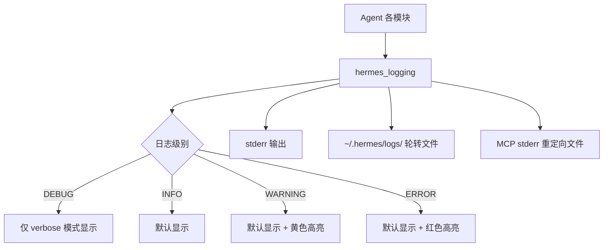
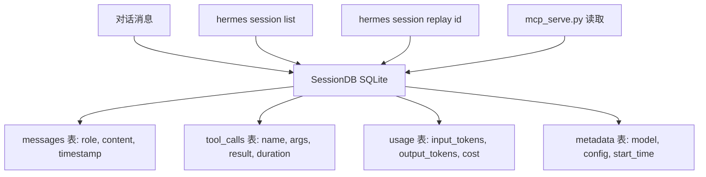
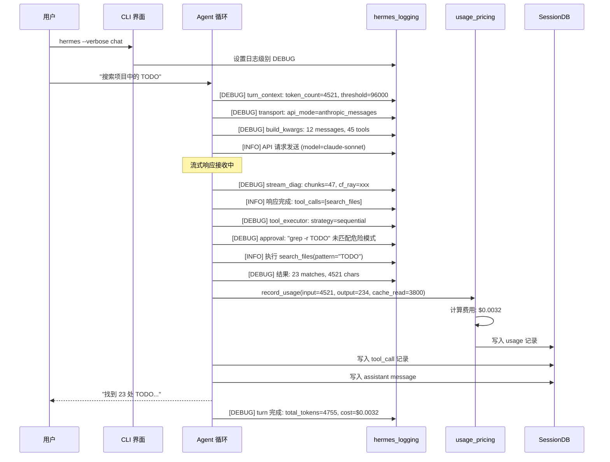

# 可观测性

## 读前思考

- 一个 Agent 执行了 15 轮工具调用后给出了错误答案——你怎么回溯"它在哪一步走偏了"？如果只有最终输出没有中间过程，你能调试吗？
- 用户问"这个月我花了多少 token？哪个任务最贵？"——如果你的系统没有 token 用量追踪，你能回答吗？追踪的粒度应该到什么级别（每次 API 调用？每个 turn？每个 session？）？

## 核心问题

可观测性解决的核心问题是：**如何让 Agent 的内部状态（决策过程、工具调用、token 消耗、错误恢复）对外可感知，支持调试、成本监控和行为审计？**

Hermes 作为个人助手运行在用户本机，没有企业级的 APM 基础设施。它的可观测性设计必须在"零外部依赖"的约束下提供足够的调试和监控能力——用户不能为了看 Agent 做了什么而部署一个 Jaeger。

| 维度 | Hermes 的选择 |
|------|--------------|
| 日志 | 分级日志（hermes_logging.py）+ 结构化输出 |
| Token 追踪 | per-turn 用量记录 + 累计统计 |
| 成本监控 | usage_pricing.py 实时计费 |
| 调试支持 | verbose 模式 + session 回放 + stream 诊断 |
| 会话持久化 | SessionDB（SQLite）完整记录对话历史 |

## 方案展示

### 设计选择一：分级日志 + 零依赖输出

`hermes_logging.py` 实现分级日志系统（DEBUG/INFO/WARNING/ERROR），输出到 stderr（不干扰 stdout 的 Agent 响应流）。日志格式包含时间戳、级别、模块名、消息。不依赖外部日志服务——默认输出到终端，可选写入 `~/.hermes/logs/` 下的轮转日志文件。



**为什么这么选**：个人助手场景下，用户不会部署 ELK 或 Datadog。日志必须"开箱可见"——verbose 模式下直接输出到终端，用户无需配置就能看到 Agent 的内部状态。stderr 输出保证不污染 stdout（Agent 的响应通过 stdout 传递给管道或 TUI）。轮转文件是可选的持久化——需要事后分析时查看，不需要时零开销。

**牺牲了什么**：没有集中式日志聚合——gateway 场景下 30 个平台的日志混在一起，按平台过滤需要 grep。没有结构化查询能力（如"找出所有 429 错误的日志"需要文本搜索而非 SQL 查询）。日志轮转策略简单（按大小轮转），不支持按时间或按 session 分割。

### 设计选择二：per-turn Token 用量追踪 + 实时计费

每次 LLM API 调用返回的 usage 信息（input_tokens、output_tokens、cache_read_tokens）被记录到 turn 级别。`usage_pricing.py` 根据模型定价表实时计算费用，累加到 session 和全局统计。用户可以通过 `/usage` 命令查看当前 session 的 token 消耗和费用。

```mermaid
graph TB
    A[LLM API 响应] --> B[NormalizedResponse.usage]
    B --> C[input_tokens / output_tokens]
    B --> D[cache_read_tokens / cache_write_tokens]
    C --> E[usage_pricing.py]
    D --> E
    E --> F[模型定价表查询]
    F --> G[计算本次费用]
    G --> H[累加到 turn 统计]
    H --> I[累加到 session 统计]
    I --> J[累加到全局统计]
    K[/usage 命令] --> I
    L[turn_finalizer] --> H
```

**为什么这么选**：用户需要知道"这次对话花了多少钱"——特别是使用昂贵模型（Claude Opus、GPT-4）时。per-turn 粒度让用户可以定位"哪一轮消耗最多"（通常是工具结果很大的那轮）。cache_read_tokens 的单独追踪让用户看到 prompt cache 的节省效果——如果 cache 命中率高，实际费用远低于 input_tokens × 单价。

**牺牲了什么**：定价表需要手动维护——新模型发布后需要更新定价，否则费用计算不准确。辅助 LLM 调用（压缩、摘要、记忆提取）的 token 消耗也计入总费用，但用户可能不意识到这些"后台"消耗。没有按任务/项目的费用分摊——如果用户在同一 session 中做了多个不相关的任务，无法分别计费。

### 设计选择三：SessionDB 完整对话持久化

每个 session 的完整对话历史（包括系统提示词、用户消息、助手响应、工具调用、工具结果）持久化到 SQLite 数据库（`~/.hermes/sessions/<session_id>.db`）。支持事后回放——`hermes session replay <id>` 可以重新展示一次完整对话。



**为什么这么选**：Agent 的调试不能只看日志——日志是"发生了什么事件"，SessionDB 是"完整的对话上下文"。调试"为什么 Agent 在第 10 轮做了错误决策"需要看到前 9 轮的完整上下文（包括工具结果）。SQLite 零依赖、单文件、支持 SQL 查询，是个人场景的最佳选择。MCP 服务器（mcp_serve.py）也读取 SessionDB 来暴露对话历史给外部 MCP 客户端。

**牺牲了什么**：每个 session 一个 .db 文件，长期使用后文件数量多（数百到数千个）。完整持久化包含工具结果（可能很大），磁盘占用随使用量线性增长。没有自动清理策略——用户需要手动删除旧 session 文件。

## 核心机制执行流：一次 verbose 模式下的调试过程

以用户执行 `hermes --verbose chat` 并观察 Agent 处理一个工具调用为例：



**阶段一：Verbose 日志输出。** `--verbose` 将日志级别设为 DEBUG，所有内部状态变化输出到 stderr。用户可以看到：token 计数和压缩阈值判断、选择了哪个 transport、发送了多少消息和工具、流式响应的 chunk 数和 CF-Ray（Cloudflare 追踪 ID）、工具执行策略选择、审批判断过程、结果大小。

**阶段二：Token 用量记录。** 每次 API 调用的 usage 信息从 NormalizedResponse 中提取，包括 cache_read_tokens（prompt cache 命中的 token 数）。usage_pricing 根据模型定价表计算费用，区分 cache hit（便宜 90%）和 cache miss（全价）。

**阶段三：Session 持久化。** 每条消息（包括工具调用和结果）写入 SessionDB。写入是增量的（每条消息一次 INSERT），不是 turn 结束后批量写入——这保证了即使进程中途崩溃，已处理的消息不会丢失。

**阶段四：Stream 诊断。** `stream_diag.py` 记录流式请求的诊断信息：chunk 数量、CF-Ray ID（用于向提供商报告问题时追踪）、首 token 延迟、总耗时。如果流式中断（连接断开），诊断信息帮助判断是网络问题还是提供商问题。

**边界路径——错误追踪：** API 调用失败时，error_classifier 的分类结果记入日志（`[WARNING] API error classified: rate_limit, retryable=True`）。credential 轮换事件记入日志（`[INFO] Rotated credential: pool_size=3, next=round_robin`）。压缩事件记入日志（`[INFO] Context compressed: 45000→12000 tokens`）。

**边界路径——成本告警：** 如果单个 session 的累计费用超过配置阈值（如 $5），输出 WARNING 日志提醒用户。如果单轮消耗异常大（如 input_tokens > 100K），输出 INFO 日志标注"大上下文轮次"。

## 工程优化

**Prompt cache 命中率追踪**：usage 中单独记录 cache_read_tokens 和 cache_write_tokens。`/usage` 命令展示 cache 命中率（cache_read / total_input），让用户直观看到 prompt cache 的节省效果。命中率低于 50% 时提示可能的原因（频繁压缩、消息格式变化）。

**日志的 TUI 安全输出**：在 TUI（curses/Ink）模式下，日志不能直接输出到 stderr（会破坏 TUI 渲染）。日志被重定向到文件，TUI 中通过专门的日志面板查看。MCP 子进程的 stderr 也重定向到文件（`~/.hermes/logs/mcp-stderr.log`），防止子进程调试输出损坏终端。

**Session 数据库的增量写入**：每条消息处理完立即写入（`_flush_session_db_after_tool_progress()`），而非 turn 结束后批量写入。这保证了崩溃恢复能力——进程在工具执行中途崩溃时，已处理的消息已持久化。

**用量统计的聚合查询**：`hermes usage --period 7d` 聚合最近 7 天的 token 用量和费用，按模型/按天分组展示。数据来源于各 session 的 usage 表，通过 SQL 聚合查询实现。

**Verbose 模式的分级控制**：`--verbose` 是 DEBUG 级别，`--verbose --verbose`（或 `-vv`）是 TRACE 级别（包含完整的 API 请求/响应 body）。TRACE 级别输出量极大（一次 API 调用可能输出数万字符），仅用于深度调试。

## 面试要点

**问题一：SessionDB 用 SQLite 单文件存储 vs 用结构化日志（如 JSON Lines），各自的适用场景是什么？为什么 Hermes 选了 SQLite？**

SQLite 的优势：(a) SQL 查询能力——"找出所有费用超过 $1 的 session"是一条 SELECT 语句，JSON Lines 需要逐行解析；(b) 事务保证——消息写入的原子性，不会出现"写了一半"的损坏记录；(c) 单文件——备份/删除/迁移一个 session 只需操作一个文件。JSON Lines 的优势：(a) 追加写入更快（无需事务开销）；(b) 可以用标准 Unix 工具（grep、jq）处理；(c) 不存在 SQLite 的锁竞争问题。Hermes 选 SQLite 是因为 mcp_serve.py 需要并发读取 session 数据（多个 MCP 客户端同时查询），SQLite 的 WAL 模式支持并发读，JSON Lines 需要额外的文件锁。

**问题二：Token 用量追踪的粒度应该到什么级别？per-API-call、per-turn、per-session、per-project 各自回答什么问题？**

per-API-call 回答"这次调用花了多少"——用于调试异常消耗（如某次调用 input_tokens 突然暴增，可能是压缩失败）。per-turn 回答"这轮交互花了多少"——用于定位"哪个任务步骤最贵"。per-session 回答"这次对话花了多少"——用于成本感知（"我和 Agent 聊了一小时花了 $2"）。per-project 回答"这个项目花了多少"——用于预算控制（"这个项目的 Agent 使用费不能超过 $50/月"）。Hermes 实现了前三级，per-project 需要用户通过 profile 隔离间接实现。更细的粒度（per-tool-call）意义不大——工具调用本身不消耗 token，消耗 token 的是包含工具结果的 API 调用。

**问题三：如果用户报告"Agent 昨天做了一件奇怪的事"，你的可观测性系统如何支持事后调查？有什么信息是缺失的？**

调查路径：(a) `hermes session list --date yesterday` 找到对应 session；(b) `hermes session replay <id>` 回放完整对话——看到用户输入、Agent 响应、工具调用和结果；(c) 查看 verbose 日志（如果当时开了 verbose 或日志文件还在）——看到 API 调用细节、错误恢复过程。缺失的信息：(a) 如果没开 verbose，DEBUG 级别日志不可恢复（只有 WARNING+ 持久化到文件）；(b) 系统提示词的精确内容（包含技能索引、记忆快照）没有持久化到 SessionDB——只能看到消息，看不到当时的系统提示词；(c) Agent 的"思考过程"（reasoning/thinking）如果没有在响应中输出，不会被记录。改进方向：将系统提示词的 hash 记入 session metadata，便于事后重建当时的上下文。
