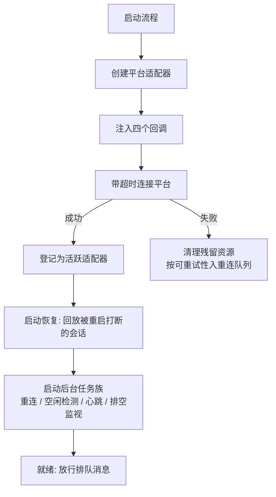
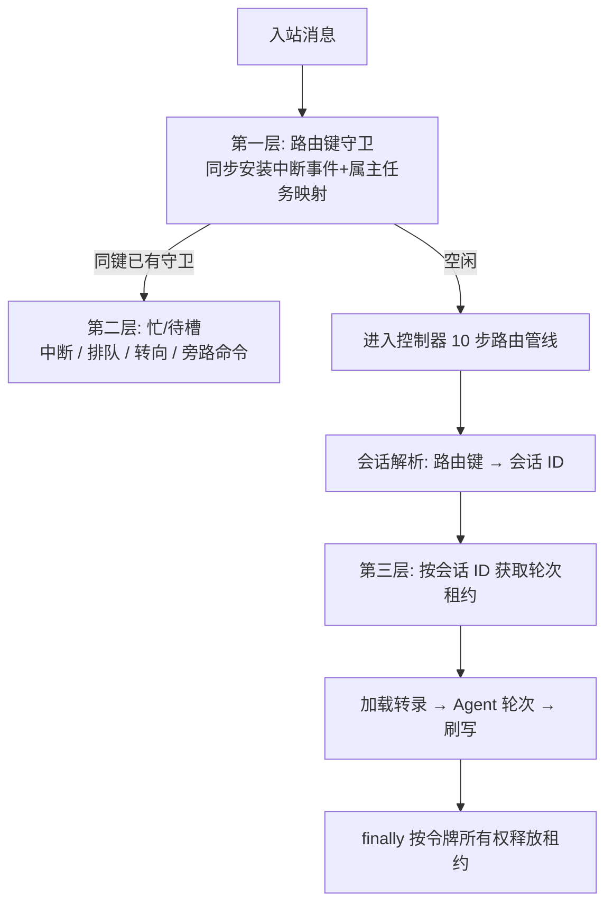
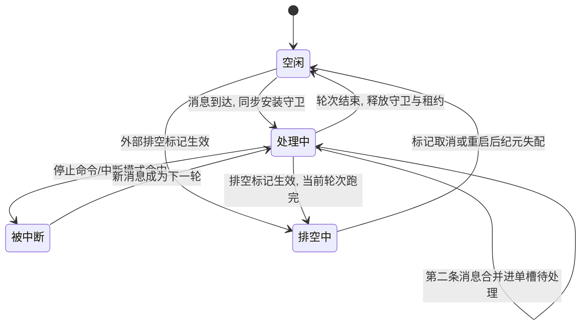
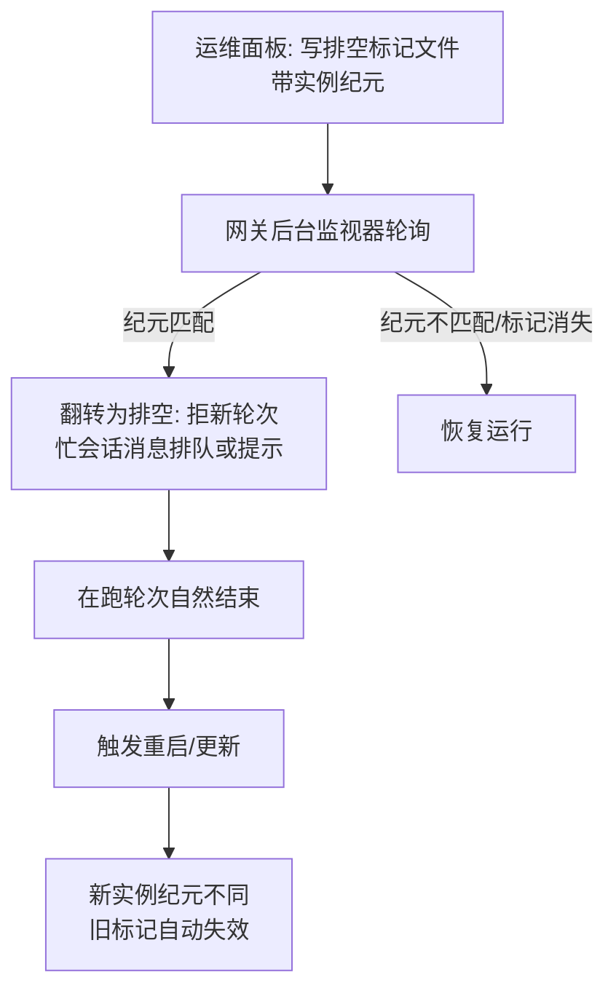
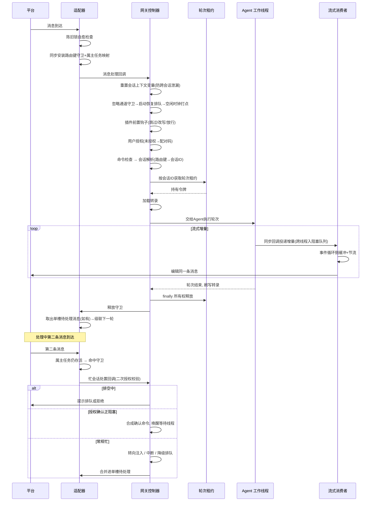

# Gateway/对外服务层

## 读前思考

- 一个常驻网关同时收到同一个会话的两条消息——两个处理流程都想加载对话历史、跑一轮 Agent、再把结果写回同一份转录。怎么保证不写坏对话记录？如果两条消息来自**不同的路由键**（同一个会话在两个聊天里都能触达），按路由键加锁还够用吗？
- 这个网关刻意不开任何对外的控制端口。那么运维面板想让它"排空重启"，指令要怎么送进去？进程被重启之后，这条指令还有效吗？

## 核心问题

网关层解决的核心问题是：**如何让一个常驻进程同时管理 30+ 平台适配器，在"多平台 × 多会话 × 多线程"的组合爆炸下保证消息不丢、转录不写坏、生命周期可控？**

边界声明：平台适配器抽象、能力标志、会话键分层、流式投递策略已在 09-channels.md 讲过，本篇不再重复。本篇只讲四件事：运行时装配时序、三层并发守卫、无外部控制通道的生命周期治理、把 HTTP API 也做成"平台"的对外服务面。

Hermes 的网关控制器是整个系统最大的单文件（主实现约 2.4 万行），它没有拆成微服务式组件，而是用一个单体类吸收全部复杂度——这个选择本身就是本篇第一个设计决策。

## 方案展示

### 设计选择一：单体网关控制器 + Mixin 组合 + 回调注入装配

**设计选择。** 网关的全部运行时逻辑收敛在一个单体控制器（GatewayRunner）里，通过三个 Mixin 组合出能力切面：授权、看板监听、斜杠命令。装配方式是**回调注入**：启动时按平台逐个创建适配器，向每个适配器注入四个回调——消息处理、致命错误、会话存储、忙会话处置——外加可选的表情回应、话题恢复、授权检查；注入完成后才发起连接。

启动有严格的时序约束：适配器一连上就可能收到消息，但被上次重启打断的会话还没恢复，所以启动期间入站消息全部进排队区，恢复流程（含合成恢复轮次）全部完成后才统一放行——否则新消息和被恢复的旧轮次会在同一个会话上交错。连接失败的平台不拖死整体启动——一次失败的连接可能已经分配了资源（连接会话、轮询任务、桥接子进程），所以失败即清理残留，避免进程退出时留下未关闭资源的孤儿；然后按"错误是否可重试"分流：可重试错误（瞬时网络问题、令牌冲突）进重连队列指数退避重试，不可重试错误（配置错误）记入启动失败清单上报。启动过程中随时可能被关停/重启请求打断，每个阶段都会检查中止条件，已连接的适配器会被反向清理后再退出——启动不是一个不可分割的动作，而是一串随时可以安全回退的步骤。

**为什么这么选。** 适配器只需要四个函数引用，不需要知道网关内部结构；网关只编排生命周期，不了解平台连接细节。30+ 平台因此可以独立开发、独立失败、独立重连，装配点只有一处。Mixin 切分让大文件在逻辑上仍可导航——授权、斜杠命令各自成文件，组合拼回主类。

**牺牲了什么。** 所有状态（活跃 Agent 表、运行代数、排空标志）共享同一个命名空间和同一个事件循环，任何一处改状态都要考虑其他路径的可见性。回调是鸭子类型契约，没有签名强制，注入错一个只会在运行期炸。

### 设计选择二：三层并发守卫——路由键守卫、忙/待槽、轮次租约

**设计选择。** 同一会话的并发消息要穿过三层守卫，每层的键不同、解决的问题不同：

| 层 | 键 | 职责 |
|----|----|------|
| 路由键守卫 | 路由键（平台+聊天+线程） | 同步安装中断事件，挡住同键第二条消息 |
| 忙/待槽 | 路由键 | 单槽待处理消息、中断/排队/转向、旁路命令 |
| 轮次租约 | **解析后的会话 ID** | 串行化"加载转录→跑轮次→刷写"区段 |

第一层的关键在时机：守卫必须在**派发后台任务之前同步安装**——若等任务启动后再装，两条几乎同时到达的消息会双双通过活跃性检查，各起一个重复任务。守卫同时登记"哪个任务拥有这个守卫"的所有权映射，会话终止命令才能精确取消对的任务；没有这张映射表，旧任务的收尾清理可能删掉新任务的守卫，留下陈旧的忙状态。第二层为活跃会话提供单槽待处理消息（连续文本合并进同一槽，不会无限堆积）、三种忙时行为（中断、排队、转向注入）、以及一批旁路命令——停止/新建/重置取消在跑任务后串行接管，授权确认类命令直接内联派发给控制器（否则 Agent 正阻塞在确认上，确认回复却被当成新轮次排队，形成死锁）。还有一类特殊消息被刻意排除在中断之外：相册照片往往以多条近乎同时的更新到达，照片类跟进消息只排队不打断；内部合成事件（子代理完成、后台进程完成通知）重入源会话时也一律静默排队——把它们当普通用户文本处理会触发中断模式，恰好违反"完成通知只在空闲时成为新轮次、不拼进在跑轮次"的设计不变量。

第三层是教学亮点，因为它暴露了前两层的盲区。前两层的键都是**路由键**，但持久转录的属主是**会话 ID**，而路由键到会话 ID 的映射是多对一的——在第二个聊天里恢复（resume）一个命名会话、命令行续接重绑、话题绑定走向压缩后的子会话、委派完成回指，都会把不同路由键指到同一会话 ID。两个路由键各自通过自己的守卫，在两个不同的 Agent 对象上并发跑轮次：两边加载的是同一份转录的两个快照，各自刷写回去，行按完成顺序而非到达顺序落库，共享历史字典上的去重逻辑可能直接吞掉一整行，第二轮甚至看不到第一轮刚写入的内容，留下一条需要每次请求都反复修复的畸形消息序列。**任何按路由键的守卫都看不见这个碰撞，因为碰撞发生在两个不同的键上。** 轮次租约按解析定型后的会话 ID 加锁：在会话解析最终定型（切换、话题走向修正都完成）之后、加载转录之前获取，在调度层的 finally 中于所有退出路径上释放。同键消息永远到不了获取点（被前两层挡住），所以这把锁除了别名键路径外处处无竞争。

**为什么这么选。** 前两层负责交互体验（中断要快、排队要合并、命令要旁路），第三层负责数据正确性。同键消息被第一层挡住，租约只在别名键路径上真正竞争，锁开销可忽略。租约还有两个安全属性：释放带所有权和运行代数校验——过期的清理流程永远放不掉新轮次的锁；等待超时则**失败开放**——降级为不串行继续跑并大声报错，宁可冒转录交错的风险也不把会话卡死。

**牺牲了什么。** 租约是进程内、单事件循环可见的——通过 CLI 共享同一会话的进程在锁的可见范围之外，这对组合需要数据库级租约另行设计。轮次中途上下文压缩导致会话 ID 轮换时还有一个小别名窗口：轮询走向修正可能解析出新的子会话 ID，而持有旧 ID 租约的轮次还在跑。闭合手段是租约重绑——把同一把锁对象登记到新 ID 名下，两个 ID 上的获取者从此串行到同一把锁上，不移动任何锁状态；如果目标 ID 上已有活跃租约，两个串行化域无法在等待中途合并，就大声记录告警、把令牌留在旧 ID 上——持有者中途不能等待，失败开放、永不死锁。

### 设计选择三：无外部控制通道的生命周期工程

**设计选择。** Hermes 有一条硬性约束：**运行中的网关没有任何外部控制通道**——没有管理端口，没有 RPC。生命周期指令只能通过斜杠命令、进程信号、**标记文件**进入。排空（drain）因此被实现为文件契约：运维面板写排空标记文件，网关后台监视器周期性读取；看到带**当前实例纪元**的标记就翻转为排空状态、拒收新轮次，删除标记即取消。

纪元（epoch）解决的是一个真实事故：排空要保护的破坏性操作（自动更新、镜像迁移、环境编辑、配置切换）恰恰都会重启机器，而标记文件在持久卷上**跨重启存活**。没有纪元，新实例启动后读到孤儿标记，把自己永远锁在排空状态——线上曾有一个自动更新后的实例因此拒绝所有请求约 50 分钟。纪元由两个内核事实组合而成：内核启动 ID（虚拟机/微型虚拟机重启时变化）和 1 号进程的启动时间（普通容器重启时变化，此时宿主内核不变）。两者合起来能区分所有重启形态：虚拟机重启、容器重启都换纪元（旧标记作废，"重启即排空结束"由构造保证），而只重启网关进程本身则纪元不变（在途排空继续被尊重，这是刻意的可逆行为——宿主安装场景下 1 号进程是长驻的服务管理器，纪元稳定）。校验刻意宽容：只在**确定**不匹配时才忽略标记；标记损坏、半写、读不出纪元（非 Linux、无进程状态可读）时一律降级为"存在即排空"的早期行为，宁可多排空也不放行，永不失败关闭。

围绕主线还有四件配套工程。**缩零休眠**：是否启用由一个实例级实验开关单独控制，不是普通配置项；只有当消息通道是中继专属或缺失、且注册了唤醒地址时才武装空闲监视器——一个被冻结却没有可达唤醒目标的实例是个黑洞。空闲判定是三条件合取：无进行中的 Agent 轮次、空闲时钟超时（只统计真实用户入站，内部事件不算流量，否则网关会被自己的后台进程完成通知保持清醒）、无后台工作；满足后走"休眠"而非停止/断开——套接字关闭但重连监督者保留、进程存活，由部署平台冻结并在唤醒地址被命中时恢复。**关停取证**：收到终止信号时在信号处理器内做毫秒级非阻塞快照（谁、什么信号、何时、父进程信息），需要等待的重型诊断（进程表遍历）放分离 subprocess——信号处理器跑在事件循环里不能阻塞，而"网关总是死"这类事故只能事后归因，取证数据必须在进程死前落盘。启动时还会做一次对齐检查：如果服务管理器的停止超时短于排空窗口，会在日志里点名过时的服务单元——否则强制杀信号会在排空中途落下，在日志里伪装成一次无因的幽灵杀。**关停看门狗**：一个独立于事件循环的操作系统线程——事件循环在排空中冻结时，排空截止、状态改写、取证全都依赖同一个卡死的循环，所有异步恢复手段结构性无法触发，而服务管理器只会重启死掉的进程，卡住但活着的网关会像僵尸一样挂到人工强杀。看门狗在排空超时外加宽限期后转储全部线程栈和元数据快照，再强制退出，把进程交还服务管理器；同时另有一个事件循环心跳文件定期落盘，让外部监督能区分"进程活着"与"循环冻结"。**重启循环熔断**：每次带着"被重启打断的会话"启动就记持久化时间戳，滚动窗口内启动过密即跳闸、跳过该次自动恢复——否则 Agent 可能通过原生命令诱导网关不断重启（约每 10 秒一轮），而每次启动都自动恢复那个会话并重跑致命逻辑，形成死循环；跳闸后网关照常服务真实消息，只是不再回放那个总在杀它的会话，把人重新拉回回路。熔断器的任何读写失败都失败开放——一个坏掉的熔断器永远不能把一个健康网关卡死。

**为什么这么选。** 控制面就是攻击面，不开端口意味着排空/重启/关停无法被网络侧触发；文件契约让写入方（面板）和读取方（网关）共享同一份格式定义，永不产生分歧；标记的"存在即状态"语义让取消操作就是删除文件，不需要额外的取消消息可靠性保证。

**牺牲了什么。** 文件轮询有响应延迟；契约演化必须双向兼容（旧网关读新格式标记不能炸）；缩零休眠依赖部署平台的冻结/恢复语义，跨平台移植要重做；面板看不到网关实时状态，可观测性靠网关自己写出的状态文件反推。最根本的取舍是：所有机制都是"事后归因 + 自愈"型——取证、看门狗、熔断器都不阻止事故，只保证事故可诊断、可恢复。

## 核心机制执行流：一条消息的全链路与忙时分支

以用户发一条消息、处理中又发第二条为例：

**阶段一：入口自愈与守卫安装。** 消息到达后先做陈旧锁自愈：路由键上还挂着守卫、但记录在案的属主任务已退出，说明守卫是泄漏的——清掉放行，否则这个聊天会被困在"正在中断当前任务"的假忙状态直到重启。自愈后若仍无守卫，就**同步**安装中断事件并登记属主任务，然后才派发后台任务。"先装锁后起任务"的顺序关掉了一个竞态窗口：两条消息在任务启动前先后到达、各起一个重复任务。安装守卫与登记属主必须是同一个原子动作，否则陈旧锁判定无法区分"真忙"和"裂脑"。

**阶段二：十步串行管线。** 回调运行在按消息创建的异步任务里，任务创建时会快照派生它的上下文——若并发消息已绑定自己的会话变量，本任务继承的就是**别人的**会话身份，任何子进程都会读到错误会话。所以管线入口先把上下文变量重置为未设置，让泄漏窗口变成"无会话"而不是"错会话"。随后依次是：忽略通道守卫（被忽略的通道必须在任何状态建立前丢弃）；启动恢复期排队；空闲时钟打点（只统计真实用户流量）；插件前置钩子（可跳过、改写文本、放行——刻意跑在授权之前，让插件能处置未授权发送者而不触发配对流程）；用户授权（私聊未授权走配对码，群聊静默忽略）；命令检查；会话解析。管线顺序本身就是安全设计：丢弃性守卫在前，状态建立在后。

**阶段三：租约与轮次。** 会话解析把路由键定型为会话 ID 后获取轮次租约，加载转录，把轮次交给按会话缓存复用的 Agent 实例。会话解析本身不是简单查表：话题模式下过期的线程号会被改写到用户最近活跃的话题，避免跨话题回复把对话碎片化；话题绑定指向压缩前的父会话时，会沿压缩续接链走到链尾，让下一条消息恢复压缩后的子会话而不是重新加载超限的父转录；自动重置被触发时，全部会话级状态在一个漏斗调用里清空并逐出缓存的 Agent，避免新会话继承上一段对话的模型覆写和压缩摘要残留。Agent 在工作线程中同步执行，每产生一段流式输出就同步调用增量回调——回调把增量投递进线程安全的阻塞队列，事件循环侧的流式消费者取出后缓冲、节流，反复编辑平台上的同一条消息。这是"同步工作线程 → 阻塞队列 → 异步投递"的线程桥：Agent 不感知事件循环，平台投递不感知工作线程；消费者还支持同步刷写屏障——需要阻塞式交互提示（如确认提问）先落地时，工作线程可以等队列里的所有内容真正送达平台再继续，保证提示是屏幕上最后一条而不是和缓冲中的文字竞跑。轮次结束刷写转录，在 finally 中按令牌所有权释放租约——令牌按（路由键，运行代数）发放，被停止命令顶掉的旧清理只能释放自己的令牌，碰不到新轮次的锁。

**阶段四：忙时分支。** 第二条消息命中守卫，走忙会话处置回调。入口先做**二次授权校验**——冷路径在创建会话前查授权，忙路径必须重复，否则共享聊天里的未授权用户能向不属于自己的活跃会话注入消息。之后依次判断：网关在排空中则提示排队或拒绝（若开启了排空期排队，消息会进队列并在恢复后成为下一轮）；Agent 阻塞在危险命令确认上，则把自然语言确认（"yes""approve"及其各语言变体）合成为标准确认命令并唤醒等待线程（否则确认回复被排成新轮次，而该轮次要等确认才能开始——死锁）；Agent 正驱动子代理或压缩进行中，则把中断降级为排队——一次随手插话不该摧毁几分钟的子代理工作，也不该打断进行中的压缩，显式停止命令不受降级影响，操作者始终保有强制取消的手段；其余按配置分流：转向（把文本注入在跑轮次，不中断）、中断（取消当前轮，新消息成为下一轮）、排队（合并进单槽待处理）。转向模式下若 Agent 尚未真正启动或负载为空，自动退回排队语义，保证不丢消息。当前任务结束后释放守卫、从单槽取出消息级联处理——单槽设计意味着连续轰炸只保留最近合并后的一条。

**边界路径——别名键竞态。** 两个路由键映射到同一会话 ID 时，两者的路由键守卫互不可见，消息各自推进到轮次租约处才相撞：后到者等待先到者刷写完成，并记一条同时点名会话 ID 和两个路由键的告警，与 Agent 侧的跨实例绊线日志配对，让这类碰撞在事后可以被完整重建；等待超时则失败开放，降级为不串行运行。

**边界路径——陈旧 Agent 逐出。** 控制器维护的活跃 Agent 表也可能泄漏：处理函数挂死或崩溃后，条目留在表里。逐出判据是双重的：既看墙钟年龄，也看 Agent 自己的空闲时长——因为合法任务可以连续跑几个小时，单看墙钟会误杀。只有 Agent 空闲超过不活跃阈值、或墙钟年龄达到极端值（阈值的十倍与两小时取大）才逐出，且刚放进的待处理哨兵（异步装配阶段的占位符）永不逐出——它没有活动跟踪器，空闲检查会把它误判为无限期空闲。

## 工程优化

**ContextVar 泄漏防护。** 按消息创建的异步任务继承派生时刻的上下文快照，并发消息的会话身份可能串入本任务。修复思路值得记住：不是禁止继承，而是把继承来的脏状态在最早的入口点清成安全默认值；会话变量的绑定采用任务局部方式而非全局字典，保证子进程环境桥读到的永远是自己会话的身份。微妙之处在于：泄漏的变量不是"未设置"而是"被设置成了别人的值"，所以环境桥那一侧的"剔除未设置项"防护帮不上忙——必须在管线入口主动重置，把"设成别人的"变成"没设"，才能被下游的剔除逻辑正确处理。

**陈旧锁自愈 + 属主任务映射。** 守卫泄漏（属主任务异常退出没来得及清理）会把聊天永久困在假忙状态。自愈判据很克制：只有"登记过属主任务且该任务已退出"才算陈旧，完全没有属主记录的守卫（可能是测试或别的路径安装的）不动——自愈只处理生产环境的裂脑场景，不过度推断。释放守卫时若指定了特定守卫对象，只在当前条目仍指向它时才删除——重置类命令可以在旧任务收尾期间换入临时守卫而不被旧任务的收尾清理误删。"守卫+属主+条件删除"这三件套是把一个不可靠的异步生命周期（任务何时真正结束）变成可确定性对账的关键。

**配对码的安全参数。** 未知用户私聊触发的配对流程按 OWASP/NIST 风格设参：32 字符无歧义字母表（剔除 0/O/1/I 避免人工转抄歧义）取 8 位、密码学随机、一小时有效期、每平台最多三个待批码、每用户十分钟一次限流、五次失败锁定一小时、数据文件 0600 权限、配对码不进日志。批准时若该平台已有允许名单环境变量，同步写回名单——让运维名单保持唯一授权事实源而不是漂移成两份，撤销同理。限流不只限制成功生成码的请求，也限制被拒绝的响应——否则攻击者连续发多条私聊会被多条拒绝消息轰炸。这些参数的共同指向是：配对码是一个低熔断值的人工流程，安全性靠短寿命加低尝试次数堆出来，而不是靠码本身的长度。

**把 HTTP API 做成平台适配器。** OpenAI 兼容的 HTTP API 不是独立服务，而是一个平台适配器：对话补全、Responses API、SSE 运行事件流、会话管理、健康检查都挂在这一个适配器上。收益是路由、授权、忙时守卫、会话存储零复用成本——一个 HTTP 请求和一条聊天消息走完全相同的管线，也因此受完全相同的并发保护（包括本篇的三层守卫）。代价是 HTTP 特有语义（无状态调用、显式会话头、轮询式运行状态）要挤进面向聊天消息建模的统一事件结构：无状态端点要接上会话连续性得靠一个可选的会话头，长期记忆作用域也靠另一个头显式声明。这个选择的深层启示是：当一个新入口复用既有管线的收益足够大时，把它建模为"又一个平台"比建一条专用通道更划算——即使它的交互模型和聊天并不完全同构。

## 面试要点

**问题一：为什么用"按解析后会话 ID 的轮次租约"，而不是全局锁或按路由键的锁？**

按路由键的锁正是被绕过的那层：路由键到会话 ID 是多对一映射（恢复命名会话、命令行续接、话题绑定、委派回指都制造别名），两个不同路由键各持自己的锁、在同一份转录上并发刷写，任何按路由键的守卫都看不见这个碰撞。全局锁能堵住洞，但把所有会话串成一条线——一个跑工具的长轮次可以持续几分钟，期间所有无关会话都被阻塞，对个人助手这种多会话并发的负载不可接受；而且全局锁无法表达"同键消息根本不该竞争"这个事实。租约按解析后的会话 ID 加锁，竞争只发生在真正的别名键路径上，其余路径零竞争。反过来也要讲出它的局限：它只覆盖进程内，跨进程的 CLI 共享会话在可见范围之外，完整方案需要数据库级租约。判断标准：锁的键取决于**被保护资源的属主是谁** × **路由键到属主的映射是否多对一**——两者不一致时必须在解析定型后补一把按属主的锁。还要讲得出两个安全属性：所有权+代数校验的释放（旧清理放不掉新锁）、超时失败开放（宁可降级不串行，也不卡死会话）——后者体现的是可用性优先于强一致性的取舍：转录交错虽然难听，但事后可以检测和修复，会话永久卡死则不可接受。

**问题二：无外部控制通道、用"标记文件 + 实例纪元"做排空契约，代价在哪？什么场景下不成立？**

代价有三层：文件轮询的响应延迟；契约演化必须双向兼容（旧网关读新格式不能炸，损坏的标记被刻意当作"排空生效"——宁可多排空也不放行）；可观测性受限，面板看不到网关实时状态，只能靠网关自己写出的状态文件和心跳反推。正面考量也要讲：不开控制端口把整个生命周期攻击面降到零，标记的"存在即状态"让取消操作就是删文件、天然幂等，而纪元的引入本质是给**持久存储上的指令加时效维度**——指令写在比进程寿命更长的存储上，就必须携带"写给哪一世进程"的身份，否则一次自动更新就能把实例永远锁死在排空态（线上真实发生过约 50 分钟的拒绝服务）。纪元构造的精妙在于它区分了"重启机器"与"重启进程"：前者意味着破坏性操作已经发生、排空应该结束，后者只是进程替换、在途排空应该继续。多实例部署下方案不成立：标记文件是单进程契约，两个实例共享同一文件会互相干扰，届时需要数据库或外部协调服务。判断标准：取决于**控制指令的存储寿命** × **进程实例的更替频率**——指令活得比实例久，就必须引入纪元类失效机制；单实例且指令只在进程内传递，则不需要。

**问题三：三层守卫看起来重复，为什么不能合并成一层？**

三层的键不同、目标不同、时机不同。路由键守卫必须在派发任务**之前同步**安装，回答"是否重复任务"，延迟要求为零；忙/待槽面向交互体验，回答"这条消息该怎么处置"（中断/排队/转向/旁路/合并）；轮次租约面向数据正确性，回答"转录能否安全写"，而答案依赖的会话解析发生在管线深处（还要等话题走向修正、压缩链尾行走都完成）。合并成一层意味着在入口就完成会话解析——把昂贵的授权/会话/插件逻辑提前到每条消息的热路径，包括那些最终会被忽略通道守卫丢弃的消息——且无法表达"守卫键"与"资源属主键"的分离，而后者正是别名键竞态的根源。反过来也要承认三层的代价：三套状态各自的清理路径必须对齐（守卫泄漏靠自愈、Agent 表泄漏靠逐出、租约靠所有权释放），任何一层清理失败都有对应的兑底机制——这不是偶然，是分层设计的必然要求：每层都要有自己的泄漏对策。判断标准：取决于**守卫要回答的问题是什么** × **答案何时可获得**——入口就能答的问题用轻守卫，要等解析完成才能答的问题用后置锁。
