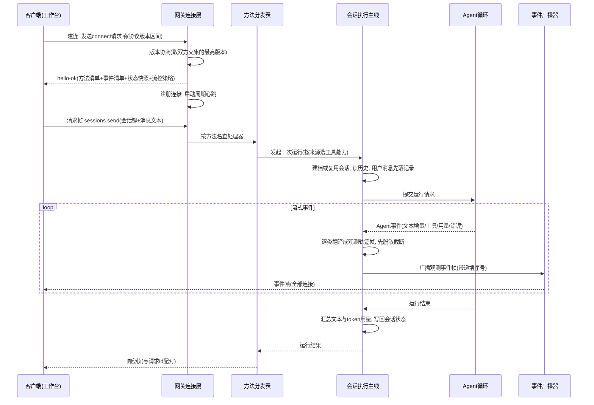

# 对外服务层与消息通道

## 读前思考

- 两个客户端同时连上同一个常驻网关：一个是正在走配对流程的新设备，只该收到配对握手事件；另一个是操作者的运行工作台，要看到会话流、模型输出和工具轨迹。服务端的事件广播凭什么决定谁收到什么？如果其中一个客户端网络极慢、发送队列一直排空不了，广播应该等它，还是丢弃，还是直接断开？
- openclaw 有 TypeScript 和 Python 两套实现，前端却只有一套。两套语言、两套类型系统，怎么保证两边在网线上说的是同一种帧协议，而不是"看起来一样、字段悄悄漂移"的两种协议？

## 核心问题

本主题在 openclaw 中的定义是：**把 Agent 运行时唯一对外暴露的服务面收敛成一个长连接服务——连接接入、连接级认证、RPC 方法面、事件广播全部从这一个门进出**，让前端工作台、IM 通道、外部工具进程用同一种帧协议操作同一个运行时；通道层则严格 transport-only，消息归属由 9 级路由优先级裁决。双实现对同一问题给出了轻重两份答案。

| 维度 | Python 版 | TypeScript 版 |
|------|-----------|--------------|
| 服务形态 | 精简 RPC 网关（FastAPI + WebSocket 端点） | 长连接控制面服务器 |
| 协议定义 | 数据模型即契约，运行时导出 JSON Schema | 独立协议包，单一协议源 |
| 连接级认证 | 握手直接信任（本地部署假设） | 四种认证模式 + 只针对失败的限流 |
| 事件广播 | 全量 fan-out，无过滤无背压 | 作用域守卫 + 慢消费者背压，未声明默认拒绝 |
| 通道形态 | 飞书长连接闭环 + WebChat 反通道 | 15+ transport-only 适配器，四类连接 |
| 消息路由 | 9 级契约落地 4 级 | 9 级全实现 + 预编译索引 |
| 配置治理 | 单文件实用主义加载器 | 文件包含模块化 + 原子写入 + 备份轮转 |

动作级审批与消息级准入（五阶段准入门控）归 09-guardrails；归属确定后的会话状态隔离与多代理实例隔离归 04-state。

## 方案展示

### 设计选择一：单一协议源——帧形状只在一处定义

**设计选择**。两个版本都没有让服务端和客户端各自维护一份帧结构。TS 版把协议抽成独立协议包：请求帧、响应帧、事件帧三种帧形用类型字段做判别联合，每个 RPC 方法的参数和返回值都有对应声明，服务端校验、客户端类型、文档导出全部从同一份声明推导。握手确认帧一次下发协议版本、方法清单、事件清单、状态快照和流控策略（单帧上限、发送缓冲上限、心跳间隔），客户端一次握手就拿到全部契约。Python 版走"模型即契约"路线：帧和方法参数用数据模型定义，运行时开放 schema 端点把 JSON Schema 直接从当前校验模型导出——前端拿到的契约就是服务端正在执行的那一份，不存在文档过时。握手流程与 TS 版同构：客户端声明可接受的协议版本区间，服务端取交集内最高版本。

**为什么这么选**。长连接 RPC 最常见的隐性故障是两端类型漂移：服务端改了字段，客户端旧版本还在发旧形状，错误要到运行时才暴露。单一协议源把漂移挡在编译期（TS）或校验期（Python）——帧进不来就是协议错误，而不是悄悄变成残缺对象。

**牺牲了什么**。TS 版的协议包随主项目演进膨胀成所有客户端的公共依赖，每加一个方法都要补声明；Python 版的契约导出是运行时产物，没有跨语言编译期检查，两实现之间的协议一致性靠人工对齐，没有机器强制。

### 设计选择二：事件广播治理的不对称——作用域守卫 vs 全量扇出

**设计选择**。这是两版分岔最明显的一处，分岔原因是部署假设不同。TS 版为每种事件声明所需访问级别，形成事件-作用域守卫表：会话类事件要求读级，审批类要求审批级，终端字节流要求管理级；配对作用域只服务配对握手本身，配对中的设备不会被动收到任何会话内容；未声明的事件默认拒绝——新增事件忘写声明的结果是"没人收到"而不是"所有人都收到"，泄露方向的错误被扭转为静默失联。同一层还做慢消费者治理：发送前检查待发送缓冲量，超限按事件性质二选一——可丢的高频事件直接跳过并推进序号，不可丢的直接断开连接，让客户端重连后靠状态快照追齐。载荷的序列化每个事件只做一次，按连接拼接序号，避免为每个连接重复序列化大对象。Python 版假设本地单用户工作台：握手校验版本区间后直接置为已认证，不做凭据核验；广播遍历全部连接逐个发送，无过滤无背压——但握手协议本身是完整的，简化的是信任裁决而不是协议结构，将来要补认证和过滤协议层不用动。

**为什么这么选**。TS 版的连接里有陌生设备和只读旁观者，信任级不同就必须过滤；Python 版连上来的都是自己人，过滤要解决的问题根本不存在，做了就是纯成本。

**牺牲了什么**。TS 版每加一种事件都要回答"它属于哪个作用域"，守卫表本身成了需要持续维护的安全资产，声明错误的代价是信息泄露或静默失联。Python 版一旦离开本地部署假设——端口暴露到不可信网络——全量扇出加无凭据握手意味着任何能建连的人都看得到所有会话内容，这是它的假设边界，不是可以忽略的细节。

### 设计选择三：transport-only 通道与 9 级消息归属路由

**设计选择**。TS 版有严格的架构规则：通道只做三件事——渲染可移植的展示与动作、执行传输限制、映射原生回调信封；不拥有产品命令树和功能菜单，"用户输入帮助命令"这类逻辑在核心实现一次，所有通道自动获得。消息归属由两个版本共同遵循的 9 级路由优先级裁决，从最具体到最宽泛逐级尝试、命中即停：精确会话对象匹配、父对象继承（话题继承群的绑定）、对象通配、群加角色、仅群匹配、团队归组、账号级、通道级，全部落空则按消息类型生成默认会话键（私聊按发送者、群聊按会话、有话题按话题）。粒度越细的规则优先级越高，保证"为某个人定制"总能覆盖"为整个群定制"。落地程度两版不对称：TS 版全 9 级实现并预编译索引（按对象、群、团队、账号、通道分桶，一次路由只查命中桶）；Python 版只落了精确对象、账号、通道、默认四级——它的典型部署只有飞书和 WebChat，只实现够用的子集。传输侧按平台 API 形态选型：长轮询、webhook（先落盘再确认、处理完打墓碑防重投副作用）、平台长连接（按意图订阅）、本地守护进程桥接四类；飞书走长连接闭环是因为 Python 版定位本地部署、没有公网 IP 接收回调。连接进来之后这条消息"能不能进 Agent、以什么身份进"的五阶段准入门控是动作级裁决，归 09-guardrails；归属确定后的会话状态隔离见 04-state。

**为什么这么选**。如果每个通道都拥有产品逻辑，新增一个功能就要改 N 个适配器；transport-only 让核心极厚、通道极薄。9 级路由是因为不同场景需要不同会话粒度，且粗粒度规则不能吞掉细粒度定制。

**牺牲了什么**。通道不能利用平台特有能力做深度集成，靠"类型化展示动作"缓解——核心声明动作语义，通道支持时映射为原生交互、不支持时降级为纯文本。每种连接都要单独做可靠性工程（轮询偏移推进、webhook 重投、长连接重连分类），这部分代码量往往超过消息转换本身。Python 版未来若接入带角色体系的平台，需要补齐中间各级路由。

### 设计选择四：按消息来源选能力 + 仅元数据审计

**设计选择**。网关是同一条执行主线的入口，但不同来源的消息不该拿到同样的能力。Python 版的共享执行入口在发起运行前做一次能力裁决：消息来自远程通道就用受限工具集，来自本地入口才用全量工具集；裁决的作用点是过滤可用工具表和系统提示词里的工具说明——被禁的工具连"存在"都不告诉模型。TS 版把同样的"按来源收敛信息"思路放在审计面：审计记录只覆盖运行与工具两类生命周期事件，每条带执行者、会话、运行标识、工具名，但明确不含任何内容——脱敏标记被协议结构锁死为"仅元数据"的字面量，不是"默认不存内容"，而是结构上就没有内容字段的位置。

**为什么这么选**。网关是信息汇聚点，最容易变成"什么都看得见"的特权面。工具裁决管住"远程来源能做什么"，仅元数据审计管住"审计系统自己能留什么"——方向相反，但都是同一个原则：默认最小化，显式扩大。工具策略整体的可见性与调度归 07-tools，其中按来源选择执行环境的部分见 08-runtime；审计的观测用途见 10-observability。

**牺牲了什么**。受限能力让远程入口的 Agent 明显弱于本地，跨入口体验不一致；仅元数据审计意味着事后排查"那次运行到底处理了什么内容"必须去查另一条带内容的轨迹记录。

### 设计选择五：配置治理——模块化、原子写入与实用主义

**设计选择**。TS 版支持文件包含指令把配置拆进多个模块（有最大嵌套深度、总大小限制和路径遍历防护），并记录每个字段来自哪个模块——用户在界面上改了配置，写回时系统知道该修改哪个文件，不会破坏模块化结构。写入流程是差异补丁、恢复环境变量引用、保留模块所有权、临时文件原子替换、备份轮转、审计记录六步；覆盖前还保存完整快照，新配置导致启动失败时可以按上一份良好配置恢复。Python 版约 200 行实用主义加载器：标准 JSON 优先解析、失败回退带注释的方言，模型允许未知字段以兼容 TS 端新增，写入前保存备份——没有模块化、没有原子写入，因为当前规模不需要。环境变量引用在写回时恢复为占位符以防明文密钥落盘，机制归 09-guardrails；多代理目录的实例隔离归 04-state。

**为什么这么选**。TS 版支持界面修改配置，必须回答"改哪个文件、怎么不写坏、怎么回滚"三个问题；Python 版配置只读，单文件加载够用。

**牺牲了什么**。TS 版的配置读写模块膨胀到三千余行，相当一部分在处理包含环检测、所有权合并、写入边界这些边界情况，配置调试难度随之上升。Python 版允许未知字段的代价是拼写错误不报错、静默忽略——schema 稳定后应切换到严格模式。

### 设计选择六：入站消息的防抖与去重

**设计选择**。IM 平台不保证投递幂等：网络抖动会重发，飞书这类平台在收不到确认时还会主动重试推送；用户快速连发则产生多条意图上同属一次的短消息。两版各有一套入站防护。Python 版做两道：按消息标识去重，内存字典记录已见消息标识，带 600 秒存活期惰性清理，同一标识的第二份直接丢弃、不进入执行主线；按会话防抖，同一会话的连续消息先在 500ms 窗口内合并成一条再提交，用户快速连发"你好""帮我""查一下"只触发一次运行。TS 版把同样的思路做成独立入站防抖策略模块，并在路由前做大小写不敏感的会话键规范化，避免同一会话的变体写法拆散合并窗口；超大事件分片发送时按消息标识分桶合并还原，分片之间不被去重误伤。

**为什么这么选**。去重防的是重复执行副作用——重发消息若原样进入循环，工具可能被跑两次；防抖省的是轮次与上下文——连续碎片逐条处理既浪费一轮轮次，又让模型面对割裂的输入。窗口定多长是权衡：太短几乎合并不了什么，太长用户能感到回复延迟，500ms 是覆盖多数"快速连发"场景的经验折中。

**牺牲了什么**。合并吞掉了消息边界——用户若真在窗口内发出两条独立消息（脚本、快捷短语触发），会被并成一条处理；去重依赖平台消息标识的稳定性，标识缺失时退化为只做防抖；内存字典是单实例结构，多实例部署下同一消息可能各自进入执行链。

### 设计选择七：分组门控——mention 门控、群策略与线程绑定

**设计选择**。群聊场景的入站消息在归属路由之外还要回答三个问题：值不值得响应、以什么粒度归会话、群内上下文怎么维护。TS 版把这套分组决策做成配置级能力。第一层是 mention 门控：群聊默认只响应提到机器人的消息，只有"策略要求提及、平台具备检测能力、消息确实没提到"三个条件同时成立才跳过；隐式提及可配置放行——回复机器人、引用机器人、出现在机器人参与过的线程里的消息都算隐式提到；已授权控制命令不要求 @，命令本身意图明确，不需要提及激活。第二层是群策略：开放、允许列表、禁用三态，配置缺失时收紧到允许列表口径——只放行显式授权的人，并告警一次提示补齐配置，宁可拒绝不可放错。第三层是会话粒度与线程绑定：会话键按平台形态建模——Telegram 用"聊天ID:话题ID"区分论坛话题与私聊，Discord 沿服务器、频道、线程三级下钻，WhatsApp 靠标识后缀区分群与私聊；线程可以绑定到独立子会话，绑定位置决定消息进当前会话还是子会话，空闲超过默认一天自动解绑，绑定期间激活与结束各发一条介绍与告别消息——"群里某个话题领走一个独立 Agent 会话"因此成为配置级能力。Python 版只在内联层面实现了飞书群聊门控（默认提及模式，开放模式关闭门控），群成员列表与角色不解析，群粒度归属路由缺少数据来源，只能等默认兜底。

**为什么这么选**。群聊里机器人是被动参与者，不设门控就得响应群里每一条消息，噪声直接变成 token 消耗；群策略三态加 fail-closed 是因为它决定陌生人能不能把消息送进运行时，配置缺失时宁可拒绝也不静默放行；线程绑定把"会话归属"从平台话题扩展成 Agent 的分工工具——不同话题各自维护独立上下文，互不污染。与准入链的边界：五阶段准入门控中的激活门（见 09-guardrails）引用的就是这套提及判定——本机制是平台层的消息路由策略，判定依据以本篇为准，09 只保留门的位置与其余四门的配合，不重复机制。

**牺牲了什么**。门控依赖平台的能力事实——平台检测不到提及就退化为全收或全拒，适配器填错事实会静默放行或拦截；线程绑定要维护绑定状态、解绑与上下文隔离，话题活跃的群会话数量随线程膨胀；Python 版未接线的群成员与角色解析，让群粒度路由只能停在默认兜底。

## 核心机制执行流：一次 WebSocket 会话消息发送的全链路

以 Python 版为主线（TS 版结构同构、治理更重）：

**握手阶段**。连接建立后第一帧必须是连接请求帧，否则网关直接回错误响应并结束连接——这是协议层的第一道形状检查，把"连上就乱发"的客户端挡在门外。版本协商取交集内最高版本，让新旧客户端都能连上同一台服务端；确认帧把方法清单、事件清单、状态快照和流控策略一并返回，客户端不必再发一轮查询就能渲染初始界面。TS 版在此处多一步认证裁决：运行时覆盖、配置文件、环境凭据三级来源按优先级合并出四种模式之一，默认落在令牌模式——配置缺失时宁可报"缺令牌"的明确诊断，也不静默关闭认证；另有滑动窗口限流器只对认证失败计数，超限进入锁定窗口，环回地址默认豁免以免本机命令行被锁在外面。

**方法分发阶段**。主循环收到的每一帧都先过形状校验，只有请求帧进入分发：按方法名查注册表，查不到回"方法未找到"错误帧。Python 版注册表约 20 个方法，覆盖配置读写、会话增删改查与发送、执行与等待、工具目录、通道状态；处理器抛出的任何异常都转成结构化错误帧而不是断开连接。TS 版的方法面还接受插件贡献的方法，每个方法声明自己的访问级别，分发前按连接持有的作用域裁决——方法级权限检查和事件级广播守卫是同一套作用域体系的两面。

**执行阶段**。消息发送方法进入共享执行主线后：按会话键建档或复用会话，读取历史（只把模型能理解的角色放回上下文，历史里的工具消息不重新喂给模型），用户消息无论后续成败都先落记录——即使模型调用失败，这条输入也保留下来方便排查失败现场。然后按消息来源选工具能力、组装系统提示词，提交给 Agent 循环。循环内部的工具调度与重试归 03-orchestrator 与 07-tools，这里只关注它的产出——一条事件流。

**事件翻译与广播阶段**。执行主线逐类消费事件流并翻译成面向人的观测轨迹帧，同时维护"运行中视角"的上下文快照，把模型增量拼回消息序列随帧广播——前端工作台因此能看到完整的消息序列演化，而不只是孤立事件。每个载荷广播前先过递归脱敏与截断，因为这条流直接渲染在前端。事件的消费方不止广播一路：本地调用方发起执行时可传入流式回调，文本增量直推发起者，不必绕广播——工作台是旁观者要看全景，发起者只要自己那次运行的增量。TS 版对应位置是带作用域守卫的广播器。

**收尾阶段**。运行结束后汇总最终文本与用量写回会话状态，发出完成或失败帧，最后给发起请求的连接回一个与请求编号配对的响应帧。响应帧只在运行彻底结束后发一次，运行期间的进度全靠事件帧——请求编号负责闭环，事件序号负责顺序。

## 工程优化

**懒加载门面降低启动依赖**。TS 版的网关入口文件只有四十余行，实现模块通过动态导入延迟加载；网关启动时要组装的东西太多（配置、凭据、插件、通道、定时任务），任何一块能延后的都应该延后。

**通道账号作为被监管任务**。TS 版把每个通道账号当被监管任务：启动并发受限，退出后指数退避自动重启、带抖动、重试次数有上限，持续稳定运行超过封顶时长才清零计数。三个防误报细节：被中止的旧任务可能延迟发出心跳，状态写回前校验任务是否仍是当前任务；连续崩溃触发断路器后抑制该通道的全部自动启动，只允许人工拉起——配置重载不能把正在排查的崩溃循环重新激活。Python 版从简：逐账号启动、单个失败不阻塞。

**入站可靠性工程**。webhook 类连接先落盘再确认、处理完成打墓碑而非删除——平台不保证更新幂等，崩溃后重投不会重复执行副作用；长轮询用租约防止多实例抢同一个机器人令牌；传输错误分类处置：服务端错误和限流本地重试、认证与资源缺失致命不重试、冲突上抛。

**慢消费者诊断只报一次**。缓冲超限的连接区分"可丢就丢"与"不可丢就断"，每个连接只记一次诊断（缓冲量、上限、处置原因），避免慢连接在日志里刷屏；连接恢复正常后标记复位。Python 版握手时下发的流控策略与 TS 版形状一致，为将来补齐背压留好了协议位置。

## 面试要点

**1. Python 版的全量扇出在什么条件下必须升级为作用域过滤？**

全量扇出的隐含假设是"所有连接的信任级相同"。升级条件取决于两个变量的乘积：客户端角色多样性 × 网络暴露面。只要出现第二类信任级的客户端（配对中的陌生设备、只读旁观者与可操作者并存），或者端口离开环回进入不可信网络，任何一条都足以让"所有人都看到所有事件"变成信息泄露。反过来，单用户本地工作台加环回绑定，过滤只是纯成本。所以答案不是"扇出是简陋的"，而是"扇出在它的部署假设内是正确的，且假设写在了明处"。迁移路径可以先补握手认证，再按事件类别逐步加过滤——协议帧里本就有事件名可作过滤键；未声明事件默认拒绝这条规则值得照抄，它把新增事件时的错误方向从泄露扭转为失联。判断标准：**取决于客户端信任级数量 × 端口暴露范围**。

**2. 为什么坚持"通道不拥有产品逻辑"？平台特有交互能力（如小程序、交互卡片）会不会打破这个规则？**

不拥有产品逻辑的收益是新增功能只在核心实现一次，N 个通道自动获得，且各通道行为一致。限制确实存在：平台特有的富交互在 transport-only 下只能映射为"打开一个 URL"或降级为纯文本。缓解方案是类型化展示动作——核心声明动作的语义类型，通道在支持时映射为原生交互。判断标准：**取决于通道数量 × 平台特有交互与核心功能的耦合度**——通道多且交互可用通用意图表达时，薄通道收益最大；只有当某个平台的核心交互无法用通用意图表达、且该平台是主战场时，才值得为它破例。

**3. Python 版握手直接置为已认证、不校验凭据，这个简化什么时候必须补齐？代价是什么？**

这取决于部署位置 × 网关持有的能力。网关背后是能执行工具、读写配置的完整运行时，一旦监听地址从环回放出去（反向代理、容器端口映射），无凭据握手等于把运行时控制权交给任何能建连的人，必须补齐——TS 版已经给出现成答案：四模式认证裁决加三级凭据来源合并，再加只对失败计数的限流。补齐的代价有三层：客户端要管理令牌分发与轮换；本地调试的零摩擦体验消失；认证模式越多，凭据来源的合并语义越需要明确规则，否则出现"改了配置不生效"的诊断困难。值得注意的细节是 TS 版默认模式是令牌而不是关闭——配置缺失时宁可明确报错也不静默放行，这是 fail-closed 思路。判断标准：**取决于网络暴露面 × 网关背后能力的破坏力**——两者任一升高，认证就从摩擦变成必需品。
