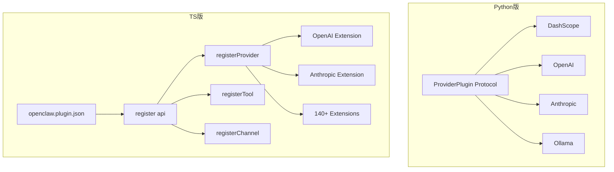
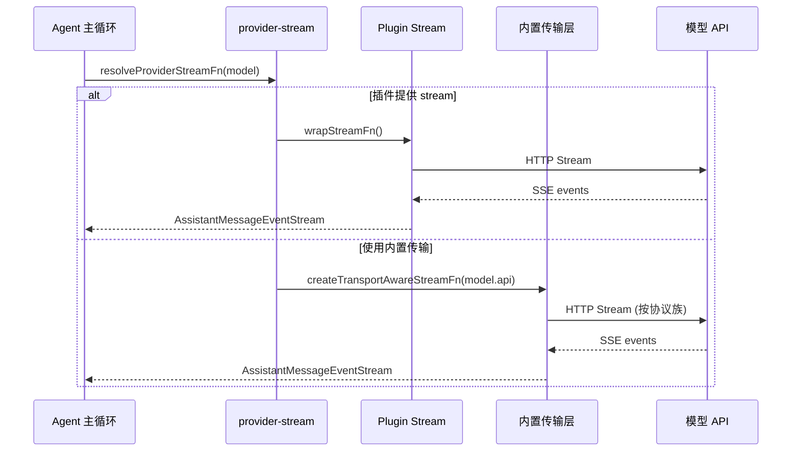
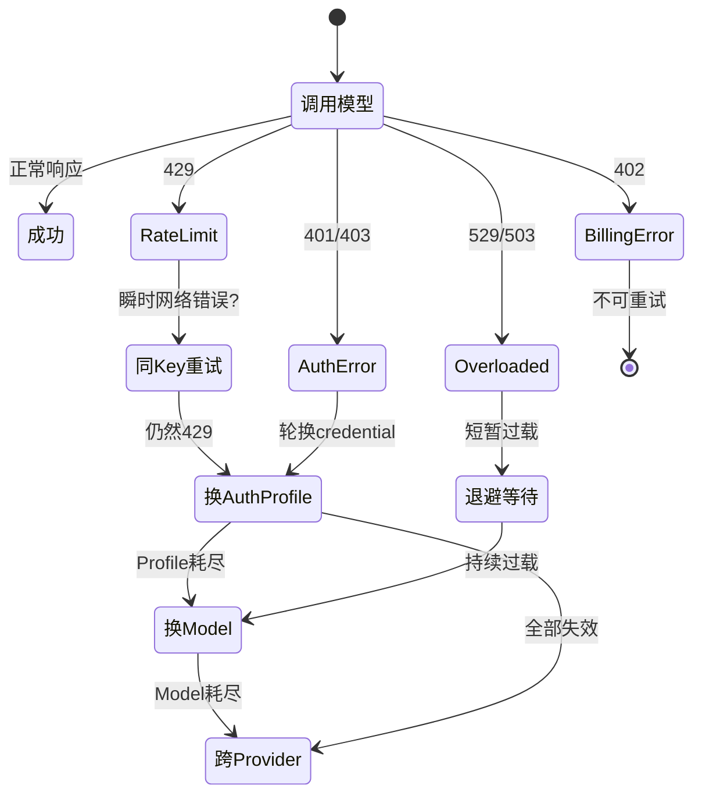

# LLM 接入层

## 读前思考

- 如果你要同时支持 OpenAI、Anthropic、阿里百炼、Ollama 四种协议完全不同的模型供应商，你会设计一个统一的 Provider 接口让它们都实现，还是让每个供应商各自为政、在上层做路由？两种方案在供应商数量从 4 增长到 140 时，哪个先崩溃？
- 当一次模型调用因为 rate-limit 失败时，你有三个选择：换 key、换模型、换供应商。这三个动作的优先级应该怎么排？如果排错了会发生什么？

## 核心问题

LLM 接入层解决的核心问题是：**如何让上层 Agent 循环完全不感知底层模型供应商的差异，同时在调用失败时自动恢复到可用路径**。

OpenClaw 有 Python 和 TypeScript 两种实现，面对这个问题给出了规模差异巨大但思路一致的答案：

| 维度 | Python 版 (openclaw-python) | TypeScript 版 (openclaw-2026.7.1) |
|------|---------------------------|----------------------------------|
| 定位 | 本地 AI Gateway，4 个供应商 | 全栈个人 AI 助理，140+ 扩展 |
| Provider 抽象 | typing.Protocol 鸭子类型 | Plugin manifest + register(api) 钩子 |
| Fallback 层级 | 单层：key 轮换 → fallback model | 三层：auth profile → 同 provider 换 model → 跨 provider |
| 流式处理 | httpx SSE 逐行解析 | 按 model.api 路由到内置传输实现 |
| 代码规模 | ~800 行（4 个 provider 总计） | model-fallback.ts 单文件 2037 行 |

## 方案展示

### 设计选择一：Protocol 驱动 vs 插件注册——Provider 抽象的两种路径

Python 版用 typing.Protocol 定义 ProviderPlugin 接口，任何实现了 list_models 和 create_stream 方法的类都自动满足契约，无需继承。四个 Provider（DashScope、OpenAI、Anthropic、Ollama）各自独立实现，Gateway 启动时按环境变量有无决定注册哪些。

TypeScript 版走了完全不同的路：Provider 是一个插件，通过 openclaw.plugin.json 声明静态元数据（模型目录、端点、激活条件），通过 index.ts 的 register(api) 调用 api.registerProvider() 完成动态注册。API 面包括 resolveDynamicModel、normalizeResolvedModel、wrapStreamFn、resolveThinkingProfile 等 30 多个可选钩子。

为什么 TS 版不直接用接口继承？因为 140 多个供应商的差异远超"发请求、收响应"的范畴——OpenAI 需要 thinking profile，Anthropic 需要 CLI backend 模式，Google 需要 OAuth 流程。一个固定接口要么太胖（大部分方法空实现），要么太瘦（无法表达差异）。插件注册式让每个供应商只暴露自己需要的钩子。

代价是类型安全从编译期退到了运行时。Python 版的 Protocol 至少在 mypy 检查时能发现接口不匹配；TS 版的 manifest 契约只有跑 provider-contract-api.ts 测试时才能验证。

### 设计选择二：流式传输——SSE 直连 vs 协议族路由

Python 版的流式处理非常直接：每个 Provider 内部用 httpx.AsyncClient.stream 发 SSE 请求，逐行解析 data: {...} 行，按 delta.content、delta.tool_calls、usage 三类事件 yield 标准化字典。tool_call 的 arguments 是流式分片到达的，Provider 内部用 dict[int, dict] 按 index 缓冲，直到 finish_reason 才一次性 yield。

TS 版引入了"协议族"概念。每个 Model 对象有一个 api 字段（如 openai-responses、anthropic-messages、google-generative-ai），provider-transport-stream.ts 按这个字段路由到对应的内置传输实现。OpenAI 传输实现 157KB，Anthropic 67KB——它们不是简单的 HTTP 客户端，而是处理了各自协议的流式分片、错误码映射、重试语义。

当插件提供了自己的 stream factory 时（通过 wrapStreamFn 钩子），优先使用插件流；否则 fallback 到 OpenClaw 管理的传输层。这个"plugin-owned stream vs managed transport"的双轨制让核心代码不需要为每个新供应商写传输逻辑，但也意味着调试一条流式链路时需要先判断走的是哪条路径。

### 设计选择三：Fallback 策略——单层降级 vs 三层故障转移

这是两个版本差异最大的设计。

Python 版的容错在 retry_loop.py 中实现，逻辑清晰：错误分类器把异常分为 7 种类型（context_overflow、timeout、auth、rate_limit、overloaded、billing、unknown），每种类型有固定的恢复路径。rate_limit 和 overloaded 先轮换 key，轮换耗尽后降级到 fallback model。整个逻辑用 ~200 行代码表达。

TS 版的 model-fallback.ts 有 2037 行，实现了三层故障转移：

1. **Auth Profile 轮换**：同一 provider 同一 model，切换不同的 credential（支持 OAuth token、API key 等多种形式）
2. **同 Provider 换 Model**：当前 model 不可用时（如 overload），切换到同 provider 的备选 model
3. **跨 Provider Fallback**：整个 provider 不可用时，切换到配置中声明的备选 provider

三层之间有严格的升级条件：rate-limit 先尝试同 key 瞬时重试（网络抖动），再换 key，再换 model；overload 先退避等待，再换 model；billing 错误直接不可重试。

为什么 TS 版需要这么复杂？因为它是面向生产环境的全栈产品，用户可能配置了多个 provider（OpenAI 主力 + Anthropic 备选 + 本地 Ollama 兜底），每个 provider 有多个 auth profile（个人 key + 团队 key + OAuth），每个 profile 有不同的 rate-limit 配额。Python 版只是本地 Gateway，一个 key 打天下，自然不需要这种复杂度。

代价是状态变量爆炸：run.ts 中追踪 profileIndex、overloadProfileRotations、rateLimitProfileRotations、consecutiveSameModelRateLimitRetries 等约 30 个 let 变量，可读性极差。

### 设计选择四：Auth Profile 生命周期管理

Python 版的 auth 轮换很简单：auth_rotation.py 维护一个 key 列表和当前索引，遇到 auth/rate_limit 错误时 advance 到下一个。

TS 版有 77 个文件组成的 auth-profiles/ 子系统，管理完整的 credential 生命周期：

- **OAuth 流程**：自动刷新 token，处理 refresh_token 过期
- **Cooldown 机制**：被 rate-limit 的 profile 进入冷却期，冷却期内不选择该 profile
- **Cooldown Probe**：冷却期内允许探测性尝试（shouldUseTransientCooldownProbeSlot），避免完全阻塞
- **Usage 追踪**：记录每个 profile 的 token 消耗，支持按用量排序
- **Order 策略**：支持 round-robin、least-used、priority 等多种选择策略

这套机制的设计动机是：企业用户可能有 5 个 OpenAI API key（分属不同团队），每个 key 的 rate-limit 配额不同，需要在它们之间智能切换以最大化吞吐。

### 设计选择五：模型选择与解析

Python 版的模型选择很直接：配置中写 provider:model 或纯模型名，model_selection/resolver.py 按名字在已注册 provider 中查找。

TS 版的 model-selection.ts + model-selection-shared.ts（52KB）处理更复杂的场景：

- **模型别名**：sonnet → claude-sonnet-4-20250514，用户不需要记完整模型 ID
- **动态模型发现**：Provider 可以在运行时报告新模型（如 OpenAI 发布新模型后，无需更新 OpenClaw 代码）
- **Allowlist/Denylist**：管理员可以限制可用模型范围
- **Persisted Model Ref**：用户上次使用的模型持久化，下次启动自动恢复

## 工程优化

**Python 版的工程细节：**
- httpx 超时统一 120 秒，错误时 yield {"type": "error"} 而非抛异常，让上层 retry_loop 统一处理
- 最大重试迭代数根据 auth profile 数量动态计算：base(24) + profiles × 8，范围 [32, 160]
- 通用退避公式 min(iteration × 0.5, 5) 秒，避免固定间隔的 thundering herd

**TS 版的工程细节：**
- Lazy Import：model-fallback.ts 用 createLazyImportLoader 延迟加载 auth 逻辑，避免冷启动加载全部认证代码
- Fallback Candidate Cache：Map 结构缓存已解析的候选列表（256 entries），避免每次调用都重新解析配置
- Stream 注册延迟：ensureCustomApiRegistered 仅在 concrete stream 存在后注册 API，避免无效路由
- API Key 轮换与 Transient Retry 分离为两个独立循环，避免将网络抖动误判为 key 失效

## 面试要点

**问题一：为什么 TS 版选择"插件注册式"而不是"接口继承式"来抽象 Provider？如果只有 4 个供应商，这个选择还合理吗？**

参考答案方向：接口继承式在供应商少时更简洁（Python 版证明了这一点），但当供应商数量增长到 140+ 时，固定接口面临两难——太胖则大部分方法空实现，太瘦则无法表达差异（OAuth vs API key vs CLI backend）。插件注册式通过可选钩子让每个供应商只暴露需要的面。代价是类型安全从编译期退到运行时，需要契约测试补偿。如果只有 4 个供应商，Protocol/接口继承是更好的选择——简单、类型安全、调试链路短。

**问题二：三层 Fallback（auth profile → 同 provider 换 model → 跨 provider）的升级条件是怎么设计的？为什么 rate-limit 和 overload 的处理路径不同？**

参考答案方向：rate-limit 是"你的请求太多"，换 credential 就能解决（不同 key 有独立配额），所以先换 profile；overload 是"服务器扛不住"，换 credential 没用（同一个服务器），所以直接退避或换 model。billing 错误是"没钱了"，任何重试都没意义，直接终止。升级条件的核心原则是：先尝试成本最低的恢复动作（换 key 比换 model 便宜，换 model 比换 provider 便宜），只有当前层级耗尽才升级。

**问题三：Python 版的错误分类器把异常分为 7 种类型，这个分类的边界是怎么划定的？如果新增一种错误（比如模型返回空响应），应该归入哪一类？**

参考答案方向：7 种类型的划分标准是"恢复动作是否相同"——context_overflow 和 timeout 都触发压缩（但次数限制不同），rate_limit 和 overloaded 都触发 key 轮换（但退避策略不同），auth 触发 key 轮换但不降级 model，billing 不可重试。空响应不属于任何现有类别（不是网络错误、不是认证问题、不是容量问题），应该新增一个 empty_response 类型，恢复路径是"重试同一请求"（可能是模型瞬时故障），但有最大重试次数限制。TS 版实际上就有这个处理：emptyResponseRetryInstruction。
