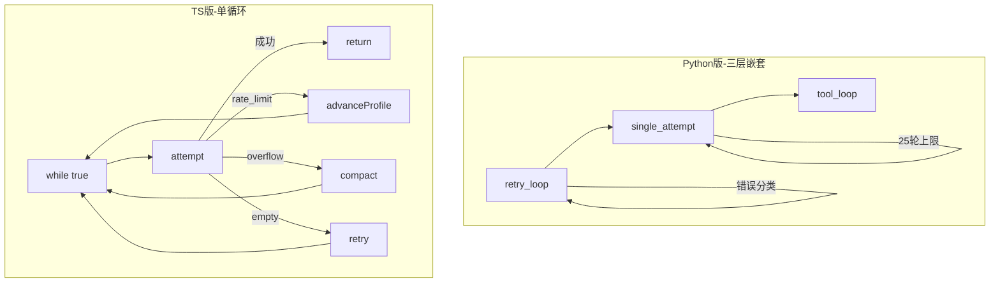
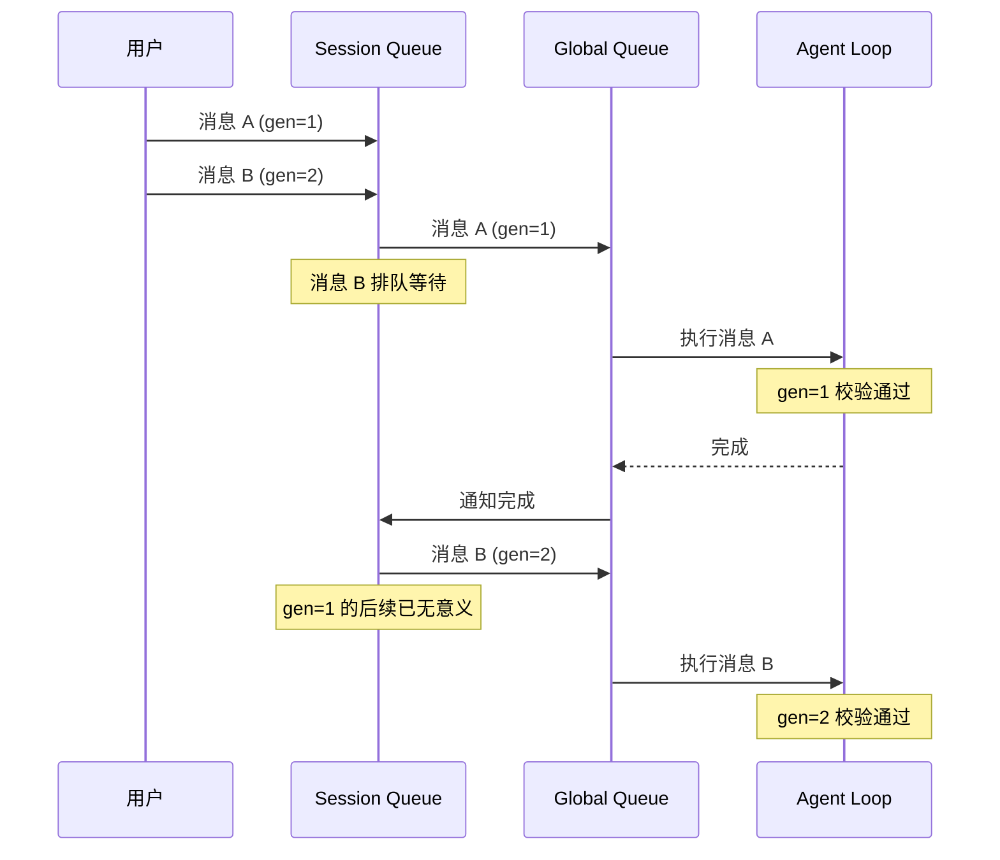
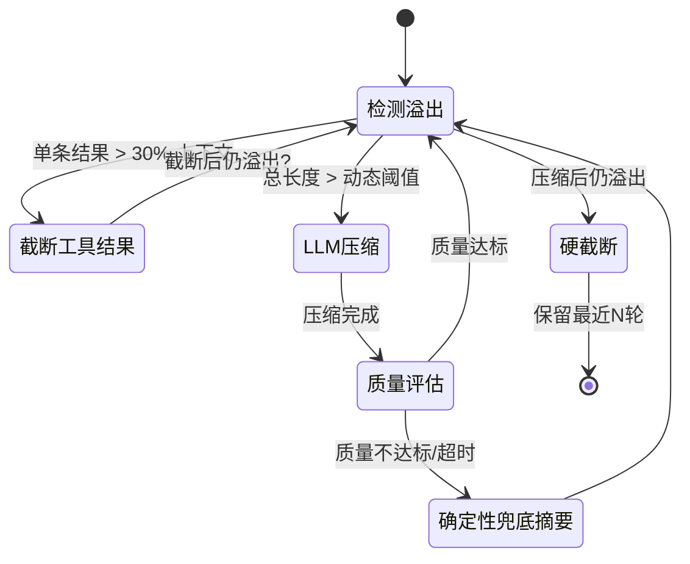

# Agent 主循环

## 读前思考

- 一个 Agent 主循环本质上就是"调模型 → 执行工具 → 再调模型"的 while 循环。但当这个循环需要处理 rate-limit、上下文溢出、空响应、用户中断、进程重启等十几种异常时，你会选择把它写成一个状态机，还是写成一个带大量 if-else 的 while(true)？两种方案在代码膨胀到 4000 行时，哪个更容易维护？
- 如果用户通过飞书和 WebChat 同时给同一个 Agent 发消息，你的主循环应该怎么处理——并行执行两个请求，还是串行排队？如果串行，队列放在哪一层？

## 核心问题

Agent 主循环解决的核心问题是：**如何编排"模型推理 → 工具执行 → 结果回填"的多轮交互，同时在各种异常条件下保证不丢消息、不无限循环、不资源泄漏**。

| 维度 | Python 版 | TypeScript 版 |
|------|-----------|--------------|
| 循环结构 | 三层嵌套：retry_loop → single_attempt → tool_loop | 单 while(true) + 30 个状态变量 |
| 并发控制 | asyncio 信号量（session 级） | 双队列：session 级串行 + global 级并发 |
| 代码规模 | runner.py 456 行 | run.ts 4366 行 |
| 恢复策略 | 错误分类器 → 固定恢复路径 | 内联判断 → 动态升级 |
| 工具循环上限 | 25 轮 | 配置化（默认更高） |

## 方案展示

### 设计选择一：三层嵌套 vs 单循环——循环结构的根本分歧

Python 版把主循环拆成三个清晰的层次：

- **retry_loop**（外层）：负责容错。调用 single_attempt，出错时按错误分类器决定恢复路径（压缩、换 key、降级 model），有最大迭代次数限制。
- **single_attempt**（中层）：负责一次完整的模型交互。进入最多 25 轮的 tool turn 循环：调模型 → 有 tool_call 就执行 → 结果回填 → 再调模型，直到模型给出最终回答。
- **tool_loop**（内层）：负责执行一批 tool_call，收集结果，处理工具错误。

这种分层的好处是每层职责单一：retry_loop 不关心工具怎么执行，single_attempt 不关心错误怎么恢复。坏处是跨层状态传递需要额外参数（比如 compact_fn 要从 retry_loop 传到 single_attempt 内部）。

TS 版选择了完全不同的路：一个巨大的 while(true) 循环，用约 30 个 let 变量追踪所有状态（overflowCompactionAttempts、consecutiveSameModelRateLimitRetries、reasoningOnlyRetryAttempts 等）。每次迭代调用 runEmbeddedAttemptWithBackend 执行一次 attempt，然后根据返回结果在循环体内决定下一步：成功则 return，rate_limit 则 advanceAuthProfile，overflow 则 compact，empty_response 则 retry。

为什么 TS 版不拆分？因为恢复路径之间有复杂交互——compaction 后需要重置 thinking level，rate-limit 后需要判断是否 escalate 到 model fallback，空响应重试需要区分"reasoning-only"和"完全空"。这些交互在分层架构中需要跨层通信，反而比单循环内的 if-else 更难理解。

代价是 run.ts 膨胀到 4366 行，任何修改都需要理解整个循环的上下文。

### 设计选择二：并发调度——session 级串行与全局并发

当多条消息同时到达同一个 session 时，必须串行处理（否则 transcript 会交错损坏）。Python 版用 asyncio 的 per-session 锁实现：run_agent_for_session 方法内部用 session_id 做 key 的字典维护锁，同一 session 的请求排队等待。

TS 版设计了双队列调度：

- **enqueueSession**：保证同一 session 内串行。每个 session 有独立的 lane，lane 有 timeout、heartbeat、priority。
- **enqueueGlobal**：控制全局并发数。防止 10 个 channel 同时来消息时打满系统资源。

更关键的是 **Lifecycle Generation 防重入**机制：每次 run 携带一个 generation 编号，队列执行前校验 generation 是否 current。用户快速连续发消息时，旧 run 可能还在队列中等待，generation 校验能安全丢弃过时的 run，避免用户已经说了"算了"之后 Agent 还在回复上一条消息。

### 设计选择三：上下文溢出治理——三级降级策略

随着工具调用轮次增加，消息历史会不断膨胀直到超出模型上下文窗口。两个版本都实现了渐进式溢出治理，但精细度不同。

Python 版的三级策略：

1. **截断单条超大工具结果**：检测单条工具结果是否超过上下文 30%，超过则智能截断（检测尾部是否包含 error/result 关键词，决定保留头尾还是只保留头部）
2. **LLM 压缩**：保留最近约 10 条消息（大窗口模型多留几条），其余交给 LLM 做结构化摘要（不是聊天摘要——明确提取工具调用、代码片段、决策、待办事项）。触发阈值是动态的：基线 75%、紧急档 90%，且每多一条工具结果消息阈值降 1%（下限 50%）——工具结果最可压缩，越多越应该提前压。压缩结果有 0-1 的质量评分（检查工具名提及率、错误覆盖、长度合理性），低于阈值就弃用 LLM 摘要，改用无 LLM 的确定性兜底摘要；超时和异常也走同一兜底
3. **硬截断**：压缩后仍溢出，截掉最早的消息，保留最近 N 轮

TS 版走的是另一套思路（机制层在 agent-core 的 compaction 模块，外面还包了一层守卫钩子）：

- **真实计数代替估算**：token 数直接取 provider 返回的用量，压缩只在真正必要时发生
- **合法切点**：从尾部倒序累积到保留预算后，只在不切断工具调用对的位置下刀；切点落在某轮中间时，被切断轮的前半部分单独摘要
- **模板化增量摘要**：固定五段 Markdown 模板（目标/约束/进展/决策/下一步），已有摘要时在旧摘要基础上增量更新；压缩产物是会话树中的检查点节点而非破坏性重写，可回溯审计
- **守卫层**：独立的压缩守卫钩子监控压缩行为，防止"压缩→溢出→再压缩"的死循环

两版的横向位置（相对另外三个项目的对比、三个岔路口的完整分析）见 comparisons/13-context-compaction。

### 设计选择四：工具循环的终止条件

工具循环不能无限执行——LLM 可能陷入"调同一个工具 → 得到同样结果 → 再调一次"的死循环。

Python 版用简单的计数器：最多 25 轮 tool turn，超过则强制终止并返回已有结果。

TS 版实现了更精细的 tool-loop-detection.ts（25KB）：
- 检测 LLM 是否重复调用同一工具且参数相同
- 检测工具结果是否与上次相同（无进展检测）
- 超过阈值后不是直接终止，而是注入一条"你似乎在重复调用，请换一种方式"的系统消息，给 LLM 一次自我纠正的机会
- 如果自我纠正失败，才强制终止

### 设计选择五：流式事件广播与可观测性

Python 版的 Gateway 在 run_agent_for_session 中遍历 AgentEvent 流，每个事件都广播到 WebSocket 连接的前端工作台：TEXT_DELTA → runtime.model.delta，TOOL_CALL_START → runtime.tool.started，TOOL_CALL_RESULT → runtime.tool.finished。所有广播数据经过脱敏（密钥替换为 [redacted]）和截断（6000 字符上限）。

TS 版的 embedded-agent-subscribe.ts（55KB）+ embedded-agent-subscribe.handlers.tools.ts（59KB）做同样的事，但规模大得多：除了基本的文本流和工具事件，还处理 thinking 流（模型的推理过程）、multi-turn 工具并行、工具结果流式返回等。

## 系统提示词结构

OpenClaw 的 Python 版和 TS 版在 system prompt 设计上差异显著：Python 版极简（五段拼装），TS 版采用多源编译模式。

**Python 版（backend/src/openclaw/agents/system_prompt/builder.py）：**

build_system_prompt() 按顺序拼装五个部分：

| 序号 | 部分 | 类型 | 核心内容 |
|------|------|------|----------|
| 1 | identity | 静态 | 默认身份声明："你是 DeepClaw，由深维 LLM 开发的 AI 助手"，包含能力说明和自称规则 |
| 2 | channel_context | 条件 | 渠道上下文（飞书/WebChat 等平台的特定指令） |
| 3 | tool_descriptions | 条件 | 可用工具列表："- tool_name: description" 格式 |
| 4 | tool_instructions | 条件 | 工具使用规则（各工具的 instructions 字段汇总） |
| 5 | extra | 条件 | 额外自定义指令（调用方传入的任意补充内容） |

这个设计极其简洁——整个 builder 只有 43 行代码。代价是没有 prompt caching 优化（所有内容拼为一个字符串，任何部分变化都导致缓存失效），且没有模型特定指导、环境信息、记忆注入等能力。

**TS 版（src/agents/ + src/plugins/runtime/）：**

TS 版的 system prompt 通过 buildSystemPromptParams() 收集运行时参数（host、OS、arch、model、shell、channel、repoRoot、时区、时间等），然后由 plugins/runtime 层的 buildSystemPrompt() 编译最终 prompt。TS 版还支持：

| 能力 | 说明 |
|------|------|
| 指令文件 | 从工作区发现 instructions.md 并注入（类似 CLAUDE.md） |
| Skills prompt | 已激活技能的 prompt 内容 |
| Plugin hook 注入 | 插件可通过 hook 向 system prompt 追加内容 |
| Provider transform | 不同 LLM 提供商对 system 字段的格式差异处理（如 Bedrock 的 cache point） |
| systemPromptReport | 生成 prompt 组成的审计报表（各段 token 占比、来源） |
| Trajectory 导出 | system prompt 完整记录到 trajectory 文件（经 redaction 脱敏） |

**两版对比的核心差异：** Python 版是“够用就好”的极简实现，适合单一渠道（飞书）的固定场景；TS 版是面向多渠道、多提供商、插件化的完整架构，支持 prompt 审计和缓存优化。

## 工程优化

**Python 版：**
- 工具结果最大 40,000 字符，单条不超过上下文 30%
- 压缩超时 15 分钟（匹配 TS 版）
- abort_signal 机制：每个 run 注册到 _active_runs 字典，外部可通过 run_id 取消
- 无 provider 时走 mock 回显（开发调试用）

**TS 版：**
- Stage Tracker：createEmbeddedRunStageTracker 记录每个启动阶段耗时，仅在异常时 warn 输出
- Idle Timeout Breaker：检测连续 idle timeout，防止成本失控
- Fast Mode Auto：根据运行时长自动切换 fast mode，平衡速度和质量
- Heartbeat 机制：lane 执行中定期发 heartbeat，防止被误判为超时
- 不完整 turn 处理：empty response 和 reasoning-only response 有独立的重试逻辑和计数器

## 面试要点

**问题一：TS 版为什么选择单 while(true) + 状态变量而不是状态机？这个选择在什么条件下会失败？**

参考答案方向：状态机要求状态之间的转换是有限且明确的，但 Agent 主循环的恢复路径之间有复杂交互（compaction 后重置 thinking level，rate-limit 后判断是否 escalate 到 model fallback，空响应重试区分 reasoning-only 和完全空）。这些交互在状态机中需要大量中间状态和转换条件，反而比 if-else 更难表达。单循环的失败条件是：当状态变量之间的约束多到无法用局部推理验证时（比如"compaction 次数 + rate-limit 次数 + 空响应次数的组合是否超过某个全局预算"），bug 会指数级增长。TS 版用 Post-Compaction Loop Guard 等专用检测器来缓解这个问题。

**问题二：Lifecycle Generation 防重入机制解决了什么问题？如果去掉它，用户体验会怎么退化？**

参考答案方向：没有 generation 校验时，用户快速发三条消息（"帮我查 X"→"算了不查了"→"帮我查 Y"），第一条的 run 可能还在队列中，执行完后会回复一个过时的答案，覆盖第三条的正确回复。generation 机制让队列中的旧 run 在执行前发现自己已过时，安全退出。去掉它的最坏情况是：用户看到 Agent 回复了一条已经不相关的消息，然后紧接着又回复了正确的消息——困惑且浪费 token。

**问题三：工具循环检测为什么选择"先注入提示让 LLM 自我纠正，再强制终止"而不是直接终止？这个设计的假设是什么？**

参考答案方向：直接终止假设"LLM 陷入了不可恢复的死循环"，但实际上很多重复调用是因为 LLM 没意识到自己在重复（比如工具返回了微妙的错误信息，LLM 认为换个参数就能成功）。注入提示给了 LLM 一次元认知机会——"你似乎在重复调用同一工具"。这个设计的假设是：LLM 有足够的自我纠正能力，一次提示就能改变策略。如果这个假设不成立（比如模型能力太弱），自我纠正只会浪费一轮调用，此时应该降低阈值或直接终止。
