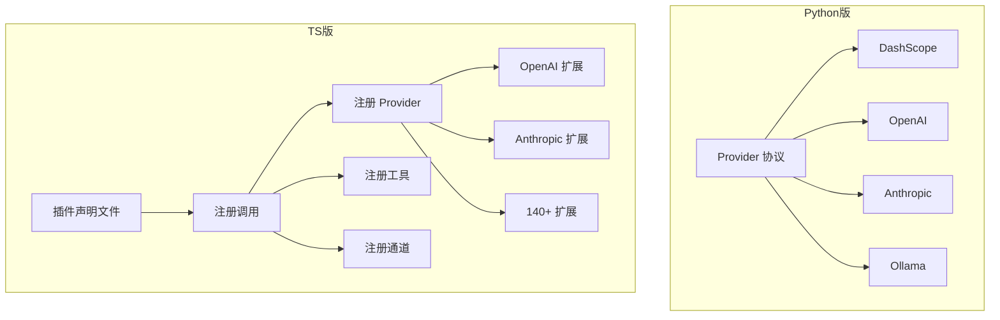
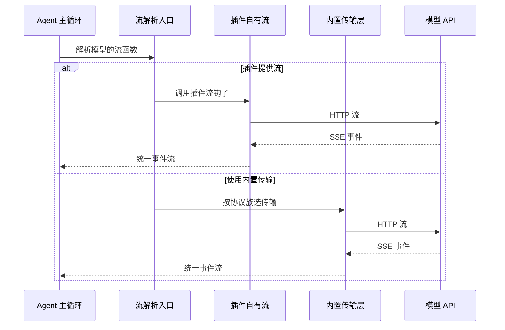
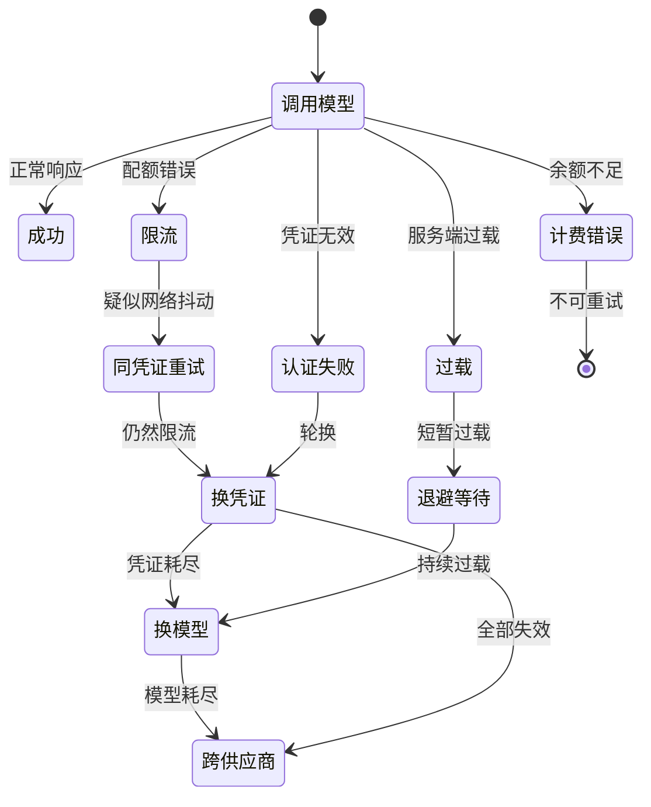
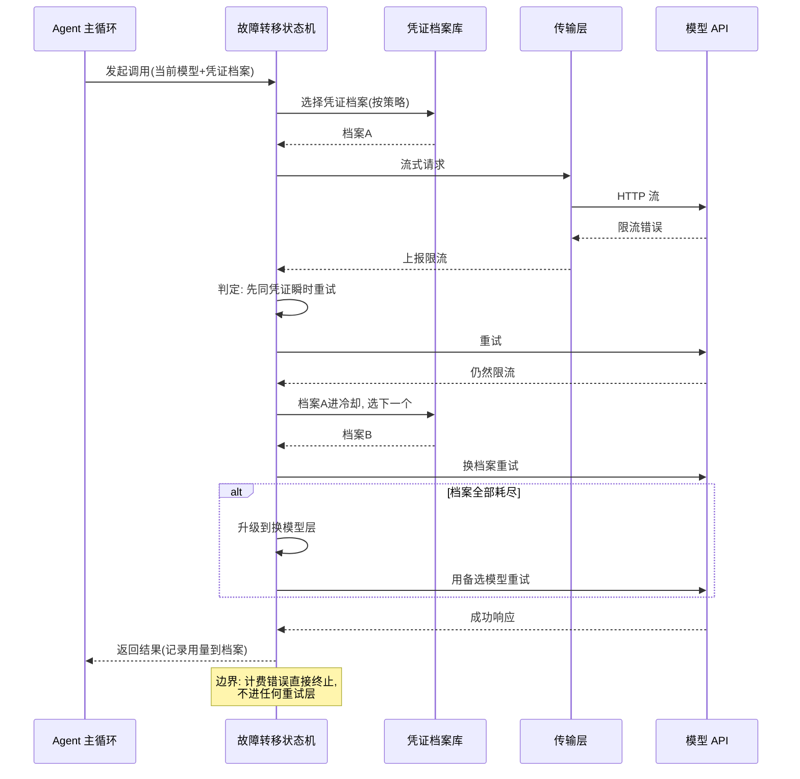

# 模型接入层

## 读前思考

- 如果你要同时支持协议完全不同的四种模型供应商，你会设计一个统一的 Provider 接口让它们都实现，还是让每个供应商各自为政、在上层做路由？这两种方案在供应商数量从 4 增长到 140 时，哪个先撑不住？
- 当一次模型调用因为限流失败时，你有三个选择：换 key、换模型、换供应商。这三个动作的优先级应该怎么排？排错了会发生什么？

## 核心问题

模型接入层解决的核心问题是：**如何让上层 Agent 循环完全不感知底层模型供应商的差异，同时在调用失败时自动恢复到可用路径。**

openclaw 有 Python 和 TypeScript 两种实现，面对这个问题给出了规模差异巨大但思路一致的答案：

| 维度 | Python 版 (openclaw-python) | TypeScript 版 (openclaw-2026.7.1) |
|------|---------------------------|----------------------------------|
| 定位 | 本地 AI Gateway，4 个供应商 | 全栈个人 AI 助理，140+ 扩展 |
| Provider 抽象 | 鸭子类型协议 | 插件声明文件 + 注册钩子 |
| Fallback 层级 | 单层：key 轮换 → 备用模型 | 三层：凭证 → 同供应商换模型 → 跨供应商 |
| 流式处理 | HTTP 客户端逐行解析 SSE | 按协议族路由到内置传输实现 |
| 结构化输出 | 不处理 | 响应格式透传 + 容错解析 |
| 代码规模 | 约 800 行（4 个 provider 总计） | 故障转移状态机单文件 2000+ 行 |

## 方案展示

### 设计选择一：鸭子类型协议 vs 插件注册——Provider 抽象的两种路径

Python 版用鸭子类型协议定义接口，任何实现了"列出模型"和"创建流式调用"两个方法的类都自动满足契约，无需继承。四个 Provider（DashScope、OpenAI、Anthropic、Ollama）各自独立实现，Gateway 启动时按环境变量有无决定注册哪些。

TS 版走了完全不同的路：Provider 是一个插件，通过声明文件描述静态元数据（模型目录、端点、激活条件），通过注册调用完成动态注册。API 面包括动态模型解析、模型规范化、流函数包装、思考档案解析等三十多个可选钩子。

为什么 TS 版不直接用接口继承？因为 140 多个供应商的差异远超"发请求、收响应"的范畴——OpenAI 需要思考档案，Anthropic 需要 CLI 后端模式，Google 需要 OAuth 流程。一个固定接口要么太胖（大部分方法空实现），要么太瘦（无法表达差异）。插件注册式让每个供应商只暴露自己需要的钩子。

代价是类型安全从编译期退到了运行时。Python 版的协议至少在静态检查时能发现接口不匹配；TS 版的声明契约只有跑契约测试时才能验证。

### 设计选择二：流式传输——SSE 直连 vs 协议族路由

Python 版的流式处理非常直接：每个 Provider 内部用 HTTP 客户端发流式请求，逐行解析数据行，按文本增量、工具调用增量、用量三类事件产出标准化字典。工具调用的参数是流式分片到达的，Provider 内部按分片序号缓冲，直到结束原因出现才一次性产出。

TS 版引入了"协议族"概念。每个模型对象有一个协议族字段（如 openai-responses、anthropic-messages、google-generative-ai），传输调度层按这个字段路由到对应的内置传输实现。这些传输实现不是简单的 HTTP 客户端——它们各自处理了协议的流式分片、错误码映射、重试语义，体量以数十 KB 计。

当插件提供了自己的流工厂时（通过流函数包装钩子），优先使用插件流；否则回落到 openclaw 管理的传输层。这个"插件自有流 vs 托管传输"的双轨制让核心代码不需要为每个新供应商写传输逻辑，但也意味着调试一条流式链路时需要先判断走的是哪条路径。

### 设计选择三：Fallback 策略——单层降级 vs 三层故障转移

这是两个版本差异最大的设计。

Python 版的容错逻辑清晰：错误分类器把异常分为 7 种类型（上下文溢出、超时、认证、限流、过载、计费、未知），每种类型有固定的恢复路径。限流和过载先轮换 key，轮换耗尽后降级到备用模型。整个逻辑用约两百行代码表达。

TS 版的故障转移状态机实现了三层升级：

1. **凭证轮换**：同一供应商同一模型，切换不同的凭证（支持 OAuth token、API key 等多种形式）；
2. **同供应商换模型**：当前模型不可用时（如持续过载），切换到同供应商的备选模型；
3. **跨供应商切换**：整个供应商不可用时，切换到配置中声明的备选供应商。

三层之间有严格的升级条件：限流先尝试同凭证瞬时重试（可能是网络抖动），再换凭证，再换模型；过载先退避等待，再换模型；计费错误直接不可重试。

为什么 TS 版需要这么复杂？因为它是面向生产环境的全栈产品，用户可能配置了多个供应商（主力 + 备选 + 本地兜底），每个供应商有多个凭证（个人 key、团队 key、OAuth），每个凭证有不同的配额。Python 版只是本地 Gateway，一个 key 打天下，自然不需要这种复杂度。

代价是状态变量爆炸：故障转移运行时追踪凭证序号、过载轮换次数、限流轮换次数、连续同模型重试次数等约三十个状态变量，可读性差。

### 设计选择四：凭证档案的生命周期管理

Python 版的凭证轮换很简单：维护一个 key 列表和当前索引，遇到认证或限流错误时推进到下一个。

TS 版有一个数十个文件组成的凭证档案子系统，管理完整的凭证生命周期：OAuth 自动刷新与过期处理；被限流的档案进入冷却期，冷却期内不被选择；冷却期内允许探测性尝试，避免完全阻塞；记录每个档案的 token 消耗，支持按用量排序；支持轮询、最少使用、优先级等多种选择策略。

**为什么这么选**：企业用户可能有多个分属不同团队的 key，配额各不相同，需要在它们之间智能切换以最大化吞吐。凭证档案的轮换与选择留在本篇（provider 侧机制），密钥的多源管理与安全治理见 [09-guardrails](./09-guardrails.md)。

**牺牲了什么**：子系统文件数与状态数都庞大，冷却探测、配额追踪这些机制的交互组合很难用测试全覆盖。

### 设计选择五：模型选择与解析

Python 版的模型选择很直接：配置中写"供应商:模型"或纯模型名，解析器按名字在已注册供应商中查找。

TS 版的模型选择层处理更复杂的场景：**模型别名**（短名映射到完整模型 ID，用户不需要记全名）；**动态模型发现**（供应商可以在运行时报告新模型，供应商发布新模型后无需更新 openclaw 代码）；**允许/拒绝清单**（管理员限制可用模型范围）；**持久化模型引用**（记住用户上次使用的模型，下次启动自动恢复——这是 openclaw 对"运行时模型切换"的回答：不做会话内热切换，做跨会话的选择记忆）。

### 设计选择六：结构化输出——透传与容错的分工

TS 版的结构化输出分两层。请求侧：OpenAI 协议族的传输实现支持把响应格式参数原样透传——JSON 对象模式和 JSON schema 模式两种形态，调用方声明什么就发什么；Anthropic 协议族不走响应格式参数，结构化靠工具调用块和思考块的固有结构完成。响应侧：子代理返回的结构化产物用容错解析——标准 JSON 解析失败后回落到 JSON5 解析器（容忍注释、尾逗号、宽松引号），把"模型输出略有瑕疵但语义完整"的情况救回来。Python 版不处理结构化输出。

**为什么这么选**：openclaw 定位是平台，不能假设所有供应商支持同一种结构化约束，透传把选择权交给调用方和供应商；容错解析针对的是真实世界里模型输出的常见瑕疵，比严格拒绝更实用。

**牺牲了什么**：透传意味着结构合法性完全依赖供应商的生成约束，接入层不做 schema 校验兜底；JSON5 容错可能把"本应报错的畸形输出"救活，掩盖上游问题。

## 核心机制执行流：一次限流调用的三层恢复

以 TS 版一次调用遭遇限流、逐层恢复为例：

逐阶段讲解：

1. **入口判定**：故障转移状态机先按选择策略（轮询/最少使用/优先级）从档案库选一个未冷却的凭证档案。
2. **限流的第一反应是"不动"**：同凭证瞬时重试一次——因为部分限流报错实际是网络抖动或代理层的瞬时状态，换档案反而浪费一个凭证的配额。
3. **升级换档案**：确认是真限流后，把当前档案置入冷却期并选下一个。冷却期内该档案仍可被探测性尝试，避免"冷却名单越滚越长、可用档案越来越少"。
4. **再升级换模型/跨供应商**：档案全部耗尽才升级到换模型层；整个供应商不可用才跨供应商。每层之间只在前一层耗尽时触发，保证恢复动作始终从最便宜的开始。
5. **边界路径**：计费错误（余额不足）在任何层级都不重试，直接终止并上报——重试只会积累无效账单。过载错误的路径与限流不同：先退避等待（过载是服务器侧问题，换凭证没用），持续过载才换模型。

## 工程优化

**Python 版的工程细节**：HTTP 超时统一为两分钟；出错时产出错误类型的事件而非抛异常，让上层重试循环统一处理；最大重试迭代数根据凭证档案数量动态计算（基数加每档案增量，并设上下限）；通用退避按迭代次数线性增长并封顶，避免固定间隔引发重试风暴。

**TS 版的工程细节**：故障转移状态机用延迟导入加载认证逻辑，避免冷启动加载全部认证代码；已解析的备选模型候选列表用带容量上限的缓存承接，避免每次调用都重新解析配置；自定义协议族的注册延迟到确实存在可用流之后，避免无效路由；key 轮换与瞬时网络重试分离为两个独立循环，避免把网络抖动误判为 key 失效。

## 面试要点

**1. 为什么 TS 版选择"插件注册式"而不是"接口继承式"来抽象 Provider？如果只有 4 个供应商，这个选择还合理吗？**

参考答案方向：接口继承式在供应商少时更简洁（Python 版证明了这一点），但当供应商数量增长到 140+ 时，固定接口面临两难——太胖则大部分方法空实现，太瘦则无法表达差异（OAuth vs API key vs CLI 后端）。插件注册式通过可选钩子让每个供应商只暴露需要的面。代价是类型安全从编译期退到运行时，需要契约测试补偿。如果只有 4 个供应商，协议/接口继承是更好的选择——简单、类型安全、调试链路短。判断标准是"供应商数量 × 单个供应商的差异面宽度"。

**2. 三层 Fallback 的升级条件是怎么设计的？为什么限流和过载的处理路径不同？**

参考答案方向：限流是"你的请求太多"，换凭证就能解决（不同 key 有独立配额），所以先换档案；过载是"服务器扛不住"，换凭证没用（还是同一个服务器），所以直接退避或换模型。计费错误是"没钱了"，任何重试都没意义，直接终止。升级条件的核心原则是：先尝试成本最低的恢复动作（换 key 比换 model 便宜，换 model 比换 provider 便宜），只有当前层级耗尽才升级。判断标准是"恢复动作的成本梯度 × 错误的归因方（用户侧配额 vs 服务器容量）"。

**3. Python 版的错误分类器把异常分为 7 种类型，这个分类的边界是怎么划定的？如果新增一种错误（比如模型返回空响应），应该归入哪一类？**

参考答案方向：7 种类型的划分标准是"恢复动作是否相同"——上下文溢出和超时都可能触发压缩（但次数限制不同），限流和过载都触发凭证轮换（但退避策略不同），认证触发换凭证但不降级模型，计费不可重试。空响应不属于任何现有类别（不是网络错误、不是认证问题、不是容量问题），应该新增一个空响应类型，恢复路径是"重试同一请求"（可能是模型瞬时故障），但设最大重试次数。TS 版实际上就有空响应重试指令这个处理。判断标准是"恢复动作是否与现有类别重合"：重合就并入，不重合就新增。
