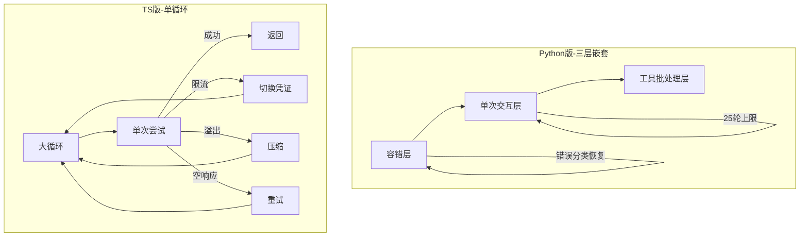
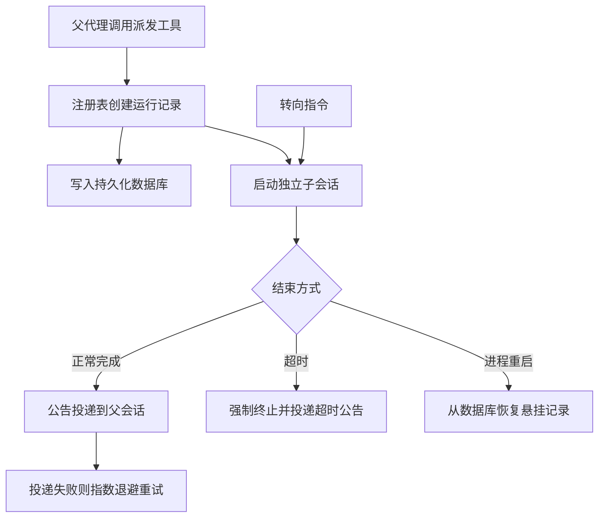
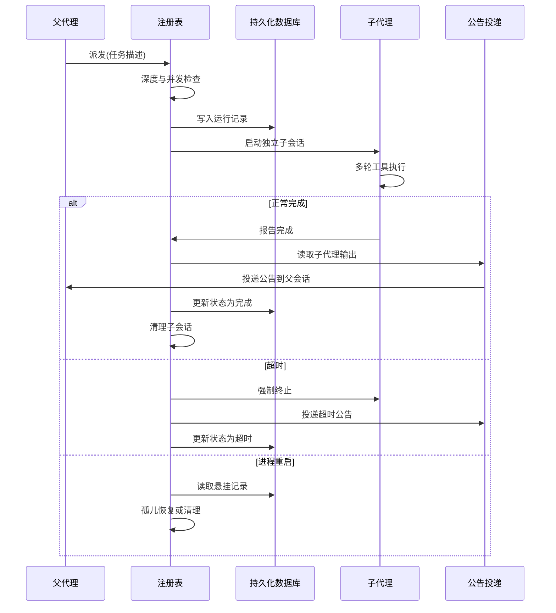

# 编排与主循环

## 读前思考

- 主循环要处理限流、上下文溢出、空响应、用户中断、进程重启等十几种异常。你会把它写成分层的状态机，还是写成一个带大量条件分支的大循环？如果两种写法都会膨胀到几千行，哪一种的修改成本更低——当恢复路径之间存在交互（压缩后要重置思考级别、限流后要判断是否降级模型）时，答案会改变吗？
- 子代理可能比父代理活得更久：父代理超时退出了，子代理还在执行；或者进程崩溃重启，父子都不在了。这时候谁负责追踪子代理的状态、送达它的结果？

## 核心问题

编排与主循环解决的核心问题是：**编排"模型推理 → 工具执行 → 结果回填"的多轮交互，在各类异常下不丢消息、不无限循环、不泄漏资源，并管理可跨进程存活的子代理。**

openclaw 的特殊之处在于同一项目的两种实现给出了两种循环答案：Python 版是本地网关，并发简单，用三层嵌套换清晰度；TS 版面向多通道生产环境，用单大循环加状态变量换恢复路径的交互便利。调度侧同样分岔：TS 版是持久化编排引擎，Python 版只有基础派发。

| 维度 | Python 版 | TS 版 |
|------|-----------|-------|
| 循环结构 | 三层嵌套：容错层 → 单次交互层 → 工具批处理层 | 单大循环 + 约 30 个状态变量 |
| 并发控制 | 会话级锁 | 双队列（会话内串行 + 全局并发） |
| 终止判断 | 25 轮计数器 | 重复检测 + 先提示后终止 |
| 恢复策略 | 错误分类器 → 固定恢复路径 | 循环内联判断 → 动态升级 |
| 子代理调度 | 基础派发 + 等待 | 注册表 + 持久化 + 公告 + 转向 |

## 方案展示

### 设计选择一：同一项目的两种循环结构

Python 版把主循环拆成三层，每层职责单一：外层负责容错，出错时按错误分类器决定恢复路径（压缩、换密钥、降级模型），有最大迭代限制；中层负责一次完整的模型交互，进入最多 25 轮的工具轮次循环；内层负责执行一批工具调用、收集结果。好处是外层不关心工具怎么执行、中层不关心错误怎么恢复；坏处是跨层状态传递需要额外参数（压缩函数要从外层传入中层内部）。

TS 版选择单个大循环加约三十个状态变量（压缩尝试数、连续限流重试数、仅推理重试数等）。每次迭代执行一次"单次尝试"子程序，然后根据返回结果在循环体内决定下一步：成功则返回，限流则切换凭证，溢出则压缩，空响应则重试。不拆分的原因是恢复路径之间有复杂交互——压缩后要重置思考级别、限流后要判断是否升级到模型降级、空响应要区分"只有推理没有正文"和"完全为空"——这些交互在分层架构中需要跨层通信，反而比循环内的条件分支更难理解。

**为什么这么选**：两个版本的并发场景不同——Python 版是本地网关，分层清晰度的收益大于跨层通信成本；TS 版面向多通道生产环境，恢复路径交互密集，单循环内的直接判断比跨层状态传递更省事。**牺牲了什么**：TS 版循环膨胀到四千余行，状态变量之间的约束难以用局部推理验证，只能靠专用守卫（如压缩后循环守卫）检测异常组合。

循环的并发调度：TS 版用双队列——会话队列保证同一会话内串行（否则对话记录会交错损坏），全局队列控制总并发。每次执行携带代次编号，用户快速连发消息时过时执行在开始前自我退场；代次校验与消息队列的状态机制见 04-state。会话状态的建模（会话存储结构）同样以 04-state 为准。

### 设计选择二：终止判断——硬限制 vs 先提示后终止

工具循环不能无限执行，模型可能陷入"调同一个工具 → 得到同样结果 → 再调一次"的重复。Python 版用简单计数器：最多 25 轮工具轮次，超过强制终止并返回已有结果。TS 版实现了精细的重复检测：检测模型是否重复调用同一工具且参数相同、工具结果是否与上次相同（无进展检测）；超过阈值后不直接终止，而是注入一条"你似乎在重复调用，请换一种方式"的系统消息，给模型一次自我纠正的机会，纠正失败才强制终止。

**为什么这么选**：直接终止假设"重复是不可恢复的死循环"，但实际上很多重复是模型没意识到工具返回了微妙的错误信息、以为换个参数就能成功。注入提示给了模型一次元认知机会。**牺牲了什么**：这个设计假设模型有自我纠正能力——对弱模型，提示只浪费一轮调用，此时应降低阈值或直接终止。

上下文溢出也走循环内的检查点：Python 版在容错层按"截断超大工具结果 → 摘要压缩 → 硬截断"三级降级，TS 版用提供商真实用量计数加守卫钩子。循环只负责"何时检查、压缩后是否重试"，压缩的保留策略、摘要形态、质量评分与死循环防护的完整机制见 05-context（TS 版的压缩产物是会话树中的检查点节点、可回溯，产物形态同样归 05-context）。

### 设计选择三：调度引擎——注册表、公告与转向

Python 版的子代理很简单：通过网关的派发工具创建一个新的运行时实例，在独立会话中执行，结果直接返回。没有注册表、没有持久化，进程重启后子代理就丢失了——符合本地网关"子代理是锦上添花"的定位。

TS 版是完整的编排引擎。注册表作为集中协调者管理子代理生命周期：注册（派发时创建运行记录，内存加持久化数据库双层）、监控（定期检查超时与存活）、完成（触发公告投递）、清理（删除子会话释放资源）、孤儿恢复（进程重启后从数据库恢复悬挂记录）。为什么要注册表而不是父子直接通信？因为子代理可能比父代理活得久，也可能在父代理不知情时失败——注册表作为独立的第三方保证无论谁先退出，状态都能被追踪。结果通过公告投递而非直接返回：父代理派发后可能继续做别的事甚至退出，公告保证无论父代理在什么状态结果都能送达；投递失败按指数退避重试，公告有过期时间避免陈旧通知；父代理已退出时公告存入数据库，下次启动恢复。TS 版还支持转向：向运行中的子代理注入新指令改变方向，有速率限制防止指令风暴，通过网关路由为子会话的新消息。

**为什么这么选**：生产环境的子代理可能运行数分钟到数小时，进程重启不能丢失状态，注册表加持久化加公告才构成完整的可靠性。转向让父代理在子代理偏离方向时保留已有进度调整，而不是杀掉重来。**牺牲了什么**：十余个文件的复杂度；持久化的 I/O 开销；转向后的状态一致性难以保证（已完成的部分可能与新方向矛盾）。子代理的提示词与工具面：TS 版子代理继承父运行的系统提示与插件配置但工具面更窄（排除高危工具），Python 版子代理用一段硬编码的极简指令。

## 核心机制执行流：一次子代理委派从派发到公告送达

以父代理委派一个耗时任务为例：

**阶段一：派发与登记。** 父代理调用派发工具，注册表先做两道资源检查——嵌套深度（从当前会话向上追溯父链计算）与并发数，超限拒绝；通过后创建运行记录并同时写入内存与数据库，再启动独立子会话。

**阶段二：独立执行。** 子代理在自己的会话中运行完整循环，工具面比父代理窄。执行期间父代理可以继续做其他事，也可以发起转向注入新指令。

**阶段三：结果送达。** 子代理结束后注册表触发公告投递：读取输出、应用到父会话。投递失败按指数退避重试；公告有过期时间，父代理长时间不在场则过期清理。

**边界路径——父代理先退出**：父代理超时退出后，注册表继续追踪子代理；公告存入数据库，等父代理的会话恢复时补投。

**边界路径——孤儿调和**：定期调和任务检测无父代理的子运行与临时状态的悬挂记录，决定恢复或清理。

## 工程优化

**运行取消**：Python 版每个执行注册到活跃运行字典，外部可通过运行标识取消；TS 版中断同样在循环体内检查，配合双队列的排空语义。

**循环守卫与成本控制**：TS 版有启动阶段耗时追踪（仅异常时告警）、连续空闲超时熔断（防止成本失控）、按运行时长自动切换快速模式；队列通道执行中定期发心跳，防止被误判为超时。

**不完整轮次的独立计数**：空响应与"仅推理"响应各有独立的重试逻辑与计数器，不与正常轮次预算混用——恢复成本不计入有效工作量，与 claudecode 的轮次返还思路同构。流式事件的广播与消费（思考流、多轮工具并行、结果流式返回）归 10-observability。

**附件与能力治理**：子代理的附件暂存到独立目录、完成后删除；能力解析模块决定子代理的工具面；生命周期钩子允许插件监听子代理事件（插件机制归 07-tools）。

## 面试要点

**1. TS 版为什么选单大循环加状态变量而不是状态机或分层？这个选择在什么条件下会失败？**

参考答案方向：状态机要求转换有限且明确，但恢复路径之间有交互（压缩后重置思考级别、限流后判断是否降级模型、空响应区分仅推理与完全空），这些交互在状态机中需要大量中间状态，在分层中需要跨层通信，都比循环内的条件分支更难表达。失败条件是状态变量之间的约束多到无法用局部推理验证——比如"压缩次数 + 限流次数 + 空响应次数的组合是否超过全局预算"这类跨变量约束，只能靠专用守卫检测异常组合。判断标准是"恢复路径交互密度 × 变量约束可局部验证性"。

**2. 为什么子代理需要注册表而不是父子直接通信？去掉注册表会在什么场景下失败？**

参考答案方向：直接通信假设父子同时存活且链路稳定。三类失败场景：父代理退出而子代理还在执行，没人追踪状态就会资源泄漏；进程崩溃重启，没有持久化记录就不知道哪些子代理要恢复或清理；父代理派发多个子代理后继续工作，没有集中协调就无法汇总结果。注册表本质是异步、故障、多对多场景下的协调服务。判断标准是"子代理执行时长 × 进程重启概率"：秒级任务直接返回够用，小时级任务必须有第三方协调。

**3. 转向（向运行中的子代理注入指令）和"终止重来"相比优势在哪？什么场景下该选后者？**

参考答案方向：转向的优势是保留已有进度——子代理可能已执行十几轮工具调用，终止重来浪费这些工作；转向注入一条新消息，子代理在已有上下文基础上调整方向。该选终止重来的场景是上下文已被错误方向污染——比如搜索了十几轮错误关键词，上下文中全是无用信息，模型会被已有内容误导，转向效果有限。判断标准是"已有上下文是资产还是负债"：资产就转向，负债就清空重来。
