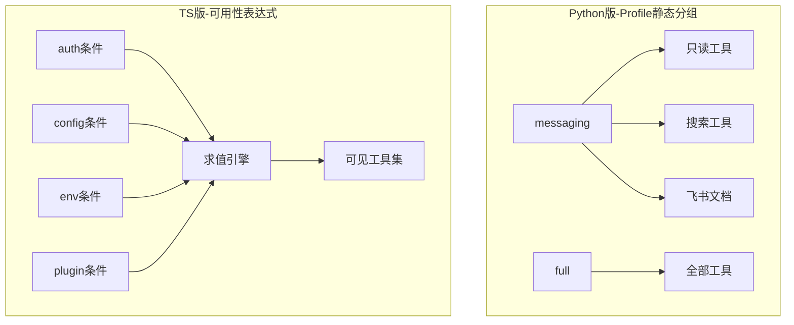
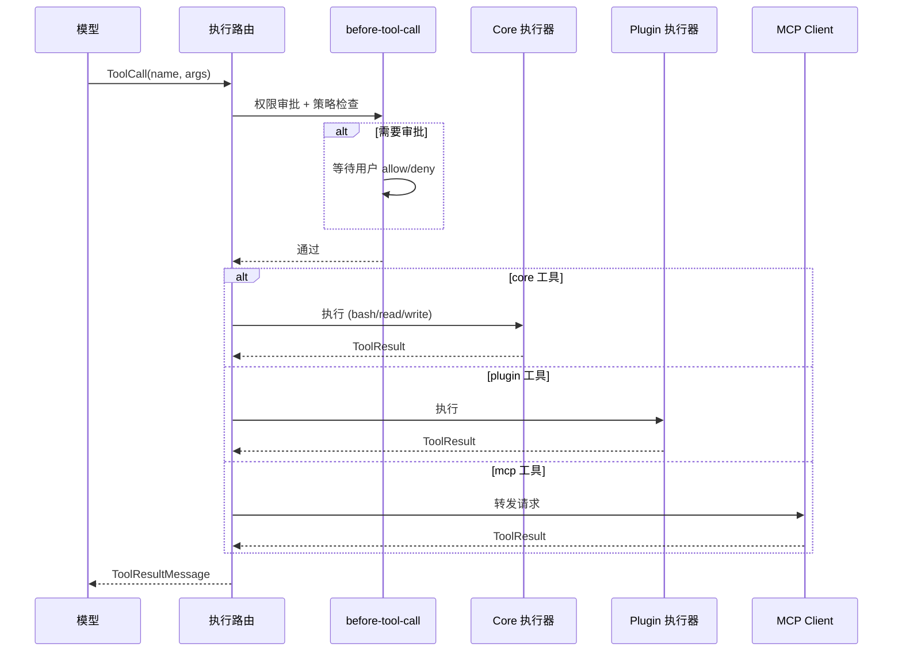

# 工具系统

## 读前思考

- 一个 Agent 有 20 个内置工具和 140 个扩展插件提供的工具，但模型的上下文窗口装不下所有工具的 schema。你会在启动时把全部工具塞给模型，还是让模型按需"搜索"工具？如果按需搜索，多出来的那一轮 LLM 往返值不值得？
- 远程用户通过飞书给 Agent 发消息，Agent 能执行 bash 命令吗？如果不能，这个限制应该写死在代码里，还是做成可配置的策略？

## 核心问题

工具系统解决的核心问题是：**如何在保证安全的前提下，让 LLM 在正确的时机看到正确的工具，并可靠地执行工具调用**。

| 维度 | Python 版 | TypeScript 版 |
|------|-----------|--------------|
| 工具数量 | 20+ 内置工具 | 核心 + 140+ 扩展插件工具 |
| 可见性控制 | Profile 静态分组 | 可用性表达式 + 策略管道动态求值 |
| 工具发现 | 启动时全量注册 | Tool Search 按需发现 |
| 安全边界 | messaging profile 禁写入工具 | 多步策略管道 + 审批流 + 沙箱 |
| 执行路由 | 统一 execute_tool | 按 owner 路由（core/plugin/mcp/channel） |

## 方案展示

### 设计选择一：Profile 静态分组 vs 可用性表达式——工具可见性的两种哲学

Python 版用 ToolPolicy Profile 做静态分组：minimal（只读+搜索）、coding（全部但禁 spawn）、messaging（只读+搜索+飞书文档，禁 bash/write/edit）、full（无限制）。Gateway 根据消息来源选择 profile——飞书来的消息用 messaging，本地 WebChat 用 full。简单直接，一行代码决定工具面。

TS 版引入了"可用性表达式"概念。每个工具不直接声明"我可用"，而是声明一组条件表达式（如 {kind: "auth", providerId: "openai"} 表示"只有 OpenAI 认证通过时才可见"，{kind: "config", path: "sandbox.enabled"} 表示"只有沙箱启用时才可见"）。运行时由 planner 根据 ToolAvailabilityContext（当前 auth 状态、配置、环境变量、插件启用状态）求值这些表达式，决定每个工具的可见性。

为什么需要这种复杂度？因为 TS 版的工具来源多样——核心工具、插件工具、MCP 工具、通道工具——它们的可用条件各不相同。一个 Docker 沙箱工具只有在 Docker 可用且配置启用时才有意义；一个飞书文档工具只有在飞书通道连接时才应该出现。静态分组无法表达这种动态条件。

代价是调试困难：当某个工具"应该出现但没出现"时，需要追踪表达式求值链才能定位原因。TS 版因此专门实现了 tool-policy-audit.ts 记录每步决策。

### 设计选择二：策略管道——多层过滤的执行链

Python 版的安全控制是单点的：ToolPolicy 在工具注册时决定哪些工具进入当前 profile，执行时不再过滤。

TS 版实现了 applyToolPolicyPipeline，按序执行多步过滤：

1. **Sandbox 策略**：容器内哪些工具可用（如禁止在沙箱内执行宿主机 bash）
2. **Profile 策略**：allowlist/denylist 显式控制
3. **Provider 策略**：某些 provider 不支持特定工具格式
4. **Sender 策略**：owner-only 工具只有所有者能调用
5. **Group 策略**：群组场景下的工具限制
6. **Subagent 策略**：子代理的工具面比父代理窄

每步可以独立 allow 或 deny，最终结果是所有步骤的交集。这个管道的设计动机是：不同部署场景（gateway、CLI、embedded、subagent）需要完全不同的工具面，单一过滤点无法覆盖所有维度。

### 设计选择三：Tool Search——动态工具发现

Python 版在启动时把 20 多个工具全部注册，schema 全量发给模型。工具少时这没问题。

TS 版面对 140+ 扩展的工具不可能全量预加载。tool-search.ts（72.9KB）实现了按需发现：LLM 可以调用一个特殊的 search 工具，描述它想做什么，系统从工具索引中匹配相关工具并动态加载到当前会话。

这个设计的权衡很明确：节省 context window（不需要塞入所有工具 schema）vs 增加一轮 LLM 往返（先搜索再调用）。对于工具数量在 20 以内的场景，全量注册更简单高效；对于 100+ 工具的场景，动态发现是必须的。

### 设计选择四：执行路由——统一入口 vs 按 Owner 分发

Python 版的工具执行是统一的：execute_tool 接收工具名和参数，在 registry 中查找 handler，调用并返回结果。所有工具（bash、文件操作、飞书文档）走同一条路径。

TS 版的工具执行按 owner 路由：

- **Core 工具**：bash-tools.exec.ts（68KB）处理 shell 执行，包含沙箱策略、审批流、输出截断
- **Plugin 工具**：路由到对应插件的 tool factory
- **MCP 工具**：通过 MCP client 转发到外部 MCP 服务器
- **Channel 工具**：路由到对应通道的工具实现

执行前经过 before-tool-call hook 链（70KB），包含权限审批、sandbox 策略、fs policy 检查。这意味着同一个"执行 bash 命令"的请求，在 CLI 模式下直接执行，在 gateway 模式下可能需要用户审批，在沙箱模式下路由到容器内执行。

### 设计选择五：工具结果处理——截断与守卫

工具结果可能非常大（一次 grep 返回几万行），直接回填会撑爆上下文。

Python 版的 tool_result.py 实现了智能截断：检测工具结果尾部是否包含 error、result、traceback 等关键词——如果包含，说明关键信息在尾部，用 head+tail 策略保留两端；如果不包含，用 head-only 策略只保留开头。单条结果最大 40,000 字符，不超过上下文的 30%。

TS 版的 tool-result-truncation.ts（47.9KB）更精细，额外处理：
- 结构化输出（JSON）的截断保持 JSON 合法性
- 文件内容的截断保留行号信息
- 截断后注入"[truncated N lines]"提示，让 LLM 知道信息不完整

Python 版还有 guard.py 做敏感信息检测：用正则匹配 API key、Bearer token、密码等模式，自动替换为 [REDACTED]。这防止了工具结果中的密钥被模型"记住"并在后续回复中泄露。

## 工程优化

**Python 版：**
- 工具自声明 prompt_instructions：每个工具可以声明使用规则，Gateway 按 profile 汇总后注入 system prompt
- 审批流预留：approval.py 提供异步审批机制（60 秒超时），但当前未在主流程中启用
- before/after 钩子：hooks.py 支持工具执行前后的扩展点

**TS 版：**
- Tool Loop Detection（25KB）：检测 LLM 重复调用同一工具，超阈值后注入提示或强制终止
- Tool Schema Quarantine：隔离有问题的工具 schema（如 JSON Schema 不合法），防止影响整个请求
- Sandbox Path Guard：wrapToolWorkspaceRootGuard 确保文件操作不越界
- 工具结果流式返回：大结果可以分块流式传回，不需要等全部完成

## 面试要点

**问题一：为什么 Python 版用静态 Profile 而 TS 版用动态可用性表达式？如果 Python 版的工具数量增长到 100 个，Profile 方案还能工作吗？**

参考答案方向：Profile 方案在工具少时优势明显——一行代码决定工具面，调试时看 profile 名就知道有什么工具。但当工具来源多样化（核心 + 插件 + MCP + 通道）且可用条件动态变化（auth 状态、配置开关、平台差异）时，静态分组需要为每种组合创建一个 profile，组合爆炸。100 个工具时 Profile 还能工作（多建几个 profile），但如果每个工具的可用条件都不同（比如 50 个插件工具各自依赖不同的 auth provider），Profile 就退化为"每个工具一个 profile"，失去了分组的意义。

**问题二：Tool Search 的"多一轮 LLM 往返"在什么场景下是值得的？什么场景下不值得？**

参考答案方向：值得的场景：工具数量多（100+），大部分工具在一次对话中用不到，全量 schema 占用 20%+ 的 context window。此时 Tool Search 用一轮短往返（搜索请求 + 结果）换取整个对话的 context 空间。不值得的场景：工具数量少（<30），全量 schema 只占 context 的 2-3%，多一轮往返反而增加延迟和 token 消耗。判断标准是：全量工具 schema 的 token 数 vs 一次搜索往返的 token 数 × 预期搜索次数。

**问题三：before-tool-call hook 链为什么要在执行前做审批而不是执行后审计？这两种方案的安全假设有什么不同？**

参考答案方向：执行前审批假设"某些操作一旦执行就不可逆"（如 rm -rf、发送消息、创建文档），必须在执行前获得授权。执行后审计假设"所有操作都可以事后追责"，适用于可逆操作（如读文件、查询数据库）。OpenClaw 同时支持两种：高风险操作（bash 执行、文件写入）走审批流，低风险操作（读文件、搜索）直接执行但记录日志。安全假设的核心区别是：审批流牺牲了延迟（等用户确认）换取安全性，审计流牺牲了安全性（操作已执行）换取流畅性。
