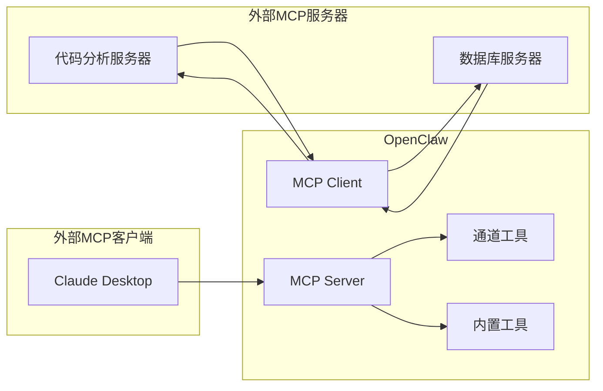
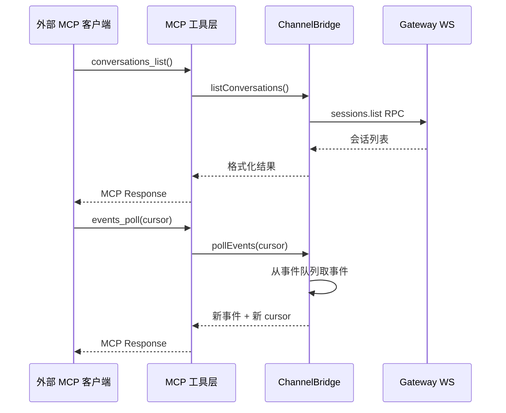

# MCP 集成

## 读前思考

- MCP（Model Context Protocol）定义了 Agent 与外部工具服务器之间的标准协议。但一个 Agent 系统本身已经有原生工具系统了——为什么还需要 MCP？原生工具和 MCP 工具的边界应该画在哪里？
- 如果你的 Agent 既要作为 MCP 客户端（连接外部工具服务器），又要作为 MCP 服务器（把自己的能力暴露给外部 Agent），这两个方向的实现能复用多少代码？

## 核心问题

MCP 集成解决的核心问题是：**如何让 Agent 系统既能消费外部 MCP 服务器提供的工具，又能把自己的能力以 MCP 协议暴露给外部客户端，同时与原生工具系统无缝融合**。

| 维度 | Python 版 | TypeScript 版 |
|------|-----------|--------------|
| MCP 角色 | 无 MCP 支持 | 双向：客户端 + 服务器 |
| 传输协议 | — | stdio / SSE / streamable-http |
| 与原生工具关系 | — | MCP 工具注册到统一工具面 |
| 认证 | — | OAuth + mTLS |
| 代码规模 | — | agent-bundle-mcp-runtime.ts 44.5KB |

Python 版当前没有 MCP 支持，所有工具都是内置的。这符合其"本地 AI Gateway"的定位——工具数量有限，不需要外部工具协议。以下分析聚焦 TS 版。

## 方案展示

### 设计选择一：双向 MCP——同时做客户端和服务器

TS 版的 MCP 集成是双向的：

**作为客户端**：agent-bundle-mcp-runtime.ts（44.5KB）管理外部 MCP 服务器的生命周期。读取配置中的 mcp.servers 列表，为每个服务器建立连接（stdio spawn 子进程 / HTTP 连接），发现服务器提供的工具列表，经过 toolFilter include/exclude 过滤后注册为 Agent 可用工具。

**作为服务器**：channel-server.ts 组装一个 MCP stdio 服务器，通过 channel-tools.ts 注册 8 个工具（conversations_list、messages_read、events_poll、permissions_request 等），让外部 MCP 客户端（如 Claude Desktop）可以操作 OpenClaw 的通道会话。

为什么需要双向？因为 OpenClaw 的定位是"个人 AI 助理平台"——它既需要调用外部工具（如代码分析 MCP 服务器、数据库 MCP 服务器），也需要被外部系统调用（如让 Claude Desktop 通过 MCP 读取 OpenClaw 管理的 Telegram 消息）。

### 设计选择二：Bridge 模式——隔离 Gateway 复杂性

MCP 服务器端的核心设计是 OpenClawChannelBridge 类（channel-bridge.ts，681 行）。它封装了：

- Gateway WebSocket 连接管理（连接、重连、心跳）
- 事件队列 + 游标（外部客户端通过 events_poll/events_wait 拉取事件，避免推送复杂性）
- 审批状态管理（权限请求有 TTL，定期清扫过期条目）
- 会话元数据缓存

MCP 工具层保持极薄——只做 schema 验证和调用 bridge 方法。这个分层的设计动机是：Gateway 的连接管理、事件订阅、审批流程都很复杂，如果每个 MCP 工具都直接操作 Gateway，代码会高度耦合。Bridge 把这些复杂性收敛到一个类里，工具层只需要知道"调 bridge 的哪个方法"。

### 设计选择三：事件队列 + 游标——拉模式 vs 推模式

MCP 协议本身支持服务器主动推送通知，但 TS 版选择了拉模式：外部客户端通过 events_poll（非阻塞）或 events_wait（阻塞等待，最大 5 分钟）获取事件。

为什么不用推模式？因为 MCP 客户端的实现质量参差不齐——有些客户端处理不好服务器主动推送（连接断开时推送丢失、推送频率过高时客户端卡死）。拉模式让客户端控制消费节奏，服务器只需要维护一个有界队列（1000 条上限）和一个游标。

代价是延迟：推模式可以毫秒级送达，拉模式取决于客户端的轮询频率。对于通道消息这种非实时场景，几百毫秒的延迟可以接受。

### 设计选择四：MCP 工具与原生工具的融合

MCP 客户端获取的外部工具不是独立管理的，而是注册到 Agent 的统一工具面中。agent-bundle-mcp-runtime.ts 负责：

1. 连接 MCP 服务器，获取工具列表
2. 应用 toolFilter（include/exclude glob 模式）
3. 将 MCP 工具转换为 ToolDescriptor 格式
4. 注册到 Agent 工具集，与原生工具并列

LLM 看到的工具列表中，原生工具和 MCP 工具没有区别——都是 name + description + inputSchema。执行时由工具路由层判断：如果是 MCP 工具，转发到对应 MCP 服务器；如果是原生工具，本地执行。

这个设计的权衡是：对 LLM 透明（不需要知道工具来源）vs 执行路径不透明（调试时需要判断工具是本地还是远程）。TS 版通过 supportsParallelToolCalls 标记控制 MCP 工具的并发安全性——某些 MCP 服务器不支持并行调用，需要串行化。

### 设计选择五：传输层适配——stdio / SSE / streamable-http

MCP 协议支持多种传输：

- **stdio**：spawn 子进程，通过 stdin/stdout 通信。适合本地工具服务器（如 npx @modelcontextprotocol/server-filesystem）。
- **SSE**：HTTP Server-Sent Events。适合远程服务器，但已被 streamable-http 取代。
- **streamable-http**：新的 HTTP 传输，支持双向流。适合生产环境远程 MCP 服务器。

mcp-transport.ts 封装了三种传输的连接管理、超时控制（connectionTimeoutMs、requestTimeoutMs）、重连逻辑。配置中每个 MCP 服务器可以指定传输类型和对应参数。

OAuth 认证（mcp-oauth.ts）处理远程 MCP 服务器的 token 管理，token 存储在 OpenClaw state 中而非配置文件，避免明文泄露。

## 工程优化

- 审批条目 TTL：Claude 权限请求 1 小时过期，普通审批 30 分钟过期，每 5 分钟清扫一次
- 事件队列有界：1000 条上限，防止内存泄漏
- 工具过滤支持 "*" glob 模式，可以按前缀/后缀批量 include/exclude
- 服务器连接精细超时：connectionTimeoutMs（建连）和 requestTimeoutMs（单次请求）分开配置
- Claude Channel 扩展能力声明：通过 experimental 字段支持 Claude 原生通道权限请求协议

## 面试要点

**问题一：为什么 OpenClaw 选择把 MCP 工具注册到原生工具面，而不是让 LLM 显式区分"调用原生工具"和"调用 MCP 工具"？**

参考答案方向：对 LLM 透明的好处是：LLM 不需要学习两套调用协议，工具选择逻辑统一，prompt 中不需要解释"这个工具是 MCP 的，那个是原生的"。坏处是：执行路径不透明（调试困难）、延迟不可预测（MCP 远程调用比本地执行慢）、错误语义不同（MCP 服务器可能返回协议级错误而非业务错误）。如果让 LLM 显式区分，LLM 可以根据延迟预期做更好的规划（比如优先用本地工具），但增加了 prompt 复杂度和 LLM 的认知负担。对于工具数量多的场景，透明融合是更好的选择——LLM 已经够忙了，不需要再管理工具来源。

**问题二：事件队列为什么选择拉模式而不是推模式？在什么场景下这个选择会出问题？**

参考答案方向：拉模式假设"客户端知道自己什么时候需要事件"，适合非实时场景（如定期同步会话列表）。推模式假设"事件产生时客户端需要立即知道"，适合实时场景（如即时消息通知）。出问题的场景：如果外部客户端需要实时响应通道消息（比如一个自动化工作流需要在收到 Telegram 消息后立即触发），拉模式的轮询间隔会引入不可接受的延迟。此时应该用 MCP 的 notification 机制做推送，或者用 events_wait 的长轮询（最大 5 分钟）近似实时。

**问题三：Python 版没有 MCP 支持，这在什么条件下会成为瓶颈？如果要给 Python 版加 MCP，最小可行方案是什么？**

参考答案方向：当用户需要连接外部工具服务器（如代码分析、数据库查询、文件系统访问）且不想把这些工具硬编码到 Python 版时，缺少 MCP 就是瓶颈。最小可行方案：实现 MCP 客户端的 stdio 传输（spawn 子进程 + JSON-RPC over stdin/stdout），在 Gateway boot 时读取 mcp.servers 配置，连接服务器获取工具列表，注册到 ToolRegistry。不需要实现服务器端（Python 版的定位是被调用方而非调用方），不需要 SSE/HTTP 传输（本地 stdio 够用）。
