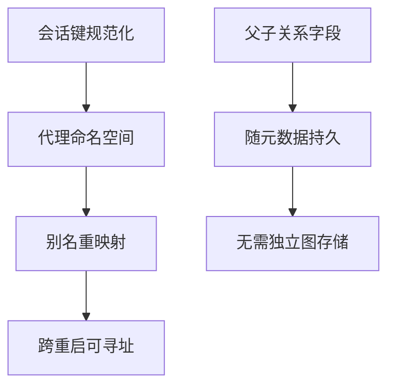
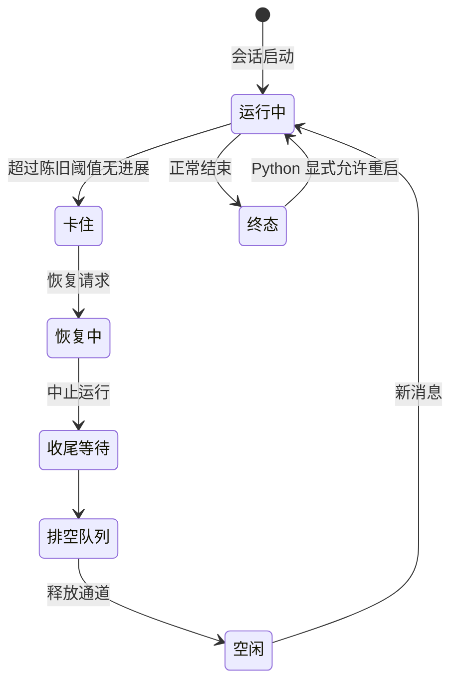
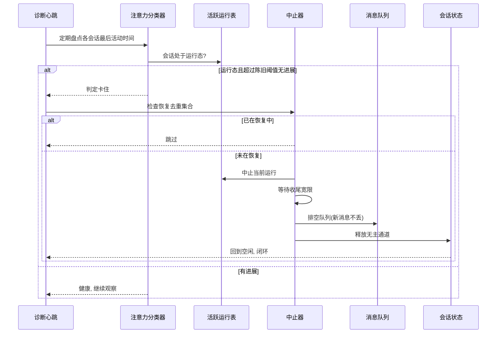

# 会话状态与持久化

## 读前思考

- 一个会话会派生出子代理会话、分岔出另一条对话线。这些父子关系如果不显式存储，恢复时怎么知道谁是谁的孩子？你会存成独立的图，还是塞进会话元数据字段？
- 同一项目有 TS 与 Python 两种实现，必须共享同一份会话契约。如果 TS 版先迁到 SQLite、Python 版还在用 JSON 文件，两边的会话记录互相看得见吗？迁移中间态的不一致窗口怎么处理？

## 核心问题

**如何用"确定性会话键 + 会话树元数据 + 非破坏检查点 + 双实现契约"为长期运行的平台维护可回溯、可恢复、跨实现一致的会话状态。**

openclaw 的会话状态以四件套为核心：确定性会话键做路由身份、SessionEntry 元数据做会话树、JSONL 转录做对话流、压缩检查点做历史回溯。TS 版正按既定策略执行 SQLite-first 迁移（不为运行时状态新增 JSON sidecar，旧文件存储的修复只走 doctor --fix），目前处于双轨中间态；Python 版保留 sessions.json 加 JSONL 的原始形态，两者通过 camelCase 字段契约互为镜像。恢复能力偏诊断式：识别卡住与陈旧运行并回收，而不是续跑。

| 维度 | openclaw 的选择（TS / Python）|
|------|------------------------------|
| 会话身份 | 确定性键 + 别名重映射 |
| 会话树 | 元数据字段（来源/父会话/分支来源/深度/子代理角色）|
| 检查点 | 追加式非破坏（TS 槽位 / Python JSONL）|
| 持久化 | TS SQLite 迁移中双轨 / Python JSON 索引 + JSONL |
| 恢复 | TS 诊断回收 / Python 终态可重启 + 转录重读 |

## 方案展示

### 设计选择一：确定性会话键为会话身份 + 会话树元数据化

会话身份不是随机 id 优先，而是规范化键：代理命名空间前缀加会话路径，再加 main 别名与遗留键重映射，保证多通道（群组/线程/频道）稳定路由、跨重启天然可寻址。会话树不建独立图存储：父子关系直接放会话元数据（来源、父会话键、分支来源、深度、子代理角色），TS 侧再以任务运行表的请求者、子会话、父流程字段落 SQLite。

**为什么这么选**：多通道场景下"同一个对话"必须从任何入口路由到同一份记录，确定性键让路由与存储同构；spawn/fork 关系是低频查询，塞进元数据比维护独立图存储便宜得多。**牺牲了什么**：规范化与遗留键兼容逻辑复杂；树一致性靠生成方自律，无外键约束，深度也未见硬性上限。

### 设计选择二：压缩检查点追加式、非破坏

压缩的产物不是重写历史，而是追加检查点：Python 版有独立的压缩检查点存储，按代理与会话分文件追加写，支持列表、最新、计数查询；TS 版把检查点存在会话条目的槽位字段里。transcript（对话转录）永不就地截断——原始消息始终在。

**为什么这么选**：平台级长期运行的事后问责要求"能回答这次压缩丢了什么"，非破坏检查点让压缩可回溯、可回退。**牺牲了什么**：存储持续增长，需要计数与清理策略；会话里同时存在"模型可见历史"与"完整历史"两套事实，遍历成本上升。

### 设计选择三：双实现迁移态——TS SQLite-first 双轨 vs Python 原始形态

TS 版正执行 SQLite-first 迁移：共享状态库加每代理库，迁移版本检查点带租约协调防多实例并发迁移；运行时会话元数据表（一次性/持久模式、运行/错误/空闲状态、最后活动时间、最后错误）仍以遗留 JSON 存储键控——双轨键控存在不一致窗口；旧文件存储的修复只走 doctor --fix 路径。Python 版保留 sessions.json（全量加载保存的索引）+ 每会话 JSONL 转录的原始形态；会话条目的 pydantic 契约允许额外字段，以 camelCase 别名维持跨语言契约，TS 新增字段 Python 端可前向兼容。

**为什么这么选**：平台演进到多实例需要数据库级并发与迁移治理，但不能一夜切换——双轨是"旧读新写"的安全中间态。**牺牲了什么**：双轨数据存在不一致窗口；两个实现的存储形态不同，任何跨实现的会话操作都要经过契约翻译。

### 设计选择四：诊断式恢复——卡住会话回收 + 终态可重启

TS 版不做自动续跑：诊断心跳定期盘点各会话的最后活动时间，处于运行态但超过陈旧阈值无进展的会话被判定卡住，触发恢复流程——中止当前运行、等待流式调用收尾、排空消息队列、释放无主通道；恢复中集合去重防重入。活跃运行表是进程内结构，重启即归零，悬挂运行靠陈旧检测兜底回收。Python 版同样无自动续跑：转录重读历史续对话，状态机显式允许终态重新开始运行——重启/重试语义被建模为合法转换，重试不需要新建会话。

**为什么这么选**：Agent 有大量静默失败模式——流式连接断开不触发错误、工具死锁、队列任务被遗忘，没有主动检测这些会话永远停在运行态；终态可重启让 Python 版的重试语义显式化。**牺牲了什么**：陈旧阈值可能误判正常的长工具执行；TS 版多实例部署下活跃运行追踪是已知盲区（进程内表看不见别的实例）。

### 设计选择五：多代理目录的实例隔离

状态目录按代理分片：每个代理有独立的会话索引文件，转录按会话 id 分文件；压缩检查点也按代理分目录存储。同一主机上多个代理实例互不干扰，各自的会话列表、转录与检查点历史物理隔离；Python 版的路径约定把这一切固定下来，TS 版迁移 SQLite 时同样按代理分库（共享状态库加每代理库）。

**为什么这么选**：一个 openclaw 主机上可能同时服务多个代理（不同身份、不同通道、不同配置），按代理分片让"一个代理的文件集"可整体备份、整体迁移、独立删除，也避免多代理共享一个会话索引时的写竞争。**牺牲了什么**：代理间共享会话需要跨目录显式处理；分片粒度固定为代理级，无法在一个代理内再做子隔离。

## 核心机制执行流：一次卡住会话的诊断回收（TS 版）

以一次工具执行死锁导致会话无进展为例：

**阶段一：注意力分类。** 诊断心跳定期盘点各会话的最后活动时间与进度标记；会话处于运行态但超过陈旧阈值无进展，被分类为卡住。区分等待模型与等待工具——流式调用有心跳可以短阈值，无心跳的工具执行要给长宽限。

**阶段二：去重与中止。** 恢复请求先查恢复中集合：已在恢复的会话跳过，防止重入。中止当前运行后不立即重置，而是等待一段收尾宽限让流式调用自行收尾，随后排空消息队列——排队的新消息不丢，恢复完成后继续处理。

**阶段三：释放与闭环。** 释放无主通道（压缩进行中卡住时给安全超时延长，避免截断检查点写入）；会话状态回到空闲。心跳在下一轮看到会话不再卡住，闭环完成。

**边界路径——进程重启：** 活跃运行表是进程内结构，重启即归零；悬挂运行无法被立即识别，靠陈旧检测在重启后数分钟内兜底回收。**边界路径——压缩中卡住：** 回收流程对压缩给安全超时延长，宁可多等也不截断检查点写入。**边界路径——Python 版：** 无自动回收，状态可能残留运行态，靠终态可重启的转换表纠偏，用户重发消息即可继续。

## 工程优化

**建会话单飞**：并发重复建会话请求合并为一次，防止同键双写。

**恢复去重集合**：卡住恢复不重入，并发触发只执行一次。

**心跳与用户活动分离**：心跳活跃度与用户交互分别记录；运行时模型保留逻辑防止心跳轮次的模型设置渗染主会话状态。

**迁移检查点 + 租约协调**：启动迁移版本检查点带租约协调，防多实例并发迁移互相干扰。

**前向兼容契约**：会话条目允许额外字段加 camelCase 别名，TS 新增字段 Python 端无感；转录读回经 pydantic 校验，损坏行可识别。

**活跃可见性过滤**：只把控制界面可见的运行算作会话忙碌，后台或隐藏运行不影响用户操作。

## 面试要点

**1. 会话树用元数据字段而不是独立图存储，什么规模下会撑不住？**

参考答案方向：元数据方案的假设是父子关系查询低频、树规模小——恢复时只需要"找父会话""找子会话"这类单跳查询。当需要跨深度遍历（"这棵树上所有后代会话的用量总和"）或关系本身成为核心查询路径时，元数据方案要全表扫描，独立图存储才划算。代价对照：独立图存储引入一致性维护成本。判断标准是"关系查询的深度 × 树规模"。

**2. TS 版先迁 SQLite 而 Python 版保留 JSON，双轨迁移的收益和代价分别是什么？**

参考答案方向：收益是演进不停摆——TS 版先拿到数据库级并发与迁移治理，Python 版零改动继续跑，两版通过契约互读；代价是不一致窗口——双轨键控期间同一会话在两侧可能状态不同，且旧文件存储的修复只能走 doctor --fix。判断标准是"演进速度 × 不一致窗口容忍度"：能接受临时不一致就双轨，不能接受就停机切换。

**3. 卡住会话的陈旧阈值设多长？太短和太长各有什么问题？**

参考答案方向：阈值长短决定的是恢复动作的触发时机——定太短，正常的长工具执行或推理模型长思考会被误判为卡住，恢复流程打断用户正在进行的任务；定太长，卡住的会话迟迟进入不了回收流程。阈值取值的判断标准与自适应宽限方案见 10-observability（检测与判定主场）。本篇的恢复语义要点：判定卡住后中止运行、给流式调用留收尾宽限、排空消息队列、释放无主通道，恢复中集合去重保证并发触发只执行一次。
