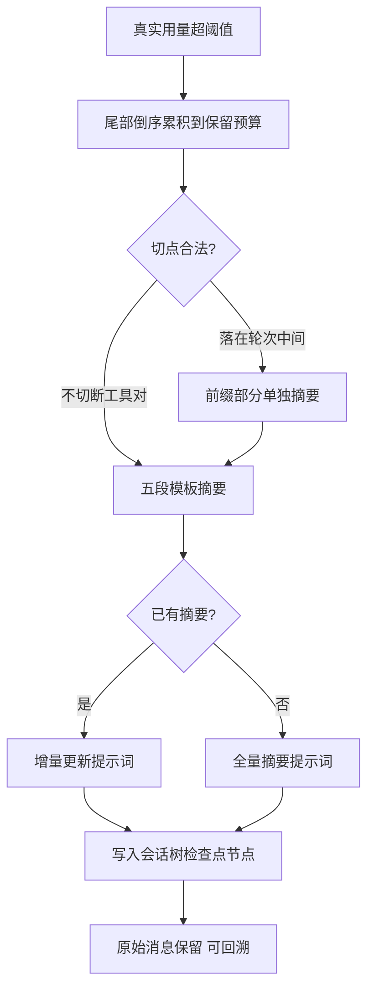
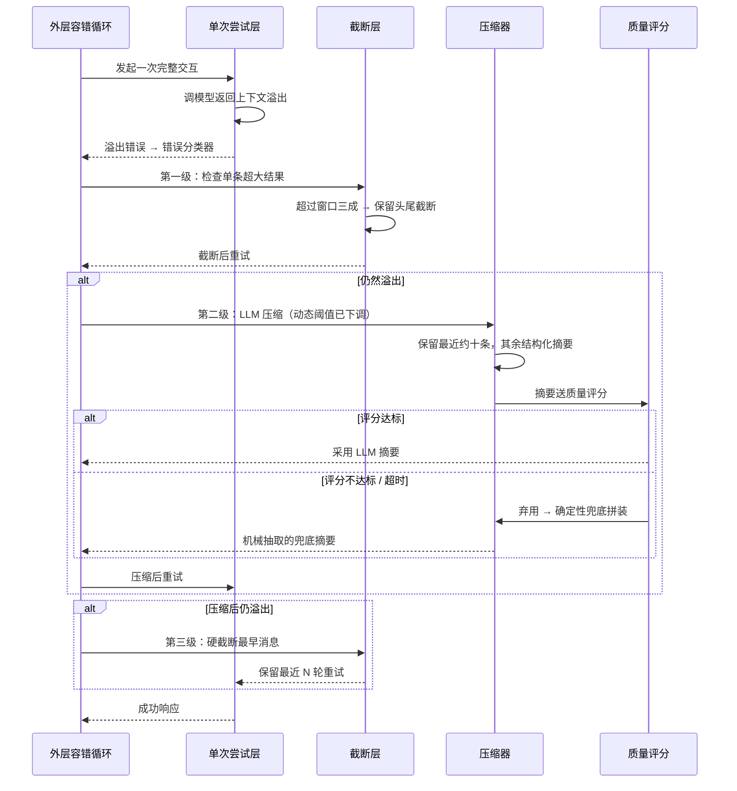

# 上下文工程

## 读前思考

- 同一个项目的两种实现，一个面向单一渠道的嵌入式运行时，一个面向多渠道多提供商的生产平台。系统提示词的组装器，一个是几十行的五段拼装，一个是带插件钩子和审计报表的编译管道。"够用就好"和"全都要"的分界线到底在哪？
- 压缩失败是长运行平台的常态而非异常：摘要模型超时、摘要写坏、压缩完还是溢出。如果要求"任何一条失败路径都不能卡死会话"，你会为压缩设计几层退路？

## 核心问题

上下文工程解决的核心问题是：**让组装与压缩在长期运行的平台场景下既可控又必有退路。** openclaw 的两个实现给出同一光谱的两端：Python 版把组装做到极简（五段拼装、无缓存优化），把复杂度全部投给压缩的兜底链；TS 版把组装做成多源编译管道，压缩则用真实计数和非破坏性检查点换取可审计。

| 维度 | Python 版 | TypeScript 版 |
|------|-----------|--------------|
| 提示词组装 | 五段顺序拼装，单字符串 | 运行时参数收集 + 插件层编译 |
| 缓存优化 | 无 | provider 格式变换（含缓存点） |
| 规则文件 | 无内建发现 | instructions.md 工作区发现 |
| 压缩计数 | 估算 | provider 返回的真实用量 |
| 触发阈值 | 双档比例 + 随工具结果动态下调 | 窗口减固定预留 |
| 摘要形态 | 六要点 + 质量评分 + 确定性兜底 | 固定五段模板 + 增量更新 |
| 压缩产物 | 原地替换 | 会话树检查点节点（非破坏性） |

## 方案展示

### 设计选择一：五段极简拼装 vs 多源编译管道

Python 版的提示词组装器（源码：build_system_prompt）按顺序拼装五个部分：

| 序号 | 部分 | 类型 | 核心内容 |
|------|------|------|----------|
| 1 | identity | 静态 | 默认身份声明（AI 助手定位、能力说明、自称规则） |
| 2 | channel_context | 条件 | 渠道上下文（飞书/WebChat 等平台的特定指令） |
| 3 | tool_descriptions | 条件 | 可用工具列表：名称 + 描述 |
| 4 | tool_instructions | 条件 | 工具使用规则（各工具 instructions 字段汇总） |
| 5 | extra | 条件 | 调用方传入的任意补充指令 |

整个组装器只有几十行，代价是没有缓存优化（所有内容拼为一个字符串，任何部分变化都导致整段失效），也没有模型特定指导、环境信息、记忆注入等能力。

TS 版先由参数收集函数（源码：buildSystemPromptParams）汇总运行时参数（主机、系统、架构、模型、shell、渠道、仓库根、时区、时间等），再由插件运行时层的编译函数（源码：buildSystemPrompt）产出最终提示词，并开放多个注入源：

| 能力 | 说明 |
|------|------|
| 指令文件 | 从工作区发现 instructions.md 并注入（类似 CLAUDE.md 的规则文件注入） |
| 技能内容 | 已激活技能的提示词内容进入系统提示词 |
| 插件钩子 | 插件可通过钩子向系统提示词追加内容 |
| 提供商变换 | 不同提供商对系统字段的格式差异处理（含缓存点设置） |
| 审计报表 | 生成提示词组成报表：各段 token 占比与来源（源码：systemPromptReport） |
| 轨迹导出 | 完整提示词记录到轨迹文件（经脱敏） |

**为什么这么选**：Python 版面向单一渠道的嵌入式运行时，组装复杂度撑不起收益；TS 版面向多渠道、多提供商、插件化的生产环境，提示词的每一段从哪来、占多少 token 都要可审计。**牺牲了什么**：Python 版任何局部变化都击穿整段缓存；TS 版的注入源一多，"提示词为什么长这样"的排查必须依赖审计报表。

### 设计选择二：TS 模板派压缩——真实计数 + 非破坏性检查点

TS 版不做估算，直接采用 provider 返回的真实用量作为计数来源，只有真实 token 超过"窗口减预留量"才触发。切点从尾部倒序累积消息 token 得出：累积到保留预算后，在最近一个**合法切点**下刀——合法的定义是不切断工具调用对；切点若仍落在某轮中间，被切断轮的前半部分改用专用摘要提示词单独处理。

摘要提示词的严格程度在四个项目中居首：固定五段 Markdown 模板（目标 / 约束与偏好 / 进展：已完成、进行中、受阻 / 关键决策 / 下一步），并强制按此格式输出；检测到已有摘要时改用增量更新提示词，在旧摘要基础上修订。压缩产物是会话树中的一个**检查点节点**而非对历史的破坏性重写——原始消息仍在树中，可回溯、可审计。文件操作清单（读过、改过哪些文件）跨压缩机械累积传递，不靠摘要模型自觉记住。机制层之外还包了一层压缩守卫钩子，监控压缩行为，防止"压缩 → 溢出 → 再压缩"的死循环。

**为什么这么选**：TS 版服务的是长期运行的平台，事后必须能回答"这次压缩丢了什么"，非破坏性检查点让压缩决策可回溯；真实计数则保证压缩只在真正必要时发生，避免估算误差带来的无效压缩。**牺牲了什么**：五段模板在闲聊、创作等非编码会话上过于刚性，结构未必贴合内容；检查点节点也抬高了会话树的存储与遍历成本。

### 设计选择三：Python 兜底派压缩——质量评分 + 确定性退路

Python 版采用双档阈值（约 75% 触发、90% 紧急），且阈值随工具结果消息数量下调：每多一条降一个百分点，下限一半。背后的假设是工具结果属于最可压缩的内容，数量越多越值得提前启动压缩。外层是三级降级序列：先截断单条超大工具结果（检测尾部是否含错误/结果关键词，决定保留头尾还是只留头部），再整体 LLM 压缩，最后硬截断保留最近 N 轮。

最有辨识度的是**摘要质量评分**：摘要生成后按"工具名提及率、错误信息覆盖、长度合理性"打零到一分，低于阈值则弃用 LLM 摘要，改用无 LLM 的确定性兜底摘要——从消息中机械抽取工具调用、错误、代码片段拼装而成；超时和异常同样汇入这条兜底路径。

**为什么这么选**：嵌入式运行时把"永远有退路"放在第一位——确定性兜底不依赖任何外部调用，质量差但必然产出。**牺牲了什么**：机械拼装的兜底摘要质量明显低于 LLM 摘要；按条数保留尾部不如按 token 精确，工具对切断保护是四家中最弱的。

## 核心机制执行流：Python 版一次溢出治理全过程

以"长会话中单条工具结果巨大、总历史接近窗口"为例：

**阶段一：错误分类入口。** Python 版的压缩入口在外层容错循环：单次尝试失败后，错误分类器把"上下文溢出"路由到压缩恢复路径。压缩在循环中的位置（外层容错层检查、是否消耗重试次数）见 03-orchestrator.md，本篇是机制主场。

**阶段二：三级降级。** 截断优先于摘要——单条超大工具结果的价值密度低，保留头尾几乎无损；只有截断不够才付出一次 LLM 调用的成本；LLM 压缩仍不够时硬截断兜底。每一级都比上一级更贵也更损，顺序严格按代价排列。

**阶段三：质量闸门。** LLM 摘要不是产出即采用，评分器检查它是否真的覆盖了工具调用和错误信息。评分不达标的摘要不如机械拼装——至少后者不会编造。

**边界路径——压缩超时**：压缩调用有独立的长超时（与 TS 版对齐，十五分钟量级），超时与异常同走确定性兜底，保证退路不依赖外部服务存活。

**与长期记忆的接口**：openclaw 不做"压缩前记忆刷写"式的联动——TS 版的记忆整合走独立的定时任务，数据源不依赖会话消息原文，压缩删掉消息不影响记忆侧的数据供给。这是与 deer-flow 相反的解法：deer-flow 让压缩等记忆，openclaw 让记忆不依赖压缩。注入与整合机制的完整讨论见 06-memory.md。

## 工程优化

**动态阈值随内容构成下调**：工具结果消息越多，触发阈值越低。这不是保守，而是收益导向——工具结果可压缩性远高于人类对话，攒得越多提前压，单次压缩的净收益越大。

**压缩守卫防死循环**：TS 版在机制层外包一层独立的守卫钩子，监控"压缩后是否立即再次溢出"。守卫与压缩机制分离，意味着压缩逻辑本身可以保持简单，死循环检测作为外部约束叠加。

**文件操作清单机械传递**：读过、改过哪些文件不进入摘要模型的自由发挥范围，而是作为结构化清单跨压缩累积。模型可能忘记摘要里的约束，但清单每次都在。

**提示词审计报表**：TS 版把系统提示词每段的来源和 token 占比输出为报表。当"上下文不够用"出现时，第一步不是压缩历史，而是看报表确认哪一段占了不该占的空间。

## 面试要点

**1. 压缩产物写回消息历史（破坏性）还是存成独立检查点节点（非破坏性），怎么选？**

参考答案方向：破坏性重写实现简单、消息列表就是唯一事实，但压缩一旦写坏无法回退，且事后无法回答"压缩丢了什么"。检查点节点保留原始消息，压缩变成可回溯、可审计的操作，还能支持从压缩前的节点重新分岔——代价是会话树的存储膨胀和遍历复杂度，以及"模型可见历史"与"树中实际历史"两套事实的同步维护。判断标准是"会话的审计要求 × 压缩频率"：需要问责的长期平台会话选非破坏性，短会话选原地重写。

**2. 摘要质量评分为什么选"工具名提及率、错误覆盖、长度合理性"这几个维度？这种自动检查的边界在哪？**

参考答案方向：这几个维度的共同点是可机械验证且与任务连续性直接相关——摘要里没提工具名，说明工具执行线索丢了；没覆盖错误信息，说明排障上下文丢了；长度过短或异常长都是生成失败的信号。边界在于它们只能查"有没有"，不能查"对不对"：摘要提及了工具名但把成功说成失败，评分发现不了。所以评分的定位是弃用明显失败的摘要，而不是保证摘要正确——正确性最终靠保留尾部原文和结构化清单兜底。判断标准是"失败模式是否可机械观测"：可观测的做自动检查，不可观测的靠机制化传递。

**3. Python 版的确定性兜底摘要质量很差，为什么还值得保留这条退路？**

参考答案方向：因为它的对手不是"LLM 摘要"，而是"会话卡死"。平台级运行的最坏情况不是信息丢失，而是会话停在原地等人工干预——确定性兜底不依赖网络、不依赖摘要模型存活、无超时风险，保证任何故障组合下都有产出。质量差的摘要会让模型表现退化，但退化的会话还能继续；卡死的会话价值为零。这是典型的"可用性优先于质量"的降级设计。判断标准是"失败的代价不对称性"：卡死代价远高于降质代价时，必须保留无依赖退路。
