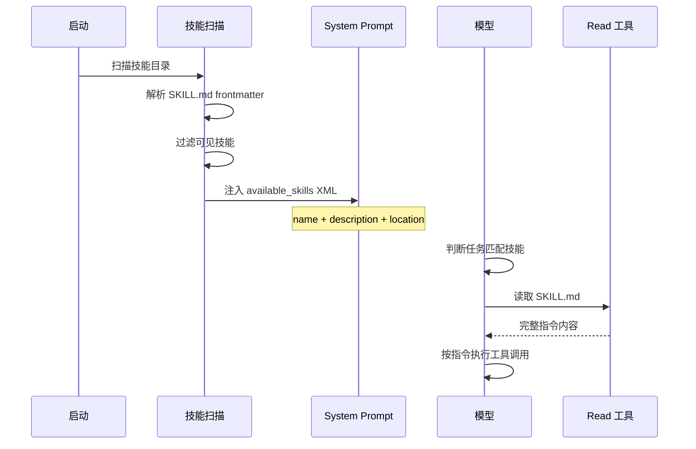

# 技能系统

## 读前思考

- 插件系统已经能让第三方扩展 Agent 的能力了，为什么还需要一个"技能系统"？技能和插件的边界在哪里——一个"帮我写 Git commit message"的能力，应该是插件还是技能？
- 如果技能本质上是一段注入 system prompt 的文本，那它和直接在 prompt 里写指令有什么区别？为什么要把指令拆成独立的 SKILL.md 文件？

## 核心问题

技能系统解决的核心问题是：**如何让非程序员用自然语言扩展 Agent 的行为，同时不引入代码执行的复杂性和安全风险**。

| 维度 | Python 版 | TypeScript 版 |
|------|-----------|--------------|
| 技能机制 | 无独立技能系统 | SKILL.md 即代码 |
| 激活方式 | — | frontmatter 条件 + LLM 按需读取 |
| 来源 | — | bundled / workspace / plugin / user / ClawHub |
| 安装 | — | brew / node / go / uv / download |
| 安全模型 | — | 权限检查 + 符号链接防护 |

Python 版没有独立的技能系统，其行为引导通过 system_prompt/builder.py 硬编码。以下分析聚焦 TS 版。

## 方案展示

### 设计选择一：SKILL.md 作为 Prompt 扩展——零运行时代码

TS 版的技能不是代码插件，而是 Markdown 文件。每个技能是一个目录，包含一个 SKILL.md（YAML frontmatter + 自然语言指令）和可选的辅助文件。系统在启动时扫描技能目录，解析 frontmatter 获取元数据，生成技能列表注入 system prompt。LLM 在判断任务匹配某技能时，通过 read 工具读取 SKILL.md 的完整内容，获取详细指令后按指令执行。

为什么不用代码？因为技能的目标用户是非程序员——产品经理、运维人员、领域专家。他们可以用自然语言写"当用户要求部署时，先检查 Docker 是否运行，然后执行 docker-compose up -d"，而不需要写 TypeScript。技能不直接执行代码，而是作为 prompt 级别的行为引导，实际执行仍然通过工具系统完成。

代价是：技能无法强制执行（LLM 可能忽略指令）、技能内容占用 context window、技能质量完全取决于编写者的 prompt 工程能力。

### 设计选择二：Frontmatter 元数据驱动——条件激活

SKILL.md 的 YAML frontmatter 声明了技能的激活条件：

- **always**：始终加载到 prompt（如核心行为规范）
- **requires**：依赖检查（如 requires.bins: ["docker"] 仅在 docker 可用时显示）
- **install**：安装规格（如 install.brew: "jq" 表示需要 jq 时自动安装）
- **os**：平台限制（如 os: ["darwin"] 仅 macOS 可见）

为什么需要条件激活？因为技能数量可能很多（50+ 内置 + 用户自定义），全部注入 prompt 会浪费 context window。条件激活让每个技能只在相关场景下出现——Docker 技能只在 Docker 可用时显示，macOS 技能只在 macOS 上出现。

代价是启动时需要做环境检查（SkillEligibilityContext），增加了启动时间。但对于 50-100 个技能的规模，这个开销可以忽略。

### 设计选择三：多来源扫描——五个技能目录

技能来自五个位置，按优先级合并：

1. **bundled**（skills/）：随 OpenClaw 发行的内置技能
2. **workspace**（.openclaw/skills/）：项目级技能，跟随 git 仓库
3. **plugin**：插件通过 resolvePluginSkillDirs 提供的技能
4. **user**（~/.config/openclaw/skills/）：用户全局技能
5. **ClawHub**：技能市场，支持在线安装

为什么需要这么多来源？因为不同来源有不同的生命周期：bundled 技能随版本更新，workspace 技能随项目走（团队成员共享），user 技能跨项目持久化，ClawHub 技能按需安装。这和 git 的多级配置（system / global / local）是同一个设计思路。

### 设计选择四：路径压缩——节省 Token

每个技能在 prompt 中占一行 XML，包含 name、description、location。location 是文件路径，如 /Users/alice/.bun/install/global/node_modules/@openclaw/skills/github/SKILL.md。

compactSkillPaths 将绝对路径压缩为 ~ 开头的短路径（~/.bun/.../SKILL.md），每个技能节省 5-6 个 token。50 个技能就是 250-300 token——对于 context window 来说不算多，但这是"免费"的优化（不损失信息），所以值得做。

### 设计选择五：ClawHub 技能市场——安装与版本管理

clawhub.ts（53.6KB）实现了完整的技能市场集成：

- **搜索**：按关键词搜索社区技能
- **安装**：支持多种安装方式（brew formula、npm package、go module、uv package、直接下载）
- **版本追踪**：promptVersion 字段让 LLM 知道技能内容是否变化，避免重复读取
- **安全扫描**：install-security-scan.ts（42.5KB）对第三方技能进行安全检查

安装流程的设计动机是：技能可能依赖外部工具（如 jq、docker、kubectl），单纯一个 Markdown 文件不够，需要自动安装依赖。install 字段声明了依赖的安装方式，系统在技能激活前自动执行安装。

## 工程优化

- **Prompt Version**：技能内容变化时 version 字段更新，LLM 可以判断是否需要重新读取
- **Skill Filter**：resolveEffectiveAgentSkillFilter 支持 agent 级技能过滤，不同 agent 看到不同技能
- **Archived Skills**：getArchivedSkillFiles 排除已归档技能，避免污染技能列表
- **Symlink Safety**：resolveAllowedSkillSymlinkTargetRealPaths 防止符号链接越界读取敏感文件
- **Frontmatter 解析容错**：readSkillFrontmatterSafe 在解析失败时不阻塞启动，跳过该技能

## 面试要点

**问题一：技能和插件的本质区别是什么？一个"帮我部署到 Vercel"的能力应该做成技能还是插件？**

参考答案方向：技能是 prompt 级行为引导（告诉 LLM 怎么做），插件是代码级能力扩展（给 LLM 新工具）。判断标准是：这个能力是否需要新的运行时行为（新的 API 调用、新的协议、新的 UI 交互）？如果是，做插件；如果只是"按特定顺序调用已有工具"，做技能。"部署到 Vercel"如果只是"调用 bash 执行 vercel deploy"，做技能就够了；如果需要 OAuth 登录 Vercel、管理环境变量、监控部署状态，就需要插件提供新工具。

**问题二：技能依赖 LLM 主动读取 SKILL.md，如果 LLM 判断错了（该读没读，或不该读却读了），会怎样？有什么缓解措施？**

参考答案方向：该读没读：LLM 按自己的默认行为执行，可能不符合用户预期（比如用户期望按团队规范写 commit message，但 LLM 没读对应技能）。不该读却读了：浪费一轮工具调用和 context 空间，但不会造成错误行为。缓解措施：always 字段让关键技能始终加载（不依赖 LLM 判断）；description 字段写清楚触发条件（"当用户要求写 commit message 时使用"）；技能列表的 XML 格式让 LLM 容易扫描匹配。根本限制是：技能系统无法强制执行，这是"自然语言扩展"的固有代价。

**问题三：为什么技能用 Markdown 文件而不是 YAML/JSON 配置？这个选择对版本控制和协作有什么影响？**

参考答案方向：Markdown 的选择动机是：技能的核心内容是自然语言指令，Markdown 是最自然的载体（支持标题、列表、代码块、链接）。YAML/JSON 适合结构化数据，但表达多段落的指令文本很笨拙（需要大量转义和缩进）。对版本控制的影响：git diff 对 Markdown 非常友好（逐行对比，变更一目了然），团队成员可以直接在 PR 中 review 技能内容的修改。如果用 YAML，diff 会被缩进和引号噪音淹没。对协作的影响：非程序员可以直接在 GitHub 上编辑 SKILL.md，不需要理解 YAML schema。
